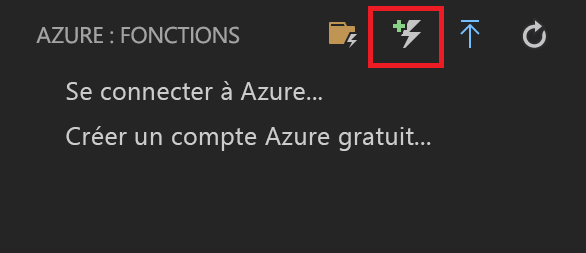
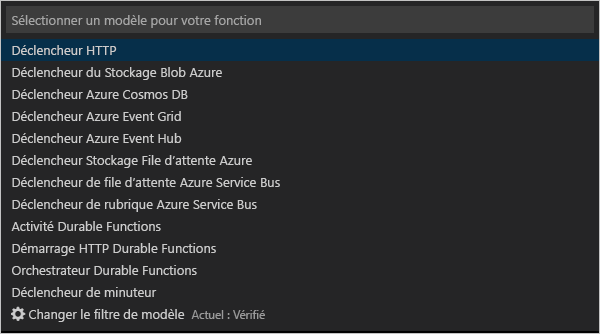

# <a name="create-your-first-durable-function-in-javascript"></a>Créer votre première fonction durable dans JavaScript

*Durable Functions* est une extension d’[Azure Functions](../functions-overview.md) qui vous permet d’écrire des fonctions avec état dans un environnement serverless. L’extension gère l’état, les points de contrôle et les redémarrages à votre place.

Dans cet article, vous allez découvrir comment utiliser l’extension Azure Functions pour Visual Studio Code afin de créer et tester localement une fonction durable appelée « Hello World ».  Cette fonction permet d’orchestrer et de chaîner des appels à d’autres fonctions. Vous allez ensuite publier le code de la fonction dans Azure.


## <a name="prerequisites"></a>Prérequis

Pour suivre ce tutoriel :

* Installez [Visual Studio Code](https://code.visualstudio.com/download).

* Assurez-vous de disposer des [derniers outils Azure Functions](../functions-develop-vs.md#check-your-tools-version).

* Sur un ordinateur Windows, vérifiez que l’[émulateur de stockage Azure](../../storage/common/storage-use-emulator.md) est installé et démarré. Sur un ordinateur Mac ou Linux, vous devez utiliser un compte de stockage Azure actif.

* Assurez-vous d’avoir la version 8.0 ou ultérieure de [Node.js](https://nodejs.org/) installée.

[!INCLUDE [quickstarts-free-trial-note](../../../includes/quickstarts-free-trial-note.md)]

[!INCLUDE [functions-install-vs-code-extension](../../../includes/functions-install-vs-code-extension.md)]

[!INCLUDE [functions-create-function-app-vs-code](../../../includes/functions-create-function-app-vs-code.md)]

## <a name="create-a-starter-function"></a>Créer une fonction de démarrage

Tout d’abord, créez une fonction déclenchée via HTTP qui démarre une orchestration de fonction durable.

1. À partir d’**Azure : Functions**, cliquez sur l’icône de Créer une fonction.

    

1. Sélectionnez le dossier avec votre projet d’application de fonction, puis le modèle de fonction **Déclencheur HTTP**.

    

1. Tapez `HttpStart` pour le nom de fonction et appuyez sur Entrée, puis sélectionnez l’authentification **Anonyme**.

    

    Une fonction est créée dans le langage que vous avez choisi à l’aide du modèle de fonction déclenchée via HTTP.

1. Remplacez index.js par le code JavaScript suivant :

    ```javascript
    const df = require("durable-functions");
    
    module.exports = async function (context, req) {
        const client = df.getClient(context);
        const instanceId = await client.startNew(req.params.functionName, undefined, req.body);
    
        context.log(`Started orchestration with ID = '${instanceId}'.`);
    
        return client.createCheckStatusResponse(context.bindingData.req, instanceId);
    };
    ```

1. Remplacez function.json par le code JSON ci-dessous :

    ```JSON
    {
      "bindings": [
        {
          "authLevel": "anonymous",
          "name": "req",
          "type": "httpTrigger",
          "direction": "in",
          "route": "orchestrators/{functionName}",
          "methods": ["post"]
        },
        {
          "name": "$return",
          "type": "http",
          "direction": "out"
        },
        {
          "name": "starter",
          "type": "orchestrationClient",
          "direction": "in"
        }
      ],
      "disabled": false
    }
    ```

Nous avons maintenant créé un point d’entrée dans notre fonction durable. Ajoutons un orchestrateur.

## <a name="create-an-orchestrator-function"></a>Créer une fonction orchestrator

Créez maintenant une autre fonction qui servira d’orchestrateur. Nous utilisons le modèle de fonction de déclencheur HTTP pour des raisons pratiques. Le code de fonction lui-même est remplacé par le code d’orchestrateur.

1. Répétez les étapes de la section précédente pour créer une deuxième fonction à l’aide du modèle de déclencheur HTTP. Cette fois, nommez la fonction `OrchestratorFunction`.

1. Ouvrez le fichier index.js de la nouvelle fonction et remplacez son contenu par le code suivant :

    [!code-json[Main](~/samples-durable-functions/samples/javascript/E1_HelloSequence/index.js)]

1. Ouvrez le fichier function.json et remplacez-le par le code JSON suivant :

    [!code-json[Main](~/samples-durable-functions/samples/javascript/E1_HelloSequence/function.json)]

Nous avons ajouté un orchestrateur pour coordonner les fonctions d’activité. Ajoutons maintenant la fonction d’activité référencée.

## <a name="create-an-activity-function"></a>Créer une fonction d’activité

1. Répétez les étapes des sections précédentes pour créer une troisième fonction à l’aide du modèle de déclencheur HTTP. Cette fois, nommez la fonction `SayHello`.

1. Ouvrez le fichier index.js de la nouvelle fonction et remplacez son contenu par le code suivant :

    [!code-javascript[Main](~/samples-durable-functions/samples/javascript/E1_SayHello/index.js)]

1. Remplacez function.json par le code JSON ci-dessous :

    [!code-json[Main](~/samples-durable-functions/samples/csx/E1_SayHello/function.json)]

Nous avons maintenant ajouté tous les composants nécessaires pour démarrer une orchestration et chaîner les fonctions d’activité.

## <a name="test-the-function-locally"></a>Tester la fonction en local

Azure Functions Core Tools vous permet d’exécuter un projet Azure Functions sur votre ordinateur de développement local. Vous êtes invité à installer ces outils la première fois que vous démarrez une fonction dans Visual Studio Code.  

1. Installez le package npm durable-functions en exécutant `npm install durable-functions` dans le répertoire racine de l’application de fonction.

1. Sur un ordinateur Windows, démarrez l’émulateur de stockage Azure et vérifiez que la propriété **AzureWebJobsStorage** de local.settings.json a la valeur `UseDevelopmentStorage=true`. Sur un ordinateur Mac ou Linux, définissez la propriété **AzureWebJobsStorage** sur la chaîne de connexion d’un compte de stockage Azure existant. Vous créerez le compte de stockage plus loin dans cet article.

1. Pour tester votre fonction, définissez un point d’arrêt dans le code de fonction et appuyez sur F5 pour démarrer le projet d’application de fonction. La sortie de Core Tools est affichée dans le panneau **Terminal**. Si vous utilisez Durable Functions pour la première fois, l’extension Durable Functions est installée et la génération peut prendre plusieurs secondes.

1. Dans le panneau **Terminal**, copiez le point de terminaison de l’URL de votre fonction déclenchée via HTTP.

    

1. Collez l’URL de la requête HTTP dans la barre d’adresse de votre navigateur et vérifiez l’état de votre orchestration.

1. Pour arrêter le débogage, appuyez sur Maj + F1.

Après avoir vérifié que la fonction s’exécute correctement sur votre ordinateur local, il est temps de publier le projet sur Azure.

[!INCLUDE [functions-create-function-app-vs-code](../../../includes/functions-sign-in-vs-code.md)]

[!INCLUDE [functions-publish-project-vscode](../../../includes/functions-publish-project-vscode.md)]

## <a name="test-your-function-in-azure"></a>Tester votre fonction dans Azure

1. Copiez l’URL du déclencheur HTTP à partir du panneau **Sortie**. L’URL qui appelle la fonction déclenchée via HTTP doit être au format suivant :

        http://<functionappname>.azurewebsites.net/api/<functionname>

1. Collez cette nouvelle URL de requête HTTP dans la barre d’adresse de votre navigateur. Vous devez obtenir la même réponse d’état que lorsque vous avez utilisé l’application publiée.

## <a name="next-steps"></a>Étapes suivantes

Vous avez utilisé Visual Studio Code pour créer et publier une application de fonction durable JavaScript.

> [!div class="nextstepaction"]
> [Découvrez maintenant les modèles courants de fonctions durables](durable-functions-overview.md)