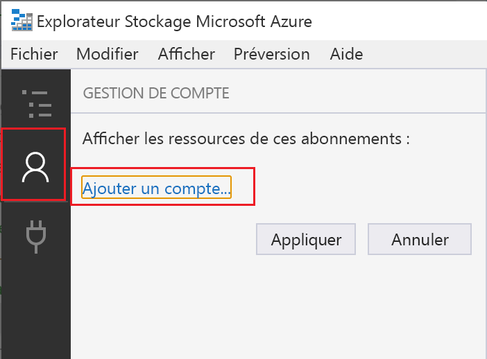
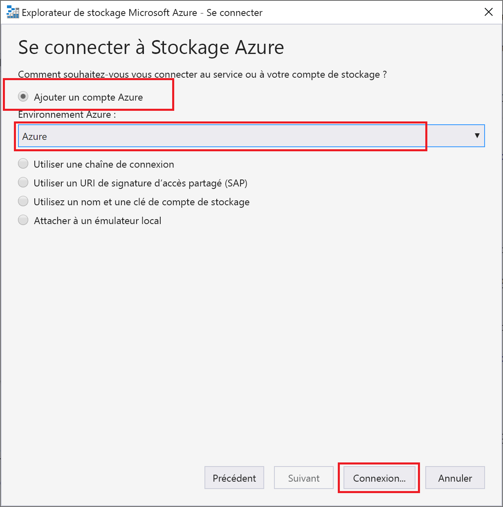
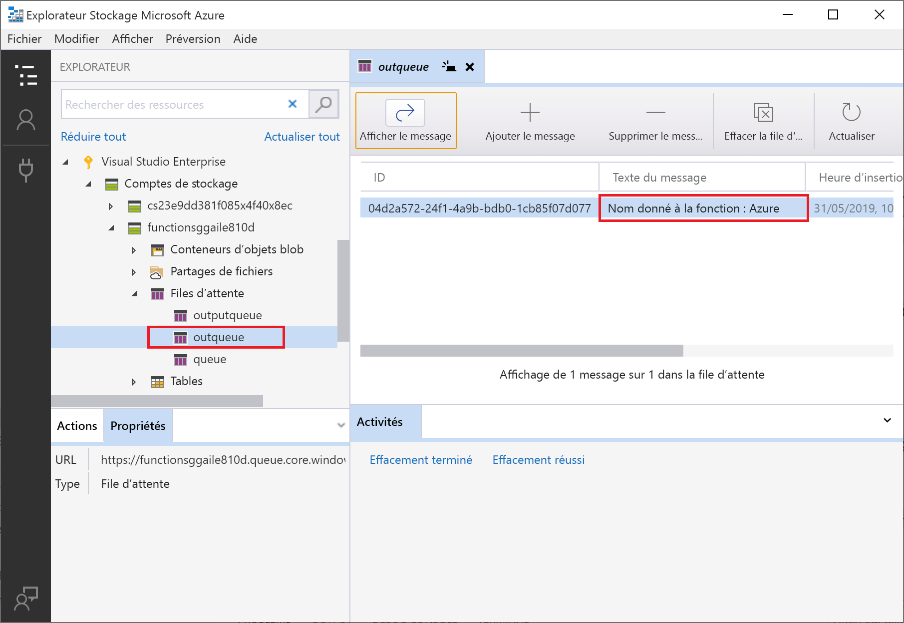

# <a name="connect-azure-functions-to-azure-storage-using-visual-studio-code"></a>Connecter Azure Functions à Stockage Azure avec Visual Studio Code

[!INCLUDE [functions-add-storage-binding-intro](../../includes/functions-add-storage-binding-intro.md)]

Cet article vous montre comment utiliser Visual Studio Code pour connecter la fonction que vous avez créée dans l’[article du guide de démarrage rapide précédent](functions-create-first-function-vs-code.md) à Stockage Azure. La liaison de sortie que vous ajoutez à cette fonction écrit des données provenant de la requête HTTP dans un message au sein de la file d’attente de Stockage File d’attente Azure. 

La plupart des liaisons requièrent une chaîne de connexion stockée que Functions utilise pour accéder au service lié. Pour simplifier, vous utilisez le compte de stockage que vous avez créé avec votre application de fonction. La connexion à ce compte est déjà stockée dans un paramètre d’application nommé `AzureWebJobsStorage`.  

## <a name="configure-your-local-environment"></a>Configurer votre environnement local

Avant de commencer cet article, vous devez satisfaire aux conditions suivantes :

* Installez l’[Extension Stockage Azure pour Visual Studio Code](https://marketplace.visualstudio.com/items?itemName=ms-azuretools.vscode-azurestorage).

* Installez l’[Explorateur Stockage Azure](https://storageexplorer.com/). L’Explorateur Stockage est un outil que vous allez utiliser pour examiner les messages en file d’attente générés par votre liaison de sortie. L’Explorateur Stockage est pris en charge sur les systèmes d’exploitation macOS, Windows et Linux.

::: zone pivot="programming-language-csharp"
* Installez les [outils CLI .NET Core](/dotnet/core/tools/?tabs=netcore2x).
::: zone-end

* Suivez les étapes de la [partie 1 du guide de démarrage rapide de Visual Studio Code](functions-create-first-function-vs-code.md). 

Cet article suppose que vous êtes déjà connecté à votre abonnement Azure à partir de Visual Studio Code. Vous pouvez vous connecter en exécutant `Azure: Sign In` à partir de la palette de commandes. 

## <a name="download-the-function-app-settings"></a>Télécharger les paramètres de l’application de fonction

Dans l’[article du guide de démarrage rapide précédent](functions-create-first-function-vs-code.md), vous avez créé une application de fonction dans Azure ainsi que le compte de stockage nécessaire. La chaîne de connexion pour ce compte est stockée de manière sécurisée dans les paramètres d’application au sein d’Azure. Dans cet article, vous allez écrire des messages dans une file d’attente de stockage au sein du même compte. Pour vous connecter à votre compte de stockage lors de l’exécution de la fonction localement, vous devez télécharger les paramètres de l’application dans le fichier local.settings.json. 

1. Appuyez sur F1 pour ouvrir la palette de commandes, puis recherchez et exécutez la commande `Azure Functions: Download Remote Settings....`. 

1. Choisissez l’application de fonction que vous avez créée dans l’article précédent. Sélectionnez **Oui pour tout** pour remplacer les paramètres locaux existants. 

    > [!IMPORTANT]  
    > Comme il contient des secrets, le fichier local.settings.json n’est jamais publié et il est exclu du contrôle de code source.

1. Copiez la valeur de `AzureWebJobsStorage`, qui est la clé pour la valeur de la chaîne de connexion du compte de stockage. Cette connexion vous permet de vérifier que la liaison de sortie fonctionne comme prévu.

## <a name="register-binding-extensions"></a>Inscrire des extensions de liaison

Comme vous utilisez une liaison de sortie de Stockage File d’attente, vous devez disposer de l’extension de liaisons de Stockage avant d’exécuter le projet. 

::: zone pivot="programming-language-javascript,programming-language-typescript,programming-language-python,programming-language-powershell,programming-language-java"

Votre projet a été configuré pour utiliser des [bundles d’extension](functions-bindings-register.md#extension-bundles), et installe automatiquement un ensemble prédéfini de packages d’extension. 

L’utilisation des bundles d’extension est activée dans le fichier host.json, à la racine du projet, et se présente de la façon suivante :

:::code language="json" source="~/functions-quickstart-java/functions-add-output-binding-storage-queue/host.json":::

::: zone-end

::: zone pivot="programming-language-csharp"

À l’exception des déclencheurs HTTP et de minuterie, les liaisons sont implémentées sous la forme de packages d’extension. Exécutez la commande [dotnet add package](/dotnet/core/tools/dotnet-add-package) suivante dans la fenêtre de terminal pour ajouter le package d’extension de Stockage à votre projet.

```bash
dotnet add package Microsoft.Azure.WebJobs.Extensions.Storage
```

::: zone-end

Vous pouvez maintenant ajouter la liaison de sortie de stockage à votre projet.

## <a name="add-an-output-binding"></a>Ajouter une liaison de sortie

Dans Functions, chaque type de liaison requiert la définition d’une `direction`, d’un `type` et d’un `name` unique dans le fichier function.json. La façon dont vous définissez ces attributs dépend du langage de votre application de fonction.

::: zone pivot="programming-language-javascript,programming-language-typescript,programming-language-python,programming-language-powershell,programming-language-java"

[!INCLUDE [functions-add-output-binding-json](../../includes/functions-add-output-binding-json.md)]

::: zone-end

::: zone pivot="programming-language-csharp"

[!INCLUDE [functions-add-storage-binding-csharp-library](../../includes/functions-add-storage-binding-csharp-library.md)]

::: zone-end

::: zone pivot="programming-language-java"

[!INCLUDE [functions-add-output-binding-java](../../includes/functions-add-output-binding-java.md)]

::: zone-end

## <a name="add-code-that-uses-the-output-binding"></a>Ajouter le code qui utilise la liaison de sortie

Une fois que la liaison est définie, vous pouvez utiliser l’attribut `name` de la liaison pour y accéder en tant qu’attribut dans la signature de fonction. En utilisant une liaison de sortie, vous n’avez pas besoin de recourir au code du SDK Stockage Azure pour l’authentification, l’obtention d’une référence de file d’attente ou l’écriture de données. La liaison de sortie de file d’attente et le runtime Functions effectuent ces tâches.

::: zone pivot="programming-language-javascript"  
[!INCLUDE [functions-add-output-binding-js](../../includes/functions-add-output-binding-js.md)]
::: zone-end  

::: zone pivot="programming-language-typescript"  
[!INCLUDE [functions-add-output-binding-ts](../../includes/functions-add-output-binding-ts.md)]
::: zone-end  

::: zone pivot="programming-language-powershell"

[!INCLUDE [functions-add-output-binding-powershell](../../includes/functions-add-output-binding-powershell.md)]

::: zone-end

::: zone pivot="programming-language-python"

[!INCLUDE [functions-add-output-binding-python](../../includes/functions-add-output-binding-python.md)]

::: zone-end

::: zone pivot="programming-language-csharp"  

[!INCLUDE [functions-add-storage-binding-csharp-library-code](../../includes/functions-add-storage-binding-csharp-library-code.md)]

::: zone-end  

::: zone pivot="programming-language-java"  

[!INCLUDE [functions-add-storage-binding-java-code](../../includes/functions-add-storage-binding-java-code.md)]

[!INCLUDE [functions-add-output-binding-java-test](../../includes/functions-add-output-binding-java-test.md)]

::: zone-end  

<!--- Local testing section --->

::: zone pivot="programming-language-csharp,programming-language-javascript,programming-language-python"

[!INCLUDE [functions-run-function-test-local-vs-code](../../includes/functions-run-function-test-local-vs-code.md)]

::: zone-end

::: zone pivot="programming-language-powershell"

[!INCLUDE [functions-run-function-test-local-vs-code-ps](../../includes/functions-run-function-test-local-vs-code-ps.md)]

::: zone-end

Le runtime Functions crée une file d’attente nommée **outqueue** dans votre compte de stockage lors de la première utilisation de la liaison de sortie. Vous allez utiliser l’Explorateur Stockage pour vérifier que la file d’attente a été créée ainsi que le nouveau message.

::: zone pivot="programming-language-java"  

[!INCLUDE [functions-add-output-binding-java-test](../../includes/functions-add-output-binding-java-test.md)]

::: zone-end

### <a name="connect-storage-explorer-to-your-account"></a>Connecter l’Explorateur Stockage à votre compte

Ignorez cette section si vous avez déjà installé l’Explorateur Stockage Azure et si vous l’avez connecté à votre compte Azure.

1. Exécutez l’outil [Explorateur Stockage Azure], sélectionnez l’icône de connexion sur la gauche, puis sélectionnez **Ajouter un compte**.

    

1. Dans la boîte de dialogue **Se connecter**, choisissez **Ajouter un compte Azure**, choisissez votre **Environnement Azure**, puis sélectionnez **Se connecter...** . 

    

Une fois connecté à votre compte, vous voyez tous les abonnements Azure associés à votre compte.

### <a name="examine-the-output-queue"></a>Analyser la file d’attente de sortie

1. Dans Visual Studio Code, appuyez sur F1 pour ouvrir la palette de commandes, puis recherchez et exécutez la commande `Azure Storage: Open in Storage Explorer`, et choisissez le nom de votre compte de stockage. Votre compte de stockage s’ouvre dans l’Explorateur Stockage Azure.  

1. Développez le nœud **Files d’attente**, puis sélectionnez la file d’attente nommée **outqueue**. 

   La file d’attente contient le message que la liaison de sortie de file d’attente a créé lors de l’exécution de la fonction déclenchée via HTTP. Si vous avez appelé la fonction avec la valeur `name` par défaut d'*Azure*, le message de la file d'attente est *Nom transmis à la fonction : Azure*.

    

1. Réexécutez la fonction et envoyez une autre demande : vous voyez alors apparaître un nouveau message dans la file d’attente.  

À présent, il est temps de republier sur Azure l’application de fonction mise à jour.

## <a name="redeploy-and-verify-the-updated-app"></a>Redéployer et tester l’application mise à jour

1. Dans Visual Studio Code, appuyez sur F1 pour ouvrir la palette de commandes. Dans la palette de commandes, recherchez et sélectionnez `Azure Functions: Deploy to function app...`.

1. Choisissez l’application de fonction que vous avez créée dans le premier article. Comme vous redéployez votre projet sur la même application, sélectionnez **Déployer** pour ignorer l’avertissement sur le remplacement des fichiers.

1. Une fois le déploiement terminé, vous pouvez à nouveau utiliser cURL ou un navigateur pour tester la fonction redéployée. Ajoutez la chaîne de requête `&name=<yourname>` à l’URL, comme dans l’exemple suivant :

    ```bash
    curl https://myfunctionapp.azurewebsites.net/api/httptrigger?code=cCr8sAxfBiow548FBDLS1....&name=<yourname>
    ```

1. [Examinez à nouveau le message dans la file d’attente de stockage](#examine-the-output-queue) pour vérifier que la liaison de sortie regénère un nouveau message dans la file d’attente.

## <a name="clean-up-resources"></a>Nettoyer les ressources

Dans Azure, le terme *ressources* fait référence aux applications de fonction, fonctions, comptes de stockage, et ainsi de suite. Elles sont rassemblées en *groupes de ressources*, et vous pouvez supprimer tous les éléments d’un groupe en supprimant le groupe.

Vous avez créé des ressources pour effectuer ces démarrages rapides. Vous pouvez être facturé pour ces ressources, en fonction de [l’état de votre compte](https://azure.microsoft.com/account/) et de la [tarification du service](https://azure.microsoft.com/pricing/). Si vous n’avez plus besoin des ressources, voici comment les supprimer :

[!INCLUDE [functions-cleanup-resources-vs-code.md](../../includes/functions-cleanup-resources-vs-code.md)]

## <a name="next-steps"></a>Étapes suivantes

Vous avez mis à jour votre fonction déclenchée via HTTP pour écrire des données dans une file d’attente de stockage. Pour en savoir plus sur le développement de fonctions à l’aide de Visual Studio Code, consultez maintenant ces articles :

+ [Développer des fonctions Azure Functions à l’aide de Visual Studio Code](functions-develop-vs-code.md)
::: zone pivot="programming-language-csharp"  
+ [Exemples de projets Functions complets en C#](/samples/browse/?products=azure-functions&languages=csharp).
+ [Informations de référence pour les développeurs C# sur Azure Functions](functions-dotnet-class-library.md)  
::: zone-end 
::: zone pivot="programming-language-javascript"  
+ [Exemples de projets Functions complets en JavaScript](/samples/browse/?products=azure-functions&languages=javascript).
+ [Guide des développeurs JavaScript sur Azure Functions](functions-reference-node.md)  
::: zone-end  
::: zone pivot="programming-language-typescript"  
+ [Exemples de projets Functions complets en TypeScript](/samples/browse/?products=azure-functions&languages=typescript).
+ [Guide du développeur TypeScript sur Azure Functions](functions-reference-node.md#typescript)  
::: zone-end  
::: zone pivot="programming-language-python"  
+ [Exemples de projets Functions complets en Python](/samples/browse/?products=azure-functions&languages=python)
+ [Guide du développeur Python sur Azure Functions](functions-reference-python.md)  
::: zone-end  
::: zone pivot="programming-language-powershell"  
+ [Exemples de projets Functions complets dans PowerShell](/samples/browse/?products=azure-functions&languages=azurepowershell).
+ [Guide du développeur PowerShell sur Azure Functions](functions-reference-powershell.md) 
::: zone-end
+ [Déclencheurs et liaisons Azure Functions](functions-triggers-bindings.md)
+ [Page de tarification de Functions](https://azure.microsoft.com/pricing/details/functions/)
+ Article [Estimation des coûts d’un plan Consommation](functions-consumption-costs.md)
