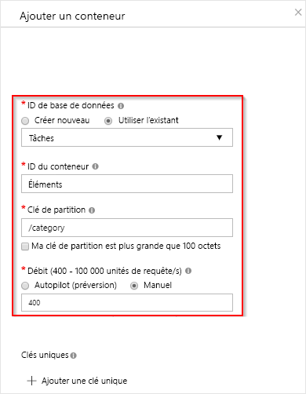

# <a name="create-a-function-triggered-by-azure-cosmos-db"></a>Créer une fonction déclenchée par Azure Cosmos DB

Découvrez comment créer une fonction qui est déclenchée quand des données sont ajoutées à Azure Cosmos DB ou y sont changées. Pour plus d’informations sur Azure Cosmos DB, consultez [Azure Cosmos DB : Utilisation des bases de données serverless avec Azure Functions](../cosmos-db/serverless-computing-database.md).

:::image type="content" source="./media/functions-create-cosmos-db-triggered-function/quickstart-completed.png" alt-text="Code Azure Cosmos DB":::

## <a name="prerequisites"></a>Prérequis

Pour suivre ce tutoriel :

+ Si vous n’avez pas d’abonnement Azure, créez un [compte gratuit](https://azure.microsoft.com/free/?WT.mc_id=A261C142F) avant de commencer.

> [!NOTE]
> [!INCLUDE [SQL API support only](../../includes/functions-cosmosdb-sqlapi-note.md)]

## <a name="sign-in-to-azure"></a>Connexion à Azure
Connectez-vous au [portail Azure](https://portal.azure.com/) avec votre compte Azure.

## <a name="create-an-azure-cosmos-db-account"></a>Création d’un compte Azure Cosmos DB

Vous devez disposer d’un compte Azure Cosmos DB qui utilise l’API SQL avant de créer le déclencheur.

[!INCLUDE [cosmos-db-create-dbaccount](../../includes/cosmos-db-create-dbaccount.md)]

## <a name="create-an-azure-function-app"></a>Création d’une application Azure Function

[!INCLUDE [Create function app Azure portal](../../includes/functions-create-function-app-portal.md)]

Créez ensuite une fonction dans la nouvelle Function App.

<a name="create-function"></a>

## <a name="create-azure-cosmos-db-trigger"></a>Créer le déclencheur Azure Cosmos DB

1. Dans votre application de fonction, sélectionnez **Fonctions** dans le menu de gauche, puis **Ajouter** dans le menu supérieur. 

1. Sur la page **Nouvelle fonction**, entrez `cosmos` dans le champ de recherche, puis choisissez le modèle **Déclencheur Azure Cosmos DB**.

   :::image type="content" source="./media/functions-create-cosmos-db-triggered-function/function-choose-cosmos.png" alt-text="Page Fonctions dans le portail Azure":::


1. Configurez le nouveau déclencheur avec les paramètres spécifiés dans le tableau suivant :

    | Paramètre      | Valeur suggérée  | Description                                |
    | ------------ | ---------------- | ------------------------------------------ |
    | **Nouvelle fonction** | Acceptez le nom par défaut | Nom de la fonction. |
    | **Connexion au compte Cosmos DB** | Acceptez le nouveau nom par défaut | Sélectionnez **Nouveau**, le **Compte de base de données** que vous avez créé précédemment, puis **OK**. Cette action crée un paramètre d’application pour votre connexion de compte. Ce paramètre est utilisé par la liaison pour se connecter à la base de données. |
    | **Nom de la base de données** | Tâches | Nom de la base de données qui inclut la collection à surveiller. |
    | **Nom de la collection** | Éléments | Nom de la collection à surveiller. |
    | **Nom de collection pour les baux** | baux | Nom de la collection dans laquelle stocker les baux. |
    | **Créer une collection de baux si elle n’existe pas** | Oui | Vérifie l’existence de la collection de baux et la crée automatiquement si nécessaire. |

    :::image type="content" source="./media/functions-create-cosmos-db-triggered-function/functions-cosmosdb-trigger-settings.png" alt-text="Créer la fonction déclenchée par Azure Cosmos DB":::

1. Sélectionnez **créer une fonction**. 

    Azure crée la fonction de déclencheur Cosmos DB.

1. Pour afficher le code de fonction basé sur un modèle, sélectionnez **Code + test**.

    :::image type="content" source="./media/functions-create-cosmos-db-triggered-function/function-cosmosdb-template.png" alt-text="Modèle de fonction Cosmos DB en C#":::

    Ce modèle de fonction écrit le nombre de documents et le premier ID de document dans les journaux d’activité.

Ensuite, vous vous connectez à votre compte Azure Cosmos DB et créez le conteneur `Items` dans la base de données `Tasks`.

## <a name="create-the-items-container"></a>Créer le conteneur d’éléments

1. Ouvrez une deuxième instance du [portail Azure](https://portal.azure.com) sous un nouvel onglet dans le navigateur.

1. Sur le côté gauche du portail, développez la barre d’icônes, tapez `cosmos` dans le champ de recherche, puis sélectionnez **Azure Cosmos DB**.

    

1. Sélectionnez votre compte Azure Cosmos DB, puis sélectionnez **Explorateur de données**. 

1. Sous **API SQL**, choisissez la base de données **Tâches** et sélectionnez **Nouveau conteneur**.

    

1. Dans **Ajouter un conteneur**, utilisez les paramètres présentés dans le tableau situé sous l’image. 

    

    | Paramètre|Valeur suggérée|Description |
    | ---|---|--- |
    | **ID de base de données** | Tâches |Nom de votre nouvelle base de données. Ce nom doit correspondre au nom défini dans votre liaison de fonction. |
    | **ID de conteneur** | Éléments | Nom du nouveau conteneur. Ce nom doit correspondre au nom défini dans votre liaison de fonction.  |
    | **[Clé de partition](../cosmos-db/partition-data.md)** | /category|Clé de partition qui distribue les données uniformément à chaque partition. Il est important de sélectionner la clé de partition correcte pour obtenir un conteneur performant. | 
    | **Débit** |400 RU| Utilisez la valeur par défaut. Si vous souhaitez réduire la latence, vous pourrez augmenter le débit par la suite. |    

1. Cliquez sur **OK** pour créer le conteneur d’éléments. La création du conteneur peut prendre un peu de temps.

Une fois que le conteneur spécifié dans la liaison de fonction a été créé, vous pouvez tester la fonction en ajoutant des éléments à ce nouveau conteneur.

## <a name="test-the-function"></a>Tester la fonction

1. Développez le nouveau conteneur **Éléments** dans l’Explorateur de données, choisissez **Éléments**, puis sélectionnez **Nouvel élément**.

    :::image type="content" source="./media/functions-create-cosmos-db-triggered-function/create-item-in-container.png" alt-text="Créer un élément dans un conteneur d’éléments":::

1. Remplacez le contenu du nouvel élément par le contenu suivant, puis choisissez **Enregistrer**.

    ```yaml
    {
        "id": "task1",
        "category": "general",
        "description": "some task"
    }
    ```

1. Passez au premier onglet de navigateur qui contient votre fonction dans le portail. Développez les journaux d’activité de la fonction et vérifiez que le nouveau document a déclenché la fonction. La valeur d’ID de document `task1` doit être écrite dans les journaux d’activité. 

    

1. (Facultatif) Accédez à votre document, apportez une modification, puis cliquez sur **Mettre à jour**. Ensuite, revenez aux journaux d’activité de la fonction, puis vérifiez que la mise à jour a également déclenché la fonction.

## <a name="clean-up-resources"></a>Nettoyer les ressources

[!INCLUDE [Next steps note](../../includes/functions-quickstart-cleanup.md)]

## <a name="next-steps"></a>Étapes suivantes

Vous avez créé une fonction qui s’exécute quand un document est ajouté ou modifié dans votre base de données Azure Cosmos DB. Pour plus d’informations sur les déclencheurs Azure Cosmos DB, consultez [Liaisons Azure Cosmos DB pour Azure Functions](functions-bindings-cosmosdb.md).

[!INCLUDE [Next steps note](../../includes/functions-quickstart-next-steps.md)]
