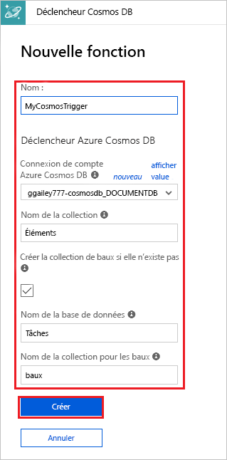
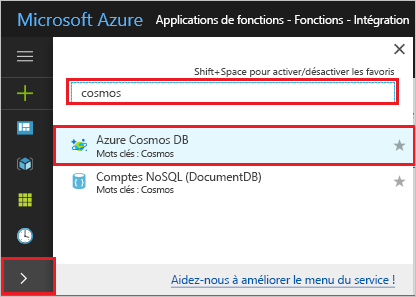

# Créer une fonction déclenchée par Azure Cosmos DB

Découvrez comment créer une fonction qui est déclenchée quand des données sont ajoutées à Azure Cosmos DB ou y sont changées. Pour découvrir plus en détail Azure Cosmos DB, consultez [Azure Cosmos DB : traitement de base de données sans serveur à l’aide d’Azure Functions](..\cosmos-db\serverless-computing-database.md).

## Prérequis

Pour suivre ce didacticiel :

+ Si vous n’avez pas d’abonnement Azure, créez un [compte gratuit](https://azure.microsoft.com/free/?WT.mc_id=A261C142F) avant de commencer.

[!INCLUDE [functions-portal-favorite-function-apps](../../includes/functions-portal-favorite-function-apps.md)]

## Création d’une application Azure Function

[!INCLUDE [Create function app Azure portal](../../includes/functions-create-function-app-portal.md)]

Créez ensuite une fonction dans la nouvelle Function App.

## Créer le déclencheur Azure Cosmos DB

1. Développez votre Function App, puis cliquez sur le bouton **+** en regard de **Fonctions**. S’il s’agit de la première fonction de votre Function App, sélectionnez **Fonction personnalisée**. Cela affiche l’ensemble complet des modèles de fonction.

    

2. Dans la zone de recherche, saisissez `cosmos`, puis sélectionnez la langue souhaitée pour le modèle déclencheur d’Azure Cosmos DB.

    

3. Configurez le nouveau déclencheur avec les paramètres comme spécifié dans le tableau situé sous l’image.

    
    
    | Paramètre      | Valeur suggérée  | Description                                |
    | ------------ | ---------------- | ------------------------------------------ |
    | **Name** | Default | Utilisez le nom de fonction par défaut suggéré par le modèle. |
    | **Nom de la collection** | Éléments | Nom de la collection à surveiller. |
    | **Créer la collection de baux si elle n’existe pas** | Activé | La collection n’existe pas, vous devez la créer. |
    | **Nom de la base de données** | Tâches | Nom de la base de données avec la collection à surveiller. |

4. Sélectionnez **Nouveau** en regard du libellé **Connexion au compte Azure Cosmos DB**, puis choisissez un compte Cosmos DB existant ou cliquez sur **+ Créer**. 
 
    

6. Lorsque vous créez un compte Cosmos DB, utilisez les paramètres du **nouveau compte** comme indiqué dans la table.

    | Paramètre      | Valeur suggérée  | Description                                |
    | ------------ | ---------------- | ------------------------------------------ |
    | **Identifiant** | Nom de base de données | ID unique de la base de données Azure Cosmos DB  |
    | **API** | SQL | Cette rubrique utilise l’API SQL.  |
    | **Abonnement** | Abonnement Azure | Abonnement sous lequel est créé ce nouveau compte Cosmos DB.  |
    | **Groupe de ressources** | myResourceGroup |  Utilisez le groupe de ressources existant qui contient votre application de fonction. |
    | **Lieu**  | WestEurope | Sélectionnez un emplacement près de votre application de fonction ou d’autres applications qui utilisent les documents stockés.  |

6. Cliquez sur **OK** pour créer la base de données. La création de la base de données peut prendre quelques minutes. Une fois la base de données créée, la chaîne de connexion de base de données est stockée en tant que paramètre d’application de fonction. Le nom de ce paramètre d’application est inséré dans **Connexion au compte Azure Cosmos DB**. 

7. Cliquez sur **Créer** pour créer votre fonction déclenchée par Azure Cosmos DB. Une fois la fonction créée, le code de fonction basé sur le modèle s’affiche.  

    

    Ce modèle de fonction écrit le nombre de documents et le premier ID de document dans les journaux. 

Ensuite, vous vous connectez à votre compte Azure Cosmos DB et créez la collection **Tasks** dans la base de données. 

## Créer la collection d’éléments

1. Ouvrez une deuxième instance du [portail Azure](https://portal.azure.com) sous un nouvel onglet dans le navigateur. 

2. Sur le côté gauche du portail, développez la barre d’icônes, tapez `cosmos` dans le champ de recherche, puis sélectionnez **Azure Cosmos DB**.

    

2. Sélectionnez votre compte Azure Cosmos DB, puis sélectionnez **Explorateur de données**. 
 
3. Dans **Collections**, choisissez **taskDatabase**, puis sélectionnez **Nouvelle collection**.

    

4. Dans **Ajouter une collection**, utilisez les paramètres présentés dans le tableau situé sous l’image. 
 
    
 
    | Paramètre|Valeur suggérée|Description |
    | ---|---|--- |
    | **ID de base de données** | Tâches |Nom de votre nouvelle base de données. Ce nom doit correspondre au nom défini dans votre liaison de fonction. |
    | **ID de la collection** | Éléments | Nom de la nouvelle collection. Ce nom doit correspondre au nom défini dans votre liaison de fonction.  |
    | **Capacité de stockage** | Fixe (10 Go)|Utilisez la valeur par défaut. Cette valeur correspond à la capacité de stockage de la base de données. |
    | **Débit** |400 RU| Utilisez la valeur par défaut. Si vous souhaitez réduire la latence, vous pourrez augmenter le débit par la suite. |
    | **[Clé de partition](../cosmos-db/partition-data.md#design-for-partitioning)** | /category|Clé de partition qui distribue les données uniformément à chaque partition. Il est important de sélectionner la clé de partition correcte pour obtenir une collection performante. | 

1. Cliquez sur **OK** pour créer la collection **Tasks**. La création de la collection peut prendre un peu de temps.

Une fois créée la collection spécifiée dans la liaison de fonction, vous pouvez tester la fonction en ajoutant des documents à cette nouvelle collection.

## Tester la fonction

1. Développez la nouvelle collection **taskCollection** dans l’Explorateur de données, choisissez **Documents**, puis sélectionnez **Nouveau document**.

    

2. Remplacez le contenu du nouveau document par le contenu suivant, puis choisissez **Enregistrer**.

        {
            "id": "task1",
            "category": "general",
            "description": "some task"
        }

1. Passez au premier onglet de navigateur qui contient votre fonction dans le portail. Développez les journaux de la fonction et vérifiez que le nouveau document a déclenché la fonction. La valeur d’ID de document `task1` doit être écrite dans les journaux. 

    

4. (Facultatif) Accédez à votre document, apportez une modification, puis cliquez sur **Mettre à jour**. Ensuite, revenez aux journaux de la fonction, puis vérifiez que la mise à jour a également déclenché la fonction.

## Supprimer des ressources

[!INCLUDE [Next steps note](../../includes/functions-quickstart-cleanup.md)]

## Étapes suivantes

Vous avez créé une fonction qui s’exécute quand un document est ajouté ou modifié dans votre base de données Azure Cosmos DB.

[!INCLUDE [Next steps note](../../includes/functions-quickstart-next-steps.md)]

Pour plus d’informations sur les déclencheurs Azure Cosmos DB, consultez [Liaisons Azure Cosmos DB pour Azure Functions](functions-bindings-cosmosdb.md).
