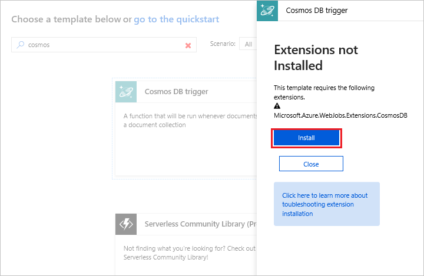
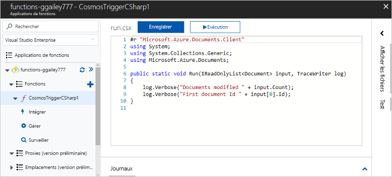
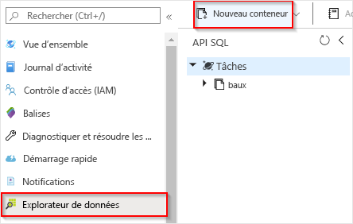
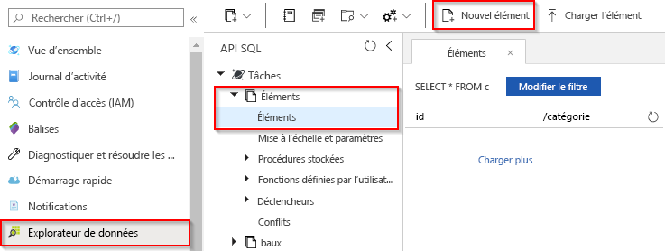

# Créer une fonction déclenchée par Azure Cosmos DB

Découvrez comment créer une fonction qui est déclenchée quand des données sont ajoutées à Azure Cosmos DB ou y sont changées. Pour plus d’informations sur Azure Cosmos DB, consultez [Azure Cosmos DB : Utilisation des bases de données serverless avec Azure Functions](../cosmos-db/serverless-computing-database.md).

## Conditions préalables requises

Pour suivre ce tutoriel :

+ Si vous n’avez pas d’abonnement Azure, créez un [compte gratuit](https://azure.microsoft.com/free/?WT.mc_id=A261C142F) avant de commencer.

> [!NOTE]
> [!INCLUDE [SQL API support only](../../includes/functions-cosmosdb-sqlapi-note.md)]

## Création d’un compte Azure Cosmos DB

Vous devez disposer d’un compte Azure Cosmos DB qui utilise l’API SQL avant de créer le déclencheur.

[!INCLUDE [cosmos-db-create-dbaccount](../../includes/cosmos-db-create-dbaccount.md)]

## Création d’une application Azure Function

[!INCLUDE [Create function app Azure portal](../../includes/functions-create-function-app-portal.md)]

Créez ensuite une fonction dans la nouvelle Function App.

## Créer le déclencheur Azure Cosmos DB

1. Développez votre Function App, puis cliquez sur le bouton **+** en regard de **Fonctions**. S’il s’agit de la première fonction de votre application de fonction, sélectionnez **Dans le portail**, puis **Continuer**. Sinon, passez à l’étape 3.

   

1. Choisissez **Autres modèles**, puis **Terminer et afficher les modèles**.

    

1. Dans le champ Rechercher, tapez `cosmos`, puis choisissez le modèle **Déclencheur Azure Cosmos DB**.

1. Si vous y êtes invité, sélectionnez **Installer** pour installer l’extension Azure Cosmos DB dans l’application de fonction. Une fois l’installation réussie, sélectionnez **Continuer**.

    

1. Configurez le nouveau déclencheur avec les paramètres comme spécifié dans le tableau situé sous l’image.

    

    | Paramètre      | Valeur suggérée  | Description                                |
    | ------------ | ---------------- | ------------------------------------------ |
    | **Nom** | Default | Utilisez le nom de fonction par défaut suggéré par le modèle.|
    | **Connexion de compte Azure Cosmos DB** | Nouveau paramètre | Sélectionnez **Nouveau**, puis choisissez votre **Abonnement**, le **Compte de base de données** que vous avez créé précédemment, puis **Sélectionner**. Cette opération crée un paramètre d’application pour votre connexion de compte. Ce paramètre est utilisé par la liaison pour se connecter à la base de données. |
    | **Nom du conteneur** | Éléments | Nom du conteneur à superviser. |
    | **Créer le conteneur de baux s’il n’existe pas** | Activé | Le conteneur n’existe pas encore. Créez-le. |
    | **Nom de la base de données** | Tâches | Nom de la base de données avec le conteneur à superviser. |

1. Cliquez sur **Créer** pour créer votre fonction déclenchée par Azure Cosmos DB. Une fois la fonction créée, le code de fonction basé sur le modèle s’affiche.  

    

    Ce modèle de fonction écrit le nombre de documents et le premier ID de document dans les journaux d’activité.

Ensuite, vous vous connectez à votre compte Azure Cosmos DB et créez le conteneur `Items` dans la base de données `Tasks`.

## Créer le conteneur d’éléments

1. Ouvrez une deuxième instance du [portail Azure](https://portal.azure.com) sous un nouvel onglet dans le navigateur.

1. Sur le côté gauche du portail, développez la barre d’icônes, tapez `cosmos` dans le champ de recherche, puis sélectionnez **Azure Cosmos DB**.

    

1. Sélectionnez votre compte Azure Cosmos DB, puis sélectionnez **Explorateur de données**. 

1. Sous **API SQL**, choisissez la base de données **Tâches** et sélectionnez **Nouveau conteneur**.

    

1. Dans **Ajouter un conteneur**, utilisez les paramètres présentés dans le tableau situé sous l’image. 

    

    | Paramètre|Valeur suggérée|Description |
    | ---|---|--- |
    | **ID de base de données** | Tâches |Nom de votre nouvelle base de données. Ce nom doit correspondre au nom défini dans votre liaison de fonction. |
    | **ID de conteneur** | Éléments | Nom du nouveau conteneur. Ce nom doit correspondre au nom défini dans votre liaison de fonction.  |
    | **[Clé de partition](../cosmos-db/partition-data.md)** | /category|Clé de partition qui distribue les données uniformément à chaque partition. Il est important de sélectionner la clé de partition correcte pour obtenir un conteneur performant. | 
    | **Débit** |400 RU| Utilisez la valeur par défaut. Si vous souhaitez réduire la latence, vous pourrez augmenter le débit par la suite. |    

1. Cliquez sur **OK** pour créer le conteneur d’éléments. La création du conteneur peut prendre un peu de temps.

Une fois que le conteneur spécifié dans la liaison de fonction a été créé, vous pouvez tester la fonction en ajoutant des éléments à ce nouveau conteneur.

## Tester la fonction

1. Développez le nouveau conteneur **Éléments** dans l’Explorateur de données, choisissez **Éléments**, puis sélectionnez **Nouvel élément**.

    

1. Remplacez le contenu du nouvel élément par le contenu suivant, puis choisissez **Enregistrer**.

        {
            "id": "task1",
            "category": "general",
            "description": "some task"
        }

1. Passez au premier onglet de navigateur qui contient votre fonction dans le portail. Développez les journaux d’activité de la fonction et vérifiez que le nouveau document a déclenché la fonction. La valeur d’ID de document `task1` doit être écrite dans les journaux d’activité. 

    

1. (Facultatif) Accédez à votre document, apportez une modification, puis cliquez sur **Mettre à jour**. Ensuite, revenez aux journaux d’activité de la fonction, puis vérifiez que la mise à jour a également déclenché la fonction.

## Nettoyer les ressources

[!INCLUDE [Next steps note](../../includes/functions-quickstart-cleanup.md)]

## Étapes suivantes

Vous avez créé une fonction qui s’exécute quand un document est ajouté ou modifié dans votre base de données Azure Cosmos DB. Pour plus d’informations sur les déclencheurs Azure Cosmos DB, consultez [Liaisons Azure Cosmos DB pour Azure Functions](functions-bindings-cosmosdb.md).

[!INCLUDE [Next steps note](../../includes/functions-quickstart-next-steps.md)]
