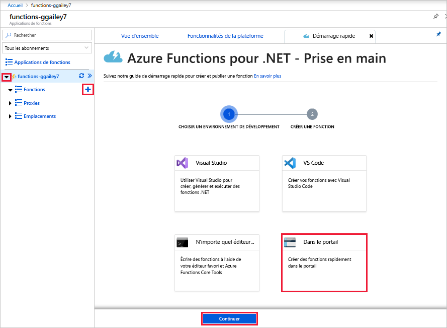

# Créer votre première fonction à l’aide du Portail Azure

Azure Functions vous permet d’exécuter votre code dans un environnement [sans serveur](https://azure.microsoft.com/solutions/serverless/) et sans avoir à créer une machine virtuelle ou à publier une application web au préalable. Dans cet article, vous allez découvrir comment utiliser Functions pour créer une fonction « hello world » dans le portail Azure.

[!INCLUDE [quickstarts-free-trial-note](../../includes/quickstarts-free-trial-note.md)]

> [!NOTE]
> Les développeurs C# doivent envisager de [créer votre première fonction dans Visual Studio 2019](functions-create-your-first-function-visual-studio.md) plutôt que sur le portail. 

## Connexion à Azure

Connectez-vous au portail Azure sur <https://portal.azure.com> avec votre compte Azure.

## Créer une application de fonction

Vous devez disposer d’une Function App pour héberger l’exécution de vos fonctions. Une Function App vous permet de regrouper les fonctions en une unité logique pour faciliter la gestion, le déploiement et le partage des ressources. 

[!INCLUDE [Create function app Azure portal](../../includes/functions-create-function-app-portal.md)]

Créez ensuite une fonction dans la nouvelle Function App.

## Créer une fonction déclenchée via HTTP

1. Développez votre nouvelle application de fonction, puis sélectionnez le bouton **+** en regard de **Fonctions**, choisissez **Dans le portail** et sélectionnez **Continuer**.

    

1. Choisissez **WebHook + API**, puis sélectionnez **Créer**.

    

Une fonction est créée à l’aide d’un modèle spécifique à une langue pour une fonction déclenchée via HTTP.

Vous pouvez maintenant exécuter la nouvelle fonction en envoyant une requête HTTP.

## Tester la fonction

1. Dans votre nouvelle fonction, cliquez sur **</> Obtenir l’URL de la fonction** en haut à droite, sélectionnez **par défaut (touche de fonction)** , puis cliquez sur **Copier**. 

    

2. Collez l’URL de fonction dans la barre d’adresse de votre navigateur. Ajoutez la valeur de la chaîne de requête `&name=<yourname>` à la fin de cette URL et appuyez sur la touche `Enter` de votre clavier pour exécuter la requête. Vous devez voir la réponse renvoyée par la fonction affichée dans le navigateur.  

    L’exemple suivant montre la réponse dans le navigateur :

    

    L’URL de demande inclut une clé qui est requise, par défaut, pour accéder à votre fonction sur HTTP.

3. Lorsque votre fonction s’exécute, des informations de suivi sont écrites dans les journaux d’activité. Pour afficher la sortie de suivi de l’exécution précédente, revenez à votre fonction dans le portail et cliquez sur la flèche figurant en bas de l’écran pour développer **Journaux d’activité**.

   

## Supprimer des ressources

[!INCLUDE [Clean-up resources](../../includes/functions-quickstart-cleanup.md)]

## Étapes suivantes

Vous avez créé une application de fonction avec une simple fonction déclenchée via HTTP.  

[!INCLUDE [Next steps note](../../includes/functions-quickstart-next-steps.md)]

Pour plus d’informations, consultez [Liaisons HTTP Azure Functions](functions-bindings-http-webhook.md).
