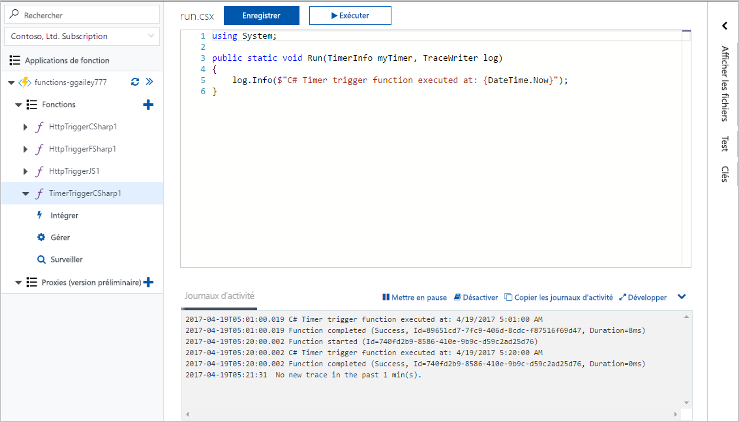

# Créez une fonction dans Azure, qui est déclenchée par un minuteur

Apprenez à utiliser Azure Functions pour créer une fonction [sans serveur](https://azure.microsoft.com/overview/serverless-computing/) qui s’exécute selon une planification que vous définissez.

## Prérequis

Pour suivre ce didacticiel :

+ Si vous n’avez pas d’abonnement Azure, créez un [compte gratuit](https://azure.microsoft.com/free/?WT.mc_id=A261C142F) avant de commencer.

## Création d’une application Azure Function

[!INCLUDE [Create function app Azure portal](../../includes/functions-create-function-app-portal.md)]

Créez ensuite une fonction dans la nouvelle Function App.

## Créer une fonction déclenchée par un minuteur

1. Développez votre Function App, puis cliquez sur le bouton **+** en regard de **Fonctions**. S’il s’agit de la première fonction de votre Function App, sélectionnez **Fonction personnalisée**. Cela affiche l’ensemble complet des modèles de fonction.

    

2. Dans la zone de recherche, saisissez `timer`, puis sélectionnez la langue souhaitée pour le modèle déclencheur de minuteur. 

    

3. Configurez le nouveau déclencheur avec les paramètres comme spécifié dans le tableau situé sous l’image.

    

    | Paramètre | Valeur suggérée | Description |
    |---|---|---|
    | **Name** | Default | Définit le nom de votre fonction déclenchée par minuteur. |
    | **[Planification](http://en.wikipedia.org/wiki/Cron#CRON_expression)** | 0 \*/1 \* \* \* \* | Un champ de six [expressions CRON](http://en.wikipedia.org/wiki/Cron#CRON_expression) qui planifie l’exécution de votre fonction chaque minute. |

2. Cliquez sur **Créer**. Une fonction est créée dans le langage que vous avez choisi et s’exécute chaque minute.

3. Vérifiez l’exécution en consultant les informations de traçage écrites dans les journaux.

    

À présent, vous pouvez modifier la planification de la fonction afin qu’elle s’exécute une fois par heure plutôt que toutes les minutes. 

## Mise à jour de la planification du minuteur

1. Développez votre fonction et cliquez sur **Intégrer**. Il s’agit de l’endroit où vous définissez les liaisons d’entrée et de sortie pour votre fonction, et où vous configurez la planification. 

2. Entrez une nouvelle valeur horaire de **Planification** de `0 0 */1 * * *`, puis cliquez sur **Enregistrer**.  

Vous disposez maintenant d’une fonction qui s’exécute toutes les heures. 

## Supprimer les ressources

[!INCLUDE [Next steps note](../../includes/functions-quickstart-cleanup.md)]

## Étapes suivantes

Vous avez créé une fonction qui s’exécute selon une planification.

[!INCLUDE [Next steps note](../../includes/functions-quickstart-next-steps.md)]

Pour en savoir plus sur les déclencheurs de minuteur, consultez la page [Planifier l’exécution de code avec Azure Functions](functions-bindings-timer.md).
