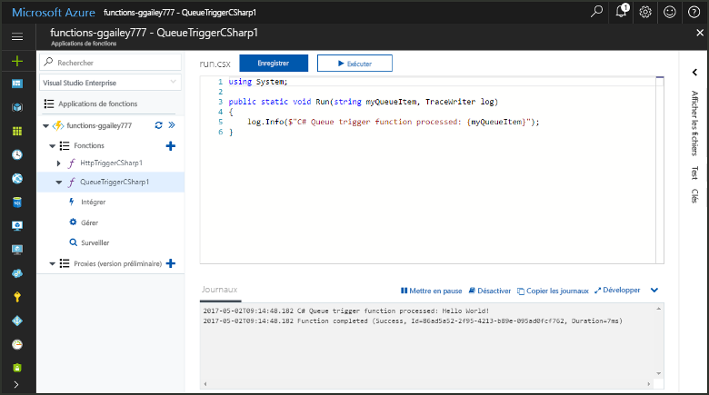
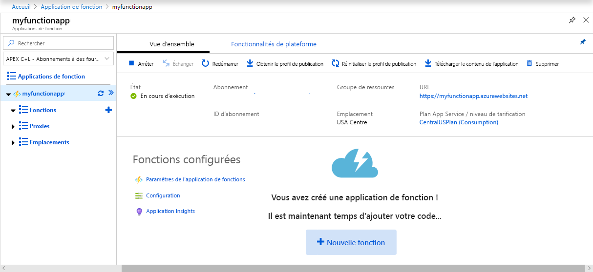
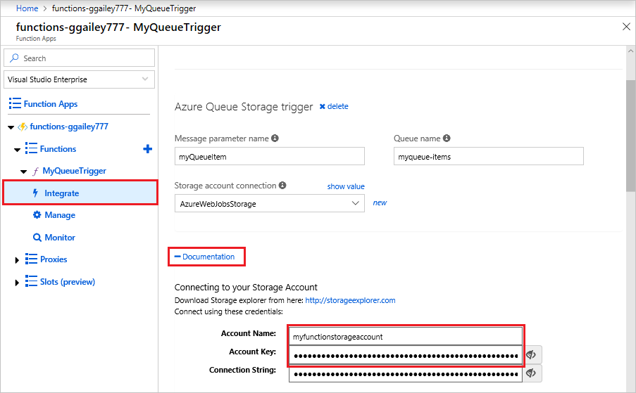

# Créer une fonction déclenchée par une file d’attente de stockage Azure

Apprenez à créer une fonction se déclenchant lorsque des messages sont envoyés à une file d’attente de stockage Azure.

Moins de cinq minutes sont nécessaires pour effectuer toutes les étapes de cette rubrique.

## Composants requis

Avant d’exécuter cet exemple, vous devez avoir effectué les étapes suivantes :

- Télécharger et installer l’[Explorateur de Stockage Microsoft Azure](http://storageexplorer.com/).

Si vous n’avez pas d’abonnement Azure, créez un [compte gratuit](https://azure.microsoft.com/free/?WT.mc_id=A261C142F) avant de commencer.

[!INCLUDE [functions-portal-favorite-function-apps](../../includes/functions-portal-favorite-function-apps.md)]

## Création d’une application Azure Function

[!INCLUDE [Create function app Azure portal](../../includes/functions-create-function-app-portal.md)]

Créez ensuite une fonction dans la nouvelle Function App.

## Créer une fonction déclenchée par une file d’attente

Développez votre Function App, cliquez sur le bouton **+** à côté de **Fonctions**, puis cliquez sur le modèle **QueueTrigger** correspondant à la langue de votre choix. Ensuite, utilisez les paramètres comme indiqué dans la table et cliquez sur **Créer**.

| Paramètre | Valeur suggérée | Description |
|---|---|---|
| **Nom de la file d’attente**   | myqueue-items    | Le nom de la file d’attente à connecter à votre compte de stockage. |
| **Connexion au compte de stockage** | AzureWebJobStorage | Vous pouvez utiliser la connexion au compte de stockage qui est déjà utilisée par votre Function App ou en créer une.  |
| **Nommer votre fonction** | Unique dans votre Function App | Nom de cette fonction déclenchée par la file d’attente. |

Ensuite, connectez-vous à votre compte de stockage Azure et créez la file d’attente de stockage **myqueue-items**.

## Créer la file d’attente

1. Dans votre fonction, cliquez sur **Intégrer**, développez **Documentation** et copiez le **Nom du compte** et la **Clé du compte**. Vous utilisez ces informations d’identification pour vous connecter au compte de stockage. Si vous avez déjà connecté votre compte de stockage, passez à l’étape 4.

    v

1. Exécutez [l’Explorateur de stockage Microsoft Azure](http://storageexplorer.com/), cliquez sur l’icône de connexion située sur la gauche, choisissez **Utiliser un nom et une clé de compte de stockage**, puis cliquez sur **Suivant**.

    

1. Saisissez le **Nom du compte** et la **Clé du compte** récupérés à l’étape 1, puis cliquez sur **Suivant** et sur **Connexion**.

    

1. Développez le compte de stockage attaché, cliquez avec le bouton droit sur **Files d’attente**, puis sur **Créer une file d’attente**, saisissez `myqueue-items` et appuyez sur Entrée.

    

Maintenant que vous disposez d’une file d’attente de stockage, vous pouvez tester la fonction en ajoutant un message à la file d’attente.

## Tester la fonction

1. Dans le portail Azure, accédez à votre fonction, développez les **Journaux** en bas de la page et vérifiez que la diffusion de journaux n’est pas suspendue.

1. Dans l’Explorateur de stockage, développez votre compte de stockage, **Files d’attente**, et **myqueue-items**, puis cliquez sur **Ajouter message**.

    

1. Saisissez le message « Hello World ! » dans **Texte du message** et cliquez sur **OK**.

1. Attendez quelques secondes, puis retournez à vos journaux de fonction et vérifiez que le nouveau message a été lu à partir de la file d’attente.

    

1. Dans l’Explorateur de stockage, cliquez sur **Actualiser** et vérifiez que le message a été traité et qu’il ne se trouve plus dans la file d’attente.

## Supprimer des ressources

[!INCLUDE [Next steps note](../../includes/functions-quickstart-cleanup.md)]

## Étapes suivantes

Vous avez créé une fonction qui s’exécute lorsqu’un message est ajouté à une file d’attente de stockage.

[!INCLUDE [Next steps note](../../includes/functions-quickstart-next-steps.md)]

Pour en savoir plus sur les déclencheurs de stockage en file d’attente, consultez la page [Liaisons de file d’attente de stockage Azure Functions](functions-bindings-storage-queue.md).
