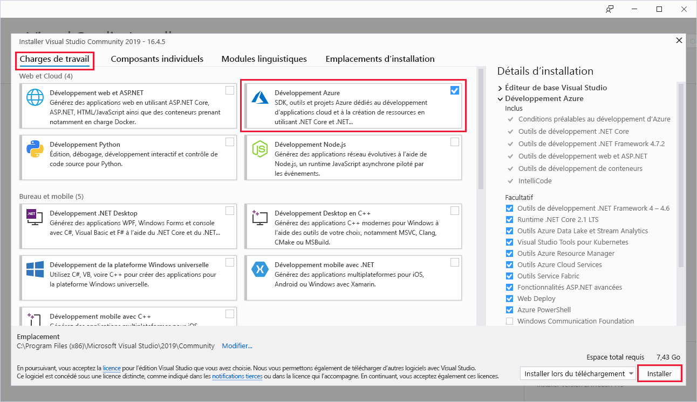

# Démarrage rapide : Créer votre première fonction dans Azure à l’aide de Visual Studio

Dans cet article, vous utilisez Visual Studio pour créer une fonction basée sur une bibliothèque de classes C# qui répond aux demandes HTTP. Après avoir testé le code localement, vous le déployez dans l’environnement serverless d’Azure Functions.  

Le fait de suivre ce guide de démarrage rapide entraîne une petite dépense de quelques cents USD tout au plus dans votre compte Azure.

## Prérequis

Pour suivre ce tutoriel, commencez par installer [Visual Studio 2019](https://azure.microsoft.com/downloads/). Assurez-vous de sélectionner la charge de travail **Développement Azure** lors de l’installation. Si vous préférez créer un projet Azure Functions avec Visual Studio 2017, vous devez commencer par installer les tout [derniers outils Azure Functions](functions-develop-vs.md#check-your-tools-version).

Si vous n’avez pas [d’abonnement Azure](../guides/developer/azure-developer-guide.md#understanding-accounts-subscriptions-and-billing), créez un [compte gratuit](https://azure.microsoft.com/free/dotnet/) avant de commencer.

## Créer un projet d’application de fonction

[!INCLUDE [Create a project using the Azure Functions template](../../includes/functions-vstools-create.md)]

Visual Studio crée un projet et une classe qui contient un code réutilisable pour le type de fonction de déclencheur HTTP. Le code réutilisable envoie une réponse HTTP qui inclut une valeur de la chaîne de requête ou du corps de requête. L’attribut `HttpTrigger` spécifie que l’exécution de la fonction est déclenchée par une requête HTTP. 

## Renommer la fonction

L’attribut de méthode `FunctionName` définit le nom de la fonction qui, par défaut, est `Function1`. Comme les outils ne vous permettent pas de remplacer le nom de fonction par défaut quand vous créez votre projet, prenez une minute pour attribuer un nom plus approprié à la classe de fonction, au fichier et aux métadonnées.

1. Dans l’**Explorateur de fichiers**, cliquez avec le bouton droit sur le fichier Function1.cs et renommez-le `HttpExample.cs`.

1. Dans le code, renommez la classe Function1 en « HttpExample ».

1. Dans la méthode `HttpTrigger` nommée `run`, renommez l’attribut de méthode `FunctionName` en `HttpExample`.

Maintenant que vous avez renommé la fonction, vous pouvez la tester sur votre ordinateur local.

## Exécuter la fonction localement

Visual Studio s’intègre à Azure Functions Core Tools pour vous permettre de tester vos fonctions en local avec le runtime Azure Functions complet.  

[!INCLUDE [functions-run-function-test-local-vs](../../includes/functions-run-function-test-local-vs.md)]

Après avoir vérifié que la fonction s’exécute correctement sur votre ordinateur local, il est temps de publier le projet sur Azure.

## Publication du projet sur Azure

Avant de pouvoir publier votre projet, vous devez disposer d’une application de fonction dans votre abonnement Azure. La publication Visual Studio crée une application de fonction pour vous la première fois que vous publiez votre projet.

[!INCLUDE [Publish the project to Azure](../../includes/functions-vstools-publish.md)]

## Tester votre fonction dans Azure

1. Dans Cloud Explorer, votre nouvelle application de fonction doit être sélectionnée. Si ce n’est pas le cas, développez votre abonnement > **App Services**, puis sélectionnez votre nouvelle application de fonction.

1. Cliquez avec le bouton droit sur l’application de fonction et choisissez **Ouvrir dans le navigateur**. Cela ouvre la racine de votre application de fonction dans votre navigateur web par défaut et affiche la page qui indique que votre application de fonction est en cours d’exécution. 

    :::image type="content" source="media/functions-create-your-first-function-visual-studio/function-app-running-azure.png" alt-text="Application de fonction en cours d’exécution":::

1. Dans la barre d’adresses du navigateur, ajoutez la chaîne `/api/HttpExample?name=Functions` à l’URL de base et exécutez la demande.

    L’URL qui appelle la fonction à déclencheur HTTP est au format suivant :

    `http://<APP_NAME>.azurewebsites.net/api/HttpExample?name=Functions`

2. Accédez à cette URL pour voir dans le navigateur une réponse à la demande GET distante retournée par la fonction, qui ressemble à l’exemple suivant :

    :::image type="content" source="media/functions-create-your-first-function-visual-studio/functions-create-your-first-function-visual-studio-browser-azure.png" alt-text="Réponse de la fonction dans le navigateur":::

## Nettoyer les ressources

Les autres démarrages rapides de cette collection reposent sur ce démarrage rapide. Si vous envisagez d’utiliser d’autres guides de démarrage rapide, tutoriels ou l’un des services que vous avez créés dans ce guide de démarrage rapide, ne supprimez pas les ressources.

*Ressources* dans Azure fait référence aux applications de fonction, fonctions, comptes de stockage, et ainsi de suite. Elles sont rassemblées en *groupes de ressources*, et vous pouvez supprimer tous les éléments d’un groupe en supprimant le groupe. 

Vous avez créé des ressources pour effectuer ces démarrages rapides. Vous pouvez être facturé pour ces ressources, en fonction de [l’état de votre compte](https://azure.microsoft.com/account/) et de la [tarification du service](https://azure.microsoft.com/pricing/). Si vous n’avez plus besoin des ressources, voici comment les supprimer :

1. Dans Cloud Explorer, développez votre abonnement > **App Services**, cliquez avec le bouton droit sur votre application de fonction et choisissez **Ouvrir dans le portail**. 

1. Dans la page de l’application de fonction, sélectionnez l’onglet **Vue d’ensemble**, puis le lien sous **Groupe de ressources**.

   :::image type="content" source="media/functions-create-your-first-function-visual-studio/functions-app-delete-resource-group.png" alt-text="Sélectionner le groupe de ressources à supprimer dans la page de l’application de fonction":::

2. Dans la page **Groupe de ressources**, passez en revue la liste des ressources incluses et vérifiez qu’elles correspondent à celles que vous souhaitez supprimer.
 
3. Sélectionnez **Supprimer le groupe de ressources** et suivez les instructions.

   Cette opération peut prendre quelques minutes. Une fois terminée, une notification s’affiche pendant quelques secondes. Vous pouvez également sélectionner l’icône représentant une cloche en haut de la page pour afficher la notification.

## Étapes suivantes

Dans ce guide de démarrage rapide, vous avez utilisé Visual Studio pour créer et publier une application de fonction C# dans Azure à l’aide d’une simple fonction à déclencheur HTTP. 

Passez à l’article suivant pour savoir comment ajouter une liaison de file d’attente de stockage Azure à votre fonction :
> [!div class="nextstepaction"]
> [Ajouter une liaison de file d’attente Stockage Azure à votre fonction](functions-add-output-binding-storage-queue-vs.md)

