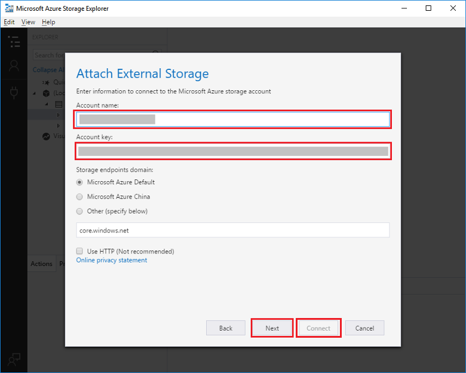

# <a name="add-messages-to-an-azure-storage-queue-using-functions"></a>Ajouter des messages au stockage de files d’attente Azure, à l’aide de Functions

Dans Azure Functions, les liaisons d’entrée et de sortie fournissent une méthode déclarative pour se connecter à des données de service externe à partir de votre fonction. Dans cette rubrique, apprenez à mettre à jour une fonction existante en ajoutant une liaison de sortie qui envoie des messages au service Stockage File d’attente d’Azure.  


## <a name="prerequisites"></a>Composants requis 

[!INCLUDE [Previous topics](../../includes/functions-quickstart-previous-topics.md)]

Vous avez également besoin de télécharger et d’installer [l’Explorateur de Stockage Microsoft Azure](http://storageexplorer.com/). 

[!INCLUDE [functions-portal-favorite-function-apps](../../includes/functions-portal-favorite-function-apps.md)] 

## <a name="add-binding"></a>Ajoutez une liaison de sortie
 
1. Développez à la fois votre application de fonction et votre fonction.

2. Cliquez sur **Intégrer** et **+ Nouvelle sortie**, puis cliquez sur **Stockage File d’attente Azure**, et cliquez sur **Sélectionner**.
    
    

3. Utilisez les paramètres comme indiqué dans la table, et cliquez sur **Enregistrer** : 

    

    | Paramètre      |  Valeur suggérée   | Description                              |
    | ------------ |  ------- | -------------------------------------------------- |
    | **Nom de la file d’attente**   | éléments myqueue    | Le nom de la file d’attente à connecter à votre compte de stockage. |
    | **Connexion au compte de stockage** | AzureWebJobStorage | Vous pouvez utiliser la connexion de compte de stockage qui est déjà utilisée par votre application de fonction, ou créez-en une.  |
    | **Nom de message de paramètre** | outQueueItem | Le nom du paramètre de liaison de sortie. | 

Maintenant que vous avez défini une liaison de sortie, vous devez mettre à jour le code afin d’utiliser la liaison pour ajouter des messages à une file d’attente.  

## <a name="update-the-function-code"></a>Mettre à jour le code de fonction

1. Cliquez sur la fonction pour afficher le code de fonction dans l’éditeur. 

2. Pour une fonction C#, mettez à jour la définition de fonction comme suit, afin d’ajouter le paramètre de liaison de stockage **outQueueItem**. Ignorez cette étape pour une fonction JavaScript.

    ```cs   
    public static async Task<HttpResponseMessage> Run(HttpRequestMessage req, 
        ICollector<string> outQueueItem, TraceWriter log)
    {
        ....
    }
    ```

3. Ajoutez le code suivant à la fonction, juste avant que la méthode ne revienne. Utilisez l’extrait de code approprié pour la langue de votre fonction.

    ```javascript
    context.bindings.outQueueItem = "Name passed to the function: " + 
                (req.query.name || req.body.name);
    ```

    ```cs
    outQueueItem.Add("Name passed to the function: " + name);     
    ```

4. Cliquez sur **Enregistrer** pour enregistrer les modifications.

La valeur passée au déclencheur HTTP est comprise dans un message ajouté à la file d’attente.
 
## <a name="test-the-function"></a>Tester la fonction 

1. Après avoir enregistré les modifications de code, cliquez sur **Exécuter**. 

    

2. Vérifiez les journaux pour vous assurer que la fonction a réussi. Une nouvelle file d’attente nommée **outqueue** est créé dans votre compte de stockage, par le runtime des fonctions, lorsque la liaison de sortie est utilisée pour la première fois.

Par la suite, vous pouvez vous connecter à votre compte de stockage afin de vérifier la nouvelle file d’attente et le nouveau message que vous avez ajouté au compte. 

## <a name="connect-to-the-queue"></a>Connexion à la file d’attente

Ignorez les trois premières étapes si vous avez déjà installé l’Explorateur de stockage et si vous l’avez connecté à votre compte de stockage.    

1. Dans votre fonction, cliquez sur **Intégrer**, et sur la nouvelle liaison de sortie **Stockage de files d’attente Azure**, puis développez **Documentation**. Copiez le **Nom de compte** et la **Clé de compte**. Vous utilisez ces informations d’identification pour vous connecter au compte de stockage.
 
    

2. Exécutez [l’Explorateur de stockage Microsoft Azure](http://storageexplorer.com/), cliquez sur l’icône de connexion situé sur la gauche, choisissez **Utiliser un nom et une clé de compte de stockage**, puis cliquez sur **Suivant**.

    
    
3. Saisissez le **Nom du compte** et la **Clé du compte** récupérés à l’étape 1, puis cliquez sur **Suivant** et sur **Connexion**. 
  
    

4. Développez le compte de stockage attaché, cliquez avec le bouton droit sur **Files d’attente** et vérifiez qu’une file d’attente nommée **éléments myqueue** existe. Vous devriez également déjà voir un message dans la file d’attente.  
 
    
 

## <a name="clean-up-resources"></a>Supprimer des ressources

[!INCLUDE [Next steps note](../../includes/functions-quickstart-cleanup.md)]

## <a name="next-steps"></a>Étapes suivantes

Vous avez ajouté une liaison de sortie à une fonction existante. 

[!INCLUDE [Next steps note](../../includes/functions-quickstart-next-steps.md)]

Pour en savoir plus sur la liaison vers le stockage de files d’attente, consultez la page [Liaisons de file d’attente de stockage Azure Functions](functions-bindings-storage-queue.md). 


