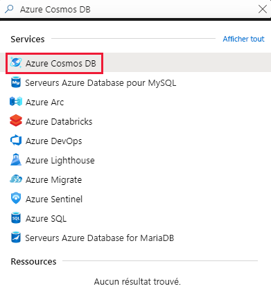

# <a name="store-unstructured-data-using-azure-functions-and-azure-cosmos-db"></a>Stocker des données non structurées à l’aide d’Azure Cosmos DB et d’Azure Functions

[Azure Cosmos DB](https://azure.microsoft.com/services/cosmos-db/) est un excellent moyen de stocker des données JSON et non structurées. Combiné à Azure Functions, Cosmos DB rend le stockage de données simple et rapide avec beaucoup moins de code que pour stocker des données dans une base de données relationnelle.

> [!NOTE]
> À l’heure actuelle, le déclencheur Azure Cosmos DB, les liaisons d’entrée et les liaisons de sortie fonctionnent uniquement avec les comptes d’API SQL et d’API Graph.

Dans Azure Functions, les liaisons d’entrée et de sortie fournissent une méthode déclarative pour se connecter à des données de service externe à partir de votre fonction. Dans cette rubrique, découvrez comment mettre à jour une fonction C# existante pour ajouter une liaison de sortie qui stocke des données non structurées dans un document Cosmos DB. 


## <a name="prerequisites"></a>configuration requise

Pour suivre ce didacticiel :

[!INCLUDE [Previous quickstart note](../../includes/functions-quickstart-previous-topics.md)]

## <a name="add-an-output-binding"></a>Ajouter une liaison de sortie

1. Développez à la fois votre application de fonction et votre fonction.

1. Sélectionnez **Intégrer** et **+ Nouvelle sortie**, en haut à droite de la page. Choisissez **Azure Cosmos DB**, puis cliquez sur **Sélectionner**.

    

3. Utilisez les paramètres de la **sortie Azure Cosmos** comme spécifié dans le tableau : 

    

    | Paramètre      | Valeur suggérée  | Description                                |
    | ------------ | ---------------- | ------------------------------------------ |
    | **Nom du paramètre de document** | taskDocument | Nom qui fait référence à l’objet Cosmos DB dans le code. |
    | **Nom de la base de données** | taskDatabase | Nom de la base de données pour l’enregistrement des documents. |
    | **Nom de la collection** | TaskCollection | Nom de la collection de bases de données. |
    | **Si la valeur est true, crée la collection et la base de données Cosmos DB** | Activé | La collection n’existe pas, vous devez la créer. |

4. Sélectionnez **Nouveau** en regard de **Connexion de document Azure Cosmos DB**, puis sélectionnez **+ Créer**. 

5. Utilisez les paramètres **Nouveau compte** comme spécifié dans le tableau : 

    

    | Paramètre      | Valeur suggérée  | Description                                |
    | ------------ | ---------------- | ------------------------------------------ |
    | **Identifiant** | Nom de base de données | ID unique de la base de données Azure Cosmos DB  |
    | **API** | SQL | Sélectionnez l’API SQL. À l’heure actuelle, le déclencheur Azure Cosmos DB, les liaisons d’entrée et les liaisons de sortie fonctionnent uniquement avec les comptes d’API SQL et d’API Graph. |
    | **Abonnement** | Abonnement Azure | Abonnement Azure  |
    | **Groupe de ressources** | myResourceGroup |  Utilisez le groupe de ressources existant qui contient votre application de fonction. |
    | **Lieu**  | WestEurope | Sélectionnez un emplacement près de votre application de fonction ou d’autres applications qui utilisent les documents stockés.  |

6. Cliquez sur **OK** pour créer la base de données. La création de la base de données peut prendre quelques minutes. Une fois la base de données créée, la chaîne de connexion de base de données est stockée en tant que paramètre d’application de fonction. Le nom de ce paramètre d’application est inséré dans **Connexion au compte Azure Cosmos DB**. 
 
8. Une fois la chaîne de connexion définie, sélectionnez **Enregistrer** pour créer la liaison.

## <a name="update-the-function-code"></a>Mettre à jour le code de fonction

Remplacez le code existant de la fonction C# par ce qui suit :

```csharp
using System.Net;

public static HttpResponseMessage Run(HttpRequestMessage req, out object taskDocument, TraceWriter log)
{
    string name = req.GetQueryNameValuePairs()
        .FirstOrDefault(q => string.Compare(q.Key, "name", true) == 0)
        .Value;

    string task = req.GetQueryNameValuePairs()
        .FirstOrDefault(q => string.Compare(q.Key, "task", true) == 0)
        .Value;

    string duedate = req.GetQueryNameValuePairs()
        .FirstOrDefault(q => string.Compare(q.Key, "duedate", true) == 0)
        .Value;

    taskDocument = new {
        name = name,
        duedate = duedate.ToString(),
        task = task
    };

    if (name != "" && task != "") {
        return req.CreateResponse(HttpStatusCode.OK);
    }
    else {
        return req.CreateResponse(HttpStatusCode.BadRequest);
    }
}

```
Cet exemple de code lit les chaînes de requête HTTP et les assigne aux champs de l’objet `taskDocument`. La liaison `taskDocument` envoie les données d’objet de ce paramètre de liaison pour les stocker dans la base de données du document lié. La base de données est créée la première fois que la fonction s’exécute.

## <a name="test-the-function-and-database"></a>Tester la fonction et la base de données

1. Développez la fenêtre de droite et sélectionnez **Test**. Sous **Requête**, cliquez sur **+ Ajouter un paramètre** et ajoutez les paramètres suivants à la chaîne de requête :

    + `name`
    + `task`
    + `duedate`

2. Cliquez sur **Exécuter** et vérifiez que l’état 200 est renvoyé.

    

1. Sur le côté gauche du portail Azure, développez la barre d’icônes, tapez `cosmos` dans le champ de recherche, puis sélectionnez **Azure Cosmos DB**.

    

2. Sélectionnez votre compte Azure Cosmos DB, puis sélectionnez **Explorateur de données**. 

3. Développez les nœuds **Collections**, sélectionnez le nouveau document et confirmez que le document contient des valeurs de votre chaîne de requête, ainsi que des métadonnées supplémentaires. 

    

Vous êtes parvenu à ajouter une liaison à votre déclencheur HTTP qui stocke des données non structurées dans une base de données Azure Cosmos DB.

[!INCLUDE [Clean-up section](../../includes/clean-up-section-portal.md)]

## <a name="next-steps"></a>Étapes suivantes

[!INCLUDE [functions-quickstart-next-steps](../../includes/functions-quickstart-next-steps.md)]

Pour en savoir plus sur la liaison vers une base de données Cosmos DB, consultez la page [Liaisons Cosmos DB Azure Functions](functions-bindings-cosmosdb.md).
