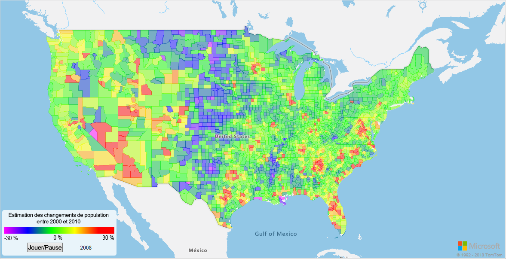
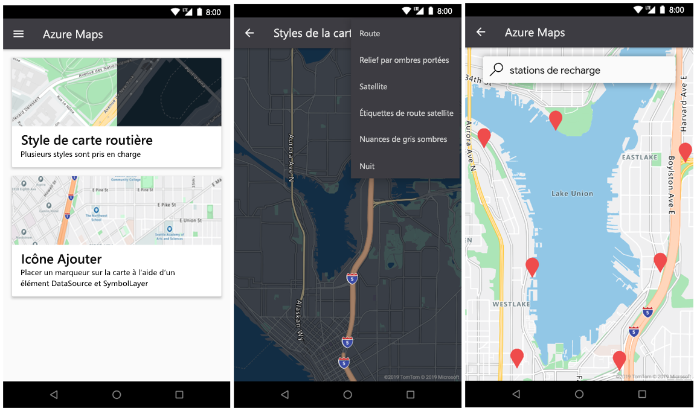

# <a name="what-is-azure-maps"></a>Qu’est-ce qu’Azure Maps ?

Azure Maps est une collection de services géospatiaux qui utilisent des données cartographiques actualisées pour fournir un contexte géographique précis à des applications web et mobiles. Azure Maps fournit les services suivants :

* API REST pour assurer le rendu des cartes dans plusieurs styles et dans une imagerie satellitaire.
* Services Search pour localiser les adresses, les lieux et les points d’intérêt dans le monde entier.
* Diverses options de routage : point à point, multipoint, optimisation multipoint, isochrone, véhicule commercial, trafic influencé et itinéraire par matrice.
* Vue des flux de trafic et vue des incidents, pour les applications qui ont besoin d’informations de trafic.
* Service Mobility pour demander la logistique des transports publics, planifier des itinéraires en temps réel et demander des informations pour des modes de transport alternatifs.
* Services de fuseau horaire et de géolocalisation et conversion d’un emplacement en fuseaux horaires.
* Services de geofencing et stockage des données cartographiques, avec les informations d’emplacement hébergées dans Azure. 
* Intelligence géographique via l’analytique géospatiale. 

Par ailleurs, les services Azure Maps sont disponibles via le kit SDK Web ou Android SDK. Ces outils aident les développeurs à développer et à mettre à l’échelle rapidement des solutions intégrant des informations de localisation dans des solutions Azure. 

Vous pouvez vous inscrire pour un [compte Azure Maps](https://azure.microsoft.com/services/azure-maps/) gratuit et commencer à développer.

La vidéo suivante explique Azure Maps plus en détail :

<br/>

<iframe src="https://channel9.msdn.com/Shows/Internet-of-Things-Show/Azure-Maps/player?format=ny" width="960" height="540" allowFullScreen frameBorder="0"></iframe>

## <a name="map-controls"></a>Contrôles de carte

### <a name="web-sdk"></a>Kit de développement logiciel (SDK) web

Le SDK web Azure Maps vous permet de personnaliser des cartes interactives avec du contenu et des images qui vous sont propres. Vous pouvez utiliser cette carte interactive pour vos applications web ou mobiles. Le contrôle de carte utilise WebGL : vous pouvez donc afficher les jeux de données volumineux avec un haut niveau de performance. Développez avec le SDK en utilisant JavaScript ou TypeScript.



### <a name="android-sdk"></a>Kit de développement logiciel Android

Utilisez le SDK Android d’Azure Maps pour créer des applications cartographiques mobiles. 



## <a name="services-in-azure-maps"></a>Services d’Azure Maps

Azure Maps se compose des neuf services suivants, qui peuvent fournir un contexte géographique à vos applications Azure.

### <a name="data-service"></a>Data Service

Les données sont indispensables pour les cartes. Utilisez Data Service pour charger et stocker des données géospatiales pour une utilisation avec des opérations spatiales ou la composition d’images.  Le fait de pouvoir rapprocher les données client du service Azure Maps permettra de réduire la latence, d’améliorer la productivité et de créer de nouveaux scénarios dans vos applications. Pour plus d’informations sur ce service, consultez la [Documentation de l’API Data Service](https://docs.microsoft.com/rest/api/maps/data).

### <a name="mobility-service"></a>Service Mobilité

Azure Maps Mobility Service permet la planification de déplacements en temps réel. Il retourne les options des meilleurs itinéraires possibles et fournit différents modes de déplacement. Pour les zones urbaines (villes), ces modes peuvent inclure la marche, le vélo et les transports publics. Vous pouvez demander des itinéraires de transports, le plan des lignes, les listes des arrêts, les arrivées planifiées et en temps réel, et des alertes sur les services.

Le service autorise également des recherches de types d’objets spécifiques autour d’un lieu. Les utilisateurs peuvent rechercher des vélos, des scooters ou des voitures en partage autour d’un lieu. Les utilisateurs peuvent demander le nombre de vélos disponibles dans la station la plus proche et rechercher les véhicules disponibles pour le covoiturage. De plus, ils peuvent trouver des détails comme la disponibilité future des véhicules et le niveau de carburant actuel.

Pour plus d’informations sur le service, consultez la [Documentation de l’API Mobility](https://docs.microsoft.com/rest/api/maps/mobility).

### <a name="render-service"></a>Render Service

Le service Render permet aux développeurs de créer des applications web et mobiles dotées de fonctionnalités de cartographie. Le service utilise des images graphiques raster de haute qualité disponibles en 19 niveaux de zoom ou des images de cartes au format vectoriel entièrement personnalisables.


Render Service inclut désormais des API pour permettre aux développeurs de travailler avec des images satellite. Pour plus d’informations, consultez la [Documentation de l’API Render](https://docs.microsoft.com/rest/api/maps/render).

### <a name="route-service"></a>Service d’itinéraire

Route Service comporte des fonctionnalités robustes de calcul géométrique pour les infrastructures réelles et des directions pour différents modes de transport. Le service permet aux développeurs de calculer des directions pour plusieurs modes de déplacement, notamment en voiture, en camion, à vélo ou à pied. Le service prend aussi en compte des entrées comme les conditions de circulation, les restrictions de poids et le transport de matières dangereuses.


Route Service offre un aperçu de fonctionnalités avancées comme les suivantes : 

* Traitement par lots de plusieurs demandes d’itinéraire.
* Matrices de durées et de distances des trajets entre un ensemble d’origines et de destinations.
* Recherche des itinéraires ou des distances que les utilisateurs peuvent parcourir en fonction d’exigences horaires ou de carburant. 

Pour plus d’informations sur les fonctionnalités liées aux itinéraires, consultez la [Documentation de l’API Route](https://docs.microsoft.com/rest/api/maps/route).

### <a name="search-service"></a>Service de recherche

Search Service aide les développeurs à rechercher des adresses, des lieux, des listes d’entreprises par nom ou par catégorie, et d’autres informations d’ordre géographique. Search Service peut aussi [géocoder en inversé](https://en.wikipedia.org/wiki/Reverse_geocoding) les adresses et rues de croisement en fonction des latitudes et longitudes.


Search Service fournit également des fonctionnalités avancées comme les suivantes :

* Rechercher le long d’une route.
* Rechercher à l’intérieur d’une zone plus large.
* Traiter par lot un groupe de demandes de recherche.
* Rechercher dans une zone plus large au lieu d’un emplacement précis. 

Les API pour le traitement par lot et la recherche par zone sont actuellement en préversion. Pour plus d’informations sur les fonctionnalités de recherche, consultez la [Documentation de l’API Search](https://docs.microsoft.com/rest/api/maps/search).

### <a name="spatial-operations-service"></a>Service Spatial Operations

Le service Spatial Operations d’Azure Maps accepte les informations de localisation. Il les analyse rapidement afin d’informer les clients au sujet des événements continus qui se produisent dans le temps et l’espace. Il permet une analyse en quasi temps réel et la modélisation prédictive des événements. 

Le service permet aux clients d’améliorer leurs informations de localisation, avec une bibliothèque de calculs mathématiques géospatiaux courants. Les calculs courants incluent le point le plus proche, la distance orthodromique et les zones tampons. Pour plus d’informations sur le service et ses différentes fonctionnalités, consultez la [documentation de l’API Spatial Operations](https://docs.microsoft.com/rest/api/maps/spatial).

### <a name="time-zone-service"></a>Time Zone Service

Time Zone Service permet d’interroger des informations actuelles, historiques et futures sur les fuseaux horaires. Vous pouvez utiliser des combinaisons de latitude et de longitude, ou un [ID IANA](https://www.iana.org/). Time Zone Service permet également de :

* Convertir les ID de fuseau horaire Microsoft Windows en fuseaux horaires IANA.
* Récupérer un décalage de fuseau horaire au format UTC.
* Obtenir l’heure actuelle dans un fuseau horaire déterminé. 

Voici un exemple de réponse JSON courante à une requête Time Zone Service :

```JSON
{
    "Version": "2017c",
    "ReferenceUtcTimestamp": "2017-11-20T23:09:48.686173Z",
    "TimeZones": [{
        "Id": "America/Los_Angeles",
        "ReferenceTime": {
            "Tag": "PST",
            "StandardOffset": "-08:00:00",
            "DaylightSavings": "00:00:00",
            "WallTime": "2017-11-20T15:09:48.686173-08:00",
            "PosixTzValidYear": 2017,
            "PosixTz": "PST+8PDT,M3.2.0,M11.1.0"
        }
    }]
}
```

Pour plus d’informations sur ce service, consultez la [Documentation de l’API Time Zone](https://docs.microsoft.com/rest/api/maps/timezone).

### <a name="traffic-service"></a>Traffic Service

Traffic Service est une suite de services web conçue que les développeurs peuvent utiliser pour créer des applications web et mobiles nécessitant des informations sur le trafic. Ce service fournit deux types de données :

* Flux de trafic : Vitesses et durées de déplacement observées en temps réel pour toutes les routes clés du réseau.
* Incidents de trafic : Vue actualisée des embouteillages et des incidents sur le réseau routier.


Pour plus d’informations, consultez la [Documentation de l’API Traffic](https://docs.microsoft.com/rest/api/maps/traffic).

### <a name="ip-to-location-service"></a>Service IP to Location

Le service IP to Location vous permet de prévisualiser le code pays à deux lettres récupéré d’une adresse IP. Ce service peut vous aider à améliorer l’expérience utilisateur en personnalisant le contenu des applications en fonction de la localisation géographique.

Pour plus d’informations sur le service IP to Location dans l’API REST, consultez la [Documentation de l’API de géolocalisation d’Azure Maps](https://docs.microsoft.com/rest/api/maps/geolocation).

## <a name="programming-model"></a>Modèle de programmation

Azure Maps est conçu pour la mobilité et peut vous permettre de développer des applications multiplateformes. Il utilise un modèle de programmation indépendant du langage et il prend en charge les sorties au format JSON via des [API REST](https://docs.microsoft.com/rest/api/maps/).

De plus, Azure Maps offre un [contrôle de carte JavaScript](https://docs.microsoft.com/javascript/api/azure-maps-control) pratique avec un modèle de programmation simple. Le développement est simple et rapide pour les applications web et mobiles.

## <a name="usage"></a>Usage

Vous pouvez accéder aux services Azure Maps via le [portail Azure](https://portal.azure.com), en créant un compte Azure Maps.

Azure Maps utilise un schéma d’authentification basé sur une clé. Votre compte s’accompagne de deux clés déjà générées automatiquement ; utilisez l’une ou l’autre de ces clés. Commencez à intégrer ces fonctionnalités de localisation dans votre application et formulez des demandes auprès des services Azure Maps.

Remarque : Azure Maps partage les demandes d’adresse/de lieu fournies par le client (« demandes ») avec la société tierce TomTom pour la fonctionnalité de carte. Les demandes ne sont liées à aucun client ou utilisateur final quand elles sont partagées avec TomTom et ne peuvent pas être utilisées pour identifier des individus. Microsoft est en train d’ajouter TomTom à la liste des sous-traitants de services en ligne. Notez que les services Mobility et Météo incluant l’intégration à Moovit et AccuWeather sont actuellement en [préversion](https://azure.microsoft.com/support/legal/preview-supplemental-terms/).

## <a name="supported-regions"></a>Régions prises en charge

Les API Azure Maps sont actuellement disponibles dans tous les pays et régions, à l’exception de :

* Chine
* Corée du Sud

Vérifiez que la localisation de votre adresse IP actuelle se trouve dans un pays pris en charge.

## <a name="next-steps"></a>Étapes suivantes

Essayez un exemple d’application qui montre Azure Maps :

> [!div class="nextstepaction"]
> [Démarrage rapide : Créer une application web](quick-demo-map-app.md)

Restez informé sur Azure Maps : 

> [!div class="nextstepaction"]
> [Blog Azure Maps](https://azure.microsoft.com/blog/topics/azure-maps/)
