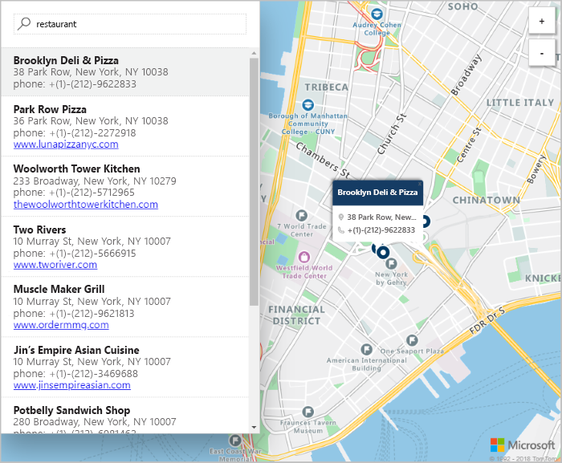

# Lancer une carte de recherche interactive avec Azure Maps

Cet article décrit les fonctionnalités d’Azure Maps qui consistent à créer une carte offrant aux utilisateurs une expérience de recherche interactive. Il explique également dans les grandes lignes comment créer son propre compte Maps et obtenir une clé de compte pour pouvoir l’utiliser dans l’application web de démonstration.

Si vous n’avez pas d’abonnement Azure, créez un [compte gratuit](https://azure.microsoft.com/free/?WT.mc_id=A261C142F) avant de commencer.

## Se connecter au portail Azure.

Connectez-vous au [portail Azure](https://portal.azure.com/).

## Créer un compte et obtenir une clé

1. En haut à gauche du [portail Azure](https://portal.azure.com), cliquez sur **Créer une ressource**.
2. Dans la zone *Rechercher sur la Place de marché*, tapez **Maps**.
3. Dans les *Résultats*, sélectionnez **Maps**. Cliquez sur le bouton **Créer** qui s’affiche sous la carte.
4. Sur la page **Créer un compte Maps**, entrez les valeurs suivantes :
    - Le *Nom* de votre nouveau compte.
    - *L’Abonnement* à utiliser pour ce compte.
    - Le *Groupe de ressources* de ce compte. Vous pouvez choisir de *Créer* ou d’utiliser un groupe de ressources *Existant*.
    - Sélectionnez *l’Emplacement du groupe de ressources*.
    - Lisez la *Licence* et la *Déclaration de confidentialité*, puis cochez la case pour accepter les conditions.
    - Enfin, cliquez sur le bouton **Créer**.

    

5. Une fois votre compte créé, ouvrez-le et accédez à la section Paramètres du menu Compte. Cliquez sur **Clés** pour afficher les clés primaire et secondaire de votre compte Azure Maps. Copiez la valeur de la **Clé primaire** dans le Presse-papiers local afin de pouvoir l’utiliser dans la section suivante.

## Télécharger l’application

1. Téléchargez ou copiez le contenu du fichier [interactiveSearch.html](https://github.com/Azure-Samples/azure-maps-samples/blob/master/src/interactiveSearch.html).
2. Enregistrez le contenu de ce fichier localement en tant que **AzureMapDemo.html** et ouvrez-le dans un éditeur de texte.
3. Recherchez la chaîne `<insert-key>` et remplacez-la par la valeur de la **Clé primaire** obtenue dans la section précédente.

## Lancer l’application

1. Ouvrez le fichier **AzureMapDemo.html** dans le navigateur de votre choix.
2. Observez la carte de la ville de Los Angeles. Effectuez un zoom avant et arrière : la carte affiche automatiquement plus ou moins d’informations selon le niveau de zoom. 
3. Modifiez le centre par défaut de la carte. Dans le fichier **AzureMapDemo.html**, recherchez la variable nommée **center**. Remplacez la paire de valeurs longitude, latitude de cette variable par les nouvelles valeurs : **[-74.0060, 40.7128]**. Enregistrez le fichier et actualisez votre navigateur.
4. Testez l’expérience de recherche interactive. Dans la zone de recherche en haut à gauche de l’application web de démonstration, recherchez **restaurants**.
5. Déplacez votre souris sur la liste des adresses/emplacements qui s’affichent sous la zone de recherche, et notez comment la punaise correspondante sur la carte affiche des informations sur cet emplacement. Pour des raisons de confidentialité des entreprises privées, des adresses et des noms fictifs sont présentés.

    

## Supprimer des ressources

Les tutoriels vous expliqueront en détail comment utiliser et configurer Maps avec votre compte. Si vous prévoyez de suivre les tutoriels, ne nettoyez pas les ressources créées dans ce guide de démarrage rapide. Sinon, procédez aux étapes suivantes pour supprimer toutes les ressources créées lors de ce démarrage rapide.

1. Fermez le navigateur qui exécute l’application web **AzureMapDemo.html**.
2. Dans le menu de gauche du Portail Azure, cliquez sur **Toutes les ressources**, puis sélectionnez votre compte Maps. Dans la partie supérieure du panneau **Toutes les ressources**, cliquez sur **Supprimer**.

## Étapes suivantes

Dans ce guide de démarrage rapide, vous avez créé votre compte Maps et lancé une application de démonstration. Pour découvrir comment créer votre propre application à l’aide des API Maps, passez au tutoriel suivant.

> [!div class="nextstepaction"]
> [Rechercher des points d’intérêt avec Maps](./tutorial-search-location.md)

Pour bénéficier de davantage d’exemples de code et d’une expérience de codage interactive, consultez les guides de procédure ci-dessous.

> [!div class="nextstepaction"]
> [Comment rechercher une adresse à l’aide des API REST de Azure Maps](./how-to-search-for-address.md)

> [!div class="nextstepaction"]
> [Guide pratique d’utilisation du contrôle de carte Azure Maps](./how-to-use-map-control.md)
