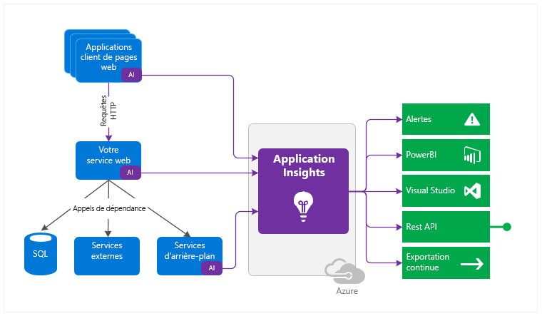
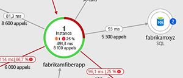
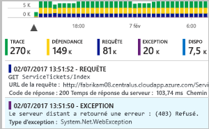
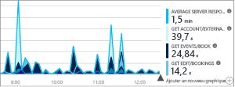
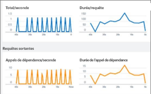
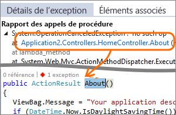
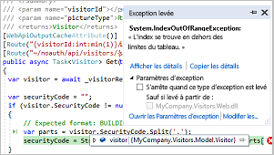

# Présentation d’Application Insights
Application Insights, fonctionnalité d’[Azure Monitor](../overview.md), est un service extensible de gestion des performances des applications (APM) destiné aux développeurs et aux professionnels de DevOps. Utilisez-le pour superviser vos applications en temps réel. Ce service détecte automatiquement les anomalies de performances et intègre de puissants outils analytiques conçus pour vous aider à diagnostiquer les problèmes et à comprendre l’usage que les utilisateurs font de votre application.  Il a été conçu pour vous permettre d’améliorer continuellement les performances et la convivialité. Il fonctionne avec des applications sur un large éventail de plateformes, notamment .NET, Node.js et Java EE, qu’elles soient hébergées localement, de manière hybride ou dans n’importe quel cloud public. Il s’intègre à votre processus DevOps et offre des points de connexion à un large éventail d’outils de développement. Il peut surveiller et analyser les données de télémétrie des applications mobiles en s’intégrant à Visual Studio App Center.

## Comment fonctionne Application Insights ?
Vous installez un petit package d’instrumentation dans votre application puis configurez une ressource Application Insights dans le portail Microsoft Azure. L’instrumentation supervise votre application et envoie les données de télémétrie à Azure Monitor. (L’application peut s’exécuter partout, elle n’a pas besoin d’être hébergée dans Azure.)

Vous pouvez instrumenter non seulement l’application de service web, mais aussi tous les composants d’arrière-plan et le code JavaScript des pages web elles-mêmes. 

En outre, vous pouvez extraire des données de télémétrie des environnements hôtes, notamment des compteurs de performances, des diagnostics Azure ou des journaux d’activité Docker. Vous pouvez également configurer des tests web qui envoient régulièrement des demandes synthétiques à votre service web.

Tous ces flux de données de télémétrie sont intégrés à Azure Monitor. Dans le portail Azure, vous pouvez appliquer de puissants outils d’analytique et de recherche aux données brutes.

### Quelle est la surcharge ?
L'impact sur les performances de votre application est très faible. Le suivi des appels n’entraîne aucun blocage, et les appels sont regroupés par lots et envoyés dans un thread séparé.

## Que surveille Application Insights ?

Application Insights est destiné à l’équipe de développement et permet de comprendre les performances et l’utilisation de votre application. Il analyse les éléments suivants :

* **Taux de demandes, temps de réponse et taux d’échec** : identifiez les pages les plus consultées, à quel moment de la journée, et déterminez où se trouvent vos utilisateurs. Identifiez les pages qui offrent les meilleures performances. Si vos temps de réponse et votre taux d’échec augmentent lorsqu’il y a plus de requêtes, vous avez peut-être un problème de ressources. 
* **Taux de dépendance, temps de réponse et taux d’échec** : déterminez si des services externes vous ralentissent.
* **Exceptions** : analysez les statistiques agrégées, ou choisissez des instances en particulier et explorez l’arborescence des appels de procédure et les requêtes connexes. Les exceptions de serveur et de navigateur sont signalées.
* **Consultations de pages et performances de chargement** : indiquées par le navigateur de vos utilisateurs.
* **Appels AJAX** à partir de pages web : taux, temps de réponse et taux d’échec.
* **Nombre de sessions et d’utilisateurs**.
* **Compteurs de performances** de vos ordinateurs serveurs Windows ou Linux, par exemple le processeur, la mémoire et l’utilisation du réseau. 
* **Diagnostics d’hébergement** de Docker ou Azure. 
* **Journaux d’activité de suivi des diagnostics** de votre application : pour pouvoir mettre en corrélation les événements de suivi avec les demandes.
* **Mesures et événements personnalisés** que vous écrivez vous-même dans le code client ou serveur, pour effectuer le suivi des événements commerciaux tels que les articles vendus ou les matchs gagnés.

## Où trouver mes données de télémétrie ?

Il existe de nombreuses manières d’explorer vos données. Consultez les articles suivants :

|  |  |
| --- | --- |
| [**Détection intelligente et alertes manuelles**](../../azure-monitor/app/proactive-diagnostics.md) Configurez des alertes automatiques qui s’adaptent aux modèles télémétriques habituels de votre application et se déclenchent quand un comportement inhabituel est détecté. Vous pouvez également [définir des alertes](../../azure-monitor/app/alerts.md) sur des niveaux particuliers de mesures personnalisées ou standard. | |
| [**Mise en correspondance d’applications**](../../azure-monitor/app/app-map.md) Explorez les composants de votre application, avec des alertes et des métriques clés. |  |
| [**Profileur**](../../azure-monitor/app/profiler.md) Examinez les profils d’exécution des requêtes échantillonnées. | |
| [**Analyse de l’utilisation**](../../azure-monitor/app/usage-overview.md) Analysez la rétention et la segmentation ds utilisateurs.| |
| [**Recherche de diagnostic pour les données d’instance**](../../azure-monitor/app/diagnostic-search.md) Cherchez et filtrez les événements, comme les requêtes, les exceptions, les appels de dépendance, les suivis de journaux et les affichages de pages.  | |
| [**Metrics Explorer pour les données agrégées**](../../azure-monitor/app/metrics-explorer.md) Explorez, filtrez et segmentez des données agrégées, comme les taux de demandes, d’échecs et d’exceptions, les temps de réponse et les durées de chargement des pages. | |
| [**Tableaux de bord**](../../azure-monitor/app/overview-dashboard.md) Combinez des données de plusieurs sources et partagez-les avec d’autres. Idéal pour les applications à composants multiples et pour un affichage en continu dans la salle de l’équipe. | |
| [**Live Metrics Stream**](../../azure-monitor/app/live-stream.md) Lorsque vous déployez une nouvelle version, observez ces indicateurs de performance quasiment en temps réel pour vous assurer que tout fonctionne comme prévu. | |
| [**Analytics**](../../azure-monitor/app/analytics.md) Répondez à des questions difficiles sur les performances et l’utilisation de votre application avec ce langage de requêtes puissant. | |
| [**Visual Studio**](../../azure-monitor/app/visual-studio.md) Consultez les données de performances dans le code. Accédez au code à partir de l’arborescence des appels de procédure.| |
| [**Débogueur de capture instantanée**](../../azure-monitor/app/snapshot-debugger.md) Déboguez les captures instantanées échantillonnées à partir des opérations en direct, avec des valeurs de paramètre.| |
| [**Power BI**](../../azure-monitor/app/export-power-bi.md ) Intégrez des mesures d’utilisation à d’autres données décisionnelles.| |
| [**API REST**](https://dev.applicationinsights.io/) Écrivez du code pour exécuter des requêtes sur vos propres données brutes et mesures.|  |
| [**Exportation continue**](../../azure-monitor/app/export-telemetry.md) Exportation en bloc de données brutes vers le système de stockage dès leur arrivée. | |

## Comment utiliser Application Insights ?

### Moniteur
Installez Application Insights dans votre application, configurez les [tests web de disponibilité](../../azure-monitor/app/monitor-web-app-availability.md), puis :

* Consultez le [tableau de bord d’application](../../azure-monitor/app/overview-dashboard.md) par défaut de votre salle d’équipe afin de garder un œil sur la charge, la réactivité et les performances de vos dépendances, chargements de pages et appels AJAX.
* Découvrez quelles demandes sont les plus lentes et se terminent le plus par un échec.
* Surveillez le [flux temps réel](../../azure-monitor/app/live-stream.md) lorsque vous déployez une nouvelle version, afin d’être immédiatement informé en cas de dégradation.

### Détecter, diagnostiquer
Lorsque vous recevez une alerte ou découvrez un problème :

* Évaluez le nombre d’utilisateurs affectés.
* Mettez en corrélation les échecs et les exceptions, les appels de dépendance et les traces.
* Examinez le profileur, les captures instantanées, les vidages de pile et les journaux d’activité de suivi.

### Créer, mesurer, apprendre
[Mesurez l’efficacité](../../azure-monitor/app/usage-overview.md) de chaque nouvelle fonctionnalité que vous déployez.

* Planifiez l’évaluation de la manière dont les clients utilisent de nouvelles fonctionnalités d’entreprise ou utilisateur.
* Écrivez des données de télémétrie personnalisées dans votre code.
* Fondez le prochain cycle de développement sur des preuves tangibles provenant de votre télémétrie.

## Bien démarrer
Application Insights est un des nombreux services hébergés dans Microsoft Azure, et les données de télémétrie sont envoyées à des fins d’analyse et de présentation. Ainsi, avant d’effectuer une autre opération, vous devez souscrire un abonnement [Microsoft Azure](https://azure.com). L’inscription est gratuite ; de plus, si vous choisissez le [plan de tarification](https://azure.microsoft.com/pricing/details/application-insights/) de base d’Application Insights, rien n’est facturé tant que votre application n’est pas utilisée de façon substantielle. Si votre organisation possède déjà un abonnement, votre compte Microsoft peut y être ajouté.

Il existe plusieurs façons de démarrer avec Application Insights. Commencez par la méthode qui vous convient le mieux. Vous pourrez ajouter les autres par la suite.

* **Au moment de l’exécution : instrumentez votre application web sur le serveur.** Idéal pour les applications déjà déployées. Permet d’éviter toute mise à jour du code.
  * [**Applications ASP.NET ou ASP.NET Core hébergées sur Azure Web Apps**](../../azure-monitor/app/azure-web-apps.md)
  * [**Applications ASP.NET hébergées dans IIS sur une machine virtuelle Azure ou un groupe de machines virtuelles identiques Azure**](../../azure-monitor/app/azure-vm-vmss-apps.md)
  * [**Applications ASP.NET hébergées par IIS sur une machine virtuelle locale**](../../azure-monitor/app/monitor-performance-live-website-now.md)
* **Au moment du développement : ajoutez Application Insights à votre code.** Vous permet de personnaliser la collecte des données de télémétrie et d’envoyer des données de télémétrie supplémentaires.
  * [Applications ASP.NET](../../azure-monitor/app/asp-net.md)
  * [Applications ASP.NET Core](../../azure-monitor/app/asp-net-core.md)
  * [Applications de console .NET](../../azure-monitor/app/console.md)
  * [Java](../../azure-monitor/app/java-get-started.md)
  * [Node.JS](../../azure-monitor/app/nodejs.md)
  * [Python](../../azure-monitor/app/opencensus-python.md)
  * [autres plateformes](../../azure-monitor/app/platforms.md)
* **[Instrumentez vos pages web](../../azure-monitor/app/javascript.md)** pour l’affichage de page, AJAX et d’autres données de télémétrie côté client.
* **[Analysez l’utilisation des applications mobiles](../../azure-monitor/learn/mobile-center-quickstart.md)** en effectuant l’intégration avec Visual Studio App Center.
* **[Tests de disponibilité](../../azure-monitor/app/monitor-web-app-availability.md)** : effectuez régulièrement un test ping sur votre site web à partir de nos serveurs.

## Étapes suivantes
Prise en main lors de l’exécution avec :

* [Applications hébergées par IIS sur une machine virtuelle Azure et un groupe de machines virtuelles identiques Azure](../../azure-monitor/app/azure-vm-vmss-apps.md)
* [Serveur IIS](../../azure-monitor/app/monitor-performance-live-website-now.md)
* [Azure Web Apps](../../azure-monitor/app/azure-web-apps.md)

Prise en main pendant le développement avec :

* [ASP.NET](../../azure-monitor/app/asp-net.md)
* [ASP.NET Core](../../azure-monitor/app/asp-net-core.md)
* [Java](../../azure-monitor/app/java-get-started.md)
* [Node.JS](../../azure-monitor/app/nodejs.md)
* [Python](../../azure-monitor/app/opencensus-python.md)

## Support et commentaires
* Questions et problèmes :
  * [Dépannage][qna]
  * [Forum MSDN](https://social.msdn.microsoft.com/Forums/vstudio/home?forum=ApplicationInsights)
  * [Stackoverflow](https://stackoverflow.com/questions/tagged/ms-application-insights)
* Vos suggestions :
  * [UserVoice](https://feedback.azure.com/forums/357324-application-insights/filters/top)
* Blog :
  * [Blog Application Insights](https://azure.microsoft.com/blog/tag/application-insights)

<!--Link references-->

[android]: ../../azure-monitor/learn/mobile-center-quickstart.md
[azure]: ../../insights-perf-analytics.md
[client]: ../../azure-monitor/app/javascript.md
[desktop]: ../../azure-monitor/app/windows-desktop.md
[greenbrown]: ../../azure-monitor/app/asp-net.md
[ios]: ../../azure-monitor/learn/mobile-center-quickstart.md
[java]: ../../azure-monitor/app/java-get-started.md
[knowUsers]: app-insights-web-track-usage.md
[platforms]: ../../azure-monitor/app/platforms.md
[portal]: https://portal.azure.com/
[qna]: ../../azure-monitor/app/troubleshoot-faq.md
[redfield]: ../../azure-monitor/app/monitor-performance-live-website-now.md
