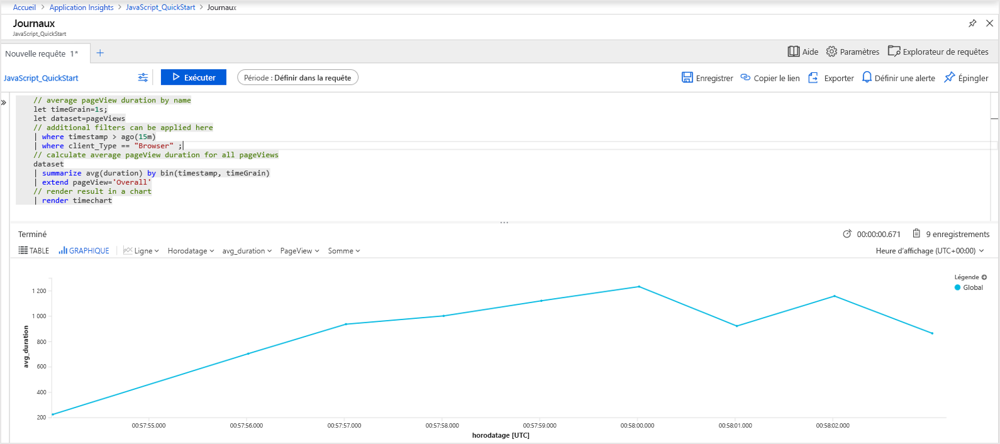
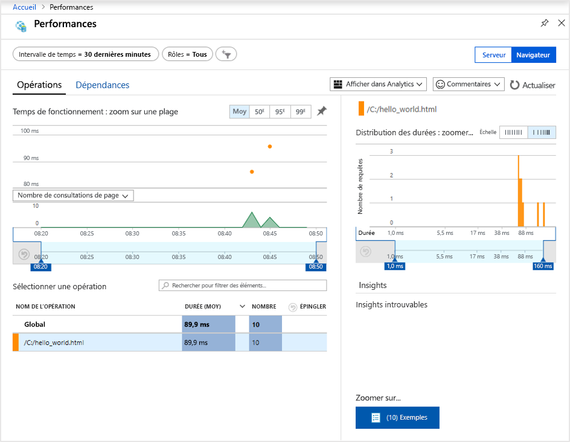
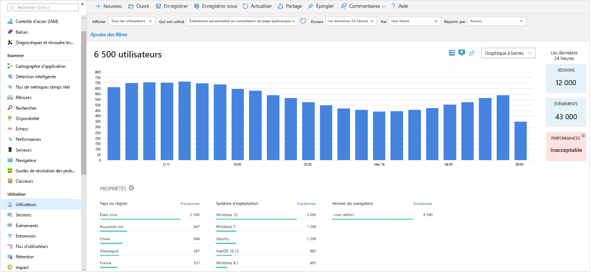

# <a name="quickstart-start-monitoring-your-website-with-azure-monitor-application-insights"></a>Démarrage rapide : Commencez à superviser votre site web avec Azure Monitor Application Insights

Dans ce guide de démarrage rapide, vous allez apprendre à ajouter le SDK JavaScript Application Insights open source à votre site web. Vous apprendrez également à mieux comprendre l’expérience côté client/navigateur pour les visiteurs de votre site web.

Azure Monitor Application Insights vous permet de surveiller facilement la disponibilité, les performances et l’utilisation de votre site web. De plus, vous pouvez rapidement identifier et diagnostiquer les erreurs dans votre application sans attendre qu’un utilisateur ne les signale. Application Insights offre des fonctionnalités de supervision côté serveur et côté client/navigateur.

## <a name="prerequisites"></a>Prérequis

* Compte Azure avec un abonnement actif. [Créez un compte gratuitement](https://azure.microsoft.com/free/?ref=microsoft.com&utm_source=microsoft.com&utm_medium=docs&utm_campaign=visualstudio).
* Un site web auquel vous pouvez ajouter le SDK JavaScript Application Insights.

## <a name="enable-application-insights"></a>Activer Application Insights

Application Insights permet de recueillir les données de télémétrie à partir de n’importe quelle application connectée à Internet, qu’elle soit exécutée localement ou dans le cloud. Suivez les étapes ci-dessous pour lancer l’affichage de ces données.

1. Connectez-vous au [portail Azure](https://portal.azure.com/).
2. Sélectionnez **Créer une ressource** > **Outils de gestion** > **Application Insights**.

   > [!NOTE]
   >Si c’est la première fois que vous créez une ressource Application Insights, vous pouvez en apprendre davantage en lisant l’article [Créer une ressource Application Insights](https://docs.microsoft.com/azure/azure-monitor/app/create-new-resource).

   Une boîte de configuration s’affiche. Utilisez le tableau suivant pour remplir les champs d’entrée.

    | Paramètres        | Valeur           | Description  |
   | ------------- |:-------------|:-----|
   | **Nom**      | Valeur globalement unique | Nom identifiant l’application que vous analysez |
   | **Groupe de ressources**     | myResourceGroup      | Nom du nouveau groupe de ressources pour héberger les données Application Insights Vous pouvez créer un groupe de ressources ou utiliser un groupe existant. |
   | **Lieu** | USA Est | Choisissez un emplacement près de chez vous ou proche de l’endroit où votre application est hébergée |

3. Cliquez sur **Créer**.

## <a name="create-an-html-file"></a>Créer un fichier HTML

1. Sur votre ordinateur local, créez un fichier appelé ``hello_world.html``. Pour cet exemple, le fichier sera placé à la racine du lecteur C: à ``C:\hello_world.html``.
2. Copiez le script ci-dessous dans ``hello_world.html`` :

    ```html
    <!DOCTYPE html>
    <html>
    <head>
    <title>Azure Monitor Application Insights</title>
    </head>
    <body>
    <h1>Azure Monitor Application Insights Hello World!</h1>
    <p>You can use the Application Insights JavaScript SDK to perform client/browser-side monitoring of your website. To learn about more advanced JavaScript SDK configurations visit the <a href="https://github.com/Microsoft/ApplicationInsights-JS/blob/master/API-reference.md" title="API Reference">API reference</a>.</p>
    </body>
    </html>
    ```

## <a name="configure-application-insights-sdk"></a>Configurer le SDK Application Insights

1. Sélectionnez **Vue d’ensemble** > **Éléments principaux** > copiez la **clé d’instrumentation** de votre application.

   

2. Ajoutez le script suivant à votre ``hello_world.html`` avant la balise de fermeture ``</head>`` :

   ```javascript
   <script type="text/javascript">
      var sdkInstance="appInsightsSDK";window[sdkInstance]="appInsights";var aiName=window[sdkInstance],aisdk=window[aiName]||function(e){function n(e){t[e]=function(){var n=arguments;t.queue.push(function(){t[e].apply(t,n)})}}var t={config:e};t.initialize=!0;var i=document,a=window;setTimeout(function(){var n=i.createElement("script");n.src=e.url||"https://az416426.vo.msecnd.net/scripts/b/ai.2.min.js",i.getElementsByTagName("script")[0].parentNode.appendChild(n)});try{t.cookie=i.cookie}catch(e){}t.queue=[],t.version=2;for(var r=["Event","PageView","Exception","Trace","DependencyData","Metric","PageViewPerformance"];r.length;)n("track"+r.pop());n("startTrackPage"),n("stopTrackPage");var s="Track"+r[0];if(n("start"+s),n("stop"+s),n("setAuthenticatedUserContext"),n("clearAuthenticatedUserContext"),n("flush"),!(!0===e.disableExceptionTracking||e.extensionConfig&&e.extensionConfig.ApplicationInsightsAnalytics&&!0===e.extensionConfig.ApplicationInsightsAnalytics.disableExceptionTracking)){n("_"+(r="onerror"));var o=a[r];a[r]=function(e,n,i,a,s){var c=o&&o(e,n,i,a,s);return!0!==c&&t["_"+r]({message:e,url:n,lineNumber:i,columnNumber:a,error:s}),c},e.autoExceptionInstrumented=!0}return t}(
      {
         instrumentationKey:"INSTRUMENTATION_KEY"
      }
      );window[aiName]=aisdk,aisdk.queue&&0===aisdk.queue.length&&aisdk.trackPageView({});
   </script>
   ```

3. Modifiez ``hello_world.html`` et ajoutez votre clé d’instrumentation.

4. Ouvrez ``hello_world.html`` dans une session de navigateur locale. Cette action crée une seule vue de page. Vous pouvez actualiser votre navigateur pour générer plusieurs affichages de page de test.

## <a name="start-monitoring-in-the-azure-portal"></a>Démarrer l’analyse dans le portail Azure

1. Vous pouvez à présent rouvrir la page de **Vue d’ensemble** d’Application Insights dans le portail Azure afin d’afficher les détails sur votre application en cours d’exécution. La page **Vue d’ensemble** vous permet de récupérer votre clé d’instrumentation. Les quatre graphiques par défaut sur la page de présentation sont limités aux données d’application côté serveur. Étant donné que nous instrumentons les interactions côté client/navigateur avec le SDK JavaScript, et à moins qu’un SDK côté serveur soit également installé, cette vue particulière ne s’applique pas.

2. Cliquez sur l’ **Analytics**.  Cette action ouvre ainsi **Analytics**, lequel fournit un langage de requête enrichi permettant d’analyser toutes les données collectées par Application Insights. Pour afficher les données associées aux requêtes de navigateur côté client, exécutez la requête suivante :

    ```kusto
    // average pageView duration by name
    let timeGrain=1s;
    let dataset=pageViews
    // additional filters can be applied here
    | where timestamp > ago(15m)
    | where client_Type == "Browser" ;
    // calculate average pageView duration for all pageViews
    dataset
    | summarize avg(duration) by bin(timestamp, timeGrain)
    | extend pageView='Overall'
    // render result in a chart
    | render timechart
    ```

   

3. Revenez à la page **Vue d’ensemble**. Cliquez sur **Navigateur** situé en dessous de l’en-tête **Examiner**, puis sélectionnez **Performances**. Vous y trouverez des mesures relatives aux performances de votre site web. Il existe également une vue correspondante dédiée à l’analyse des défaillances et des exceptions dans votre site web. Vous pouvez cliquer sur **Exemples** pour explorer les détails des transactions individuelles. À partir de là, vous pouvez accéder à l’expérience des [détails de la transaction de bout en bout](../../azure-monitor/app/transaction-diagnostics.md).

   

4. Pour commencer à explorer les [outils d’analytique du comportement des utilisateurs](../../azure-monitor/app/usage-overview.md), dans le menu Application Insights principal, sélectionnez [**Utilisateurs**](../../azure-monitor/app/usage-segmentation.md) sous l’en-tête **Utilisation**. Étant donné que nous testons à partir d’une seule machine, nous ne voyons les données que d’un seul utilisateur. Pour un site web en direct, la distribution des utilisateurs peut se présenter comme suit :

     

5. Si nous avions instrumenté un site web plus complexe avec plusieurs pages, un autre outil utile serait les [**Flux d’utilisateurs**](../../azure-monitor/app/usage-flows.md). Avec les **Flux d’utilisateurs** vous pouvez suivre les chemins d’accès empruntés par les visiteurs sur les différentes parties de votre site web.

   

Pour en savoir plus les configurations plus complexes pour la supervision des sites web, consultez la [Documentation de référence de l’API du Kit de développement logiciel (SDK) JavaScript](https://github.com/Microsoft/ApplicationInsights-JS/blob/master/API-reference.md).

## <a name="clean-up-resources"></a>Nettoyer les ressources

Si vous souhaitez continuer à utiliser d’autres guides de démarrage rapide ou les tutoriels, ne nettoyez pas les ressources créées dans le cadre de ce guide de démarrage rapide. Sinon, procédez comme suit pour supprimer toutes les ressources créées dans le cadre de ce guide de démarrage rapide dans le portail Azure.

> [!NOTE]
> Si vous avez utilisé un groupe de ressources existant, les instructions ci-dessous ne s’appliquent pas ; vous devrez simplement supprimer la ressource Application Insights individuelle. N’oubliez pas que lorsque vous supprimez un groupe de ressources, toutes les ressources sous-jacentes qui sont membres de ce groupe seront également supprimées.

1. Dans le menu de gauche du portail Azure, cliquez sur **Groupes de ressources**, puis sur **myResourceGroup**.
2. Sur la page de votre groupe de ressources, cliquez sur **Supprimer**, tapez **myResourceGroup** dans la zone de texte, puis cliquez sur **Supprimer**.

## <a name="next-steps"></a>Étapes suivantes

> [!div class="nextstepaction"]
> [Rechercher et diagnostiquer des problèmes de performances](https://docs.microsoft.com/azure/application-insights/app-insights-analytics)
