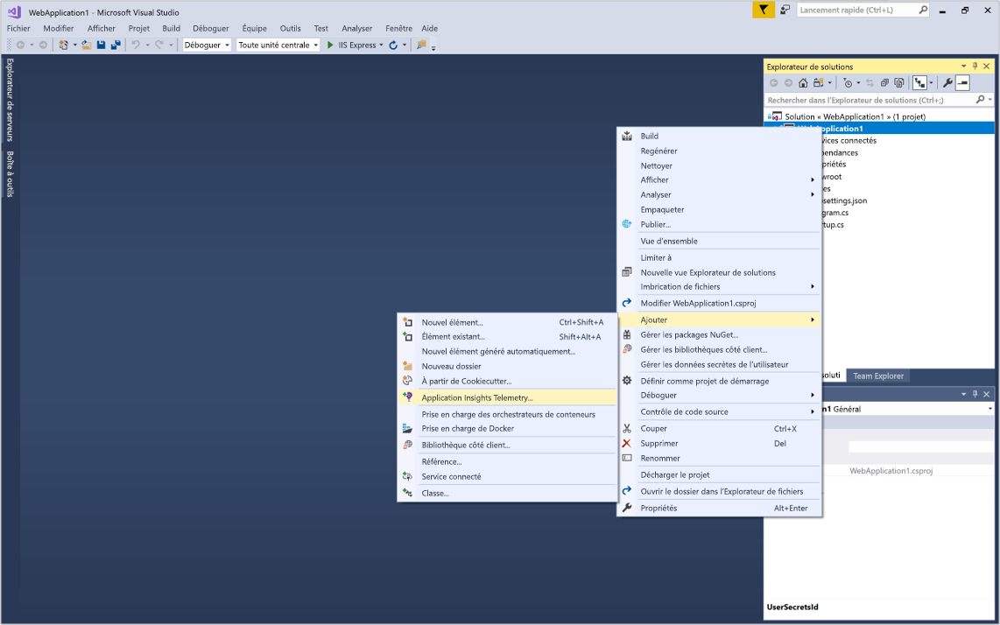
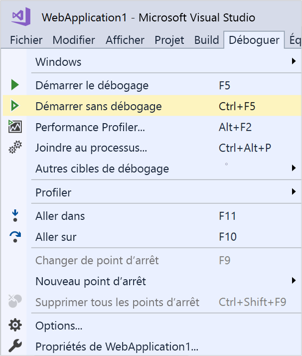
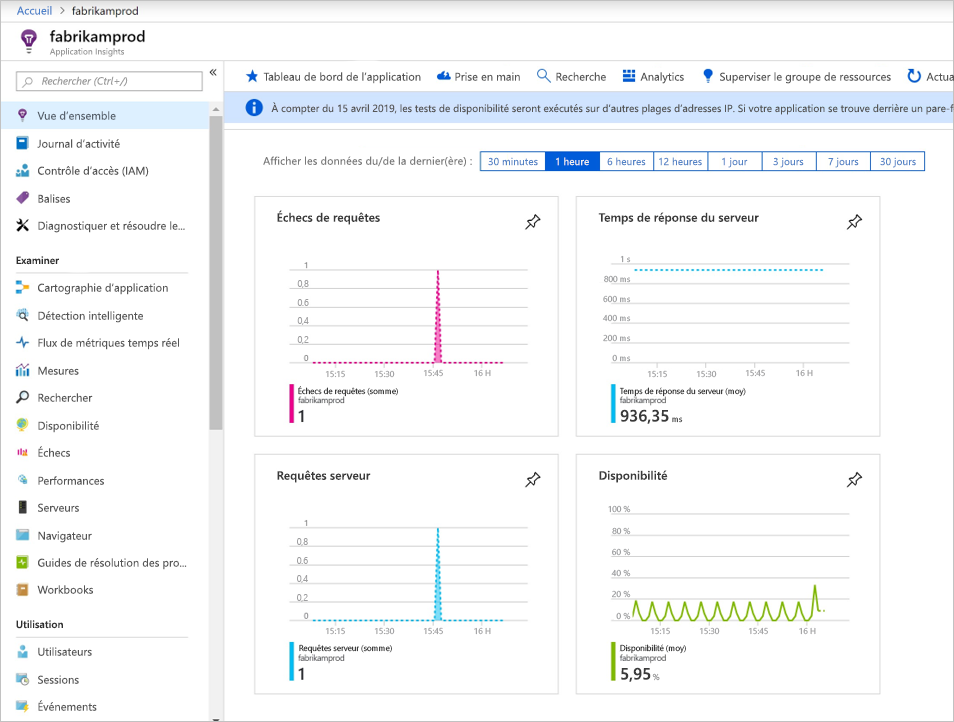
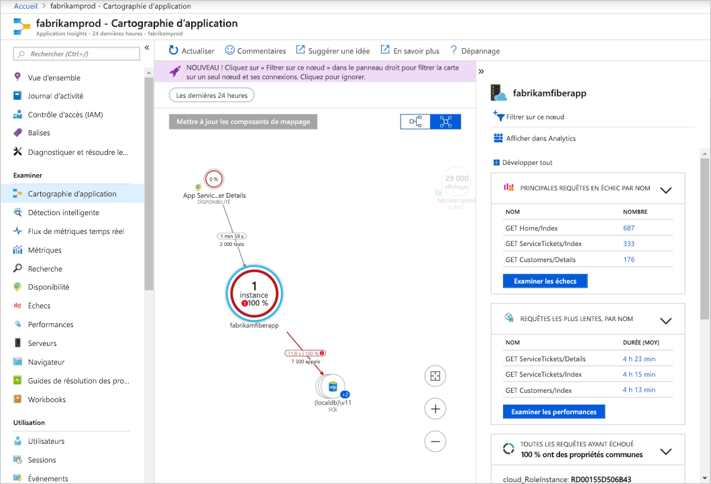
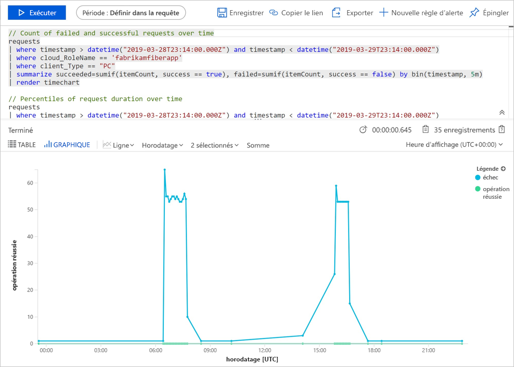
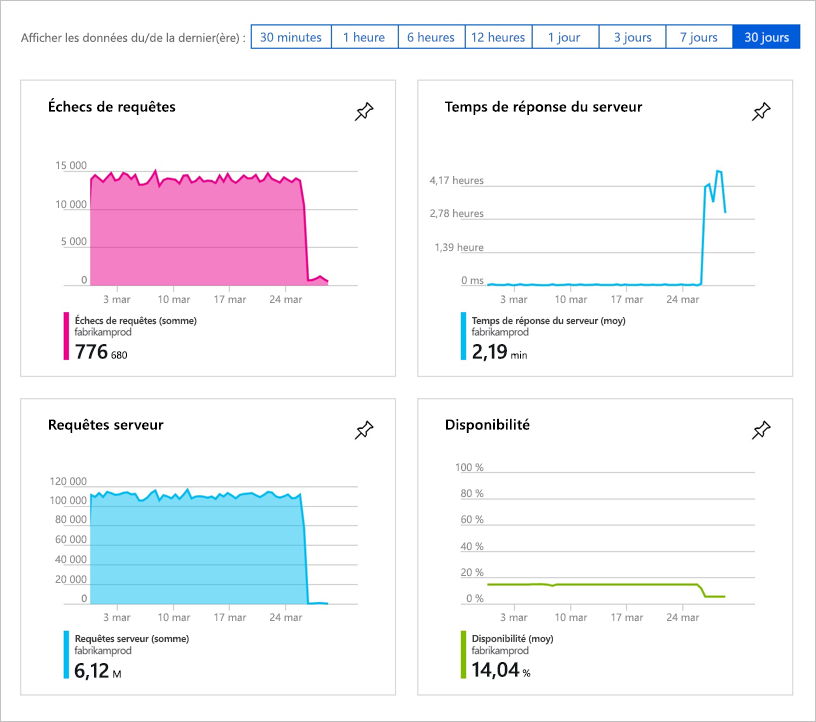
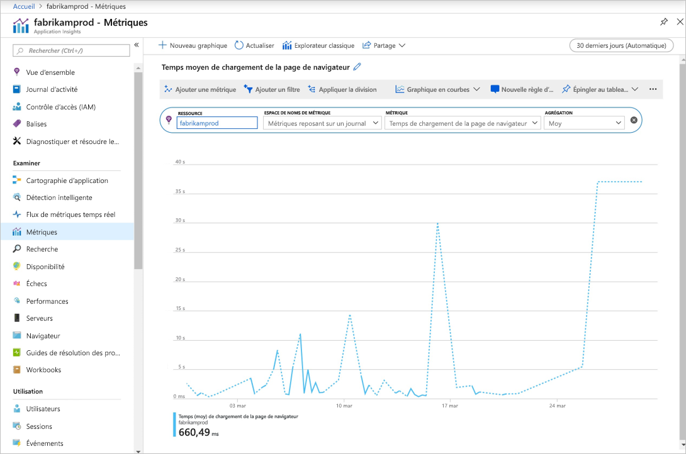

# Démarrer l’analyse de votre application web ASP.NET Core

Azure Application Insights vous permet d’analyser facilement la disponibilité, les performances et l’utilisation de votre application web. De plus, vous pouvez rapidement identifier et diagnostiquer les erreurs dans votre application sans attendre qu’un utilisateur ne les signale. 

Ce guide de démarrage rapide vous accompagne tout au long de l’ajout du Kit de développement logiciel (SDK) Application Insights dans une application web ASP.NET Core existante. Pour en savoir plus sur la configuration d’Application Insights sans extraction de Visual Studio, consultez cet [article](https://docs.microsoft.com/azure/azure-monitor/app/asp-net-core).

## Prérequis

Pour suivre ce guide de démarrage rapide :

- [Installez Visual Studio 2019](https://www.visualstudio.com/downloads/) avec les charges de travail suivantes :
  - Développement web et ASP.NET
  - Développement Azure
- [Installez le kit de développement (SDK) .NET Core 2.0](https://www.microsoft.com/net/core)
- Vous avez besoin d’un abonnement Azure et d’une application web .NET Core existante.

Si vous ne disposez pas d’une application web ASP.NET Core, vous pouvez utiliser notre guide pas à pas pour [créer une application ASP.NET Core et ajouter Application Insights](../../azure-monitor/app/asp-net-core.md).

Si vous n’avez pas d’abonnement Azure, créez un compte [gratuit](https://azure.microsoft.com/free/) avant de commencer.

## Connectez-vous au portail Azure.

Connectez-vous au [portail Azure](https://portal.azure.com/).

## Activer Application Insights

Application Insights permet de recueillir les données de télémétrie à partir de n’importe quelle application connectée à Internet, qu’elle soit exécutée localement ou dans le cloud. Suivez les étapes ci-dessous pour lancer l’affichage de ces données.

1. Sélectionnez **Créer une ressource** > **Outils de développement** > **Application Insights**.

   > [!NOTE]
   >Si c’est la première fois que vous créez une ressource Application Insights, vous pouvez en apprendre davatange en vous rendant sur la documentation [Créer une ressource Application Insights](https://docs.microsoft.com/azure/azure-monitor/app/create-new-resource).

    Une boîte de configuration s’affiche. Utilisez le tableau suivant pour remplir les champs d’entrée.

   | Paramètres        |  Valeur           | Description  |
   | ------------- |:-------------|:-----|
   | **Nom**      | Valeur globalement unique | Nom identifiant l’application que vous analysez |
   | **Groupe de ressources**     | myResourceGroup      | Nom du nouveau groupe de ressources où héberger les données App Insights. Vous pouvez créer un groupe de ressources ou utiliser un groupe existant. |
   | **Lieu** | USA Est | Choisissez un emplacement près de chez vous ou proche de l’endroit où votre application est hébergée |

2. Cliquez sur **Créer**.

## Configurer le Kit de développement logiciel (SDK) Application Insights

1. Ouvrez votre **projet** d’application web ASP.NET Core dans Visual Studio > cliquez avec le bouton droit de la souris sur l’AppName dans l’**Explorateur de solutions** > sélectionnez **Ajouter** > **Application Insights Telemetry**.

    

2. Cliquez sur le bouton **Commencer**.

3. Sélectionnez votre compte et votre abonnement > sélectionnez la **ressource existante** que vous avez créée dans le portail Azure > cliquez sur **Inscrire**.

4. Sélectionnez **Projet** > **Gérer les packages NuGet** > **Source du package : nuget.org** > **Mettre à jour** les packages du SDK Application Insights vers la version stable la plus récente.

5. Sélectionnez **Déboguer** > **Exécuter sans débogage** (Ctrl + F5) pour lancer votre application.

    

> [!NOTE]
> Les données prennent 3 à 5 minutes avant d’apparaître sur le portail. S’il s’agit d’une application de test avec un trafic faible, gardez à l’esprit que la plupart des métriques sont capturées uniquement lorsqu’il existe des demandes ou des opérations actives.

## Démarrer l’analyse dans le portail Azure

1. Rouvrez la page de **présentation** d’Application Insights dans le portail Azure en sélectionnant **Accueil** et, sous les ressources récentes, sélectionnez la ressource que vous avez créée pour afficher les détails sur votre application en cours d’exécution.

   

2. Cliquez sur **Cartographie d’application** pour obtenir une présentation visuelle des relations de dépendance entre les composants de votre application. Chaque composant affiche des indicateurs de performance clés comme la charge, les performances, les échecs et les alertes.

   

3. Cliquez sur l’icône **Analyse d’application**  **Voir dans Analytics**. Vous ouvrez ainsi **Application Insights - Analyses**, qui fournit un langage de requête enrichi permettant d’analyser toutes les données collectées par Application Insights. Dans ce cas, une requête est générée et affiche le nombre de demandes sous forme de graphique. Vous pouvez écrire vos propres requêtes pour analyser d’autres données.

   

4. Revenez à la page **Vue d’ensemble** et examinez les tableaux de bord des indicateurs de performance clés (KPI).  Ce tableau de bord fournit des statistiques sur l’intégrité de votre application, y compris le nombre de demandes entrantes, la durée de ces demandes et les éventuelles erreurs qui se produisent. 

   

5. Sur la gauche, cliquez sur **Métriques**. Utilisez l’explorateur de métriques pour examiner l’intégrité et l’utilisation de votre ressource. Cliquez sur **Ajouter un nouveau graphique** pour créer des vues personnalisées supplémentaires, ou sélectionnez **Modifier** afin de modifier les types de graphiques existants, leur hauteur, leur palette de couleurs, leurs regroupements et leurs métriques. Par exemple, vous pouvez créer un graphique qui affiche le temps de chargement moyen de la page de navigateur en choisissant « Temps de chargement de la page de navigateur » dans la liste déroulante de métriques et « Moyenne » en guise d’agrégation. Pour en savoir plus sur Azure Metrics Explorer, consultez [Bien démarrer avec Azure Metrics Explorer](../../azure-monitor/platform/metrics-getting-started.md).

     

## Vidéo

- Vidéo détaillée externe sur la [configuration d’Application Insights en partant de zéro avec .NET Core et Visual Studio](https://www.youtube.com/watch?v=NoS9UhcR4gA&t).
- Vidéo détaillée externe sur la [configuration d’Application Insights en partant de zéro avec .NET Core et Visual Studio Code](https://youtu.be/ygGt84GDync).

## Nettoyer les ressources
Une fois les tests terminés, vous pouvez supprimer le groupe de ressources et toutes les ressources associées. Pour ce faire, procédez comme suit.

> [!NOTE]
> Si vous avez utilisé un groupe de ressources existant, les instructions ci-dessous ne s’appliquent pas ; vous devrez simplement supprimer la ressource Application Insights individuelle. N’oubliez pas que lorsque vous supprimez un groupe de ressources, toutes les ressources sous-jacentes qui sont membres de ce groupe seront également supprimées.

1. Dans le menu de gauche du portail Azure, cliquez sur **Groupes de ressources**, puis sur **myResourceGroup**.
2. Sur la page de votre groupe de ressources, cliquez sur **Supprimer**, tapez **myResourceGroup** dans la zone de texte, puis cliquez sur **Supprimer**.

## Étapes suivantes

> [!div class="nextstepaction"]
> [Rechercher et diagnostiquer des exceptions runtime](https://docs.microsoft.com/azure/application-insights/app-insights-tutorial-runtime-exceptions)
