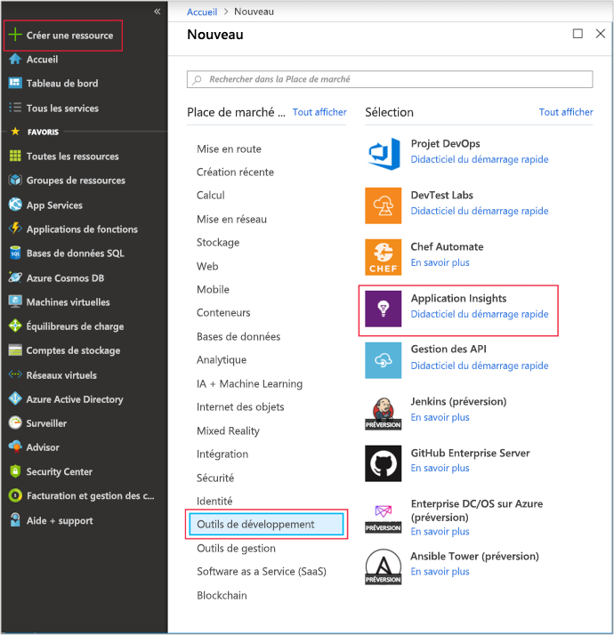
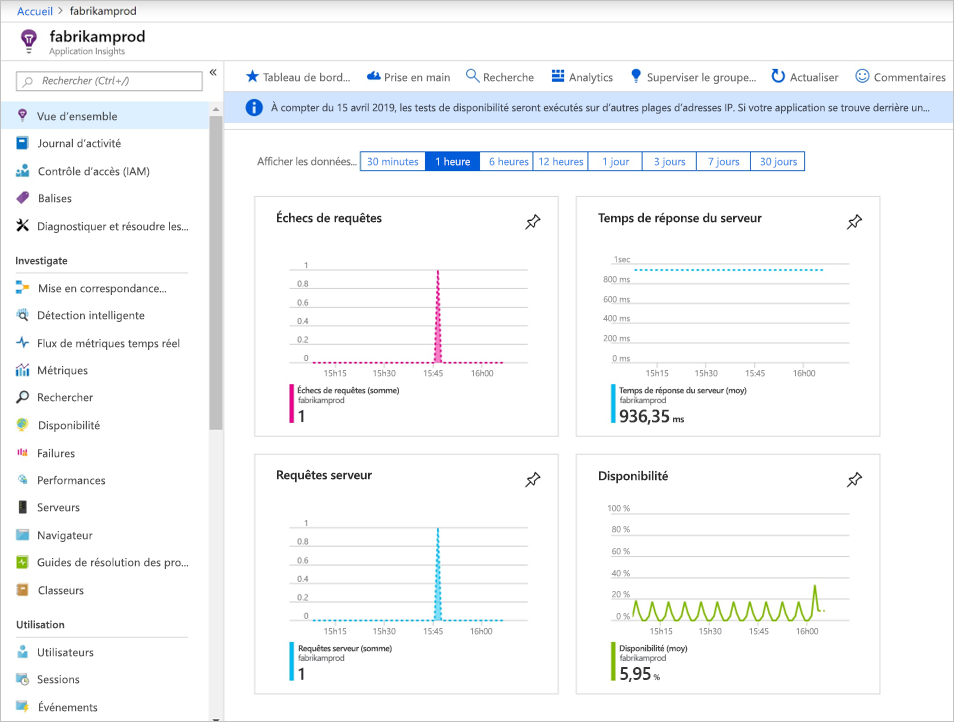
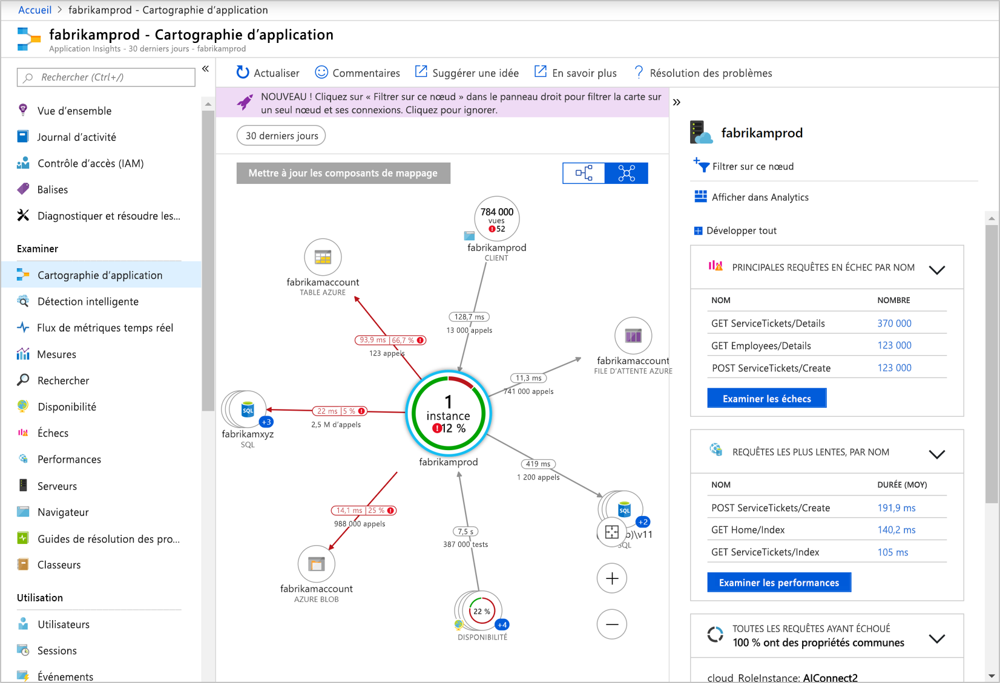
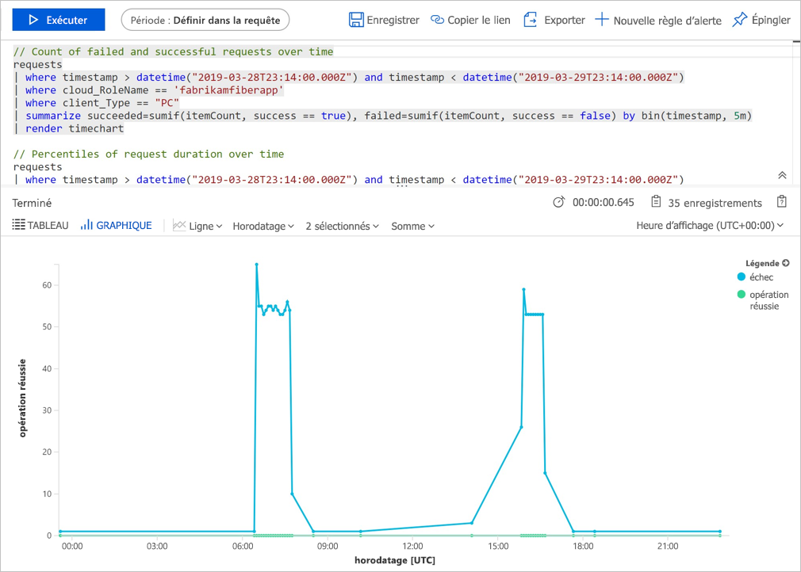
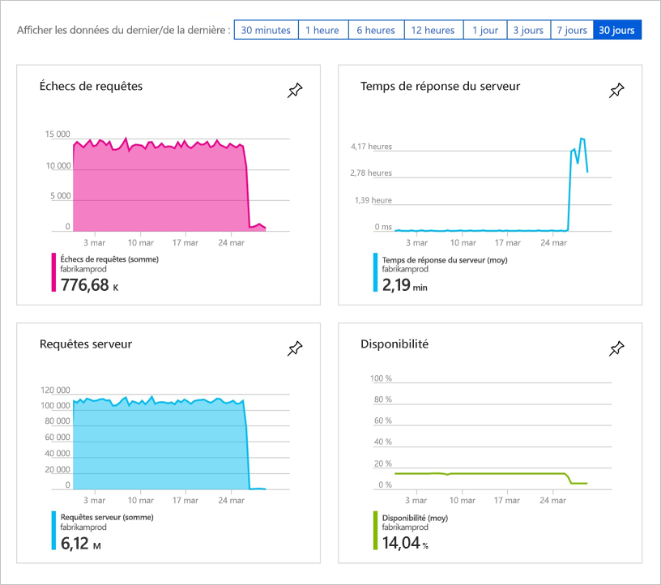
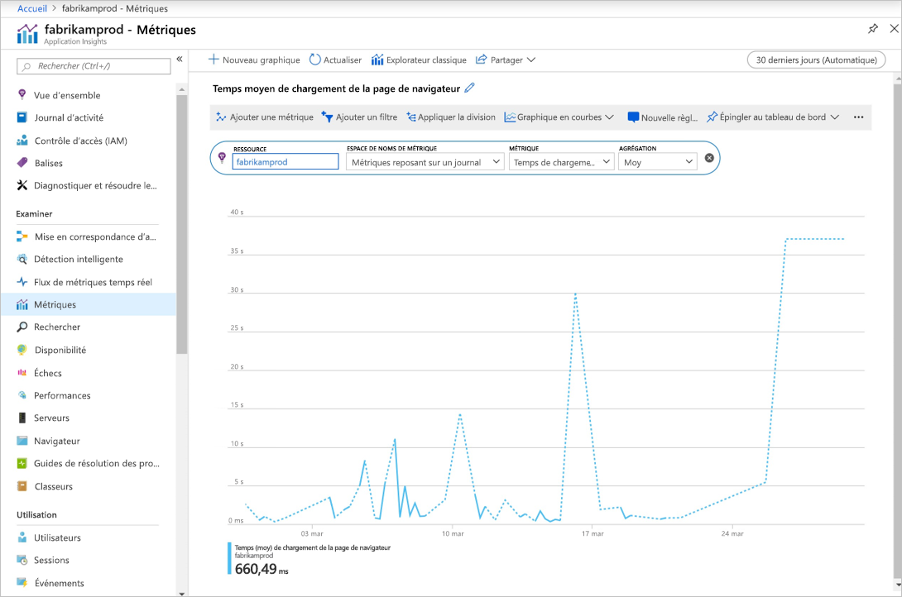

# <a name="quickstart-start-monitoring-your-nodejs-web-application-with-azure-application-insights"></a>Démarrage rapide : Démarrer la supervision de votre application web Node.js avec Azure Application Insights

Dans ce guide de démarrage rapide, vous ajoutez le SDK Application Insights version 0.22 pour Node.js à une application web Node.js existante.

Azure Application Insights vous permet d’analyser facilement la disponibilité, les performances et l’utilisation de votre application web. De plus, vous pouvez rapidement identifier et diagnostiquer les erreurs dans votre application sans attendre qu’un utilisateur ne les signale. À partir de la version 0.20 du Kit de développement logiciel (SDK), vous pouvez analyser des packages tiers courants, y compris MongoDB, MySQL et Redis.

## <a name="prerequisites"></a>Prérequis

* Compte Azure avec un abonnement actif. [Créez un compte gratuitement](https://azure.microsoft.com/free/?ref=microsoft.com&utm_source=microsoft.com&utm_medium=docs&utm_campaign=visualstudio).
* Une application node.js opérationnelle.

## <a name="enable-application-insights"></a>Activer Application Insights

Application Insights permet de recueillir les données de télémétrie à partir de n’importe quelle application connectée à Internet, qu’elle soit ou non exécutée localement ou dans le cloud. Suivez les étapes ci-dessous pour lancer l’affichage de ces données.

1. Connectez-vous au [portail Azure](https://portal.azure.com/).

2. Sélectionnez **Créer une ressource** > **Outils de développement** > **Application Insights**.

   

   > [!NOTE]
   >Si c’est la première fois que vous créez une ressource Application Insights, vous pouvez en apprendre davatange en vous rendant sur la documentation [Créer une ressource Application Insights](https://docs.microsoft.com/azure/azure-monitor/app/create-new-resource).

   Une page de configuration s’affiche. Utilisez le tableau suivant pour remplir les champs d’entrée. 

    | Paramètres        | Valeur           | Description  |
   | ------------- |:-------------|:-----|
   | **Nom**      | Valeur globalement unique | Nom identifiant l’application que vous analysez |
   | **Groupe de ressources**     | myResourceGroup      | Nom du nouveau groupe de ressources où héberger les données AppInsights. Vous pouvez créer un groupe de ressources ou utiliser un groupe existant. |
   | **Lieu** | USA Est | Choisissez un emplacement près de chez vous ou proche de l’endroit où votre application est hébergée |

3. Sélectionnez **Create** (Créer).

## <a name="configure-appinsights-sdk"></a>Configurer le SDK Application Insights

1. Sélectionnez **Vue d’ensemble** et copiez la **clé d’instrumentation** de votre application.

   

2. Ajoutez le Kit de développement logiciel (SDK) Application Insights pour Node.js dans votre application. À partir du dossier racine de votre application, exécutez ce qui suit :

   ```bash
   npm install applicationinsights --save
   ```

3. Modifiez le premier fichier *.js* de votre application et ajoutez les deux lignes ci-dessous dans la partie supérieure de votre script. Si vous utilisez l’[application de démarrage rapide Node.js](https://docs.microsoft.com/azure/app-service/app-service-web-get-started-nodejs), vous modifiez le fichier *index.js*. Remplacez `<instrumentation_key>` par la clé d’instrumentation de votre application. 

   ```JavaScript
   const appInsights = require('applicationinsights');
   appInsights.setup('<instrumentation_key>').start();
   ```

4. Redémarrez votre application.

> [!NOTE]
> Les données prennent 3 à 5 minutes avant d’apparaître sur le portail. S’il s’agit d’une application de test avec un trafic faible, gardez à l’esprit que la plupart des métriques sont capturées uniquement lorsqu’il existe des demandes ou des opérations actives.

## <a name="start-monitoring-in-the-azure-portal"></a>Démarrer l’analyse dans le portail Azure

1. Vous pouvez à présent rouvrir la page de **présentation** d’Application Insights dans le portail Azure où vous avez récupéré votre clé d’instrumentation afin d’afficher les détails sur votre application en cours d’exécution.

   

2. Sélectionnez **Cartographie d’application** pour obtenir une présentation visuelle des relations de dépendance entre les composants de votre application. Chaque composant affiche des indicateurs de performance clés comme la charge, les performances, les échecs et les alertes.

   

3. Sélectionnez l’icône **Analyse d’application**  **Voir dans Analytics**.  Cette action ouvre **Application Insights - Analyses**, qui fournit un langage de requête enrichi permettant d’analyser toutes les données collectées par Application Insights. Dans ce cas, une requête est générée et affiche le nombre de demandes sous forme de graphique. Vous pouvez écrire vos propres requêtes pour analyser d’autres données.

   

4. Revenez à la page **Vue d’ensemble** et examinez les graphiques de l’indicateur de performance clé (KPI).  Ce tableau de bord fournit des statistiques sur l’intégrité de votre application, y compris le nombre de demandes entrantes, la durée de ces demandes et les éventuelles erreurs qui se produisent.

   

   Pour activer le graphique **Temps de chargement de la page consultée** à remplir avec les données de **télémétrie côté client**, ajoutez ce script à toutes les pages dont vous souhaitez effectuer le suivi :

   ```HTML
   <!-- 
   To collect user behavior analytics tools about your application, 
   insert the following script into each page you want to track.
   Place this code immediately before the closing </head> tag,
   and before any other scripts. Your first data will appear 
   automatically in just a few seconds.
   -->
   <script type="text/javascript">
     var appInsights=window.appInsights||function(config){
       function i(config){t[config]=function(){var i=arguments;t.queue.push(function(){t[config].apply(t,i)})}}var t={config:config},u=document,e=window,o="script",s="AuthenticatedUserContext",h="start",c="stop",l="Track",a=l+"Event",v=l+"Page",y=u.createElement(o),r,f;y.src=config.url||"https://az416426.vo.msecnd.net/scripts/a/ai.0.js";u.getElementsByTagName(o)[0].parentNode.appendChild(y);try{t.cookie=u.cookie}catch(p){}for(t.queue=[],t.version="1.0",r=["Event","Exception","Metric","PageView","Trace","Dependency"];r.length;)i("track"+r.pop());return i("set"+s),i("clear"+s),i(h+a),i(c+a),i(h+v),i(c+v),i("flush"),config.disableExceptionTracking||(r="onerror",i("_"+r),f=e[r],e[r]=function(config,i,u,e,o){var s=f&&f(config,i,u,e,o);return s!==!0&&t["_"+r](config,i,u,e,o),s}),t
       }({
           instrumentationKey:"<insert instrumentation key>"
       });
       
       window.appInsights=appInsights;
       appInsights.trackPageView();
   </script>
   ```

5. Sur la gauche, sélectionnez **Métriques**. Utilisez l’explorateur de métriques pour examiner l’intégrité et l’utilisation de votre ressource. Sélectionnez **Ajouter un nouveau graphique** pour créer des vues personnalisées supplémentaires ou sélectionnez **Modifier** pour modifier les types de graphiques existants, leur hauteur, leur palette de couleurs, leurs regroupements et leurs métriques. Par exemple, vous pouvez créer un graphique qui affiche le temps de chargement moyen de la page de navigateur en sélectionnant « Temps de chargement de la page de navigateur » dans la liste déroulante de métriques et « Moyenne » en guise d’agrégation. Pour en savoir plus sur Azure Metrics Explorer, consultez [Bien démarrer avec Azure Metrics Explorer](../../azure-monitor/platform/metrics-getting-started.md).

   

Pour plus d’informations sur la supervision de Node.js, consultez la [documentation supplémentaire sur Application Insights pour Node.js](../../azure-monitor/app/nodejs.md).

## <a name="clean-up-resources"></a>Nettoyer les ressources

Une fois les tests terminés, vous pouvez supprimer le groupe de ressources et toutes les ressources associées. Pour ce faire, procédez comme suit.

> [!NOTE]
> Si vous avez utilisé un groupe de ressources existant, les instructions ci-dessous ne s’appliquent pas ; vous devrez simplement supprimer la ressource Application Insights individuelle. N’oubliez pas que lorsque vous supprimez un groupe de ressources, toutes les ressources sous-jacentes qui sont membres de ce groupe seront également supprimées.

1. Dans le menu gauche du portail Azure, sélectionnez **Groupes de ressources**, puis **myResourceGroup**.
2. Dans la page de votre groupe de ressources, sélectionnez **Supprimer**, entrez **myResourceGroup** dans la zone de texte, puis sélectionnez **Supprimer**.

## <a name="next-steps"></a>Étapes suivantes

> [!div class="nextstepaction"]
> [Rechercher et diagnostiquer des problèmes de performances](https://docs.microsoft.com/azure/application-insights/app-insights-analytics)
