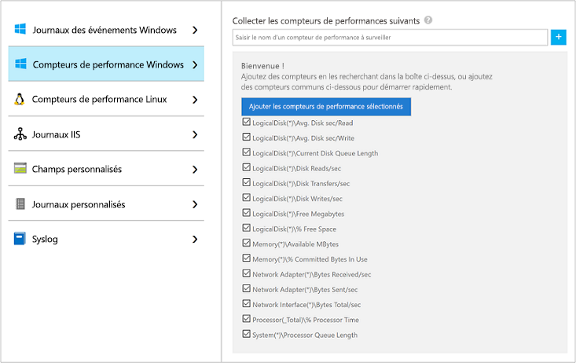
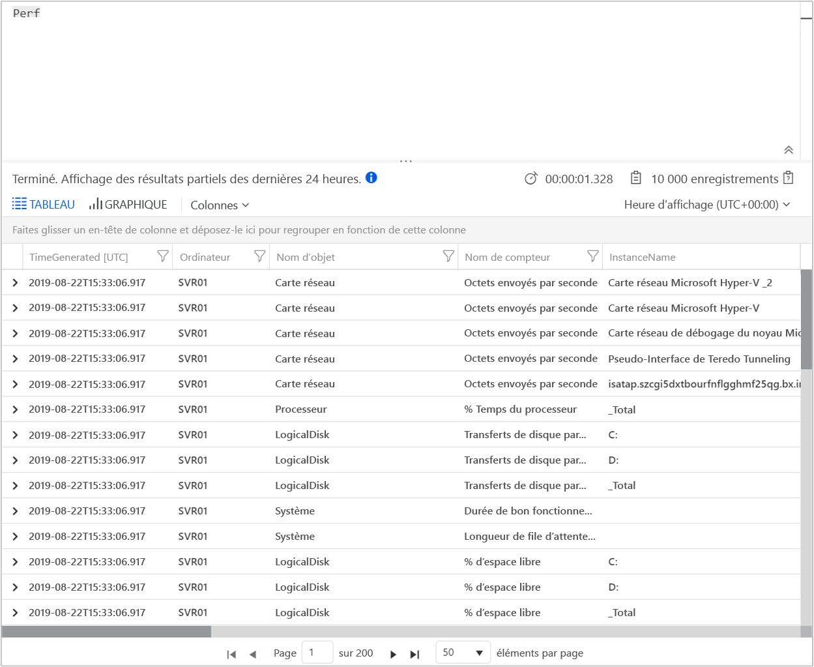

# Collecter des données à partir d’une machine virtuelle Azure avec Azure Monitor

[Azure Monitor](../overview.md) est capable de collecter directement les données de vos machines virtuelles Azure dans un espace de travail Log Analytics en vue d’une analyse et d’une mise en corrélation détaillées. L’installation de l’extension de machine virtuelle Log Analytics pour [Windows](../../virtual-machines/extensions/oms-windows.md) et [Linux](../../virtual-machines/extensions/oms-linux.md) permet à Azure Monitor de collecter les données de vos machines virtuelles Azure. Ce guide de démarrage rapide vous montre comment configurer et collecter les données de vos machines virtuelles Azure Linux ou Windows en quelques étapes simples avec l’extension de machine virtuelle.  
 
En suivant ce guide, vous êtes censé disposer d’une machine virtuelle Azure. Dans le cas contraire, vous pouvez [créer une machine virtuelle Windows](../../virtual-machines/windows/quick-create-portal.md) ou [créer une machine virtuelle Linux](../../virtual-machines/linux/quick-create-cli.md) en suivant nos guides de démarrage rapide consacrés aux machines virtuelles.

## Se connecter au portail Azure

Connectez-vous au portail Azure sur [https://portal.azure.com](https://portal.azure.com). 

## Créer un espace de travail

1. Dans le portail Azure, sélectionnez **Tous les services**. Dans la liste de ressources, saisissez **Log Analytics**. Au fur et à mesure de la saisie, la liste est filtrée. Sélectionnez **Espaces de travail Log Analytics**.

       

2. Cliquez sur **Créer**, puis sélectionnez des options pour les éléments suivants :

   * Attribuez un nom au nouvel **Espace de travail Log Analytics** comme *DefaultLAWorkspace*.  
   * Dans la liste déroulante **Abonnement**, sélectionnez un abonnement à lier si la valeur par défaut sélectionnée n’est pas appropriée.
   * Pour **Groupe de ressources**, sélectionnez un groupe de ressources existant qui contient une ou plusieurs machines virtuelles Azure.  
   * Sélectionnez l’**Emplacement** dans lequel vos machines virtuelles sont déployées.  Pour en savoir plus, découvrez dans quelles [régions Log Analytics est disponible](https://azure.microsoft.com/regions/services/).
   * Si vous créez un espace de travail dans un nouvel abonnement créé après le 2 avril 2018, il utilisera automatiquement le plan tarifaire *Par Go* et l’option pour sélectionner un niveau de tarification ne sera pas disponible.  Si vous créez un espace de travail pour un abonnement existant créé avant le 2 avril ou pour un abonnement lié à une inscription EA existante, sélectionnez le niveau tarifaire de votre choix.  Pour plus d’informations sur les différents niveaux proposés, consultez le [détail des tarifs de Log Analytics](https://azure.microsoft.com/pricing/details/log-analytics/).
  
         

3. Une fois que vous avez entré les informations requises dans le volet **Espace de travail Log Analytics**, sélectionnez **OK**.  

Pendant que les informations sont vérifiées et l’espace de travail créé, vous pouvez suivre la progression sous **Notifications** dans le menu. 

## Activer l’extension de machine virtuelle Log Analytics

[!INCLUDE [log-analytics-agent-note](../../../includes/log-analytics-agent-note.md)] 

Pour les machines virtuelles Windows et Linux déjà déployées dans Azure, vous devez installer l’agent Log Analytics avec l’extension de machine virtuelle Log Analytics. L’utilisation de l’extension simplifie le processus d’installation et configure automatiquement l’agent pour qu’il envoie des données à l’espace de travail Log Analytics que vous spécifiez. De même, l’agent est automatiquement mis à niveau quand une version plus récente est publiée. Vous êtes ainsi assuré de disposer des fonctionnalités et des correctifs les plus récents. Avant de poursuivre, vérifiez que la machine virtuelle est en cours d’exécution, sinon le processus échouera.  

>[!NOTE]
>L’agent Log Analytics pour Linux ne peut pas être configuré pour envoyer des rapports à plus d’un espace de travail Log Analytics. 

1. Dans le portail Azure, sélectionnez **Tous les services** en haut à gauche. Dans la liste de ressources, saisissez **Log Analytics**. Au fur et à mesure de la saisie, la liste est filtrée. Sélectionnez **Espaces de travail Log Analytics**.

2. Dans votre liste d’espaces de travail Log Analytics, sélectionnez *DefaultLAWorkspace* créé précédemment.

3. Dans le menu de gauche, sous Sources de données de l’espace de travail, sélectionnez **Machines virtuelles**.  

4. Dans la liste des **Machines virtuelles**, sélectionnez la machine virtuelle sur laquelle vous voulez installer l’agent. Notez que l’**État de la connexion Log Analytics** de la machine virtuelle indique **Non connecté**.

5. Dans les détails de votre machine virtuelle, sélectionnez **Connecter**. L’agent est automatiquement installé et configuré pour votre espace de travail Log Analytics. Ce processus prend quelques minutes durant lesquelles l’**état** affiché est **Connexion en cours**.

6. Une fois l’agent installé et connecté, l’**État de la connexion Log Analytics** est mis à jour et indique **Cet espace de travail**.

## Collecter les données d’événements et de performances

Azure Monitor est capable de collecter les événements des journaux des événements Windows ou du journal Syslog Linux ainsi que des compteurs de performances que vous spécifiez dans l’optique de procéder à une analyse à long terme et de générer des rapports pour agir dès lors qu’une condition particulière est détectée. Pour configurer la collecte des événements du journal système Windows ou du journal Syslog Linux et de plusieurs compteurs de performances courants, commencez par suivre ces étapes.  

### Collecte de données à partir d’une machine virtuelle Windows

1. Sélectionnez **Paramètres avancés**.

    

2. Sélectionnez **Données**, puis **Journaux des événements Windows**.

3. Vous pouvez ajouter un journal d’événements en tapant le nom de ce journal.  Entrez **Système**, puis sélectionnez le signe plus **+** .

4. Dans le tableau, vérifiez les niveaux de gravité **Erreur** et **Avertissement**.

5. Sélectionnez **Enregistrer** en haut de la page pour enregistrer la configuration.

6. Sélectionnez **Données de performances Windows** pour activer la collecte des compteurs de performances sur un ordinateur Windows.

7. Quand vous procédez à la configuration initiale des compteurs de performances Windows pour un nouvel espace de travail Log Analytics, la possibilité vous est offerte de créer rapidement plusieurs compteurs courants. Ils s’affichent avec une case à cocher en regard.

    

    Sélectionnez **Ajouter les compteurs de performances sélectionnés**.  Ils sont ajoutés et prédéfinis avec un intervalle d’échantillonnage de collecte de dix secondes.
  
8. Sélectionnez **Enregistrer** en haut de la page pour enregistrer la configuration.

### Collecte de données à partir d’une machine virtuelle Linux

1. Sélectionnez **Syslog**.  

2. Vous pouvez ajouter un journal d’événements en tapant le nom de ce journal.  Entrez **Syslog**, puis sélectionnez le signe plus **+** .  

3. Dans le tableau, décochez les niveaux de gravité **Info**, **Avis** et **Débogage**. 

4. Sélectionnez **Enregistrer** en haut de la page pour enregistrer la configuration.

5. Sélectionnez **Données de performances Linux** pour activer la collecte des compteurs de performances sur un ordinateur Linux. 

6. Quand vous procédez à la configuration initiale des compteurs de performances Linux pour un nouvel espace de travail Log Analytics, la possibilité vous est offerte de créer rapidement plusieurs compteurs courants. Ils s’affichent avec une case à cocher en regard.

    

    Sélectionnez **Appliquer la configuration ci-dessous à mes machines**, puis **Ajouter les compteurs de performances sélectionnés**.  Ils sont ajoutés et prédéfinis avec un intervalle d’échantillonnage de collecte de dix secondes.  

7. Sélectionnez **Enregistrer** en haut de la page pour enregistrer la configuration.

## Afficher les données collectées

Maintenant que vous avez activé la collecte de données, exécutons un exemple élémentaire de recherche dans les journaux pour examiner certaines données des machines virtuelles cibles.  

1. Dans l’espace de travail sélectionné, dans le volet gauche, sélectionnez **Journaux**.

2. Dans la page de requête Journaux, tapez `Perf` dans l’éditeur de requête et sélectionnez **Exécuter**.

     

    Par exemple, la requête présentée dans l’image suivante a retourné 10 000 enregistrements de performances. Vos résultats seront bien moins abondants.

    

## Nettoyer les ressources

Quand vous n’en avez plus besoin, supprimez l’espace de travail Log Analytics. Pour ce faire, sélectionnez l’espace de travail Log Analytics que vous avez créé précédemment puis, dans la page de ressource, sélectionnez **Supprimer**.

## Étapes suivantes

Maintenant que vous collectez des données opérationnelles et de performances à partir de vos machines virtuelles Windows ou Linux, vous pouvez commencer à explorer et à analyser facilement les données que vous collectez *gratuitement* et agir en conséquence.  

Pour savoir comment consulter et analyser les données, passez au didacticiel suivant.

> [!div class="nextstepaction"]
> [Consulter ou analyser les données dans Log Analytics](../../azure-monitor/learn/tutorial-viewdata.md)
