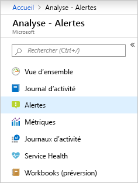
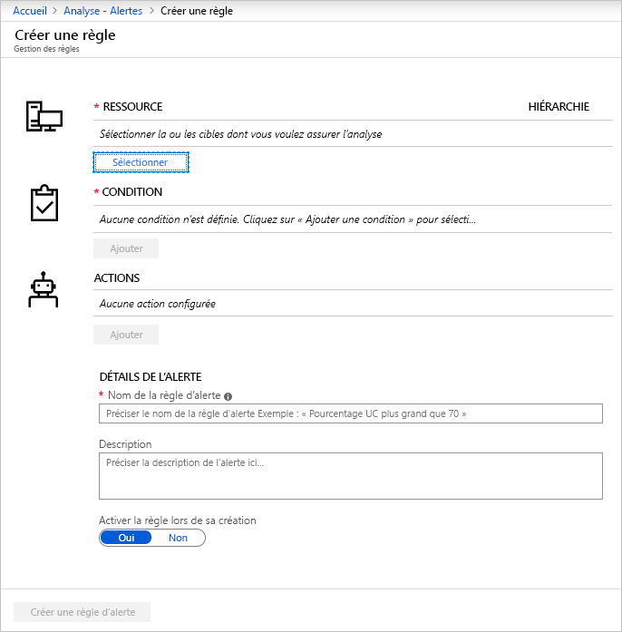
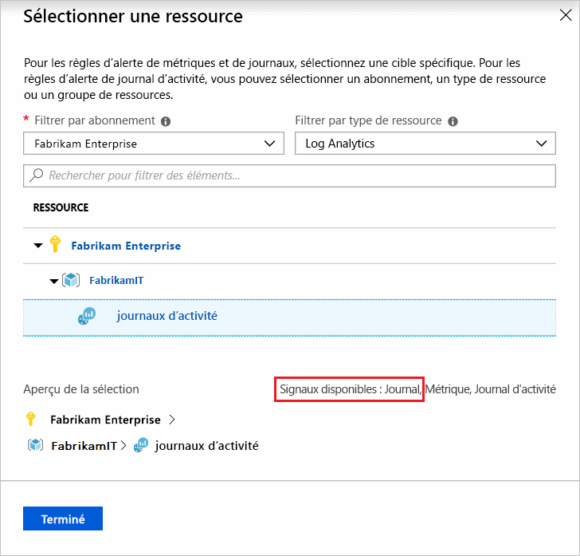
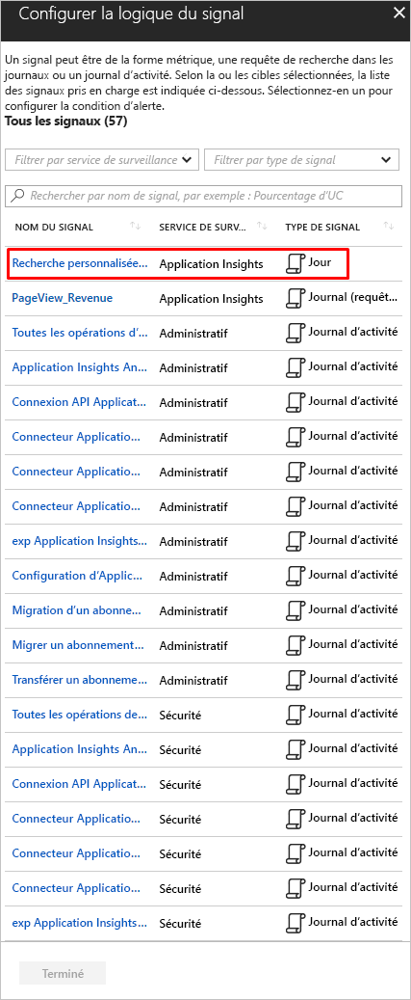
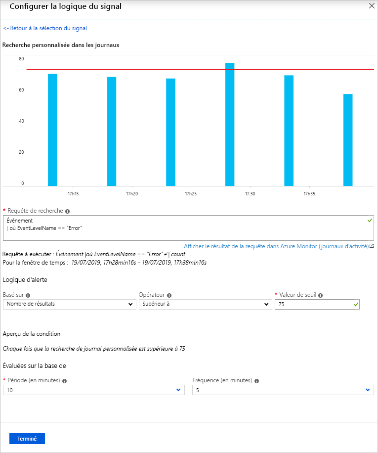
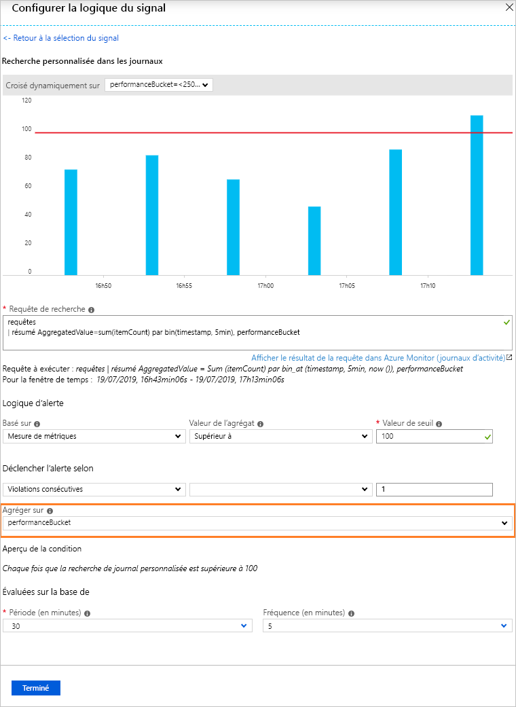
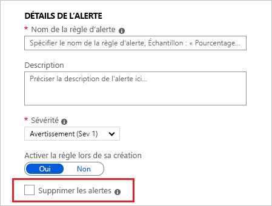
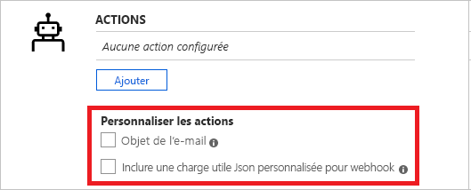
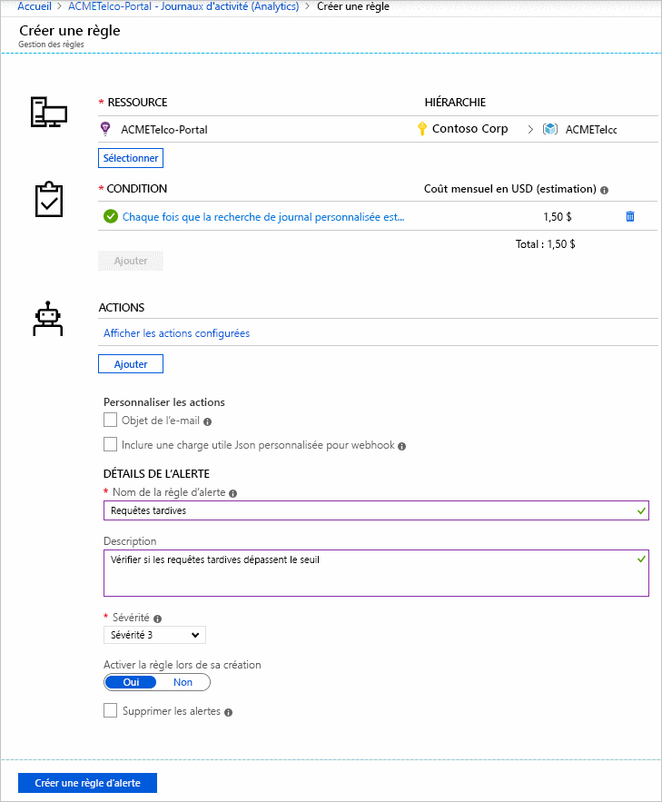

# <a name="create-view-and-manage-log-alerts-using-azure-monitor"></a>Créer, afficher et gérer des alertes de journal à l’aide d’Azure Monitor

## <a name="overview"></a>Vue d'ensemble
Cet article explique comment configurer des alertes de journal à l’aide de l’interface d’alertes dans le portail Azure. La définition d’une règle d’alerte se fait en trois parties :
- Cible : Ressource Azure spécifique à surveiller
- Critères : Condition spécifique ou logique qui, une fois détectée (signal), doit déclencher une action
- Action : Appel spécifique envoyé au récepteur d’une notification (e-mail, SMS, webhook, etc.)

Le terme **alertes de journal** décrit les alertes où le signal est une requête de journal dans un [espace de travail Log Analytics](../learn/tutorial-viewdata.md) ou [Application Insights](../app/analytics.md). Obtenez plus d’informations sur la fonctionnalité, la terminologie et les types dans [Alertes de journal - Vue d’ensemble](alerts-unified-log.md).

> [!NOTE]
> Les données de journal populaires d’[un espace de travail Log Analytics](../../azure-monitor/learn/tutorial-viewdata.md) sont désormais également disponibles sur la plateforme de métrique dans Azure Monitor. Pour la vue de détails, consultez [Alerte de métrique pour les journaux d’activité](alerts-metric-logs.md)

## <a name="managing-log-alerts-from-the-azure-portal"></a>Gestion des alertes de journal à partir du portail Azure

Vous trouverez ci-après un guide pas à pas sur l’utilisation des alertes de journal à l’aide de l’interface du portail Azure.

### <a name="create-a-log-alert-rule-with-the-azure-portal"></a>Créer une règle d’alerte de journal avec le portail Azure

1. Dans le [portail](https://portal.azure.com/), sélectionnez **Surveiller** et choisissez **Alertes** dans la section SURVEILLER.

    

1. Cliquez sur le bouton **Nouvelle règle d’alerte** pour créer une alerte dans Azure.

    

1. La section Créer une alerte s’affiche avec les trois parties suivantes : *Définir la condition de l’alerte*, *Définir les détails de l’alerte* et *Définir le groupe d’actions*.

    

1. Définissez la condition d’alerte en utilisant le lien **Sélectionner une ressource**, puis en spécifiant la cible via la sélection d’une ressource. Filtrez en choisissant l’_abonnement_, le _type de ressource_ et la _ressource_ nécessaire.

   > [!NOTE]
   > Pour créer une alerte de journal, avant de continuer, vérifiez le signal de **journal** disponible pour la ressource sélectionnée.
   >  

1. *Alertes de journal* : Assurez-vous que le **Type de ressource** est une source analytique telle que *Log Analytics* ou *Application Insights* et le type de signal **Journal**. Ensuite, une fois la **ressource** appropriée choisie, cliquez sur le bouton *Terminé*. Utilisez ensuite le bouton **Ajouter des critères** pour afficher la liste des options de signal disponibles pour la ressource et à partir de l’option **Recherche de journal personnalisée** de la liste de signaux pour le service de surveillance des journaux choisi, tel que *Log Analytics* ou *Application Insights*.

   

   > [!NOTE]
   > 
   > Les listes d’alertes peuvent importer une requête analytique en tant que type de signal : **Journal (requête enregistrée)** , comme indiqué dans l’illustration ci-dessus. Les utilisateurs peuvent donc perfectionner votre requête dans Analytics et l’enregistrer pour l’utiliser ultérieurement dans les alertes. Pour en savoir plus sur l’enregistrement de requêtes, consultez la section relative à [l’utilisation des requêtes de journal dans Azure Monitor](../log-query/log-query-overview.md) ou aux [requêtes partagées dans Application Insights Analytics](../app/app-insights-overview.md).

1. *Alertes de journal* : Une fois sélectionnée, la requête de génération d’alerte peut être indiquée dans le champ **Requête de recherche**. Si la syntaxe de la requête est incorrecte, le champ affiche un message d’erreur en rouge. Si la syntaxe de la requête est correcte, les données de la requête indiquée sont indiquées à titre de référence sous forme de graphique avec la possibilité d’ajuster la fenêtre de temps entre les six dernières heures et la semaine précédente.

    

   > [!NOTE]
   > 
   > La visualisation des données historiques n’est possible que si les résultats de la requête comportent des informations temporelles. Si votre requête produit des données synthétisées ou des valeurs de colonnes spécifiques, les mêmes informations sont indiquées sous forme de tracé unique.
   > Pour les alertes de journal de type Mesure de métriques utilisant Application Insights ou [basculées vers la nouvelle API](alerts-log-api-switch.md), vous pouvez spécifier la variable à utiliser pour regrouper les données à l'aide de l'option **Agréger sur**, comme illustré ci-dessous :
   > 
   > 

1. *Alertes de journal* : Avec la visualisation en place, la **logique d’alerte** peut être sélectionnée parmi les options proposées de condition, d’agrégation et de seuil. Enfin, dans la logique, spécifiez le moment auquel évaluer la condition indiquée à l’aide de l’option **Période**. Précisez également la fréquence d’exécution de l’alerte en sélectionnant **Fréquence**. Les **alertes de journal** peuvent reposer sur les éléments suivants :
    - [Nombre d’enregistrements](../../azure-monitor/platform/alerts-unified-log.md#number-of-results-alert-rules) : une alerte est créée si le nombre d’enregistrements retournés par la requête est supérieur ou inférieur à la valeur indiquée.
    - [Mesure de métriques](../../azure-monitor/platform/alerts-unified-log.md#metric-measurement-alert-rules) : une alerte est créée si chaque *valeur d’agrégation* dans les résultats dépasse la valeur de seuil indiquée et s’il existe un *regroupement* selon la valeur choisie. Le nombre de violations d’une alerte est le nombre de fois où que le seuil est dépassé pendant la période choisie. Vous pouvez spécifier le nombre total de violations pour obtenir toutes les combinaisons de violations dans les résultats ou les violations consécutives pour exiger que les violations aient lieu dans des échantillons consécutifs.


1. Ensuite, définissez un nom pour votre alerte dans le champ **Nom de la règle d’alerte** avec une **description** détaillant les spécificités de l’alerte et une valeur de **gravité** choisie parmi les options fournies. Ces détails sont réutilisés dans l’ensemble des courriers électroniques d’alerte, notifications ou messages Push d’Azure Monitor. En outre, l’utilisateur peut activer immédiatement la règle d’alerte lors de la création via l’option **Activer la règle lors de sa création**.

    Pour les **alertes de journal** uniquement, certaines fonctionnalités supplémentaires sont disponibles dans les détails d’alerte :

    - **Supprimer les alertes** : Quand vous activez la suppression de la règle d’alerte, les actions correspondant à la règle sont désactivées pour une durée définie quand une alerte est créée. La règle est toujours en cours d’exécution et crée des enregistrements d’alerte si les critères sont satisfaits. Cela vous donne le temps de résoudre le problème sans exécuter des actions en double.

        

        > [!TIP]
        > Spécifiez une valeur Supprimer l’alerte supérieure à la fréquence de l’alerte pour garantir l’arrêt des notifications sans chevauchement

1. Enfin, le cas échéant, spécifiez le **groupe d’actions** à déclencher pour la règle d’alerte lorsque la condition d’alerte est remplie. Vous pouvez choisir n’importe quel groupe d’actions existant avec l’alerte ou créer un autre groupe d’actions. En fonction du groupe d’actions sélectionné, lors du déclenchement de l’alerte, Azure envoie des courriers électroniques, envoie des SMS, appelle des webhooks, corrige le problème à l’aide de runbooks Azure, envoie un message Push à votre outil ITSM, etc. En savoir plus sur les [groupes d’actions](action-groups.md).

    > [!NOTE]
    > Consultez la [limites du service d’abonnement Azure](../../azure-subscription-service-limits.md) pour connaître les limites de charges utiles de Runbook déclenchées pour les alertes de journal par le biais de groupes d’actions Azure

    Pour les **alertes de journal**, certaines fonctionnalités supplémentaires sont disponibles afin de passer outre les actions par défaut :

    - **E-mail de notification** : substitue *l’objet de l’e-mail* dans le message, envoyé via le groupe d’actions, si une ou plusieurs actions de messagerie existent dans ledit groupe d’actions. Vous ne pouvez pas modifier le corps du message et ce champ n’est **pas** destiné à l’adresse de messagerie.
    - **Inclure la charge utile JSON personnalisée** : remplace le JSON webhook utilisé par les groupes d’actions, si une ou plusieurs actions de webhook existent dans ledit groupe d’actions. L’utilisateur peut spécifier le format JSON à utiliser pour tous les webhooks configurés dans le groupe d’actions associé ; Pour plus d’informations sur les formats de webhook, voir [Action webhook pour les alertes de journal](../../azure-monitor/platform/alerts-log-webhook.md). L’option d’affichage de Webhook est fournie pour vérifier le format à l’aide d’exemples de données JSON.

        


1. Si tous les champs sont valides et qu’une coche verte est visible, le bouton **Créer une règle d’alerte** peut être activé. Une alerte est alors créée dans Azure Monitor – Alertes. Toutes les alertes peuvent être consultées dans le tableau de bord des alertes.

     

     Après quelques minutes, l’alerte est active et se déclenche comme décrit précédemment.

Les utilisateurs peuvent également finaliser leur requête d’analyse dans [l’analytique des journaux d’activité](../log-query/portals.md), l’envoyer (push) afin de créer une alerte à l’aide du bouton « Définir l’alerte », puis suivre les instructions à partir de l’étape 6 du didacticiel ci-dessus.

 

### <a name="view--manage-log-alerts-in-azure-portal"></a>Afficher et gérer les alertes de journal dans le portail Azure

1. Dans le [portail](https://portal.azure.com/), sélectionnez **Surveiller** et choisissez **Alertes** dans la section SURVEILLER.

1. Le **tableau de bord Alertes** s'affiche. Celui-ci regroupe l'ensemble des alertes Azure (alertes de journal incluses) en présentant notamment toutes les occurrences de déclenchement de votre règle d'alerte de journal. Pour en savoir plus, consultez [Gestion des alertes](https://aka.ms/managealertinstances).
    > [!NOTE]
    > Les règles d’alerte de journal incluent une logique personnalisée basée sur une requête fournie par les utilisateurs et, par conséquent, sans un état résolu. Chaque fois que les conditions spécifiées dans la règle d’alerte de journal sont remplies, celle-ci est déclenchée.

1. Cliquez sur le bouton **Gérer les règles** dans la barre supérieure pour accéder à la section de gestion des règles, où toutes les règles d’alerte créées sont répertoriées, y compris les alertes désactivées.
    

## <a name="managing-log-alerts-using-azure-resource-template"></a>Gestion des alertes de journal à l’aide du modèle de ressource Azure

Les alertes de journal dans Azure Monitor sont associées au type de ressource `Microsoft.Insights/scheduledQueryRules/`. Pour plus d’informations sur ce type de ressource, consultez [Azure Monitor - Référence de l’API des règles de requêtes planifiées](https://docs.microsoft.com/rest/api/monitor/scheduledqueryrules/). Les alertes de journal pour Application Insights ou Log Analytics peuvent être créées à l’aide de l’[API des règles de requêtes planifiées](https://docs.microsoft.com/rest/api/monitor/scheduledqueryrules/).

> [!NOTE]
> Les alertes de journal pour Log Analytics peuvent également être gérées à l’aide de l’[API d’alerte Log Analytics](api-alerts.md) existante et des modèles existants des [alertes et recherches Log Analytics enregistrées](../insights/solutions-resources-searches-alerts.md). Pour plus d’informations sur l’utilisation par défaut de la nouvelle API ScheduledQueryRules détaillée ici, consultez [Opter pour la nouvelle API des alertes Log Analytics](alerts-log-api-switch.md).


### <a name="sample-log-alert-creation-using-azure-resource-template"></a>Exemple de création d'alerte de journal à l'aide du modèle de ressource Azure

Vous trouverez ci-dessous la structure d'un modèle de ressource basé sur la [création de règles de requête planifiées](https://docs.microsoft.com/rest/api/monitor/scheduledqueryrules/createorupdate) avec requête standard de recherche dans les journaux pour une [alerte de journal de type Nombre de résultats](alerts-unified-log.md#number-of-results-alert-rules), et avec des exemples de jeux de données comme variables.

```json
{
    "$schema": "https://schema.management.azure.com/schemas/2015-01-01/deploymentTemplate.json#",
    "contentVersion": "1.0.0.0",
    "parameters": {
    },
    "variables": {
        "alertLocation": "southcentralus",
        "alertName": "samplelogalert",
        "alertDescription": "Sample log search alert",
        "alertStatus": "true",
        "alertSource":{
            "Query":"requests",
            "SourceId": "/subscriptions/a123d7efg-123c-1234-5678-a12bc3defgh4/resourceGroups/myRG/providers/microsoft.insights/components/sampleAIapplication",
            "Type":"ResultCount"
        },
        "alertSchedule":{
            "Frequency": 15,
            "Time": 60
        },
        "alertActions":{
            "SeverityLevel": "4"
        },
        "alertTrigger":{
            "Operator":"GreaterThan",
            "Threshold":"1"
        },
        "actionGrp":{
            "ActionGroup": "/subscriptions/a123d7efg-123c-1234-5678-a12bc3defgh4/resourceGroups/myRG/providers/microsoft.insights/actiongroups/sampleAG",
            "Subject": "Customized Email Header",
            "Webhook": "{ \"alertname\":\"#alertrulename\", \"IncludeSearchResults\":true }"
        }
    },
    "resources":[ {
        "name":"[variables('alertName')]",
        "type":"Microsoft.Insights/scheduledQueryRules",
        "apiVersion": "2018-04-16",
        "location": "[variables('alertLocation')]",
        "properties":{
            "description": "[variables('alertDescription')]",
            "enabled": "[variables('alertStatus')]",
            "source": {
                "query": "[variables('alertSource').Query]",
                "dataSourceId": "[variables('alertSource').SourceId]",
                "queryType":"[variables('alertSource').Type]"
            },
            "schedule":{
                "frequencyInMinutes": "[variables('alertSchedule').Frequency]",
                "timeWindowInMinutes": "[variables('alertSchedule').Time]"
            },
            "action":{
                "odata.type": "Microsoft.WindowsAzure.Management.Monitoring.Alerts.Models.Microsoft.AppInsights.Nexus.DataContracts.Resources.ScheduledQueryRules.AlertingAction",
                "severity":"[variables('alertActions').SeverityLevel]",
                "aznsAction":{
                    "actionGroup":"[array(variables('actionGrp').ActionGroup)]",
                    "emailSubject":"[variables('actionGrp').Subject]",
                    "customWebhookPayload":"[variables('actionGrp').Webhook]"
                },
                "trigger":{
                    "thresholdOperator":"[variables('alertTrigger').Operator]",
                    "threshold":"[variables('alertTrigger').Threshold]"
                }
            }
        }
    } ]
}

```

L’exemple json ci-dessus peut par exemple être enregistré en tant que sampleScheduledQueryRule.json pour les besoins de cette procédure pas à pas, et peut être déployé à l’aide d’[Azure Resource Manager dans le portail Azure](../../azure-resource-manager/resource-group-template-deploy-portal.md#deploy-resources-from-custom-template).


### <a name="log-alert-with-cross-resource-query-using-azure-resource-template"></a>Alerte de journal avec requête inter-ressources à l'aide du modèle de ressource Azure

Vous trouverez ci-dessous la structure d'un modèle de ressource basé sur la [création de règles de requête planifiées](https://docs.microsoft.com/rest/api/monitor/scheduledqueryrules/createorupdate) avec [requête inter-ressources de recherche dans les journaux](../../azure-monitor/log-query/cross-workspace-query.md) pour une [alerte de journal de type Mesure de métriques](../../azure-monitor/platform/alerts-unified-log.md#metric-measurement-alert-rules), et avec des exemples de jeux de données comme variables.

```json

{
    "$schema": "https://schema.management.azure.com/schemas/2015-01-01/deploymentTemplate.json#",
    "contentVersion": "1.0.0.0",
    "parameters": {
    },
    "variables": {
        "alertLocation": "Region Name for your Application Insights App or Log Analytics Workspace",
        "alertName": "sample log alert",
        "alertDescr": "Sample log search alert",
        "alertStatus": "true",
        "alertSource":{
            "Query":"union workspace(\"servicews\").Update, app('serviceapp').requests | summarize AggregatedValue = count() by bin(TimeGenerated,1h), Classification",
            "Resource1": "/subscriptions/a123d7efg-123c-1234-5678-a12bc3defgh4/resourceGroups/contosoRG/providers/microsoft.OperationalInsights/workspaces/servicews",
            "Resource2": "/subscriptions/a123d7efg-123c-1234-5678-a12bc3defgh4/resourceGroups/contosoRG/providers/microsoft.insights/components/serviceapp",
            "SourceId": "/subscriptions/a123d7efg-123c-1234-5678-a12bc3defgh4/resourceGroups/contosoRG/providers/microsoft.OperationalInsights/workspaces/servicews",
            "Type":"ResultCount"
        },
        "alertSchedule":{
            "Frequency": 15,
            "Time": 60
        },
        "alertActions":{
            "SeverityLevel": "4",
            "SuppressTimeinMin": 20
        },
        "alertTrigger":{
            "Operator":"GreaterThan",
            "Threshold":"1"
        },
        "metricMeasurement": {
            "thresholdOperator": "Equal",
            "threshold": "1",
            "metricTriggerType": "Consecutive",
            "metricColumn": "Classification"
        },
        "actionGrp":{
            "ActionGroup": "/subscriptions/a123d7efg-123c-1234-5678-a12bc3defgh4/resourceGroups/contosoRG/providers/microsoft.insights/actiongroups/sampleAG",
            "Subject": "Customized Email Header",
            "Webhook": "{ \"alertname\":\"#alertrulename\", \"IncludeSearchResults\":true }"
        }
    },
    "resources":[ {
        "name":"[variables('alertName')]",
        "type":"Microsoft.Insights/scheduledQueryRules",
        "apiVersion": "2018-04-16",
        "location": "[variables('alertLocation')]",
        "properties":{
            "description": "[variables('alertDescr')]",
            "enabled": "[variables('alertStatus')]",
            "source": {
                "query": "[variables('alertSource').Query]",
                "authorizedResources": "[concat(array(variables('alertSource').Resource1), array(variables('alertSource').Resource2))]",
                "dataSourceId": "[variables('alertSource').SourceId]",
                "queryType":"[variables('alertSource').Type]"
            },
            "schedule":{
                "frequencyInMinutes": "[variables('alertSchedule').Frequency]",
                "timeWindowInMinutes": "[variables('alertSchedule').Time]"
            },
            "action":{
                "odata.type": "Microsoft.WindowsAzure.Management.Monitoring.Alerts.Models.Microsoft.AppInsights.Nexus.DataContracts.Resources.ScheduledQueryRules.AlertingAction",
                "severity":"[variables('alertActions').SeverityLevel]",
                "throttlingInMin": "[variables('alertActions').SuppressTimeinMin]",
                "aznsAction":{
                    "actionGroup": "[array(variables('actionGrp').ActionGroup)]",
                    "emailSubject":"[variables('actionGrp').Subject]",
                    "customWebhookPayload":"[variables('actionGrp').Webhook]"
                },
                "trigger":{
                    "thresholdOperator":"[variables('alertTrigger').Operator]",
                    "threshold":"[variables('alertTrigger').Threshold]",
                    "metricTrigger":{
                        "thresholdOperator": "[variables('metricMeasurement').thresholdOperator]",
                        "threshold": "[variables('metricMeasurement').threshold]",
                        "metricColumn": "[variables('metricMeasurement').metricColumn]",
                        "metricTriggerType": "[variables('metricMeasurement').metricTriggerType]"
                    }
                }
            }
        }
    } ]
}

```

> [!IMPORTANT]
> Lors de l'utilisation d'une requête inter-ressources dans une alerte de journal, [allowedResources](https://docs.microsoft.com/rest/api/monitor/scheduledqueryrules/createorupdate#source) est obligatoire et l'utilisateur doit avoir accès à la liste des ressources indiquées.

L’exemple json ci-dessus peut par exemple être enregistré en tant que sampleScheduledQueryRule.json pour les besoins de cette procédure pas à pas, et peut être déployé à l’aide d’[Azure Resource Manager dans le portail Azure](../../azure-resource-manager/resource-group-template-deploy-portal.md#deploy-resources-from-custom-template).

## <a name="managing-log-alerts-using-powershell"></a>Gestion des alertes de journal à l’aide de PowerShell

[!INCLUDE [updated-for-az](../../../includes/updated-for-az.md)]

L’API Azure Monitor - [Règles de requêtes planifiées](https://docs.microsoft.com/rest/api/monitor/scheduledqueryrules/) est une API REST entièrement compatible avec l’API REST Azure Resource Manager. De plus, les applets de commande PowerShell répertoriées ci-dessous sont disponibles pour tirer parti de l’[API des règles de requêtes planifiées](https://docs.microsoft.com/rest/api/monitor/scheduledqueryrules/).

1. [New-AzScheduledQueryRule](https://docs.microsoft.com/powershell/module/az.monitor/new-azscheduledqueryrule): Applet de commande PowerShell permettant de créer une règle d’alerte de journal.
1. [Set-AzScheduledQueryRule](https://docs.microsoft.com/powershell/module/az.monitor/set-azscheduledqueryrule): Applet de commande PowerShell permettant de mettre à jour une règle d’alerte de journal existante.
1. [New-AzScheduledQueryRuleSource](https://docs.microsoft.com/powershell/module/az.monitor/new-azscheduledqueryrulesource): Applet de commande PowerShell permettant de créer ou mettre à jour un objet spécifiant les paramètres sources pour une alerte de journal. Utilisé comme entrée par l’applet de commande [New-AzScheduledQueryRule](https://docs.microsoft.com/powershell/module/az.monitor/new-azscheduledqueryrule) et [Set-AzScheduledQueryRule](https://docs.microsoft.com/powershell/module/az.monitor/set-azscheduledqueryrule).
1. [New-AzScheduledQueryRuleSchedule](https://docs.microsoft.com/powershell/module/az.monitor/New-AzScheduledQueryRuleSchedule) : Applet de commande PowerShell permettant de créer ou mettre à jour un objet spécifiant les paramètres de planification pour une alerte de journal. Utilisé comme entrée par l’applet de commande [New-AzScheduledQueryRule](https://docs.microsoft.com/powershell/module/az.monitor/new-azscheduledqueryrule) et [Set-AzScheduledQueryRule](https://docs.microsoft.com/powershell/module/az.monitor/set-azscheduledqueryrule).
1. [New-AzScheduledQueryRuleAlertingAction](https://docs.microsoft.com/powershell/module/az.monitor/New-AzScheduledQueryRuleAlertingAction): Applet de commande PowerShell permettant de créer ou mettre à jour un objet spécifiant les paramètres d’action pour une alerte de journal. Utilisé comme entrée par l’applet de commande [New-AzScheduledQueryRule](https://docs.microsoft.com/powershell/module/az.monitor/new-azscheduledqueryrule) et [Set-AzScheduledQueryRule](https://docs.microsoft.com/powershell/module/az.monitor/set-azscheduledqueryrule).
1. [New-AzScheduledQueryRuleAznsActionGroup](https://docs.microsoft.com/powershell/module/az.monitor/new-azscheduledqueryruleaznsactiongroup): Applet de commande PowerShell permettant de créer ou mettre à jour un objet spécifiant les paramètres des groupes d’actions pour une alerte de journal. Utilisé comme entrée par l’applet de commande [New-AzScheduledQueryRuleAlertingAction](https://docs.microsoft.com/powershell/module/az.monitor/New-AzScheduledQueryRuleAlertingAction).
1. [New-AzScheduledQueryRuleTriggerCondition](https://docs.microsoft.com/powershell/module/az.monitor/new-azscheduledqueryruletriggercondition): Applet de commande PowerShell permettant de créer ou mettre à jour un objet spécifiant les paramètres de condition de déclenchement pour une alerte de journal. Utilisé comme entrée par l’applet de commande [New-AzScheduledQueryRuleAlertingAction](https://docs.microsoft.com/powershell/module/az.monitor/New-AzScheduledQueryRuleAlertingAction).
1. [New-AzScheduledQueryRuleLogMetricTrigger](https://docs.microsoft.com/powershell/module/az.monitor/new-azscheduledqueryrulelogmetrictrigger): Applet de commande PowerShell permettant de créer ou mettre à jour un objet spécifiant les paramètres de condition de déclenchement de métrique pour une [alerte de journal de type mesure métrique](../../azure-monitor/platform/alerts-unified-log.md#metric-measurement-alert-rules). Utilisé comme entrée par l’applet de commande [New-AzScheduledQueryRuleTriggerCondition](https://docs.microsoft.com/powershell/module/az.monitor/new-azscheduledqueryruletriggercondition).
1. [Get-AzScheduledQueryRule](https://docs.microsoft.com/powershell/module/az.monitor/get-azscheduledqueryrule): Applet de commande PowerShell permettant de lister les règles d’alerte de journal existantes ou une règle d’alerte de journal spécifique
1. [Update-AzScheduledQueryRule](https://docs.microsoft.com/powershell/module/az.monitor/update-azscheduledqueryrule): Applet de commande PowerShell permettant d’activer ou de désactiver une règle d’alerte de journal
1. [Remove-AzScheduledQueryRule](https://docs.microsoft.com/powershell/module/az.monitor/remove-azscheduledqueryrule) : Applet de commande PowerShell permettant de supprimer une règle d’alerte de journal existante

> [!NOTE]
> Les applets de commande PowerShell ScheduledQueryRules peuvent uniquement gérer l’applet de commande créée par les règles elle-même ou à l’aide d’Azure Monitor - [API de règles de requêtes planifiées](https://docs.microsoft.com/rest/api/monitor/scheduledqueryrules/). Les règles d’alerte de journal créées à l’aide de l’[API d’alerte Log Analytics](api-alerts.md) héritée et les modèles hérités d’[alertes et recherches enregistrées Log Analytics](../insights/solutions-resources-searches-alerts.md) peuvent être gérées à l’aide des applets de commande PowerShell ScheduledQueryRules après seulement que l’utilisateur a [changé de préférence d’API pour les alertes Log Analytics](alerts-log-api-switch.md).

Les étapes suivantes illustrent la création d’un exemple de règle d’alerte de journal à l’aide des cmdlets PowerShell scheduleQueryRules.
```powershell
$source = New-AzScheduledQueryRuleSource -Query 'Heartbeat | summarize AggregatedValue = count() by bin(TimeGenerated, 5m), _ResourceId' -DataSourceId "/subscriptions/a123d7efg-123c-1234-5678-a12bc3defgh4/resourceGroups/contosoRG/providers/microsoft.OperationalInsights/workspaces/servicews"

$schedule = New-AzScheduledQueryRuleSchedule -FrequencyInMinutes 15 -TimeWindowInMinutes 30

$metricTrigger = New-AzScheduledQueryRuleLogMetricTrigger -ThresholdOperator "GreaterThan" -Threshold 2 -MetricTriggerType "Consecutive" -MetricColumn "_ResourceId"

$triggerCondition = New-AzScheduledQueryRuleTriggerCondition -ThresholdOperator "LessThan" -Threshold 5 -MetricTrigger $metricTrigger

$aznsActionGroup = New-AzScheduledQueryRuleAznsActionGroup -ActionGroup "/subscriptions/a123d7efg-123c-1234-5678-a12bc3defgh4/resourceGroups/contosoRG/providers/microsoft.insights/actiongroups/sampleAG" -EmailSubject "Custom email subject" -CustomWebhookPayload "{ \"alert\":\"#alertrulename\", \"IncludeSearchResults\":true }"

$alertingAction = New-AzScheduledQueryRuleAlertingAction -AznsAction $aznsActionGroup -Severity "3" -Trigger $triggerCondition

New-AzScheduledQueryRule -ResourceGroupName "contosoRG" -Location "Region Name for your Application Insights App or Log Analytics Workspace" -Action $alertingAction -Enabled $true -Description "Alert description" -Schedule $schedule -Source $source -Name "Alert Name"
```

## <a name="managing-log-alerts-using-cli-or-api"></a>Gestion des alertes de journal à l’aide de l’interface CLI ou d’une API

L’API Azure Monitor - [Règles de requêtes planifiées](https://docs.microsoft.com/rest/api/monitor/scheduledqueryrules/) est une API REST entièrement compatible avec l’API REST Azure Resource Manager. Elle peut donc être utilisée par le biais de Powershell à l’aide de commandes Resource Manager pour Azure CLI.


> [!NOTE]
> Les alertes de journal pour Log Analytics peuvent également être gérées à l’aide de l’[API d’alerte Log Analytics](api-alerts.md) existante et des modèles existants des [alertes et recherches Log Analytics enregistrées](../insights/solutions-resources-searches-alerts.md). Pour plus d’informations sur l’utilisation par défaut de la nouvelle API ScheduledQueryRules détaillée ici, consultez [Opter pour la nouvelle API des alertes Log Analytics](alerts-log-api-switch.md).

Les alertes de journal n’ont actuellement pas de commandes CLI dédiées, mais, comme illustré ci-dessous, elles peuvent être utilisées par le biais de la commande d’interface CLI d’Azure Resource Manager pour l’exemple de modèle de ressource présenté plus haut (sampleScheduledQueryRule.json) dans la section Modèle de ressource :

```azurecli
az group deployment create --resource-group contosoRG --template-file sampleScheduledQueryRule.json
```

Une fois l’opération réussie, le code 201 est retourné pour signaler la création de la nouvelle règle d’alerte, ou l’état 200 si une règle d’alerte existante a été modifiée.

## <a name="next-steps"></a>Étapes suivantes

* En savoir plus sur les [alertes de journal dans les alertes Azure ](../../azure-monitor/platform/alerts-unified-log.md)
* Comprendre les [actions Webhook pour les alertes de journal](../../azure-monitor/platform/alerts-log-webhook.md)
* En savoir plus sur [Application Insights](../../azure-monitor/app/analytics.md)
* Découvrez plus en détail les [requêtes dans les journaux](../log-query/log-query-overview.md).
