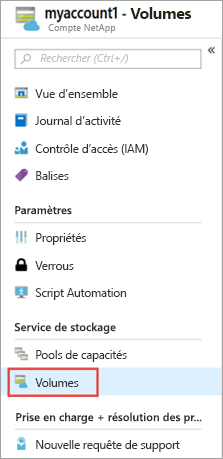

# Configurer Azure NetApp Files et créer un volume 

Cet article explique comment configurer Azure NetApp Files et créer un volume rapidement. 

## Avant de commencer 

Vous devez faire partie du programme Préversion publique et figurer dans la liste verte pour l’accès au fournisseur de ressources Azure Microsoft.NetApp. Pour plus d’informations sur l’adhésion au programme Préversion publique, consultez la [page d’inscription au programme Préversion publique d’Azure NetApp Files](https://aka.ms/nfspublicpreview). 

## S’inscrire à Azure NetApp Files et au fournisseur de ressources NetApp

1. Dans le portail Azure, cliquez sur l’icône Azure Cloud Shell en haut à droite.

      

2. Spécifiez l’abonnement qui a été mis en liste verte pour Azure NetApp Files :
    
        az account set --subscription <subscriptionId>

3. Inscrivez le fournisseur de ressources Azure : 
    
        az provider register --namespace Microsoft.NetApp --wait  

    Le processus d’inscription peut prendre du temps.

## Créer un compte NetApp

1. Dans la zone de recherche du portail Azure, entrez **Azure NetApp Files**, puis sélectionnez **Azure NetApp Files (préversion)** dans la liste qui s’affiche.

      

2. Cliquez sur **+Ajouter** pour créer un nouveau compte NetApp.

     

3. Dans la fenêtre Nouveau compte NetApp, entrez les informations suivantes : 
   1. Entrez **myaccount1** comme nom de compte. 
   2. Sélectionnez votre abonnement.
   3. Sélectionnez **Créer** pour créer un groupe de ressources. Entrez **myRG1** comme nom du groupe de ressources. Cliquez sur **OK**. 
   4. Sélectionnez l’emplacement de votre compte.  

        

      

4. Cliquez sur **Créer** pour créer votre compte NetApp.

## Configurer un pool de capacité

1. Dans le panneau de gestion Azure NetApp Files, sélectionnez votre compte NetApp (**myaccount1**).

      

2. Dans le panneau de gestion Azure NetApp Files de votre compte NetApp, cliquez sur **Pools de capacités**.

      

3. Cliquez sur **+ Ajouter des pools**. 

      

4. Fournissez des informations pour le pool de capacités : 
    1. Entrez **mypool1** comme nom du pool.
    2. Sélectionnez **Premium** pour le niveau de service. 
    3. Spécifiez **4 (Tio)** pour la taille du pool. 

5. Cliquez sur **OK**.

## Créer un volume pour Azure NetApp Files

1. Dans le panneau de gestion Azure NetApp Files de votre compte NetApp, cliquez sur **Volumes**.

      

2. Cliquez sur **+ Ajouter un volume**.

      

3. Dans la fenêtre Créer un volume, spécifiez les informations concernant le nouveau volume : 
   1. Entrez **myvol1** comme nom du volume. 
   2. Entrez **myfilepath1** comme chemin de fichier à utiliser pour créer le chemin d’exportation du nouveau volume.
   3. Sélectionnez votre pool de capacités (**mypool1**).
   4. Utilisez la valeur par défaut du quota. 
   5. Sous Réseau virtuel, cliquez sur **Créer** pour créer un réseau virtuel Azure.  Ensuite, renseignez les informations suivantes :
       * Entrez **myvnet1** comme nom du réseau virtuel.
       * Spécifiez un espace d’adressage pour votre paramètre, par exemple, 10.7.0.0/16
       * Entrez **myANFsubnet** comme nom du sous-réseau.
       * Spécifiez la plage d’adresses du sous-réseau, par exemple, 10.7.0.0/24. Notez que vous ne pouvez pas partager le sous-réseau dédié avec d’autres ressources.
       * Sélectionnez **Microsoft.NetApp/volumes** pour la délégation de sous-réseau.
       * Cliquez sur **OK** pour créer le réseau virtuel.
   6. Dans le sous-réseau, sélectionnez le réseau virtuel qui vient d’être créé (**myvnet1**) comme sous-réseau délégué.

        

        

4. Cliquez sur **Revoir + créer**.

      

5. Passez en revue les informations concernant le volume, puis cliquez sur **Créer**.  
    Le volume créé s’affiche dans le panneau Volumes.

      

## Étapes suivantes  

* [Comprendre la hiérarchie de stockage d’Azure NetApp Files](azure-netapp-files-understand-storage-hierarchy.md)
* [Gérer les volumes avec Azure NetApp Files](azure-netapp-files-manage-volumes.md) 
