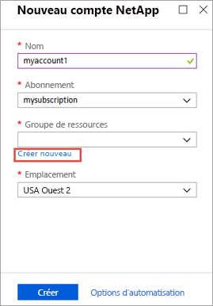

# Configurer Azure NetApp Files et créer un volume 

Cet article vous montre comment définir des fichiers de NetApp Azure rapidement et de créer un volume. 

## Avant de commencer 

Vous devez faire partie du programme Préversion publique et figurer dans la liste verte pour l’accès au fournisseur de ressources Azure Microsoft.NetApp. Pour plus d’informations sur l’adhésion au programme Préversion publique, consultez la [page d’inscription au programme Préversion publique d’Azure NetApp Files](https://aka.ms/nfspublicpreview). 

## S’inscrire pour les fichiers NetApp Azure et le fournisseur de ressources de NetApp

1. À partir du portail Azure, cliquez sur l’icône Azure Cloud Shell dans le coin supérieur droit.

      

2. Spécifier l’abonnement qui a été mis en liste verte pour les fichiers de NetApp Azure :
    
        az account set --subscription <subscriptionId>

3. Inscrire le fournisseur de ressources Azure : 
    
        az provider register --namespace Microsoft.NetApp --wait  

    Le processus d’inscription peut prendre du temps.

## Créer un compte NetApp

1. Dans la zone de recherche du portail Azure, entrez **Azure NetApp Files** , puis sélectionnez **fichiers NetApp de Azure (aperçu)** dans la liste qui s’affiche.

      

2. Cliquez sur **+Ajouter** pour créer un nouveau compte NetApp.

     

3. Dans la fenêtre Nouveau compte NetApp, fournissez les informations suivantes : 
   1. Entrez **myaccount1** pour le nom du compte. 
   2. Sélectionnez votre abonnement.
   3. Sélectionnez **créer** pour créer le nouveau groupe de ressources. Entrez **myRG1** pour le nom de groupe de ressources. Cliquez sur **OK**. 
   4. Sélectionnez l’emplacement de votre compte.  

        

      

4. Cliquez sur **créer** pour créer votre nouveau compte NetApp.

## Configurer un pool de capacité

1. À partir du Panneau de gestion de fichiers NetApp de Azure, sélectionnez votre compte NetApp (**myaccount1**).

      

2. Dans le panneau de gestion de fichiers NetApp de Azure de votre compte NetApp, cliquez sur **pools de capacité**.

      

3. Cliquez sur **+ ajouter des pools**. 

      

4. Fournissent des informations pour le pool de capacité : 
    1. Entrez **mypool1** en tant que le nom du pool.
    2. Sélectionnez **Premium** pour le niveau de service. 
    3. Spécifiez **4 (TIO)** en tant que la taille du pool. 

5. Cliquez sur **OK**.

## Créer un volume pour Azure NetApp Files

1. Dans le panneau de gestion de fichiers NetApp de Azure de votre compte NetApp, cliquez sur **Volumes**.

      

2. Cliquez sur **+ Ajouter un volume**.

      

3. Dans la création d’une fenêtre de Volume, fournissent des informations pour le volume : 
   1. Entrez **myvol1** comme nom de volume. 
   2. Entrez **myfilepath1** en tant que le chemin d’accès de fichier doit être utilisé pour créer le chemin d’exportation pour le volume.
   3. Sélectionnez votre pool de capacité (**mypool1**).
   4. Utilisez la valeur par défaut pour le quota. 
   5. Sous réseau virtuel, cliquez sur **créer** pour créer un réseau virtuel Azure (Vnet) nouvelle.  Renseignez ensuite les informations suivantes :
       * Entrez **myvnet1** en tant que le nom du réseau virtuel.
       * Spécifiez un espace d’adressage pour votre paramètre, par exemple, 10.7.0.0/16
       * Entrez **myANFsubnet** en tant que le nom du sous-réseau.
       * Spécifiez la plage d’adresses de sous-réseau, par exemple, 10.7.0.0/24. Notez que vous ne pouvez pas partager le sous-réseau dédié avec d’autres ressources.
       * Sélectionnez **Microsoft.NetApp/volumes** pour la délégation de sous-réseau.
       * Cliquez sur **OK** pour créer le réseau virtuel.
   6. Dans le sous-réseau, sélectionnez le réseau virtuel qui vient d’être créé (**myvnet1**) en tant que le sous-réseau de délégué.

        

        

4. Cliquez sur **Revoir + créer**.

      

5. Passez en revue les informations pour le volume, puis cliquez sur **créer**.  
    Le volume créé apparaît dans le panneau de Volumes.

      

## Étapes suivantes  

* [Comprendre la hiérarchie de stockage d’Azure NetApp Files](azure-netapp-files-understand-storage-hierarchy.md)
* [Gérer les volumes à l’aide de fichiers NetApp de Azure](azure-netapp-files-manage-volumes.md) 
