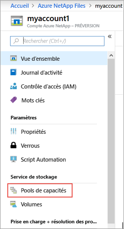
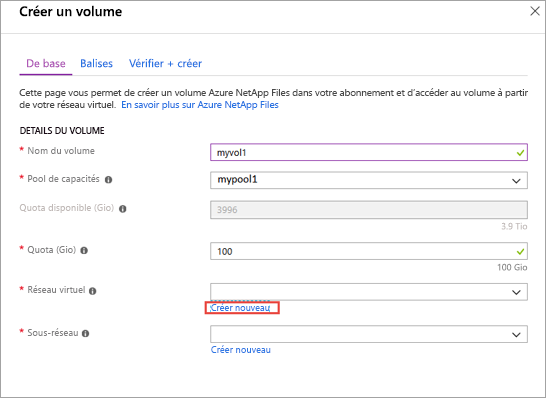
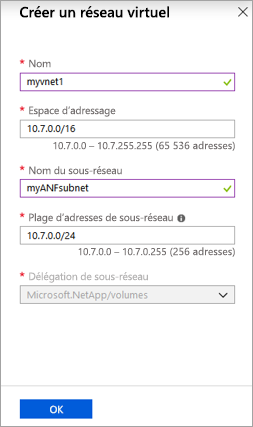

# <a name="quickstart-set-up-azure-netapp-files-and-create-an-nfs-volume"></a>Démarrage rapide : Configurer Azure NetApp Files et créer un volume NFS 

Cet article explique comment configurer Azure NetApp Files et créer un volume rapidement. 

Lors de ce démarrage rapide, vous allez configurer les éléments suivants :

- Inscription à Azure NetApp Files et au fournisseur de ressources NetApp
- Un compte NetApp
- Un pool de capacités
- Un volume NFS pour Azure NetApp Files

Si vous n’avez pas d’abonnement Azure, créez un [compte gratuit](https://azure.microsoft.com/free/?WT.mc_id=A261C142F) avant de commencer.

## <a name="before-you-begin"></a>Avant de commencer 

> [!IMPORTANT] 
> Vous devez avoir accès au service Azure NetApp Files.  Pour demander l’accès au service, consultez la [page de soumission d’une liste d’attente Azure NetApp Files](https://forms.office.com/Pages/ResponsePage.aspx?id=v4j5cvGGr0GRqy180BHbR8cq17Xv9yVBtRCSlcD_gdVUNUpUWEpLNERIM1NOVzA5MzczQ0dQR1ZTSS4u).  Vous devez attendre un e-mail de confirmation officiel de l’équipe Azure NetApp Files avant de continuer. 

[!INCLUDE [cloud-shell-try-it.md](../../includes/cloud-shell-try-it.md)]

---

## <a name="register-for-azure-netapp-files-and-netapp-resource-provider"></a>S’inscrire à Azure NetApp Files et au fournisseur de ressources NetApp

> [!NOTE]
> Le processus d’inscription peut prendre du temps.
>

# <a name="portaltabazure-portal"></a>[Portal](#tab/azure-portal)

Pour connaître les étapes à suivre pour l’inscription à l’aide du portail, ouvrez une session Cloud Shell comme indiqué ci-dessus, puis effectuez les étapes Azure CLI suivantes :

[!INCLUDE [azure-netapp-files-cloudshell-include](../../includes/azure-netapp-files-azure-cloud-shell-window.md)]

# <a name="powershelltabazure-powershell"></a>[PowerShell](#tab/azure-powershell)

Cet article de guide pratique nécessite le module Azure PowerShell Az version 2.6.0 ou ultérieure. Exécutez `Get-Module -ListAvailable Az` pour rechercher votre version actuelle. Si vous devez installer ou mettre à niveau, consultez [Installer le module Azure PowerShell](/powershell/azure/install-Az-ps). Si vous préférez, vous pouvez utiliser la console Azure Cloud Shell dans une session PowerShell à la place.

1. Dans une invite de commandes PowerShell (ou une session PowerShell Cloud Shell), spécifiez l’abonnement qui a été mis en liste verte pour Azure NetApp Files :
    ```powershell-interactive
    Select-AzSubscription -Subscription <subscriptionId>
    ```

2. Inscrivez le fournisseur de ressources Azure :
    ```powershell-interactive
    Register-AzResourceProvider -ProviderNamespace Microsoft.NetApp
    ```

# <a name="azure-clitabazure-cli"></a>[Interface de ligne de commande Azure](#tab/azure-cli)

[!INCLUDE [azure-netapp-files-cloudshell-include](../../includes/azure-netapp-files-azure-cloud-shell-window.md)]

---

## <a name="create-a-netapp-account"></a>Créer un compte NetApp

# <a name="portaltabazure-portal"></a>[Portal](#tab/azure-portal)

1. Dans la zone de recherche du portail Azure, entrez **Azure NetApp Files**, puis sélectionnez **Azure NetApp Files** dans la liste qui s’affiche.

      

2. Cliquez sur **+Ajouter** pour créer un nouveau compte NetApp.

     

3. Dans la fenêtre Nouveau compte NetApp, entrez les informations suivantes : 
   1. Entrez **myaccount1** comme nom de compte. 
   2. Sélectionnez votre abonnement.
   3. Sélectionnez **Créer** pour créer un groupe de ressources. Entrez **myRG1** comme nom du groupe de ressources. Cliquez sur **OK**. 
   4. Sélectionnez l’emplacement de votre compte.  

        

      

4. Cliquez sur **Créer** pour créer votre compte NetApp.

# <a name="powershelltabazure-powershell"></a>[PowerShell](#tab/azure-powershell)

1. Définissez des variables afin que nous puissions y faire référence dans le reste des exemples :

    ```powershell-interactive
    $resourceGroup = "myRG1"
    $location = "eastus"
    $anfAccountName = "myaccount1"
    ``` 

    > [!NOTE]
    > Pour obtenir la liste des régions prises en charge, reportez-vous à [Disponibilité des produits par région](https://azure.microsoft.com/global-infrastructure/services/?products=netapp&regions=all).
    > Pour obtenir le nom de région qui est pris en charge par nos outils en ligne de commande, utilisez `Get-AzLocation | select Location`
    >

1. Créez un groupe de ressources à l’aide de la commande [New-AzResourceGroup](/powershell/module/az.resources/new-azresourcegroup) :

    ```powershell-interactive
    New-AzResourceGroup -Name $resourceGroup -Location $location
    ```

2. Créez un compte Azure NetApp Files avec la commande [New-AzNetAppFilesAccount](/powershell/module/az.netappfiles/New-AzNetAppFilesAccount) :
   
    ```powershell-interactive
    New-AzNetAppFilesAccount -ResourceGroupName $resourceGroup -Location $location -Name $anfAccountName
    ```

# <a name="azure-clitabazure-cli"></a>[Interface de ligne de commande Azure](#tab/azure-cli)

1. Définissez des variables afin que nous puissions y faire référence dans le reste des exemples :

    ```azurecli-interactive
    RESOURCE_GROUP="myRG1"
    LOCATION="eastus"
    ANF_ACCOUNT_NAME="myaccount1"
    ``` 

    > [!NOTE]
    > Pour obtenir la liste des régions prises en charge, reportez-vous à [Disponibilité des produits par région](https://azure.microsoft.com/global-infrastructure/services/?products=netapp&regions=all).
    > Pour obtenir le nom de région qui est pris en charge par nos outils en ligne de commande, utilisez `az account list-locations -query "[].{Region:name}" --out table`
    >

2. Créez un groupe de ressources à l’aide de la commande [az group create](/cli/azure/group#az-group-create) :

    ```azurecli-interactive
    az group create \
        --name $RESOURCE_GROUP \
        --location $LOCATION
    ```

3. Créez un compte Azure NetApp Files avec la commande [az netappfiles account create](/cli/azure/netappfiles/account#az-netappfiles-account-create) :
   
    ```azurecli-interactive
    az netappfiles account create \
        --resource-group $RESOURCE_GROUP \
        --location $LOCATION \
        --account-name $ANF_ACCOUNT_NAME
    ```
---

## <a name="set-up-a-capacity-pool"></a>Configurer un pool de capacité

# <a name="portaltabazure-portal"></a>[Portal](#tab/azure-portal)

1. Dans le panneau de gestion Azure NetApp Files, sélectionnez votre compte NetApp (**myaccount1**).

      

2. Dans le panneau de gestion Azure NetApp Files de votre compte NetApp, cliquez sur **Pools de capacités**.

      

3. Cliquez sur **+ Ajouter des pools**. 

      

4. Fournissez des informations pour le pool de capacités : 
    1. Entrez **mypool1** comme nom du pool.
    2. Sélectionnez **Premium** pour le niveau de service. 
    3. Spécifiez **4 (Tio)** pour la taille du pool. 

5. Cliquez sur **OK**.

# <a name="powershelltabazure-powershell"></a>[PowerShell](#tab/azure-powershell)

1. Définition de nouvelles variables pour référence ultérieure

    ```powershell-interactive
    $poolName = "mypool1"
    $poolSizeBytes = 4398046511104 # 4TiB
    $serviceLevel = "Premium" # Valid values are Standard, Premium and Ultra
    ```

1. Créer un pool de capacités à l’aide de la commande [ New-AzNetAppFilesPool](/powershell/module/az.netappfiles/new-aznetappfilespool)

    ```powershell-interactive
    New-AzNetAppFilesPool -ResourceGroupName $resourceGroup -Location $location -AccountName $anfAccountName -Name $poolName -PoolSize $poolSizeBytes -ServiceLevel $serviceLevel
    ```

# <a name="azure-clitabazure-cli"></a>[Interface de ligne de commande Azure](#tab/azure-cli)

1. Définition de nouvelles variables pour référence ultérieure

    ```azurecli-interactive
    POOL_NAME="mypool1"
    POOL_SIZE_TiB=4 # Size in Azure CLI needs to be in TiB unit (minimum 4 TiB)
    SERVICE_LEVEL="Premium" # Valid values are Standard, Premium and Ultra
    ```

2. Créer un pool de capacités à l’aide de la commande [az netappfiles pool create](/cli/azure/netappfiles/pool#az-netappfiles-pool-create) 

    ```azurecli-interactive
    az netappfiles pool create \
        --resource-group $RESOURCE_GROUP \
        --location $LOCATION \
        --account-name $ANF_ACCOUNT_NAME \
        --pool-name $POOL_NAME \
        --size $POOL_SIZE_TiB \
        --service-level $SERVICE_LEVEL
    ```

---

## <a name="create-nfs-volume-for-azure-netapp-files"></a>Créer un volume NFS pour Azure NetApp Files

# <a name="portaltabazure-portal"></a>[Portal](#tab/azure-portal)

1. Dans le panneau de gestion Azure NetApp Files de votre compte NetApp, cliquez sur **Volumes**.

      

2. Cliquez sur **+ Ajouter un volume**.

      

3. Dans la fenêtre Créer un volume, spécifiez les informations concernant le nouveau volume : 
   1. Entrez **myvol1** comme nom du volume. 
   2. Sélectionnez votre pool de capacités (**mypool1**).
   3. Utilisez la valeur par défaut du quota. 
   4. Sous Réseau virtuel, cliquez sur **Créer** pour créer un réseau virtuel Azure.  Ensuite, renseignez les informations suivantes :
       * Entrez **myvnet1** comme nom du réseau virtuel.
       * Spécifiez un espace d’adressage pour votre paramètre, par exemple, 10.7.0.0/16
       * Entrez **myANFsubnet** comme nom du sous-réseau.
       * Spécifiez la plage d’adresses du sous-réseau, par exemple, 10.7.0.0/24. Vous ne pouvez pas partager le sous-réseau dédié avec d’autres ressources.
       * Sélectionnez **Microsoft.NetApp/volumes** pour la délégation de sous-réseau.
       * Cliquez sur **OK** pour créer le réseau virtuel.
   5. Dans le sous-réseau, sélectionnez le réseau virtuel qui vient d’être créé (**myvnet1**) comme sous-réseau délégué.

        

        

4. Cliquez sur **Protocole**, puis effectuez les actions suivantes : 
    * Sélectionnez **NFS** comme type de protocole pour le volume.  
    * Entrez **myfilepath1** comme chemin de fichier à utiliser pour créer le chemin d’exportation du nouveau volume.  
    * Sélectionnez la version de NFS (**NFSv3** ou **NFSv4.1**) du volume.  
      Consultez les [Considérations](azure-netapp-files-create-volumes.md#considerations) et les [Bonnes pratiques](azure-netapp-files-create-volumes.md#best-practice) relatives aux versions NFS. 
      
> [!IMPORTANT] 
> L’accès à la fonctionnalité NFSv4.1 nécessite la mise en liste verte.  Pour demander une mise en liste verte, envoyez une demande à <anffeedback@microsoft.com>. 

  

5. Cliquez sur **Revoir + créer**.

      

6. Passez en revue les informations concernant le volume, puis cliquez sur **Créer**.  
    Le volume créé s’affiche dans le panneau Volumes.

      

# <a name="powershelltabazure-powershell"></a>[PowerShell](#tab/azure-powershell)

1. Créez une délégation de sous-réseau sur « Microsoft.NetApp/volumes » avec la commande [New-AzDelegation](/powershell/module/az.network/new-azdelegation).

    ```powershell-interactive
    $anfDelegation = New-AzDelegation -Name ([guid]::NewGuid().Guid) -ServiceName "Microsoft.NetApp/volumes"
    ```

2. Créez une configuration de sous-réseau à l’aide de la commande [New-AzVirtualNetworkSubnetConfig](/powershell/module/az.network/new-azvirtualnetworksubnetconfig).

    ```powershell-interactive
    $subnet = New-AzVirtualNetworkSubnetConfig -Name "myANFSubnet" -AddressPrefix "10.7.0.0/24" -Delegation $anfDelegation
    ```

3. Créez le réseau virtuel à l’aide de la commande [New-AzVirtualNetwork](/powershell/module/az.network/new-azvirtualnetwork).
    
    ```powershell-interactive
    $vnet = New-AzVirtualNetwork -Name "myvnet1" -ResourceGroupName $resourceGroup -Location $location -AddressPrefix "10.7.0.0/16" -Subnet $subnet
    ```

4. Créez le volume à l’aide de la commande [New-AzNetAppFilesVolume](/powershell/module/az.netappfiles/new-aznetappfilesvolume).
   
    ```powershell-interactive
    $volumeSizeBytes = 1099511627776 # 100GiB
    $subnetId = $vnet.Subnets[0].Id

    New-AzNetAppFilesVolume -ResourceGroupName $resourceGroup `
        -Location $location `
        -AccountName $anfAccountName `
        -PoolName $poolName `
        -Name "myvol1" `
        -UsageThreshold $volumeSizeBytes `
        -SubnetId $subnetId `
        -CreationToken "myfilepath1" `
        -ServiceLevel $serviceLevel `
        -ProtocolType NFSv3
    ```

# <a name="azure-clitabazure-cli"></a>[Interface de ligne de commande Azure](#tab/azure-cli)

1. Définition de certaines variables pour une utilisation ultérieure.
    
    ```azurecli-interactive
    VNET_NAME="myvnet1"
    SUBNET_NAME="myANFSubnet"
    ```

1. Créez un réseau virtuel sans sous-réseau à l’aide de la commande [az network vnet create](/cli/azure/network/vnet#az-network-vnet-create).
    
    ```azurecli-interactive
    az network vnet create \
        --resource-group $RESOURCE_GROUP \
        --name $VNET_NAME \
        --location $LOCATION \
        --address-prefix "10.7.0.0/16"

    ```

2. Créez un sous-réseau délégué à l’aide de la commande [az network vnet subnet create](/cli/azure/network/vnet/subnet#az-network-vnet-subnet-create).

    ```azurecli-interactive
    az network vnet subnet create \
        --resource-group $RESOURCE_GROUP \
        --vnet-name $VNET_NAME \
        --name $SUBNET_NAME \
        --address-prefixes "10.7.0.0/24" \
        --delegations "Microsoft.NetApp/volumes"
    ```

3. Créez le volume à l’aide de la commande [az netappfiles volume create](/cli/azure/netappfiles/volume#az-netappfiles-volume-create).
   
    ```azurecli-interactive
    VNET_ID=$(az network vnet show --resource-group $RESOURCE_GROUP --name $VNET_NAME --query "id" -o tsv)
    SUBNET_ID=$(az network vnet subnet show --resource-group $RESOURCE_GROUP --vnet-name $VNET_NAME --name $SUBNET_NAME --query "id" -o tsv)
    VOLUME_SIZE_GiB=100 # 100 GiB
    UNIQUE_FILE_PATH="myfilepath2" # Please note that creation token needs to be unique within subscription and region

    az netappfiles volume create \
        --resource-group $RESOURCE_GROUP \
        --location $LOCATION \
        --account-name $ANF_ACCOUNT_NAME \
        --pool-name $POOL_NAME \
        --name "myvol1" \
        --service-level $SERVICE_LEVEL \
        --vnet $VNET_ID \
        --subnet $SUBNET_ID \
        --usage-threshold $VOLUME_SIZE_GiB \
        --file-path $UNIQUE_FILE_PATH \
        --protocol-types "NFSv3"
    ```

---

## <a name="clean-up-resources"></a>Supprimer des ressources

# <a name="portaltabazure-portal"></a>[Portal](#tab/azure-portal)

Lorsque vous avez terminé et si vous le souhaitez, vous pouvez supprimer le groupe de ressources. La suppression d’un groupe de ressources est irréversible.  

> [!IMPORTANT]
> Toutes les ressources dans les groupes de ressources vont être définitivement supprimés et une annulation n’est pas possible. 

1. Dans la zone de recherche du portail Azure, entrez **Azure NetApp Files**, puis sélectionnez **Azure NetApp Files** dans la liste qui s’affiche.

2. Dans la liste des abonnements, cliquez sur le groupe de ressources (myRG1) que vous souhaitez supprimer. 

    


3. Dans la page du groupe de ressources, cliquez sur **Supprimer le groupe de ressources**.

     

    Une fenêtre s’ouvre et affiche un avertissement concernant les ressources qui seront supprimées avec le groupe de ressources.

4. Entrez le nom du groupe de ressources (myRG1) pour confirmer que vous souhaitez supprimer définitivement le groupe de ressources et toutes les ressources qu’il contient, puis cliquez sur **Supprimer**.

     

# <a name="powershelltabazure-powershell"></a>[PowerShell](#tab/azure-powershell)

Lorsque vous avez terminé et si vous le souhaitez, vous pouvez supprimer le groupe de ressources. La suppression d’un groupe de ressources est irréversible.  

> [!IMPORTANT]
> Toutes les ressources dans les groupes de ressources vont être définitivement supprimés et une annulation n’est pas possible.

1. Supprimez le groupe de ressources à l’aide de la commande [Remove-AzResourceGroup](/powershell/module/az.resources/remove-azresourcegroup).
   
    ```powershell-interactive
    Remove-AzResourceGroup -Name $resourceGroup
    ```

# <a name="azure-clitabazure-cli"></a>[Interface de ligne de commande Azure](#tab/azure-cli)

Lorsque vous avez terminé et si vous le souhaitez, vous pouvez supprimer le groupe de ressources. La suppression d’un groupe de ressources est irréversible.  

> [!IMPORTANT]
> Toutes les ressources dans les groupes de ressources vont être définitivement supprimés et une annulation n’est pas possible.

1. Supprimez le groupe de ressources à l’aide de la commande [az group delete](/cli/azure/group#az-group-delete).
   
    ```azurecli-interactive
    az group delete \
        --name $RESOURCE_GROUP
    ```
---

## <a name="next-steps"></a>Étapes suivantes  

> [!div class="nextstepaction"]
> [Gérer les volumes avec Azure NetApp Files](azure-netapp-files-manage-volumes.md)  
