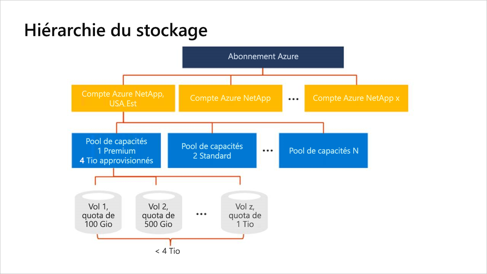

# Qu’est-ce que la hiérarchie de stockage d’Azure NetApp Files

Avant de créer un volume dans Azure NetApp Files, vous devez acheter et configurer un pool de capacité disponible.  Pour configurer un pool de capacité, vous devez disposer d’un compte NetApp. Comprendre la hiérarchie de stockage s’avère utile pour configurer et gérer vos ressources Azure NetApp Files.

## Comptes NetApp

- Un compte NetApp est un groupement administratif de pools de capacité.  
- Un compte de NetApp diffère de votre compte de stockage Azure général. 
- Un compte NetApp a une portée régionale.   
- Vous pouvez avoir plusieurs comptes NetApp dans une région, mais chaque compte NetApp est lié à une seule région.

## Pools de capacités

- Un pool de capacité se mesure par sa capacité allouée.  
- La capacité est approvisionnée via les références SKU fixes que vous avez achetées (par exemple, une capacité de 4 Tio).
- Un pool de capacité ne peut avoir qu’un seul niveau de service.  
- Chaque pool de capacité peut appartenir à un seul compte NetApp. Toutefois, vous pouvez avoir plusieurs pools de capacité au sein d’un compte NetApp.  
- Un pool de capacité ne peut pas être déplacé entre les comptes NetApp.   
  Par exemple, dans le [diagramme conceptuel de la hiérarchie de stockage](#conceptual_diagram_of_storage_hierarchy) ci-dessous, le Pool de capacité 1 ne peut pas être déplacé du compte NetApp Est des États-Unis au compte NetApp Ouest des États-Unis 2.  
- Impossible de supprimer un pool de capacités tant que tous les volumes qu’il contient n’ont pas été supprimés.

## Volumes

- Un volume se mesure par la consommation de capacité logique et est évolutif. 
- La consommation de capacité d’un volume est comptée par rapport à la capacité configurée de son pool.
- Chaque volume appartient à un seul pool, mais un pool peut contenir plusieurs volumes. 
- Un volume ne peut pas être déplacé entre des pools de capacité. <!--Within the same NetApp account, you can move a volume across pools.  -->   
  Par exemple, dans le [diagramme conceptuel de la hiérarchie de stockage](#conceptual_diagram_of_storage_hierarchy) ci-dessous, vous ne pouvez pas déplacer les volumes du Pool de capacité de 1 vers le Pool de capacité 2.
- Impossible de supprimer un volume tant que tous ses instantanés n’ont pas été supprimés.

## Diagramme conceptuel de la hiérarchie de stockage 
L’exemple suivant montre les relations entre l’abonnement Azure, les comptes NetApp, les pools de capacité et les volumes.   

## Étapes suivantes

- [Limites des ressources pour Azure NetApp Files](azure-netapp-files-resource-limits.md)
- [Register for Azure NetApp Files](azure-netapp-files-register.md) (S’inscrire à Azure NetApp Files)
