# <a name="quickstart-create-azure-resource-manager-templates-with-visual-studio-code"></a>Démarrage rapide : Créer des modèles Azure Resource Manager avec Visual Studio Code

Les outils Azure Resource Manager pour Visual Studio Code fournissent une prise en charge des langages, des extraits de code de ressources et l’autocomplétion des ressources. Ces outils permettent de créer et de valider des modèles Azure Resource Manager. Dans ce guide de démarrage rapide, vous allez utiliser l’extension qui permet de créer un modèle Azure Resource Manager de zéro. Ainsi, vous découvrirez les fonctionnalités de l’extension telles que les extraits de code des modèles ARM, la validation, l’autocomplétion et la prise en charge des fichiers de paramètres.

Pour suivre ce guide de démarrage rapide, vous avez besoin de [Visual Studio Code](https://code.visualstudio.com/), ainsi que de l’[extension Outils Azure Resource Manager](https://marketplace.visualstudio.com/items?itemName=msazurermtools.azurerm-vscode-tools). Vous avez également besoin soit d’[Azure CLI](https://docs.microsoft.com/cli/azure/?view=azure-cli-latest), soit du [module Azure PowerShell](https://docs.microsoft.com/powershell/azure/new-azureps-module-az?view=azps-3.7.0), que vous devez authentifier après leur installation.

Si vous ne disposez pas d’abonnement Azure, créez un [compte gratuit](https://azure.microsoft.com/free/) avant de commencer.

## <a name="create-an-arm-template"></a>Créer un modèle ARM

Dans Visual Studio Code, créez puis ouvrez avec un fichier nommé *azuredeploy.json*. Entrez `arm` dans l’éditeur de code pour initialiser les extraits de code Azure Resource Manager en vue de générer automatiquement des modèles à partir d’un modèle ARM.

Sélectionnez `arm!` pour créer un modèle limité à un déploiement de groupe de ressources Azure.


Cet extrait de code crée la base d’un modèle ARM.


Notez que le mode de langage Visual Studio Code est passé de *JSON* à *Modèle Azure Resource Manager*. L’extension comprend un serveur de langage propre aux modèles ARM qui permet la validation et l’autocomplétion des modèles ARM, ainsi que d’autres services de langage.


## <a name="add-an-azure-resource"></a>Ajouter une ressource Azure

L’extension comprend des extraits de code pour de nombreuses ressources Azure. Ces extraits de code peuvent être utilisés pour ajouter facilement des ressources à votre déploiement de modèle.

Placez le curseur dans le bloc **resources** du modèle, tapez `storage`, puis sélectionnez l’extrait de code *arm-storage*.

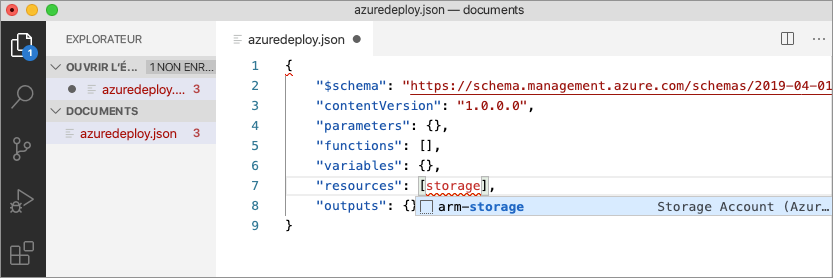

Cette action ajoute une ressource de stockage au modèle.

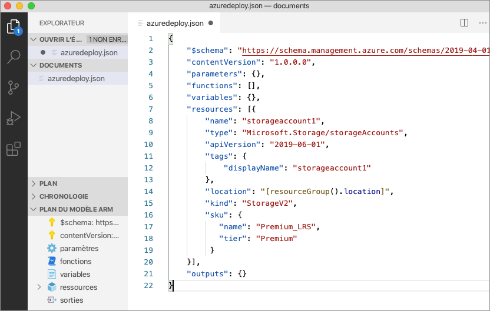

Vous pouvez utiliser la touche de **tabulation** pour parcourir les propriétés configurables du compte de stockage.

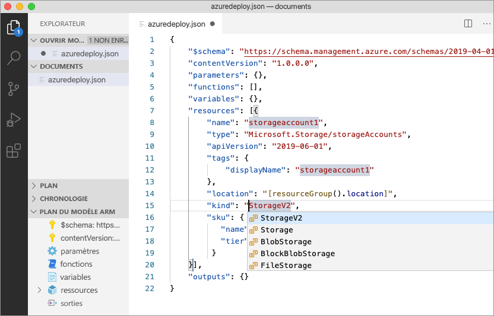

## <a name="completion-and-validation"></a>Autocomplétion et validation

L’une des fonctionnalités les plus puissantes de l’extension est son intégration aux schémas Azure. Les schémas Azure permettent à l’extension de bénéficier de fonctionnalités comme la validation et l’autocomplétion des ressources. Nous allons modifier le compte de stockage pour voir à quoi ressemble la validation et l’autocomplétion. 

Tout d’abord, mettez à jour le type de compte de stockage avec une valeur non valide, par exemple `megaStorage`. Notez que cette action génère un avertissement indiquant que `megaStorage` n’est pas une valeur valide.

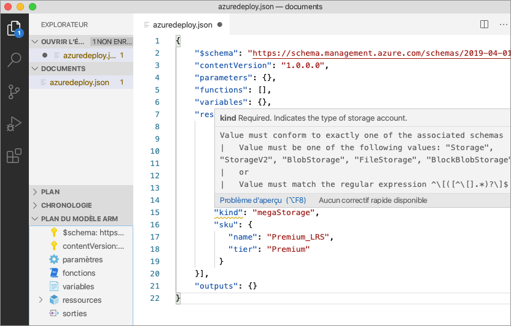

Pour utiliser les fonctionnalités d’autocomplétion, supprimez `megaStorage`, placez le curseur à l’intérieur des guillemets doubles, puis appuyez sur `ctrl` + `space`. Cette action présente une liste de complétion comprenant des valeurs valides.

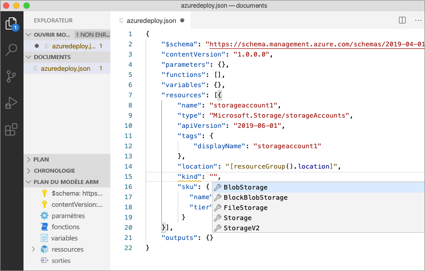

## <a name="add-template-parameters"></a>Ajouter des paramètres de modèle

À présent, vous allez créer et utiliser un paramètre pour spécifier le nom du compte de stockage.

Placez votre curseur dans le bloc de paramètres, ajoutez un retour chariot, tapez `par`, puis sélectionnez l’extrait de code `arm-param-value`. Cette action ajoute un paramètre générique au modèle.

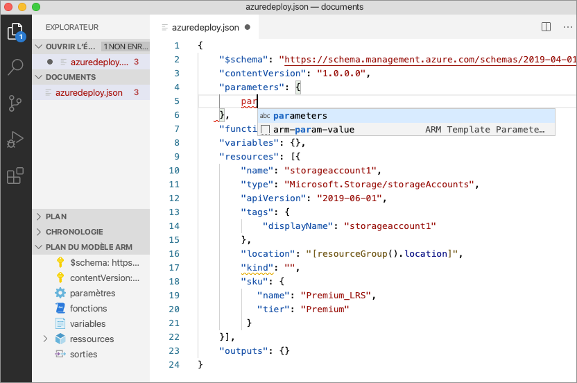

Remplacez le nom du paramètre par `storageAccountName` et sa description par `Storage Account Name`.

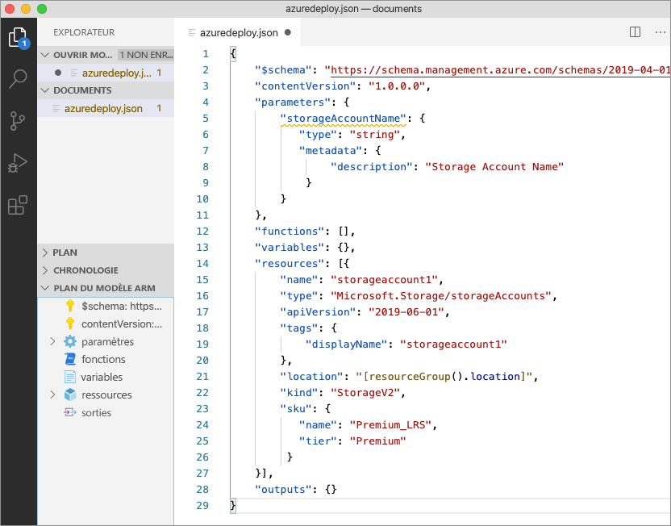

Le nom d’un compte de stockage Azure doit être constitué de 3 à 24 caractères. Ajoutez `minLength` et `maxLength` au paramètre et fournissez les valeurs appropriées.

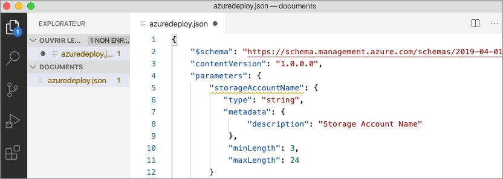

Maintenant, dans la ressource de stockage, mettez à jour la propriété Name pour utiliser le paramètre. Pour cela, supprimez le nom actuel. Entrez un guillemet double et un crochet ouvrant (`[`) pour afficher une liste de fonctions de modèle ARM. Sélectionnez *parameters* dans la liste. 

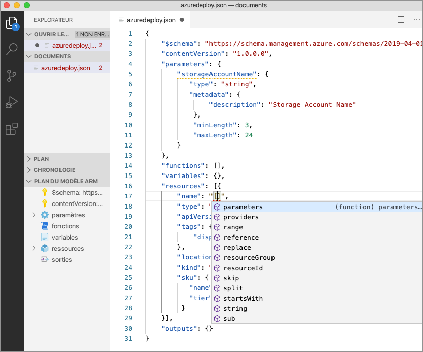

Si vous entrez un guillemet simple (`'`) entre deux parenthèses, vous obtenez la liste de tous les paramètres définis dans le modèle, en l’occurence *storageAccountName*. Sélectionnez le paramètre.

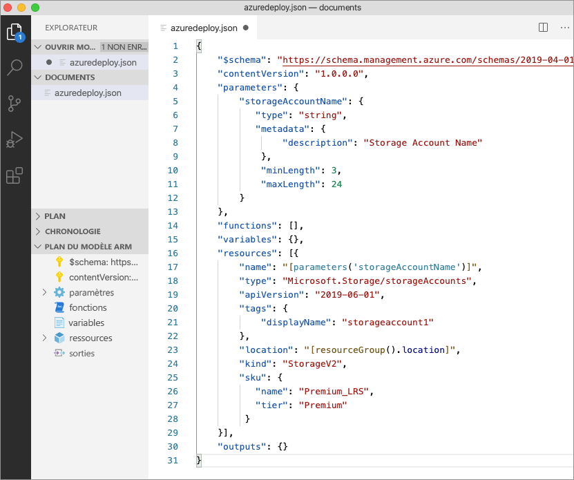

## <a name="create-a-parameter-file"></a>Créer un fichier de paramètres

Pour un modèle ARM, un fichier de paramètres vous permet de stocker des valeurs de paramètres propres à l’environnement et de passer ces valeurs en groupe au moment du déploiement. Par exemple, vous pouvez avoir un fichier de paramètres contenant des valeurs propres à un environnement de test, et un autre fichier contenant des valeurs propres à un environnement de production.

L’extension facilite la création d’un fichier de paramètres à partir de vos modèles existants. Pour ce faire, cliquez avec le bouton droit sur le modèle dans l’éditeur de code, puis sélectionnez `Select/Create Parameter File`.

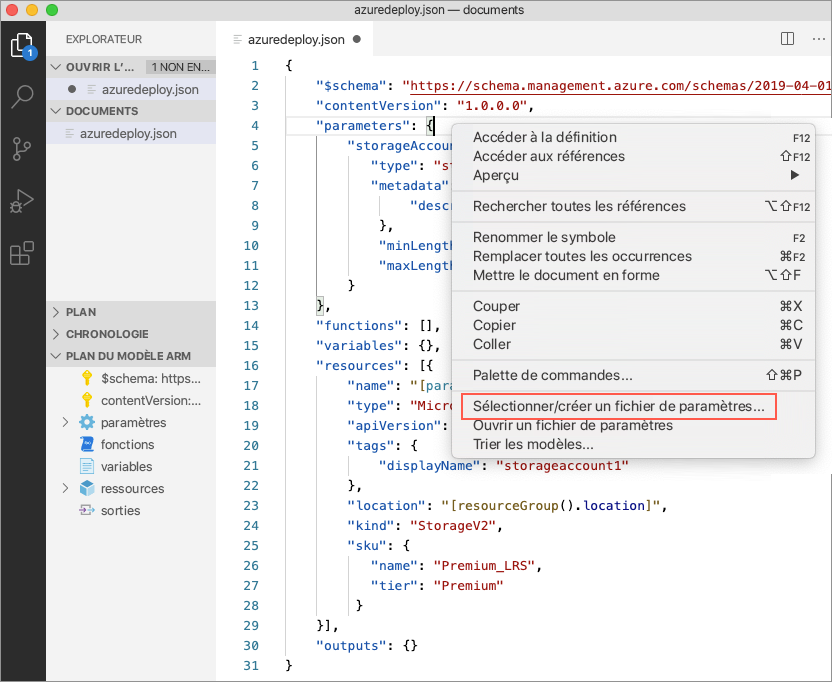

Sélectionnez `New` > `All Parameters`, puis sélectionnez un nom et un emplacement pour le fichier de paramètres.


Cette action crée un fichier de paramètres et le mappe avec le modèle à partir duquel il a été créé. Vous pouvez voir et modifier le mappage actuel entre le modèle et le fichier de paramètres dans la barre d’état Visual Studio Code lorsque vous sélectionnez le modèle en question.


Maintenant que le fichier de paramètres a été mappé au modèle, l’extension valide à la fois le modèle et le fichier de paramètres. Pour voir cette validation à l’œuvre, ajoutez une valeur à deux caractères au paramètre `storageAccountName` dans le fichier de paramètres, puis enregistrez le fichier.

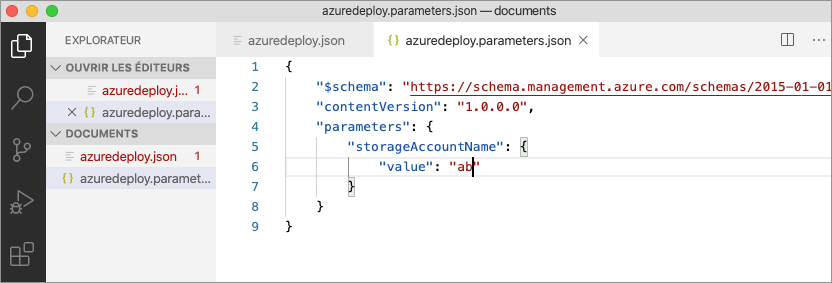

Revenez au modèle ARM et remarquez qu’une erreur s’affiche, indiquant que la valeur ne répond pas aux critères du paramètre.

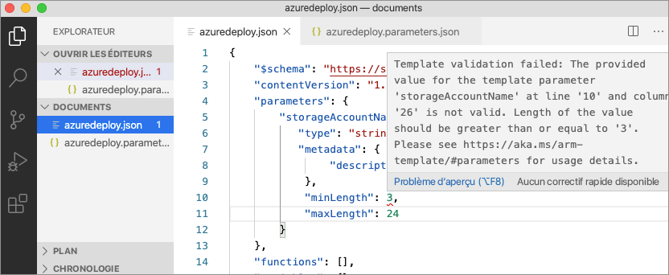

Remplacez la valeur par une valeur valide, enregistrez le fichier, puis revenez au modèle. Notez que l’erreur concernant le paramètre a été résolue.

## <a name="deploy-the-template"></a>Déployer le modèle

Ouvrez le terminal Visual Studio Code intégré à l’aide de la combinaison de touches `ctrl` + ```` ` ````, puis utilisez Azure CLI ou le module Azure PowerShell afin de déployer le modèle.

# <a name="cli"></a>[INTERFACE DE LIGNE DE COMMANDE](#tab/CLI)

```azurecli
az group create --name arm-vscode --location eastus

az deployment group create --resource-group arm-vscode --template-file azuredeploy.json --parameters azuredeploy.parameters.json
```

# <a name="powershell"></a>[PowerShell](#tab/PowerShell)

```azurepowershell
New-AzResourceGroup -Name arm-vscode -Location eastus

New-AzResourceGroupDeployment -ResourceGroupName arm-vscode -TemplateFile ./azuredeploy.json -TemplateParameterFile ./azuredeploy.parameters.json
```
---

## <a name="clean-up-resources"></a>Nettoyer les ressources

Lorsque les ressources Azure ne sont plus nécessaires, utilisez Azure CLI ou le module Azure PowerShell afin de supprimer le groupe de ressources qui a été utilisé pour ce guide de démarrage rapide.

# <a name="cli"></a>[INTERFACE DE LIGNE DE COMMANDE](#tab/CLI)

```azurecli
az group delete --name arm-vscode
```

# <a name="powershell"></a>[PowerShell](#tab/PowerShell)

```azurepowershell
Remove-AzResourceGroup -Name arm-vscode
```
---

## <a name="next-steps"></a>Étapes suivantes

> [!div class="nextstepaction"]
> [Tutoriels pour les débutants](./template-tutorial-create-first-template.md)
