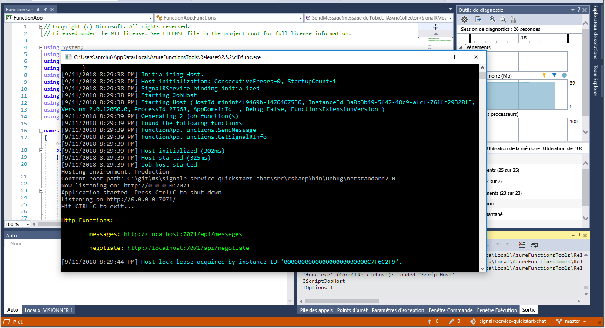

# Démarrage rapide : créer une salle de conversation avec Azure Functions et le service SignalR à l’aide de C#

Le service Azure SignalR vous permet d’ajouter facilement des fonctionnalités en temps réel à votre application. Azure Functions est une plateforme serverless qui vous permet d’exécuter votre code sans gérer d’infrastructures. Dans ce démarrage rapide, découvrez comment utiliser le service SignalR et Functions pour générer une application serverless de conversation en temps réel.

## Prérequis

Si vous n’avez pas encore installé Visual Studio 2017, vous pouvez télécharger et utiliser la version **gratuite** [Visual Studio 2017 Community Edition](https://www.visualstudio.com/downloads/). Veillez à activer **le développement Azure** lors de l’installation de Visual Studio.

[!INCLUDE [quickstarts-free-trial-note](../../includes/quickstarts-free-trial-note.md)]

## Connexion à Azure

Connectez-vous au portail Azure sur <https://portal.azure.com/> avec votre compte Azure.

[!INCLUDE [Create instance](includes/signalr-quickstart-create-instance.md)]

[!INCLUDE [Clone application](includes/signalr-quickstart-clone-application.md)]

## Configurer et exécuter l’application de fonction Azure

1. Démarrez Visual Studio et ouvrez la solution dans le dossier *chat\src\csharp* du référentiel cloné.

1. Dans le navigateur dans lequel le portail Azure est ouvert, vérifiez que l’instance du service SignalR que vous avez déployée précédemment a bien été créée en recherchant son nom dans la zone de recherche en haut du portail. Sélectionnez l’instance pour l’ouvrir.

    

1. Sélectionnez **Clés** pour afficher les chaînes de connexion de l’instance du service SignalR.

1. Sélectionnez et copiez la chaîne de connexion principale.

1. De retour dans Visual Studio, dans l’Explorateur de solutions, renommez *local.settings.sample.json* en *local.settings.json*.

1. Dans le fichier **local.settings.json**, collez la chaîne de connexion dans la valeur du paramètre **AzureSignalRConnectionString**. Enregistrez le fichier .

1. Ouvrez **Functions.cs**. Il existe deux fonctions déclenchées par HTTP dans cette application de fonction :

    - **GetSignalRInfo** : utilise la liaison d’entrée *SignalRConnectionInfo* pour générer et retourner des informations de connexion valides.
    - **SendMessage** : reçoit un message de conversation dans le corps de la demande et utilise la liaison de sortie *SignalR* pour diffuser le message à toutes les applications clientes connectées.

1. Dans le menu **Déboguer**, sélectionnez **Démarrer le débogage** pour exécuter l’application.

    

[!INCLUDE [Run web application](includes/signalr-quickstart-run-web-application.md)]

[!INCLUDE [Cleanup](includes/signalr-quickstart-cleanup.md)]

## Étapes suivantes

Dans ce démarrage rapide, vous avez généré et exécuté une application serverless en temps réel dans VS Code. Apprenez-en plus sur le déploiement d’Azure Functions à partir de VS Code.

> [!div class="nextstepaction"]
> [Déployer Azure Functions avec VS Code](https://code.visualstudio.com/tutorials/functions-extension/getting-started)