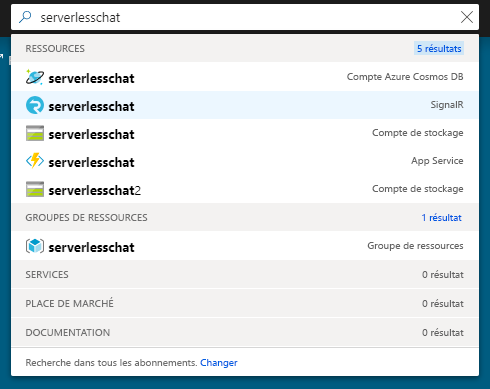
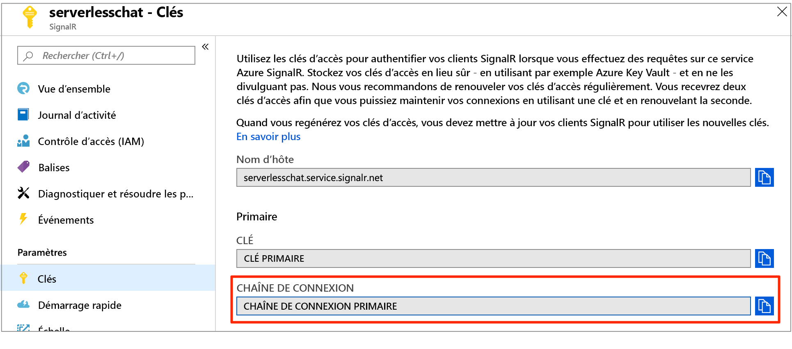

# <a name="quickstart-create-a-chat-room-with-azure-functions-and-signalr-service-using-javascript"></a>Démarrage rapide : Créer une salle de conversation avec Azure Functions et SignalR Service à l’aide de JavaScript

Le service Azure SignalR vous permet d’ajouter facilement des fonctionnalités en temps réel à votre application. Azure Functions est une plateforme serverless qui vous permet d’exécuter votre code sans gérer d’infrastructures. Dans ce démarrage rapide, découvrez comment utiliser le service SignalR et Functions pour générer une application serverless de conversation en temps réel.

## <a name="prerequisites"></a>Prérequis

Ce démarrage rapide peut être exécuté sur macOS, Windows ou Linux.

Assurez-vous qu’un éditeur de code tel que [Visual Studio Code](https://code.visualstudio.com/) est installé.

Installez [Azure Functions Core Tools (v2)](https://github.com/Azure/azure-functions-core-tools#installing) pour exécuter des applications Azure Function en local.

Azure Functions nécessite [Node.js](https://nodejs.org/en/download/) version 8 ou 10.

Pour installer des extensions, Azure Functions Core Tools requiert actuellement que le [kit SDK .NET Core](https://www.microsoft.com/net/download) soit installé. Toutefois, aucune connaissance de .NET n’est requise pour générer des applications de fonction Azure JavaScript.

[!INCLUDE [quickstarts-free-trial-note](../../includes/quickstarts-free-trial-note.md)]

## <a name="log-in-to-azure"></a>Connexion à Azure

Connectez-vous au portail Azure sur <https://portal.azure.com/> avec votre compte Azure.

[!INCLUDE [Create instance](includes/signalr-quickstart-create-instance.md)]

[!INCLUDE [Clone application](includes/signalr-quickstart-clone-application.md)]

## <a name="configure-and-run-the-azure-function-app"></a>Configurer et exécuter l’application de fonction Azure

1. Dans le navigateur dans lequel le portail Azure est ouvert, vérifiez que l’instance du service SignalR que vous avez déployée précédemment a bien été créée en recherchant son nom dans la zone de recherche en haut du portail. Sélectionnez l’instance pour l’ouvrir.

    

1. Sélectionnez **Clés** pour afficher les chaînes de connexion de l’instance du service SignalR.

1. Sélectionnez et copiez la chaîne de connexion principale.

    

1. Dans votre éditeur de code, ouvrez le dossier *src/chat/javascript* situé dans le référentiel cloné.

1. Renommez *local.settings.sample.json* en *local.settings.json*.

1. Dans le fichier **local.settings.json**, collez la chaîne de connexion dans la valeur du paramètre **AzureSignalRConnectionString**. Enregistrez le fichier .

1. Les fonctions JavaScript sont organisées dans des dossiers. Deux fichiers se trouvent dans chaque dossier : le fichier *function.json* définit les liaisons utilisées dans la fonction et le fichier *index.js* correspond au corps de la fonction. Il existe deux fonctions déclenchées par HTTP dans cette application de fonction :

    - **negotiate** : utilise la liaison d’entrée *SignalRConnectionInfo* pour générer et retourner des informations de connexion valides.
    - **messages** : reçoit un message de conversation dans le corps de la demande et utilise la liaison de sortie *SignalR* pour diffuser le message à toutes les applications clientes connectées.

1. Dans le terminal, vérifiez que vous vous trouvez dans le dossier *src/chat/javascript*. Utilisez Azure Functions Core Tools pour installer les extensions requises pour exécuter l’application.

    ```bash
    func extensions install
    ```

1. Exécutez l’application de fonction.

    ```bash
    func start
    ```

    

[!INCLUDE [Run web application](includes/signalr-quickstart-run-web-application.md)]

[!INCLUDE [Cleanup](includes/signalr-quickstart-cleanup.md)]

## <a name="next-steps"></a>Étapes suivantes

Dans ce démarrage rapide, vous avez généré et exécuté une application serverless en temps réel dans VS Code. Apprenez-en plus sur le déploiement d’Azure Functions à partir de VS Code.

> [!div class="nextstepaction"]
> [Déployer Azure Functions avec VS Code](https://code.visualstudio.com/tutorials/functions-extension/getting-started)
