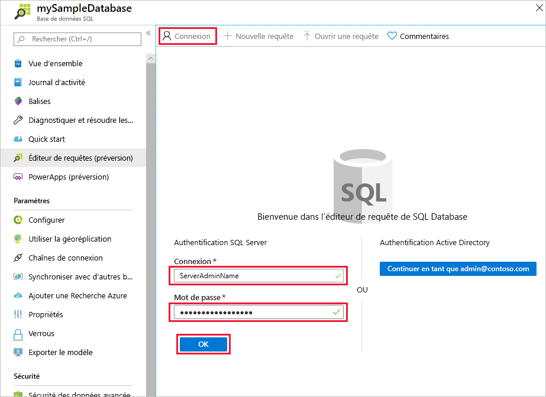
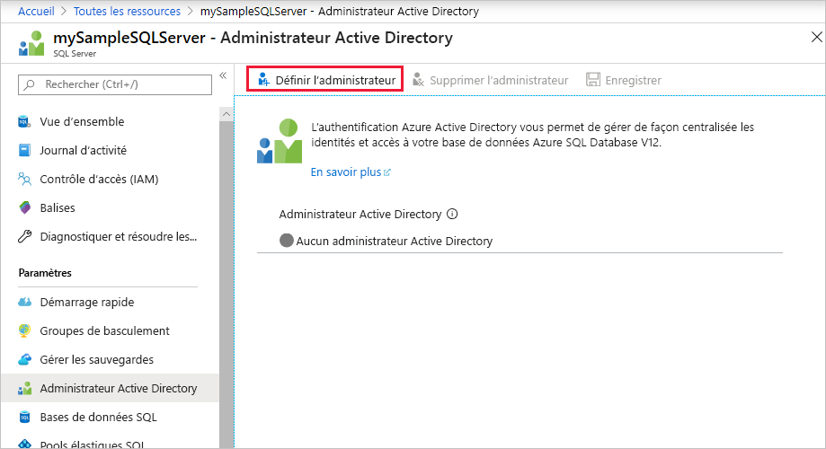
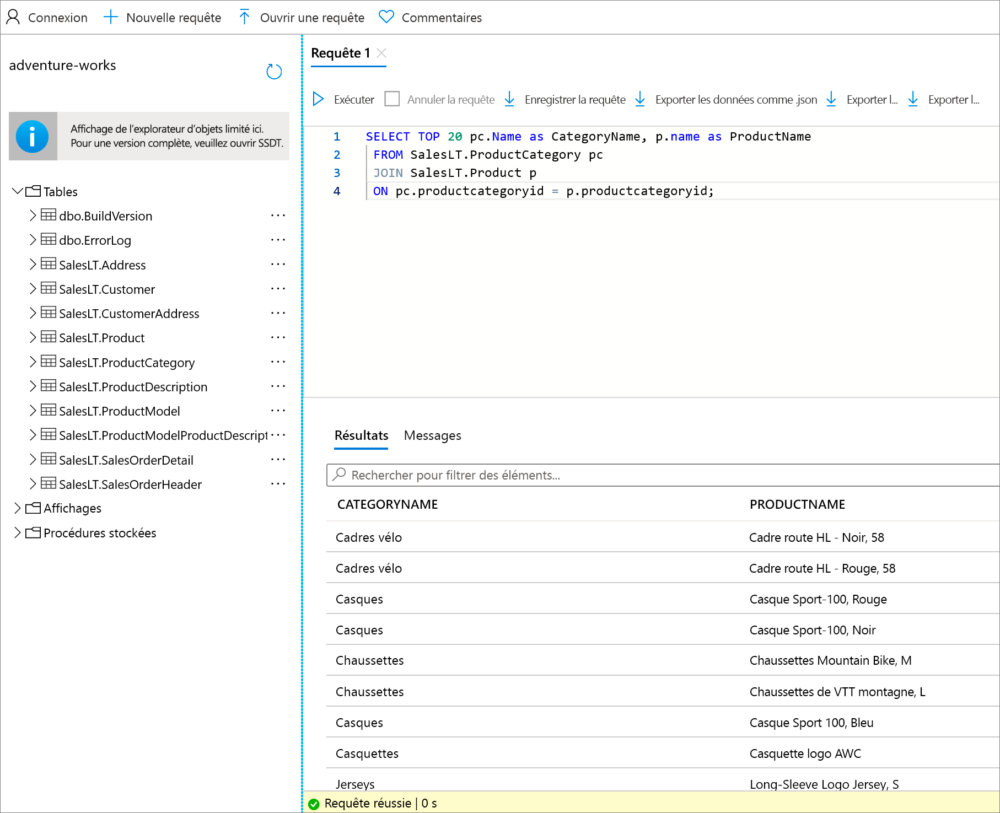

# <a name="quickstart-use-the-azure-portals-query-editor-to-query-an-azure-sql-database"></a>Démarrage rapide : Utiliser l’éditeur de requête du portail Azure pour interroger une base de données Azure SQL
[!INCLUDE[appliesto-sqldb](../includes/appliesto-sqldb.md)]

L’éditeur de requête est un outil du portail Azure qui permet d’exécuter des requêtes SQL sur une base de données dans Azure SQL Database ou sur un entrepôt de données dans Azure SQL Data Warehouse. 

Dans ce guide de démarrage rapide, vous allez utiliser l’éditeur de requête pour exécuter des requêtes T-SQL (Transact-SQL) sur une base de données.

## <a name="prerequisites"></a>Prérequis

Pour suivre ce guide, vous avez besoin de l’exemple de base de données AdventureWorksLT. Si vous ne disposez pas d’une copie de travail de l’exemple de base de données AdventureWorksLT dans SQL Database, le guide de démarrage rapide suivant vous permettra d’en créer une rapidement :

- [Démarrage rapide : Créer une base de données dans Azure SQL Database à l’aide du portail Azure, de PowerShell et d’Azure CLI](single-database-create-quickstart.md) 

### <a name="configure-network-settings"></a>Configurer les paramètres réseau

Si l’une des erreurs suivantes s’affiche dans l’éditeur de requête : *Les paramètres de votre réseau local empêchent peut-être l’éditeur de requête d’émettre des requêtes. Cliquez ici pour obtenir des instructions sur la configuration des paramètres réseau* ou *Impossible d’établir une connexion au serveur. Il s’agit peut-être d’un problème avec la configuration locale de votre pare-feu ou de vos paramètres de proxy réseau*, les informations suivantes devraient vous aider à résoudre le problème :

> [!IMPORTANT]
> L’éditeur de requête utilise les ports 443 et 1443 pour communiquer. Vérifiez que vous avez activé le trafic HTTPS sortant sur ces ports. Vous devez également [ajouter votre adresse IP sortante aux règles d’autorisation de pare-feu du serveur](firewall-create-server-level-portal-quickstart.md) pour accéder à vos bases de données et entrepôts de données.


## <a name="open-the-sql-database-query-editor"></a>Ouvrir l’éditeur de requête SQL Database

1. Connectez-vous au [portail Azure](https://portal.azure.com/) et sélectionnez la base de données que vous souhaitez interroger.

2. Dans le menu **Base de données SQL**, sélectionnez **Éditeur de requête (préversion)** .

    


## <a name="establish-a-connection-to-the-database"></a>Établir une connexion à la base de données

Même si vous êtes connecté au portail, vous devez fournir des informations d’identification pour accéder à la base de données. Vous pouvez vous connecter à l’aide de l’authentification SQL ou Azure Active Directory pour vous connecter à votre base de données.

### <a name="connect-using-sql-authentication"></a>Se connecter à l’aide de l’authentification SQL

1. Dans la page **Connexion**, sous **Authentification SQL Server**, entrez un **nom d’utilisateur** et un **mot de passe** pour l’utilisateur qui a accès à la base de données. Si vous ne savez pas lesquels utiliser, utilisez ceux de l’administrateur du serveur de la base de données.

    

2. Sélectionnez **OK**.


### <a name="connect-using-azure-active-directory"></a>Se connecter avec Azure Active Directory

La configuration d’un administrateur Azure AD (Azure Active Directory) vous permet d’utiliser une même identité pour vous connecter au portail Azure et à votre base de données. Pour vous connecter à votre base de données avec Azure AD, suivez les étapes ci-dessous afin de configurer un administrateur Azure AD pour votre instance de SQL Server.

> [!NOTE]
> * Les comptes de messagerie (par exemple outlook.com, gmail.com, yahoo.com, etc.) ne sont pas encore pris en charge comme administrateurs Azure AD. Veillez à choisir un utilisateur créé en mode natif dans Azure AD ou fédéré dans Azure AD.
> * La connexion d’un administrateur Azure AD ne fonctionne pas avec les comptes pour lesquels l’authentification à deux facteurs est activée.

#### <a name="set-an-active-directory-admin-for-the-server"></a>Définir un administrateur Active Directory pour le serveur

1. Dans le portail Azure, sélectionnez votre instance de SQL Server.

2. Dans le menu **SQL Server**, sélectionnez **Administrateur Active Directory**.

3. Dans la barre d’outils de la page SQL Server **Administrateur Active Directory**, sélectionnez **Définir l’administrateur**, puis choisissez l’utilisateur ou le groupe qui doit devenir l’administrateur Azure Active Directory.

    

4. Dans la page **Ajouter un administrateur**, dans la zone de recherche, entrez un utilisateur ou un groupe à rechercher, sélectionnez-le en tant qu’administrateur, puis cliquez sur le bouton **Sélectionner**.

5. De retour dans la barre d’outils de la page SQL Server **Administrateur Active Directory**, sélectionnez **Enregistrer**.

### <a name="connect-to-the-database"></a>Se connecter à la base de données

6. Dans le menu **SQL Server**, sélectionnez **Bases de données SQL**, puis sélectionnez votre base de données.

7. Dans le menu **Base de données SQL**, sélectionnez **Éditeur de requête (préversion)** . Dans la page **Connexion**, sous l’étiquette **Authentification Active Directory**, un message s’affiche indiquant que vous vous êtes connecté si vous êtes un administrateur Azure AD. Sélectionnez ensuite le bouton **Continuer en tant que** *\<your user or group ID>* . Si la page indique que la connexion a échoué, essayez d’actualiser la page.

## <a name="query-a-database-in-sql-database"></a>Interroger une base de données dans SQL Database

Les exemples de requêtes suivants doivent pouvoir s’exécuter sur l’exemple de base de données AdventureWorksLT.

### <a name="run-a-select-query"></a>Exécuter une requête SELECT

1. Collez la requête ci-après dans l’éditeur de requête :

   ```sql
    SELECT TOP 20 pc.Name as CategoryName, p.name as ProductName
    FROM SalesLT.ProductCategory pc
    JOIN SalesLT.Product p
    ON pc.productcategoryid = p.productcategoryid;
   ```

2. Sélectionnez **Exécuter**, puis passez en revue la sortie dans le volet **Résultats**.

   

3. Si vous le souhaitez, vous pouvez enregistrer la requête sous la forme d’un fichier .sql ou exporter les données retournées dans un fichier .json, .csv ou .xml.

### <a name="run-an-insert-query"></a>Exécuter une requête INSERT

Exécutez l’instruction T-SQL [INSERT](/sql/t-sql/statements/insert-transact-sql/) suivante pour ajouter un nouveau produit dans la table `SalesLT.Product`.

1. Remplacez la requête précédente par celle-ci.

    ```sql
    INSERT INTO [SalesLT].[Product]
           ( [Name]
           , [ProductNumber]
           , [Color]
           , [ProductCategoryID]
           , [StandardCost]
           , [ListPrice]
           , [SellStartDate]
           )
    VALUES
           ('myNewProduct'
           ,123456789
           ,'NewColor'
           ,1
           ,100
           ,100
           ,GETDATE() );
   ```


2. Sélectionnez **Exécuter** pour insérer une nouvelle ligne dans la table `Product`. Le volet **Messages** affiche **Requête réussie : Lignes affectées : 1**.


### <a name="run-an-update-query"></a>Exécuter une requête UPDATE

Exécutez l’instruction T-SQL [UPDATE](/sql/t-sql/queries/update-transact-sql/) suivante pour modifier votre nouveau produit.

1. Remplacez la requête précédente par celle-ci.

   ```sql
   UPDATE [SalesLT].[Product]
   SET [ListPrice] = 125
   WHERE Name = 'myNewProduct';
   ```

2. Sélectionnez **Exécuter** pour mettre à jour la ligne spécifiée dans la table `Product`. Le volet **Messages** affiche **Requête réussie : Lignes affectées : 1**.

### <a name="run-a-delete-query"></a>Exécuter une requête DELETE

Exécutez l’instruction T-SQL [DELETE](/sql/t-sql/statements/delete-transact-sql/) suivante pour supprimer votre nouveau produit.

1. Remplacez la requête précédente par celle-ci :

   ```sql
   DELETE FROM [SalesLT].[Product]
   WHERE Name = 'myNewProduct';
   ```

2. Sélectionnez **Exécuter** pour supprimer la ligne spécifiée dans la table `Product`. Le volet **Messages** affiche **Requête réussie : Lignes affectées : 1**.


## <a name="query-editor-considerations"></a>Considérations relatives à l’éditeur de requête

Il y a quelques informations à connaître quand vous travaillez avec l’éditeur de requête.

* L’éditeur de requête utilise les ports 443 et 1443 pour communiquer. Vérifiez que vous avez activé le trafic HTTPS sortant sur ces ports. Vous devrez également ajouter votre adresse IP sortante aux les règles d’autorisation de pare-feu du serveur pour accéder à vos bases de données et entrepôts de données.

* Si vous avez une connexion Private Link, l’éditeur de requête fonctionne sans qu’il soit nécessaire d’ajouter l’adresse IP du client au pare-feu SQL Database.

* Le fait d’appuyer sur **F5** réinitialise la page de l’éditeur de requête, effaçant la requête sur laquelle vous travaillez.

* L’éditeur de requête ne prend pas en charge la connexion à la base de données `master`.

* Il y a un délai d’expiration de 5 minutes pour l’exécution des requêtes.

* L’éditeur de requête prend en charge seulement la projection cylindrique des types de données géographiques.

* Il n’existe pas de prise en charge d’IntelliSense pour les tables et les vues de base de données. Toutefois, l’éditeur prend en charge la saisie semi-automatique des noms qui ont déjà été tapés.


## <a name="next-steps"></a>Étapes suivantes

Pour plus d’informations sur les instructions T-SQL (Transact-SQL) prises en charge dans Azure SQL Database, consultez [Résolution des différences de Transact-SQL durant la migration vers SQL Database](transact-sql-tsql-differences-sql-server.md).
