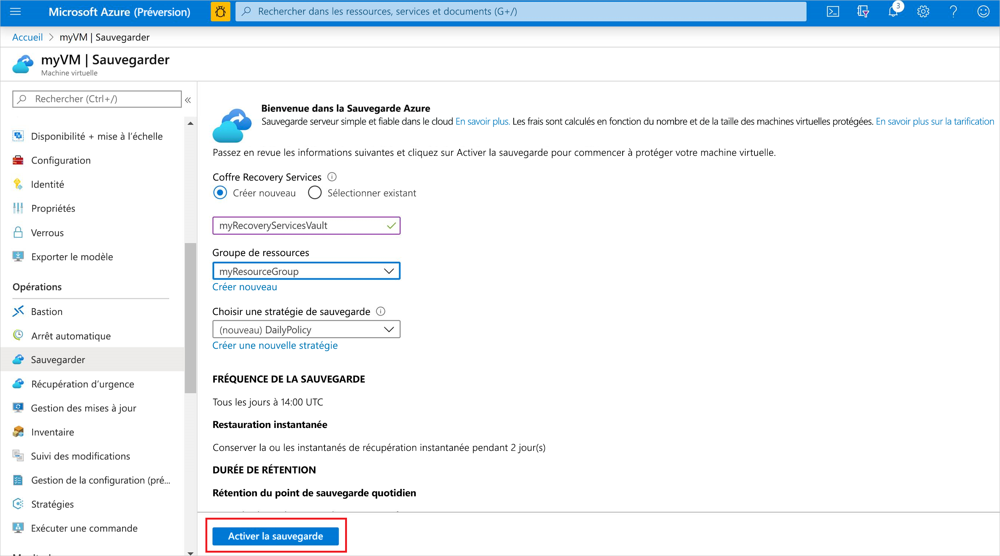
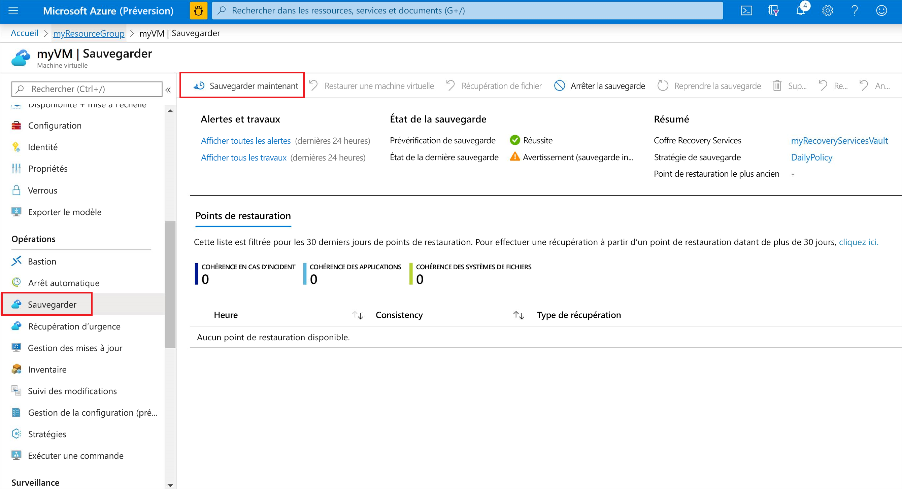
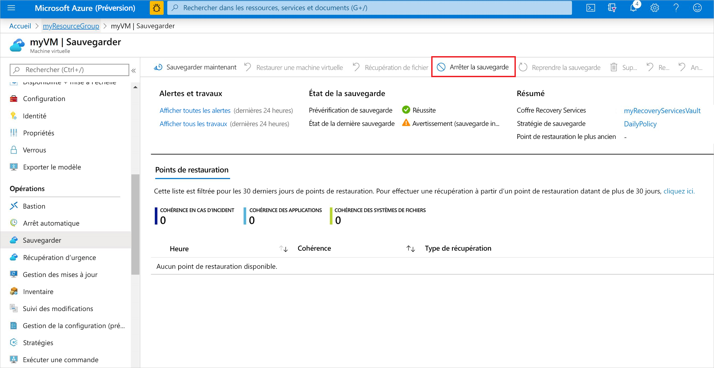

# Sauvegarder une machine virtuelle dans Azure
Les sauvegardes Azure peuvent être créées via le portail Azure. Cette méthode fournit une interface utilisateur basée sur un navigateur permettant de créer et configurer les sauvegardes Azure et toutes les ressources associées. Vous pouvez protéger vos données en effectuant des sauvegardes à intervalles réguliers. La sauvegarde Azure crée des points de récupération pouvant être stockés dans des coffres de récupération géo-redondants. Cet article explique comment sauvegarder une machine virtuelle (VM) avec le portail Azure. 

Ce démarrage rapide permet la sauvegarde sur une machine virtuelle Azure existante. Si vous devez créer une machine virtuelle, vous pouvez [le faire avec le portail Azure](../virtual-machines/windows/quick-create-portal.md).

## Connexion à Azure

Connectez-vous au Portail Azure à l’adresse http://portal.azure.com.

## Sélectionner une machine virtuelle à sauvegarder
Créez une simple sauvegarde quotidienne planifiée dans un coffre Recovery Services. 

1. Dans le menu de gauche, sélectionnez **Machines virtuelles**. 
2. Dans la liste, sélectionnez la machine virtuelle que vous souhaitez sauvegarder. Si vous avez utilisé les exemples de commandes de démarrage rapide de machine virtuelle, la machine virtuelle est nommée *myVM* dans le groupe de ressources *myResourceGroup*.
3. Dans la section **Paramètres**, cliquez sur **Sauvegarder**. Le panneau **Activer la sauvegarde** s’ouvre.

## Activer la sauvegarde sur une machine virtuelle
Un coffre Recovery Services est un conteneur logique qui stocke les données de sauvegarde de chaque ressource protégée, telles que des machines virtuelles Azure. Lorsque le travail de sauvegarde d’une ressource protégée s’exécute, il crée un point de récupération à l’intérieur du coffre Recovery Services. Vous pouvez ensuite utiliser un de ces points de récupération pour restaurer des données à un moment donné dans le temps.

1. Sélectionnez **Créer un nouveau** et indiquez un nom pour le nouveau coffre, par exemple **myRecoveryServicesVault**.
2. Si cela n’est pas encore fait, choisissez **Utiliser existant**, puis sélectionnez le groupe de ressources de votre machine virtuelle dans le menu déroulant.

    

    Par défaut, le coffre est défini pour le stockage géo-redondant. Pour mieux protéger vos données, ce niveau de redondance de stockage garantit que vos données de sauvegarde sont répliquées dans une région Azure secondaire, située à des centaines de kilomètres de la région principale.

    Vous créez et utilisez des stratégies pour définir l’exécution d’un travail de sauvegarde et la durée de stockage des points de récupération. La stratégie de protection par défaut exécute un travail de sauvegarde chaque jour, et conserve les points de récupération pendant 30 jours. Vous pouvez utiliser ces valeurs de stratégie par défaut pour protéger rapidement votre machine virtuelle. 

3. Pour accepter les valeurs de stratégie de sauvegarde par défaut, sélectionnez **Activer la sauvegarde**.

## Démarrer un travail de sauvegarde
Vous pouvez démarrer une sauvegarde sans attendre que la stratégie par défaut exécute le travail à l’heure planifiée. Ce premier travail de sauvegarde crée un point de récupération complet. Chaque travail de sauvegarde après cette sauvegarde initiale crée des points de récupération incrémentielle. Les points de récupération incrémentielle constituent un mode de stockage rapide et efficace, car ils transfèrent uniquement les modifications apportées depuis la dernière sauvegarde.

1. Sur la fenêtre **Sauvegarde** de votre machine virtuelle, sélectionnez **Sauvegarder maintenant**.

    

2. Pour accepter la stratégie de rétention des sauvegardes de 30 jours, laissez la date par défaut de la zone **Conserver sauvegarde jusqu’à ce que**. Pour démarrer le travail, sélectionnez **Sauvegarde**.

## Surveiller le travail de sauvegarde
L’état de la sauvegarde et le nombre de points de restauration terminés sont affichés dans la fenêtre **Sauvegarde** de votre machine virtuelle. Une fois le travail de sauvegarde terminé, des informations sur l’**heure de la dernière sauvegarde**, le **dernier point de restauration** et le **plus ancien point de restauration** s’affichent sur le côté droit de la fenêtre  **Vue d’ensemble**.

## Nettoyer le déploiement
Lorsqu’elle n’est plus nécessaire, vous pouvez désactiver la protection sur la machine virtuelle, supprimer les points de restauration et le coffre Recovery Services, puis supprimer le groupe de ressources et les ressources de machine virtuelle associées.

Si vous vous apprêtez à passer à un didacticiel de sauvegarde expliquant comment restaurer des données pour votre machine virtuelle, ignorez les étapes de cette section et accédez à [Étapes suivantes](#next-steps).

1. Sélectionnez l’option **Sauvegarde** pour votre machine virtuelle.

2. Sélectionnez **... Plus** pour afficher des options supplémentaires, puis choisissez **Arrêter la sauvegarde**.

    

3. Sélectionnez **Supprimer les données de sauvegarde** à partir du menu de la liste déroulante.

4. Dans la boîte de dialogue **Taper le nom de l’élément de sauvegarde**, entrez le nom de votre machine virtuelle, par exemple *myVM*. Sélectionnez **Arrêter la sauvegarde**.

    Une fois la sauvegarde de la machine virtuelle arrêtée et les points de récupération, supprimés, vous pouvez supprimer le groupe de ressources. Si vous avez utilisé une machine virtuelle existante, nous vous conseillons de laisser en place le groupe de ressources et la machine virtuelle.

5. Dans le menu de gauche, sélectionnez **Groupes de ressources**. 
6. Dans la liste, choisissez votre groupe de ressources. Si vous avez utilisé les exemples de commandes de démarrage rapide de machine virtuelle, le groupe de ressources est nommé *myResourceGroup*.
7. Sélectionnez **Supprimer le groupe de ressources**. Pour confirmer, entrez le nom de groupe de ressources, puis sélectionnez **Supprimer**.

    

## Étapes suivantes
Dans ce guide de démarrage rapide, vous avez créé un coffre Recovery Services, activé la protection sur une machine virtuelle et créé le point de récupération initial. Pour en savoir plus sur la sauvegarde Azure et Recovery Services, passez aux didacticiels.

> [!div class="nextstepaction"]
> [Sauvegarder plusieurs machines virtuelles Azure](./tutorial-backup-vm-at-scale.md)

