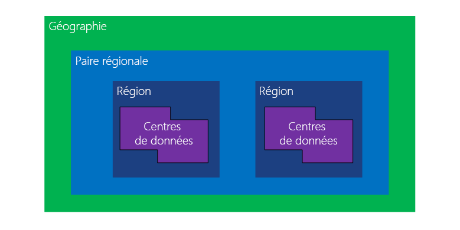
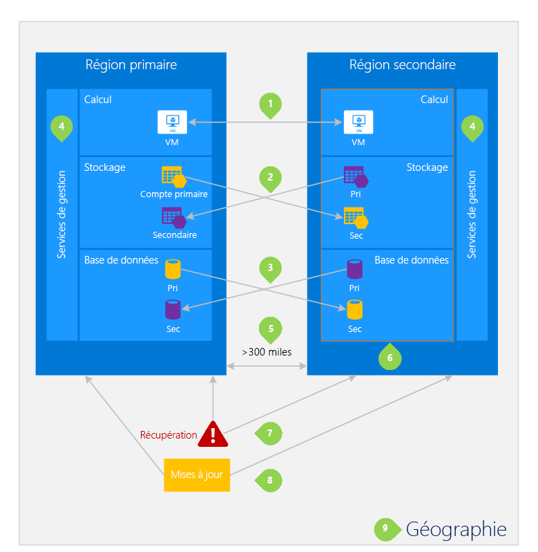

# Continuité des activités et récupération d’urgence (BCDR) : régions jumelées d’Azure

## Régions jumelées : définition

Azure fonctionne dans plusieurs zones géographiques à travers le monde. Une zone géographique Azure est une zone définie du monde contenant au moins une région Azure. Une région Azure est une zone géographique contenant un ou plusieurs centres de données.

Chaque région Azure est associée à une autre région au sein de la même région géographique, constituant ainsi des paires régionales. La seule exception est le sud du Brésil qui est associé à une zone en dehors de sa zone géographique. Pour les paires de régions, Azure sérialise les mises à jour de plateforme (maintenance planifiée) pour que les deux régions soient mises à jour l’une après l’autre, et non en même temps. En outre, en cas de panne affectant plusieurs régions, au moins l’une des régions de chaque paire est prioritaire pour la récupération.

Figure 1 – Paires régionales Azure

| Geography | Régions jumelées |  |
|:--- |:--- |:--- |
| Asie |Est de l'Asie |Asie du Sud-Est |
| Australie |Est de l’Australie |Australie Sud-Est |
| Australie |Centre de l’Australie |Centre de l’Australie 2 |
| Brésil |Sud du Brésil 2 |USA Centre Sud |
| Canada |Centre du Canada |Est du Canada |
| Chine |Chine du Nord |Chine orientale|
| Europe |Europe du Nord |Europe de l'Ouest |
| Allemagne |Centre de l’Allemagne |Nord-Est de l’Allemagne |
| Inde |Inde centrale |Inde du Sud |
| Inde |Inde de l'Ouest (1) |Inde du Sud |
| Japon |Est du Japon |Ouest du Japon |
| Corée du Sud |Centre de la Corée |Corée du Sud |
| Amérique du Nord |Est des États-Unis |États-Unis de l’Ouest |
| Amérique du Nord |Est des États-Unis 2 |Centre des États-Unis |
| Amérique du Nord |Centre-Nord des États-Unis |États-Unis - partie centrale méridionale |
| Amérique du Nord |Ouest des États-Unis 2 |Centre-Ouest des États-Unis 
| Royaume-Uni |Ouest du Royaume-Uni |Sud du Royaume-Uni |
| Ministère de la défense des États-Unis |Est des États-Unis – US DoD |Centre des États-Unis – US DoD |
| Gouvernement américain |Gouvernement des États-Unis – Arizona |Gouvernement des États-Unis – Texas |
| Gouvernement américain |Gouvernement des États-Unis – Iowa (3) |Gouvernement américain - Virginie |
| Gouvernement américain |Gouvernement des États-Unis – Virginie (4) |Gouvernement des États-Unis – Texas |

Tableau 1 - Mise en correspondance des paires régionales Azure

- (1) L’Inde de l’Ouest est différente, car elle est jumelée avec une autre région dans une seule direction. La région secondaire de la région Inde de l’Ouest est Inde du Sud, mais la région secondaire de la région Inde du Sud est Centre de l’Inde.
- (2) La région Sud du Brésil est unique, car elle est jumelée avec une région située en dehors de sa propre zone géographique. La région secondaire de la région Sud du Brésil est Sud-Centre des États-Unis mais la région secondaire de la région Sud-Centre des États-Unis n’est pas Sud du Brésil.
- (3) La région secondaire de la région Gouvernement des États-Unis– Iowa est la région Gouvernement des États-Unis – Virginie, mais la région secondaire de la région Gouvernement des États-Unis – Virginie n’est pas la région Gouvernement des États-Unis – Iowa.
- (4) La région secondaire de la région Gouvernement des États-Unis – Virginie est la région Gouvernement des États-Unis – Texas, mais la région secondaire de la région Gouvernement des États-Unis – Texas n’est pas la région Gouvernement des États-Unis – Virginie.

Nous vous recommandons de configurer la continuité d’activité et reprise d’activité (BCDR) dans les paires régionales pour tirer parti des stratégies d’isolation et de disponibilité Azure. Pour les applications qui prennent en charge plusieurs régions actives, nous vous recommandons d’utiliser les deux régions d’une paire lorsque cela est possible. Cela garantit la disponibilité optimale des applications, ainsi qu’un temps de récupération réduit en cas de sinistre. 

## Exemple de régions jumelées
La Figure 2 ci-dessous montre une application hypothétique qui utilise les régions jumelées pour la récupération d’urgence. Les numéros verts mettent en surbrillance les activités entre les régions de trois services Azure (de stockage, de calcul et de base de données) et comment ils sont configurés pour répliquer les régions. Les avantages uniques du déploiement entre les régions jumelées sont mis en surbrillance par les nombres en orange.

Figure 2 – Paire régionale Azure hypothétique

## Activités entre régions
Conformément à la figure 2.

**Azure Compute (PaaS)** – Vous devez approvisionner des ressources de calcul supplémentaires à l’avance pour garantir la disponibilité des ressources dans d’autres régions au cours d’un incident. Pour plus d’informations, consultez le [Guide technique de la résilience Azure](resiliency/resiliency-technical-guidance.md).

**Azure Storage** - Le stockage géo-redondant (GRS, Geo-Redundant Storage) est configuré par défaut quand vous créez un compte de stockage Azure. Avec GRS, vos données sont répliquées trois fois dans la région principale et trois fois dans la région jumelée. Pour plus d'informations, consultez [Options de redondance du stockage Azure](storage/common/storage-redundancy.md).

**Bases de données SQL** – avec Azure SQL géo-réplication Standard, vous pouvez configurer la réplication asynchrone des transactions vers une région jumelée. Avec la géo-réplication Premium, vous pouvez configurer la réplication pour n’importe quelle région du monde ; toutefois, nous vous recommandons de déployer ces ressources dans une région jumelée pour la récupération d’urgence. Pour plus d’informations, consultez la rubrique concernant la [géoréplication dans la base de données SQL Azure](sql-database/sql-database-geo-replication-overview.md).

**Azure Resource Manager** - Resource Manager offre par nature une isolation logique des composants de gestion de service entre les régions. Cela signifie que des échecs logiques dans une région sont moins susceptibles d’avoir un impact sur une autre.

## Avantages des régions jumelées
Conformément à la figure 2.  

**Isolation physique** – Quand cela est possible, Azure préfère une séparation de 483 kilomètres (300 miles) au moins entre les centres de données d’une paire régionale, même si ce n’est pas pratique, voire impossible dans toutes les régions géographiques. La séparation physique du centre de données réduit la probabilité de catastrophes naturelles, de troubles civils, de coupures de courant ou de pannes de réseau physique affectant les deux régions en même temps. L’isolation est soumise aux contraintes géographiques (étendue, disponibilité de l’infrastructure réseau et de l’alimentation, réglementations, etc.).  

**Réplication fournie par plate-forme** - Certains services de stockage géo-redondant fournissent la réplication automatique à la région jumelée.

**Ordre de récupération de la région** – En cas de panne étendue, la récupération d’une région est hiérarchisée pour chaque paire. Les applications déployées dans des régions jumelées ont la garantie que l’une des régions est récupérée en priorité. Si une application est déployée dans des régions qui ne sont pas jumelées, la récupération peut être retardée. Dans le pire des cas, les régions choisies peuvent être les deux dernières à être récupérées.

**Mises à jour séquentielles** – Les mises à jour planifiées du système Azure sont déployées vers les régions jumelées séquentiellement (pas en même temps) pour limiter les interruptions de service, l’effet des bogues et les échecs logiques dans les rares cas d’échec de mise à jour.

**Résidence de données** – Une région se trouve dans la même zone géographique que la région avec laquelle elle est jumelée (à l’exception du Sud du Brésil) pour répondre aux exigences de la résidence de données en termes d’impôts et d’application de la loi.
