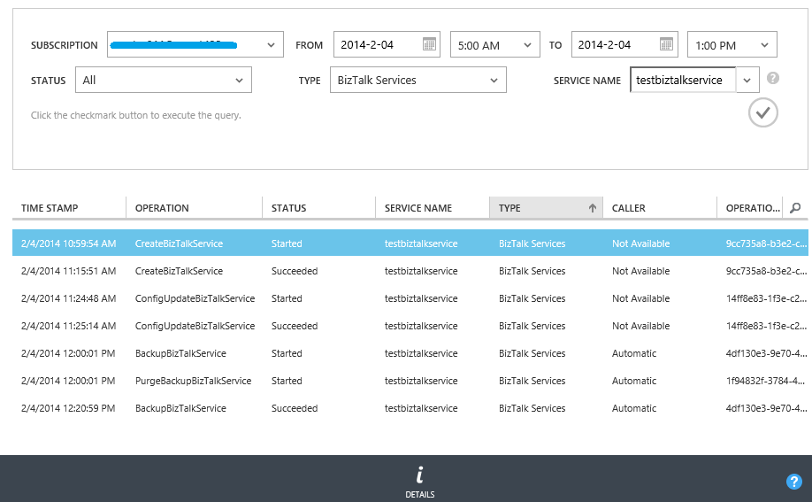

<properties linkid="biztalk-troubleshoot-using-ops-logs" urlDisplayName="BizTalk Services: Troubleshoot using operation logs" pageTitle="BizTalk Services: Troubleshoot using ops logs | Azure" metaKeywords="" description="BizTalk Services: Troubleshoot using ops logs" metaCanonical="" services="" documentationCenter="" title="BizTalk Services: Troubleshoot using ops logs" authors="" solutions="" writer="nitinme" manager="paulettm" editor="cgronlun" />

BizTalk Services : résolution de problèmes à l'aide des journaux des opérations
===============================================================================

Les journaux des opérations, une fonction des services de gestion disponibles dans le portail de gestion, vous permettent d'afficher les journaux des opérations effectuées sur vos services Azure, y compris BizTalk Services. Vous pouvez ainsi afficher les données d'historique des opérations de gestion liées à votre abonnement BizTalk Services jusqu'à 180 jours.

**Remarque**

Cette fonctionnalité capture uniquement les journaux des opérations de gestion relatives à BizTalk Services telles que le moment où le service est démarré, sauvegardé, etc. Ces opérations sont suivies qu'elles soient effectuées via le portail de gestion Azure ou les [API REST BizTalk Services](http://msdn.microsoft.com/fr-fr/library/windowsazure/dn232347.aspx). Pour obtenir la liste complète des opérations suivies à l'aide des services de gestion, consultez la rubrique [Opérations suivies à l'aide des services de gestion Azure](#bizops).

Cette fonctionnalité ne capture pas les journaux des activités liées à l'exécution de BizTalk Services (comme les messages traités par ponts, etc.). Pour afficher ces journaux, vous devez utiliser la vue Suivi du portail BizTalk Services. Pour plus d'informations, consultez la rubrique [Messages de suivi](http://msdn.microsoft.com/library/windowsazure/hh949805.aspx).

Affichage des journaux des opérations BizTalk Services
------------------------------------------------------

1.  Depuis le portail de gestion Azure, cliquez sur Services de gestion, puis sur l'onglet Journaux des opérations.
2.  Vous pouvez filtrer les journaux selon différents paramètres tels que l'abonnement, la plage de dates, le type de service (ex : BizTalk Services), le nom du service ou le statut (de l'opération, ex : réussite, échec).
3.  Cliquez sur la coche pour afficher la liste filtrée. L'illustration suivante montre les activités liées à testbiztalkservice. 
4.  Pour afficher plus d'informations sur une opération spécifique, sélectionnez la ligne correspondante et cliquez sur **Détails** en bas de la page.

Opérations suivies à l'aide des services de gestion Azure
---------------------------------------------------------

Le tableau ci-dessous répertorie les opérations suivies à l'aide des services de gestion Azure.

<table border="1" cellpadding="5">
<tr>
<td>CreateBizTalkService</td> 
<td align="left">Opération de création d'un nouveau service BizTalk</td> 
</tr> 
<tr>
<td>DeleteBizTalkService</td> 
<td align="left">Opération de suppression d'un service BizTalk</td>  
</tr> 
<tr>
<td>RestartBizTalkService</td> 
<td align="left">Opération de redémarrage d'un service BizTalk</td> 
</tr>
<tr>
<td>StartBizTalkService</td> 
<td align="left">Opération de démarrage d'un service BizTalk</td> 
</tr>
<tr>
<td>StopBizTalkService</td> 
<td align="left">Opération d'arrêt d'un service BizTalk</td> 
</tr>
<tr>
<td>DisableBizTalkService</td> 
<td align="left">Opération de désactivation d'un service BizTalk</td> 
</tr>
<tr>
<td>EnableBizTalkService</td> 
<td align="left">Opération d'activation d'un service BizTalk</td> 
</tr>
<tr>
<td>BackupBizTalkService</td> 
<td align="left">Opération de sauvegarde d'un service BizTalk</td> 
</tr>
<tr>
<td>RestoreBizTalkService</td> 
<td align="left">Opération de restauration d'un service BizTalk depuis une sauvegarde spécifiée</td> 
</tr>
<tr>
<td>SuspendBizTalkService</td> 
<td align="left">Opération de suspension d'un service BizTalk</td> 
</tr>
<tr>
<td>ResumeBizTalkService</td> 
<td align="left">Opération de reprise d'un service BizTalk</td> 
</tr>
<tr>
<td>ScaleBizTalkService</td> 
<td align="left">Opération de mise à l'échelle d'un service BizTalk</td> 
</tr>
<tr>
<td>ConfigUpdateBizTalkService</td> 
<td align="left">Opération de mise à jour de la configuration d'un service BizTalk</td> 
</tr>
<tr>
<td>ServiceUpdateBizTalkService</td> 
<td align="left">Opération de mise à niveau d'un service BizTalk vers une version différente</td> 
</tr>
<tr>
<td>PurgeBackupBizTalkService</td> 
<td align="left">Opération de vidage des sauvegardes du service BizTalk en dehors de la période de rétention</td> 
</tr>
</table>

Voir aussi
----------

-   [Sauvegarde d'un service BizTalk](http://go.microsoft.com/fwlink/p/?LinkID=325584)
-   [Restauration d'un service BizTalk depuis une sauvegarde](http://go.microsoft.com/fwlink/p/?LinkID=325582)
-   [BizTalk Services : tableau comparatif des éditions Développeur, De base, Standard, et Premium](http://go.microsoft.com/fwlink/p/?LinkID=302279)
-   [BizTalk Services : approvisionnement à l'aide du portail de gestion Azure](http://go.microsoft.com/fwlink/p/?LinkID=302280)
-   [BizTalk Services : tableau comparatif des états d'approvisionnement](http://go.microsoft.com/fwlink/p/?LinkID=329870)
-   [BizTalk Services : tableau de bord, Surveiller et Mettre à l'échelle dans BizTalk Services](http://go.microsoft.com/fwlink/p/?LinkID=302281)
-   [BizTalk Services : limitation](http://go.microsoft.com/fwlink/p/?LinkID=302282)
-   [BizTalk Services : nom et clé de l'émetteur](http://go.microsoft.com/fwlink/p/?LinkID=303941)
-   [Utilisation du Kit de développement logiciel (SDK) Azure BizTalk Services](http://go.microsoft.com/fwlink/p/?LinkID=302335)

