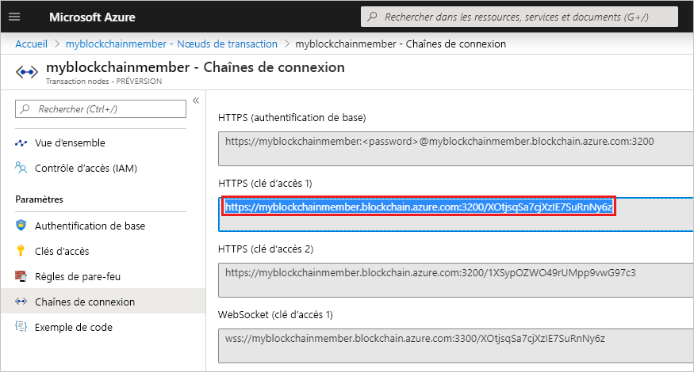

# <a name="quickstart-use-geth-to-connect-to-a-transaction-node"></a>Démarrage rapide : Utiliser Geth pour vous connecter à un nœud de transaction

Geth est un client Go Ethereum que vous pouvez utiliser pour attacher une instance Geth à un nœud de transaction Azure Blockchain Service.

[!INCLUDE [quickstarts-free-trial-note](../../../includes/quickstarts-free-trial-note.md)]

## <a name="prerequisites"></a>Prérequis

* Installer [Geth](https://github.com/ethereum/go-ethereum/wiki/geth)
* Effectuer l’étape [Démarrage rapide : Créer un membre blockchain à l’aide du portail Azure](create-member.md) ou [Démarrage rapide : Créer un membre blockchain Azure Blockchain Service à l’aide de l’interface Azure CLI](create-member-cli.md)

## <a name="get-the-geth-connection-string"></a>Obtenir la chaîne de connexion Geth

La chaîne de connexion Geth se trouve dans le portail Azure.

1. Connectez-vous au [Portail Azure](https://portal.azure.com).
1. Accédez au membre Azure Blockchain Service. Sélectionnez **Nœuds de transaction**, puis le lien du nœud de transaction par défaut.

    

1. Sélectionnez **Chaînes de connexion**.
1. Copiez la chaîne de connexion située sous **HTTPS (Clé d’accès 1)** . Vous aurez besoin de cette commande pour la section suivante.

    

## <a name="connect-to-geth"></a>Se connecter à Geth

1. Ouvrez une invite de commandes ou un interpréteur de commandes.
1. Dans Geth, utilisez la sous-commande attach pour attacher l’instance Geth en cours d’exécution à votre nœud de transaction. Collez la chaîne de connexion en tant qu’argument pour la sous-commande attach. Par exemple,

    ```
    geth attach <connection string>
    ```

1. Une fois connecté à la console Ethereum du nœud de transaction, vous pouvez appeler l’API web3 JavaScript Dapp ou l’API d’administration.

    Par exemple, vous pouvez utiliser l’API suivante pour connaître le chainId.

    ```bash
    admin.nodeInfo.protocols.istanbul.config.chainId
    ```

    Dans cet exemple, le chainId est 297.

    

1. Pour vous déconnecter de la console, tapez `exit`.

## <a name="next-steps"></a>Étapes suivantes

Dans ce guide de démarrage rapide, vous avez utilisé le client Geth pour attacher une instance Geth à un nœud de transaction Azure Blockchain Service. Essayez le tutoriel suivant pour utiliser le kit de développement Azure Blockchain pour Ethereum et Truffle, afin de créer, générer, déployer et exécuter une fonction de contrat intelligent via une transaction.

> [!div class="nextstepaction"]
> [Utiliser Visual Studio Code pour créer, générer et déployer des contrats intelligents](send-transaction.md)