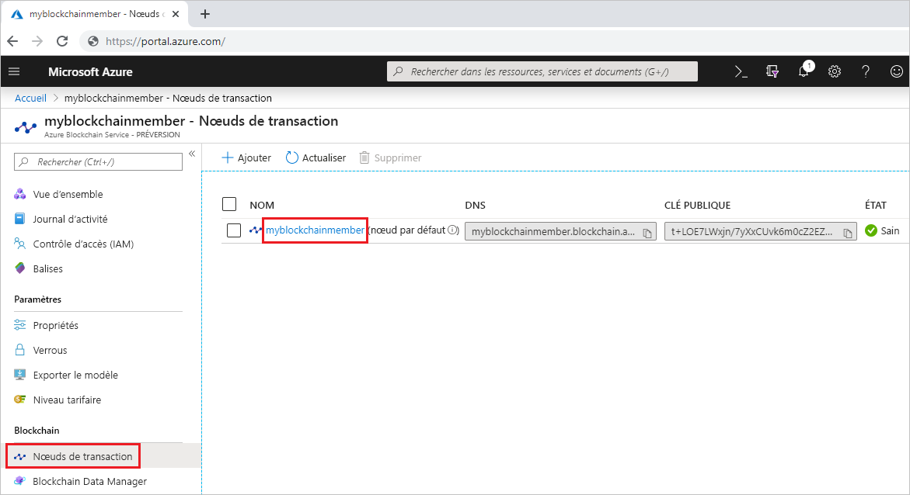

# <a name="quickstart-use-geth-to-connect-to-a-transaction-node"></a>Démarrage rapide : Utiliser Geth pour vous connecter à un nœud de transaction

Geth est un client Go Ethereum que vous pouvez utiliser pour attacher une instance Geth à un nœud de transaction Azure Blockchain Service.

[!INCLUDE [quickstarts-free-trial-note](../../../includes/quickstarts-free-trial-note.md)]

## <a name="prerequisites"></a>Prérequis

* Installer [Geth](https://github.com/ethereum/go-ethereum/wiki/geth)
* [Créer un membre Azure Blockchain](create-member.md)

## <a name="get-the-geth-connection-string"></a>Obtenir la chaîne de connexion Geth

La chaîne de connexion Geth se trouve dans le portail Azure.

1. Connectez-vous au [Portail Azure](https://portal.azure.com).
1. Accédez au membre Azure Blockchain Service. Sélectionnez **Nœuds de transaction**, puis le lien du nœud de transaction par défaut.

    

1. Sélectionnez **Chaînes de connexion**.
1. Copiez la chaîne de connexion située sous **HTTPS (Clé d’accès 1)**. Vous aurez besoin de cette commande pour la section suivante.

    

## <a name="connect-to-geth"></a>Se connecter à Geth

1. Ouvrez une invite de commandes ou un interpréteur de commandes.
1. Dans Geth, utilisez la sous-commande attach pour attacher l’instance Geth en cours d’exécution à votre nœud de transaction. Collez la chaîne de connexion en tant qu’argument pour la sous-commande attach. Par exemple,

    ```
    geth attach <connection string>
    ```

1. Une fois connecté à la console Ethereum du nœud de transaction, vous pouvez appeler l’API web3 JavaScript Dapp ou l’API d’administration.

    Par exemple, vous pouvez utiliser l’API suivante pour connaître le chainId.

    ```bash
    admin.nodeInfo.protocols.istanbul.config.chainId
    ```

    Dans cet exemple, le chainId est 297.

    

1. Pour vous déconnecter de la console, tapez `exit`.

## <a name="next-steps"></a>Étapes suivantes

Dans ce guide de démarrage rapide, vous avez utilisé le client Geth pour attacher une instance Geth à un nœud de transaction Azure Blockchain Service. Testez le tutoriel suivant pour déployer et envoyer une transaction à l’aide de Truffle.

> [!div class="nextstepaction"]
> [Envoyer une transaction](send-transaction.md)