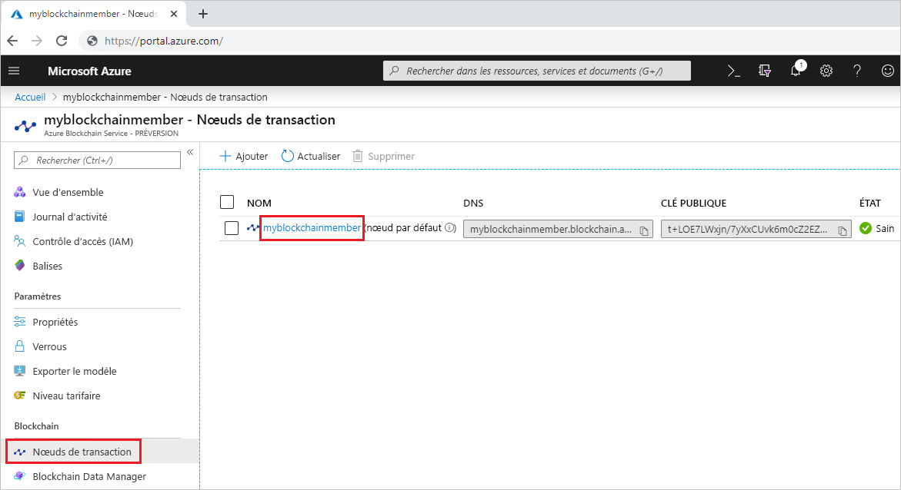
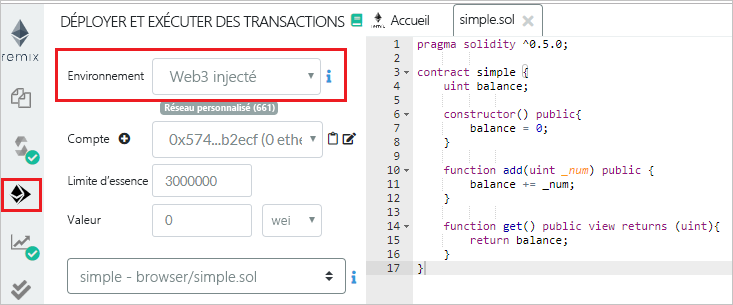
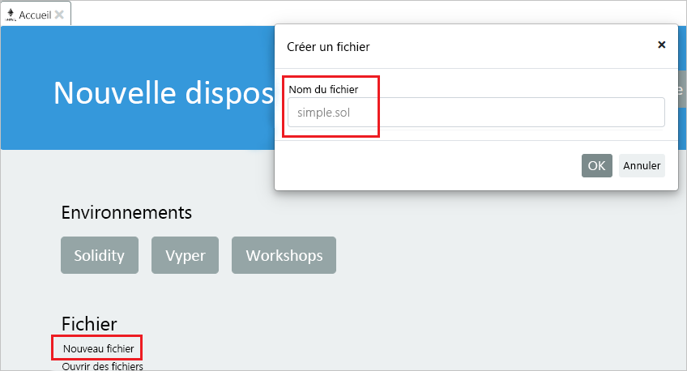
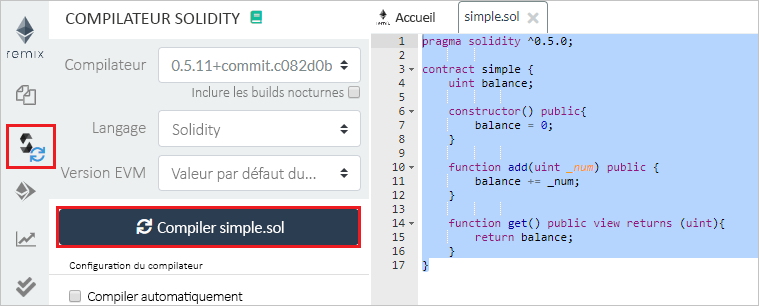

# <a name="quickstart-use-metamask-to-connect-and-deploy-a-smart-contract"></a>Démarrage rapide : Utiliser MetaMask pour vous connecter et déployer un contrat intelligent

Dans ce guide de démarrage rapide, vous allez utiliser MetaMask pour vous connecter à un réseau Azure Blockchain Service, puis utiliser Remix pour déployer un contrat intelligent. Metamask est une extension de navigateur qui permet de gérer un portefeuille Ether et d’effectuer des actions relatives aux contrats intelligents.

[!INCLUDE [quickstarts-free-trial-note](../../../includes/quickstarts-free-trial-note.md)]

## <a name="prerequisites"></a>Prérequis

* [Créer un membre Azure Blockchain](create-member.md)
* Installer l’[extension de navigateur MetaMask](https://metamask.io)
* Générer un [portefeuille](https://metamask.zendesk.com/hc/en-us/articles/360015488971-New-to-MetaMask-Learn-How-to-Setup-MetaMask-the-First-Time) MetaMask

## <a name="get-endpoint-address"></a>Obtenir l’adresse de point de terminaison

Vous avez besoin de l’adresse du point de terminaison Azure Blockchain Service pour vous connecter au réseau Blockchain. L’adresse du point de terminaison et les clés d’accès se trouvent sur le portail Azure.

1. Connectez-vous au [Portail Azure](https://portal.azure.com).
1. Accédez au membre Azure Blockchain Service. Sélectionnez **Nœuds de transaction**, puis le lien du nœud de transaction par défaut.

    

1. Sélectionnez **Chaînes de connexion > Clés d’accès**.
1. Copiez l’adresse du point de terminaison située sous **HTTPS (Clé d’accès 1)**. Vous aurez besoin de cette adresse pour la section suivante.

    

## <a name="connect-metamask"></a>Se connecter à MetaMask

1. Ouvrez l’extension de navigateur MetaMask, puis connectez-vous.
1. Dans la liste déroulante des réseaux, sélectionnez **Custom RPC**.

    

1. Dans **New Network > New RPC URL**, entrez l’adresse de point de terminaison que vous avez copiée dans la section précédente.
1. Sélectionnez **Enregistrer**.

    Si la connexion a réussi, le réseau privé s’affiche dans la liste déroulante des réseaux.

    

## <a name="deploy-smart-contract"></a>Déployer un contrat intelligent

Remix est un environnement de développement Solidity basé sur le navigateur. L’utilisation conjointe de MetaMask et de Remix vous permet de déployer des contrats intelligents et d’effectuer des actions relatives à ces contrats.

1. Dans votre navigateur, accédez à `https://remix.ethereum.org`.
1. Sélectionnez **Exécuter**. 

    MetaMask définit votre **environnement** sur **Injected Web3**, puis définit votre **compte** sur votre réseau.

    

1. Sélectionnez **Create new file**.

    Nommez le nouveau fichier `simple.sol`.

    

    Sélectionnez **OK**.

1. Dans l’éditeur Remix, collez le code du **contrat intelligent Simple** ci-dessous.

    ```solidity
    pragma solidity ^0.5.0;
             
    contract simple {
        uint balance;
                 
        constructor() public{
            balance = 0;
        }
                 
        function add(uint _num) public {
            balance += _num;
        }
                 
        function get() public view returns (uint){
            return balance;
        }
    }
    ```

    Le **contrat Simple** déclare une variable d’état nommée **balance**. Deux fonctions sont définies. La fonction **add** ajoute un nombre à **balance**. La fonction **get** retourne la valeur de **balance**.

1. Pour compiler le contrat, sélectionnez **Compile > Start to compile**. En cas de réussite, le nom du contrat s’affiche dans un rectangle vert.

    

1. Pour exécuter le contrat, sélectionnez l’onglet **Run**. Sélectionnez le contrat **Simple**, puis sélectionnez **Deploy**.

    

1. Une notification MetaMask vous informe que les fonds ne sont pas suffisants pour effectuer la transaction.

    Pour un réseau public Blockchain, vous avez besoin d’Ether pour payer le coût de la transaction. Dans la mesure où il s’agit d’un réseau privé de consortium, vous pouvez définir le prix du gaz sur zéro.

1.  Sélectionnez **Gas Fee > Edit > Advanced**, puis définissez **Gas Price** sur 0.

    

    Sélectionnez **Enregistrer**.

1. Sélectionnez **Confirm** pour déployer le contrat intelligent dans la blockchain.
1. Dans la section **Deployed Contracts**, développez le contrat **Simple**.

    

    Deux actions **add** et **get** correspondent aux fonctions définies dans le contrat.

1. Pour effectuer une transaction **add** dans la blockchain, entrez un nombre à ajouter, puis sélectionnez **add**.
1. Comme lorsque vous avez déployé le contrat, une notification MetaMask vous informe que les fonds ne sont pas suffisants pour effectuer la transaction.

    Dans la mesure où il s’agit d’un réseau privé de consortium, vous pouvez définir le prix du gaz sur zéro.

1.  Sélectionnez **Gas Fee > Edit > Advanced**, définissez **Gas Price** sur 0, puis sélectionnez **Save**.
1. Sélectionnez **Confirm** pour effectuer la transaction dans la blockchain.
1. Sélectionnez l’action **get**. Il s’agit d’un appel pour interroger les données de nœud. Aucune transaction n’est nécessaire.
1. Dans le volet de débogage de Remix, vous pouvez voir des informations détaillées sur les transactions de la blockchain.

    

    Vous pouvez voir la création du contrat **Simple**, la transaction pour **simple.add** et l’appel à **simple.get**.

1. Vous pouvez également voir l’historique des transactions dans MetaMask. Ouvrez l’extension de navigateur MetaMask.
1. Dans la section **History** (Historique), vous pouvez voir le journal des transactions et le contrat déployé.

## <a name="next-steps"></a>Étapes suivantes

Dans ce guide de démarrage rapide, vous avez utilisé l’extension de navigateur MetaMask pour vous connecter à un nœud de transaction Azure Blockchain Service, pour déployer un contrat intelligent et pour envoyer une transaction à la blockchain. Testez le tutoriel suivant pour déployer et envoyer une transaction à l’aide de Truffle.

> [!div class="nextstepaction"]
> [Envoyer une transaction](send-transaction.md)