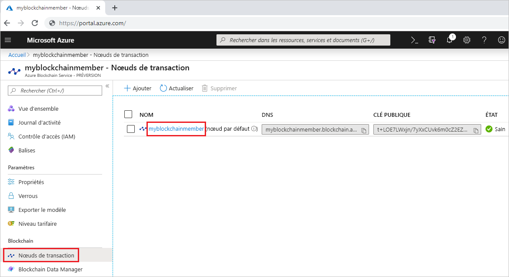
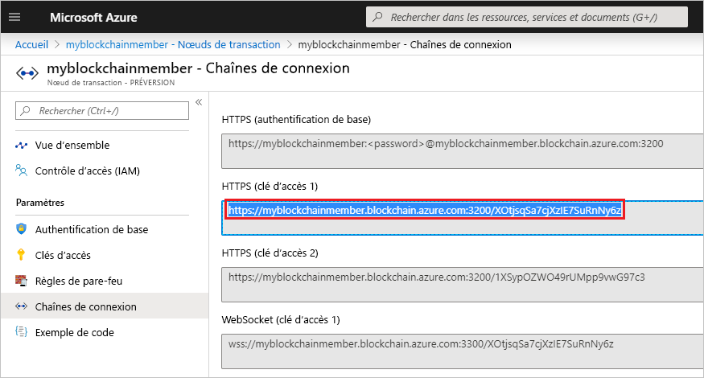

# <a name="quickstart-use-truffle-to-connect-to-azure-blockchain-service"></a>Démarrage rapide : Utiliser Truffle pour vous connecter à Azure Blockchain Service

Dans ce guide de démarrage rapide, vous allez utiliser Truffle pour vous connecter à un nœud de transaction Azure Blockchain Service. Ensuite, vous utiliserez la console interactive Truffle pour appeler des méthodes **web3** afin d’interagir avec votre réseau blockchain.

[!INCLUDE [quickstarts-free-trial-note](../../../includes/quickstarts-free-trial-note.md)]

## <a name="prerequisites"></a>Prérequis

* Effectuer l’étape [Démarrage rapide : Créer un membre blockchain à l’aide du portail Azure](create-member.md) ou [Démarrage rapide : Créer un membre blockchain Azure Blockchain Service à l’aide de l’interface Azure CLI](create-member-cli.md)
* Installez [Truffle](https://github.com/trufflesuite/truffle). Truffle nécessite que plusieurs outils soient installés, notamment [Node.js](https://nodejs.org) et [Git](https://git-scm.com/book/en/v2/Getting-Started-Installing-Git).
* Installez [Python 2.7.15](https://www.python.org/downloads/release/python-2715/). Python est nécessaire pour Web3.

## <a name="create-truffle-project"></a>Créer un projet Truffle

1. Ouvrez un interpréteur de commandes ou une invite de commandes Node.js.
1. Sélectionnez le répertoire dans lequel vous souhaitez créer le projet Truffle.
1. Créez un répertoire pour le projet, puis remplacez le chemin par celui du nouveau répertoire. Par exemple,

    ``` bash
    mkdir truffledemo
    cd truffledemo
    ```

1. Initialisez le projet Truffle.

    ``` bash
    truffle init
    ```

1. Installez l’API Ethereum JavaScript web3 dans le dossier du projet. La version 1.0.0-beta.37 de web3 est nécessaire.

    ``` bash
    npm install web3@1.0.0-beta.37
    ```

    Vous pouvez recevoir des avertissements de npm lors de l’installation.
    
## <a name="configure-truffle-project"></a>Configurer le projet Truffle

Pour configurer le projet Truffle, vous avez besoin d’obtenir certaines informations sur le nœud de transaction à partir du portail Azure.

1. Connectez-vous au [Portail Azure](https://portal.azure.com).
1. Accédez au membre Azure Blockchain Service. Sélectionnez **Nœuds de transaction**, puis le lien du nœud de transaction par défaut.

    

1. Sélectionnez **Chaînes de connexion**.
1. Copiez la chaîne de connexion située sous **HTTPS (Clé d’accès 1)** . Vous aurez besoin de cette chaîne pour la section suivante.

    

### <a name="edit-configuration-file"></a>Modifier le fichier de configuration

Ensuite, vous devez mettre à jour le fichier de configuration Truffle avec le point de terminaison du nœud de transaction.

1. À partir du dossier du projet **truffledemo**, ouvrez le fichier de configuration Truffle `truffle-config.js` dans un éditeur.
1. Remplacez le contenu du fichier par les informations de configuration suivantes. Ajoutez une variable contenant l’adresse du point de terminaison. Remplacez le contenu entre crochets par des valeurs que vous avez collectées dans la section précédente.

    ``` javascript
    var defaultnode = "<default transaction node connection string>";   
    var Web3 = require("web3");
    
    module.exports = {
      networks: {
        defaultnode: {
          provider: new Web3.providers.HttpProvider(defaultnode),
          network_id: "*"
        }
      }
    }
    ```

1. Enregistrez les changements apportés à `truffle-config.js`.

## <a name="connect-to-transaction-node"></a>Se connecter à un nœud de transaction

Utilisez *Web3* pour vous connecter au nœud de transaction.

1. Utilisez la console Truffle pour vous connecter au nœud de transaction par défaut. À partir d’une invite de commandes ou d’un interpréteur de commandes, exécutez la commande suivante :

    ``` bash
    truffle console --network defaultnode
    ```

    Truffle se connecte au nœud de transaction par défaut et fournit une console interactive.

    Vous pouvez appeler des méthodes sur l’objet **web3** pour interagir avec votre réseau blockchain.

1. Appelez la méthode **getBlockNumber** pour retourner le nombre actuel de blocs.

    ```bash
    web3.eth.getBlockNumber();
    ```

    Exemple de sortie :

    ```bash
    truffle(defaultnode)> web3.eth.getBlockNumber();
    18567
    ```
1. Quittez la console Truffle.

    ```bash
    .exit
    ```

## <a name="next-steps"></a>Étapes suivantes

Dans ce guide de démarrage rapide, vous avez utilisé Truffle pour vous connecter à un nœud de transaction Azure Blockchain Service par défaut, et vous avez utilisé la console interactive pour retourner le numéro de bloc blockchain actuel.

Essayez le tutoriel suivant pour utiliser Azure Blockchain Development Kit pour Ethereum afin de créer, générer, déployer et exécuter une fonction de contrat intelligent via une transaction.

> [!div class="nextstepaction"]
> [Créer, générer et déployer des contrats intelligents sur Azure Blockchain Service](send-transaction.md)
