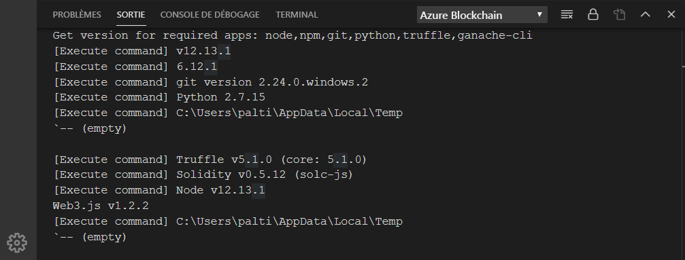

# Démarrage rapide : Utiliser Visual Studio Code pour se connecter à un réseau du consortium Azure Blockchain Service

Dans ce guide de démarrage rapide, vous installez et vous utilisez l’extension Kit de développement Azure Blockchain pour Ethereum de Visual Studio Code pour l’attacher à un consortium sur Azure Blockchain Service. Le kit de développement Azure Blockchain simplifie la création, la connexion, la génération et le déploiement de contrats intelligents sur des registres Ethereum. 

[!INCLUDE [quickstarts-free-trial-note](../../../includes/quickstarts-free-trial-note.md)]

## Prérequis

* Effectuer l’étape [Démarrage rapide : Créer un membre blockchain à l’aide du portail Azure](create-member.md) ou [Démarrage rapide : Créer un membre blockchain Azure Blockchain Service à l’aide de l’interface Azure CLI](create-member-cli.md)
* [Visual Studio Code](https://code.visualstudio.com/Download)
* [Azure Blockchain Development Kit pour l’extension Ethereum](https://marketplace.visualstudio.com/items?itemName=AzBlockchain.azure-blockchain)
* [Node.JS](https://nodejs.org)
* [Git](https://git-scm.com)
* [Python](https://www.python.org/downloads/release/python-2715/) Ajoutez Python.exe à votre chemin. La présence de Python dans votre chemin est exigée pour Azure Blockchain Development Kit.
* [Truffle](https://www.trufflesuite.com/docs/truffle/getting-started/installation)
* [Ganache CLI](https://github.com/trufflesuite/ganache-cli)

### Vérifier l’environnement Azure Blockchain Development Kit

Azure Blockchain Development Kit vérifie que les conditions préalables de votre environnement de développement sont remplies. Pour vérifier votre environnement de développement :

À partir de la palette de commandes VS Code, choisissez **Azure Blockchain : Afficher la page d’accueil**.

Azure Blockchain Development Kit exécute un script de validation qui dure environ une minute. Vous pouvez afficher la sortie en sélectionnant **Terminal > Nouveau terminal**. Dans la barre de menus Terminal, sélectionnez l’onglet **Sortie**, et **Azure Blockchain** dans la liste déroulante. Une validation réussie génère une image semblable à la suivante :

 S’il vous manque un outil exigé, un nouvel onglet nommé **Azure Blockchain Development Kit - Préversion** liste les applications à installer, et les liens pour télécharger les outils.

Installez les composants requis manquants avant de poursuivre le guide de démarrage rapide.

## Se connecter à un membre de consortium

Vous pouvez vous connecter à des membres de consortium au moyen de l’extension VS Code Azure Blockchain Development Kit. Une fois connecté à un consortium, vous pouvez compiler, générer et déployer des contrats intelligents sur un membre de consortium Azure Blockchain Service.

Si vous n’avez pas accès à un membre de consortium Azure Blockchain Service, suivez l’un des deux prérequis suivants [Démarrage rapide : Créer un membre blockchain à l’aide du portail Azure](create-member.md) ou [Démarrage rapide : Créer un membre blockchain Azure Blockchain Service à l’aide de l’interface Azure CLI](create-member-cli.md).

1. Dans le volet de l’Explorateur de Visual Studio Code (VS code), développez l’extension **Azure Blockchain**.
1. Sélectionnez **Se connecter au consortium**.

   

    Si vous êtes invité à utiliser l’authentification Azure, suivez les invites pour vous authentifier avec un navigateur.
1. Choisissez **Se connecter au consortium Azure Blockchain Service** dans la liste déroulante de la palette de commandes.
1. Choisissez l’abonnement et le groupe de ressources qui sont associés à votre membre de consortium Azure Blockchain Service.
1. Choisissez votre consortium dans la liste.

Le consortium et les membres blockchain sont listés dans la barre latérale de l’Explorateur Visual Studio.

## Étapes suivantes

Dans ce guide de démarrage rapide, vous avez utilisé l’extension Kit de développement Azure Blockchain pour Ethereum de Visual Studio Code pour vous attacher à un consortium sur Azure Blockchain Service. Essayez le tutoriel suivant pour utiliser le kit de développement Azure Blockchain pour Ethereum et Truffle afin de créer, générer, déployer et exécuter une fonction de contrat intelligent via une transaction.

> [!div class="nextstepaction"]
> [Utiliser Visual Studio Code pour créer, générer et déployer des contrats intelligents](send-transaction.md)