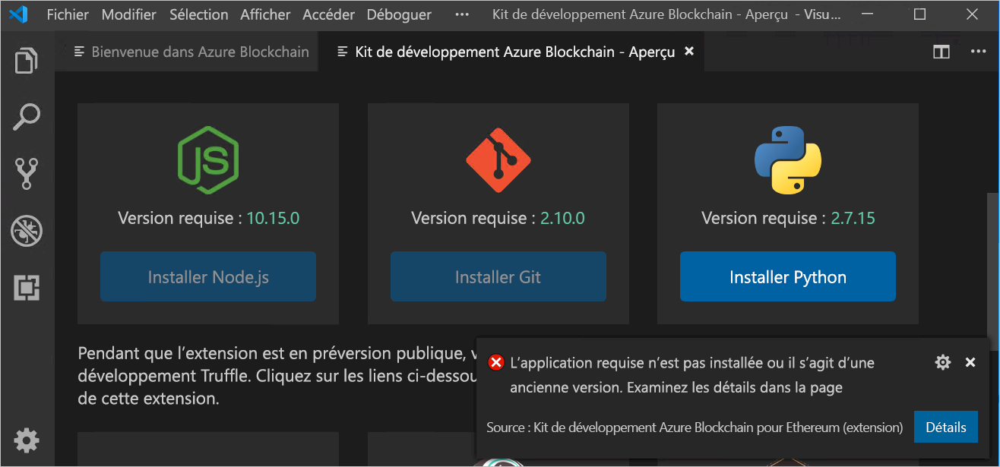

# Démarrage rapide : Utiliser Visual Studio Code pour se connecter à un réseau du consortium Azure Blockchain Service

Dans ce guide de démarrage rapide, vous allez installer et utiliser l’extension Azure Blockchain Development Kit pour Ethereum de Visual Studio Code (VS Code) afin de l’attacher à un consortium sur Azure Blockchain Service. Azure Blockchain Development Kit simplifie la création, la connexion, la génération et le déploiement de contrats intelligents sur des registres blockchain Ethereum.

[!INCLUDE [quickstarts-free-trial-note](../../../includes/quickstarts-free-trial-note.md)]

## Prérequis

* Effectuer l’étape [Démarrage rapide : Créer un membre blockchain à l’aide du portail Azure](create-member.md) ou [Démarrage rapide : Créer un membre blockchain Azure Blockchain Service à l’aide de l’interface Azure CLI](create-member-cli.md)
* [Visual Studio Code](https://code.visualstudio.com/Download)
* [Azure Blockchain Development Kit pour l’extension Ethereum](https://marketplace.visualstudio.com/items?itemName=AzBlockchain.azure-blockchain)
* [Node.js 10.15.x ou ultérieur](https://nodejs.org)
* [Git 2.10.x ou ultérieur](https://git-scm.com)
* [Python 2.7.15](https://www.python.org/downloads/release/python-2715/) Ajoutez python.exe à votre chemin. La présence de Python version 2.7.15 dans votre chemin est obligatoire pour le kit de développement Azure Blockchain.
* [Truffle 5.0.0](https://www.trufflesuite.com/docs/truffle/getting-started/installation)
* [Ganache CLI 6.0.0](https://github.com/trufflesuite/ganache-cli)

Sur Windows, un compilateur C++ doit être installé pour le module node-gyp. Vous pouvez utiliser les outils MSBuild :

* Si Visual Studio 2017 est installé, configurez npm pour utiliser les outils MSBuild avec la commande `npm config set msvs_version 2017 -g`
* Si Visual Studio 2019 est installé, définissez le chemin des outils de build MS pour npm. Par exemple : `npm config set msbuild_path "C:\Program Files (x86)\Microsoft Visual Studio\2019\Community\MSBuild\Current\Bin\MSBuild.exe"`
* Dans le cas contraire, installez les outils de build Visual Studio autonomes à l’aide de `npm install --global windows-build-tools` dans une interface de commande *Exécuter en tant qu’administrateur* avec élévation de privilèges.

Pour plus d’informations sur node-gyp, consultez le [dépôt node-gyp sur GitHub](https://github.com/node-gyp).

### Vérifier l’environnement Azure Blockchain Development Kit

Azure Blockchain Development Kit vérifie que les conditions préalables de votre environnement de développement sont remplies. Pour vérifier votre environnement de développement :

À partir de la palette de commandes VS Code, choisissez **Azure Blockchain : Afficher la page d’accueil**.

Azure Blockchain Development Kit exécute un script de validation qui dure environ une minute. Vous pouvez afficher la sortie en sélectionnant **Terminal > Nouveau terminal**. Dans la barre de menus Terminal, sélectionnez l’onglet **Sortie**, et **Azure Blockchain** dans la liste déroulante. Une validation réussie génère une image semblable à la suivante :

 S’il vous manque un outil obligatoire, un nouvel onglet nommé **Azure Blockchain Development Kit - Préversion** liste les applications obligatoires avec leurs liens de téléchargement.

Installez les composants requis manquants avant de poursuivre le guide de démarrage rapide.

## Se connecter à un membre de consortium

Vous pouvez vous connecter à des membres de consortium au moyen de l’extension VS Code Azure Blockchain Development Kit. Une fois connecté à un consortium, vous pouvez compiler, générer et déployer des contrats intelligents sur un membre de consortium Azure Blockchain Service.

Si vous n’avez pas accès à un membre de consortium Azure Blockchain Service, suivez l’un des deux prérequis suivants [Démarrage rapide : Créer un membre blockchain à l’aide du portail Azure](create-member.md) ou [Démarrage rapide : Créer un membre blockchain Azure Blockchain Service à l’aide de l’interface Azure CLI](create-member-cli.md).

1. Dans le volet de l’Explorateur de VS code, développez l’extension **Azure Blockchain**.
1. Sélectionnez **Se connecter au réseau**.

   

    Si vous êtes invité à utiliser l’authentification Azure, suivez les invites pour vous authentifier avec un navigateur.
1. Choisissez **Azure Blockchain Service** dans la liste déroulante de la palette de commandes.
1. Choisissez l’abonnement et le groupe de ressources qui sont associés à votre membre de consortium Azure Blockchain Service.
1. Choisissez votre consortium dans la liste.

Le consortium et les membres blockchain sont listés dans la barre latérale de l’Explorateur VS Code.

## Étapes suivantes

Dans ce guide de démarrage rapide, vous avez utilisé l’extension Azure Blockchain Development Kit pour Ethereum de VS Code pour vous attacher à un consortium sur Azure Blockchain Service. Essayez le tutoriel suivant pour utiliser Azure Blockchain Development Kit pour Ethereum afin de créer, générer, déployer et exécuter une fonction de contrat intelligent via une transaction.

> [!div class="nextstepaction"]
> [Créer, générer et déployer des contrats intelligents sur Azure Blockchain Service](send-transaction.md)