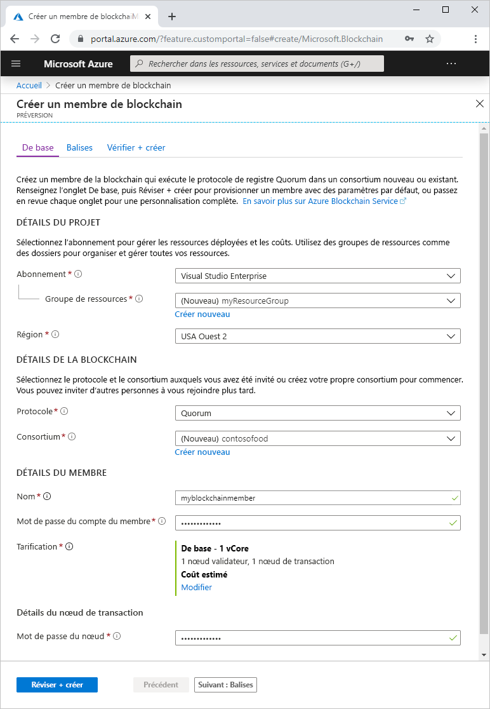
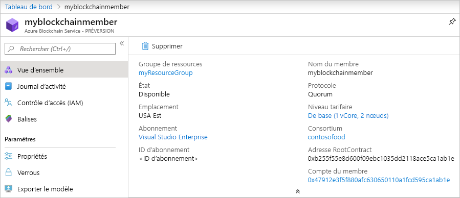

# Démarrage rapide : Créer une instance Azure Blockchain Service à l’aide du portail Azure

Azure Blockchain Service est une plateforme blockchain que vous pouvez utiliser pour exécuter votre logique métier au sein d’un contrat intelligent. Ce guide de démarrage rapide vous montre comment créer un registre managé à l’aide du portail Azure.

[!INCLUDE [quickstarts-free-trial-note](../../../includes/quickstarts-free-trial-note.md)]

## Créer un registre managé

Azure Blockchain Service est créé avec un ensemble défini de ressources de calcul et de stockage.

1. Connectez-vous au [Portail Azure](https://portal.azure.com).
1. Sélectionnez **Créer une ressource** dans le coin supérieur gauche du portail Azure.
1. Sélectionnez **Blockchain** > **Azure Blockchain Service**.
1. Créez le modèle.

    

    Paramètre | Description
    --------|------------
    Membre blockchain | Choisissez un nom unique qui identifie le membre Azure Blockchain Service. Le nom du membre blockchain doit être uniquement composé de lettres minuscules et de chiffres. Le premier caractère doit être une lettre. Le nom doit comprendre entre 2 et 20 caractères.
    Abonnement | Sélectionnez l’abonnement Azure que vous souhaitez utiliser pour votre serveur. Si vous avez plusieurs abonnements, sélectionnez l’abonnement dans lequel la ressource est facturée.
    Groupe de ressources | Un nouveau nom de groupe de ressources ou un nom de groupe existant dans votre abonnement.
    Région | L’emplacement doit être le même pour tous les membres du consortium.
    Mot de passe du compte du membre | Le mot de passe du compte du membre sert à chiffrer la clé privée du compte Ethereum créé pour votre membre. Vous utilisez le compte du membre et le mot de passe du compte du membre pour la gestion du consortium.
    Nom du consortium | Pour un nouveau consortium, entrez un nom unique. Si vous rejoignez un consortium par le biais d’une invitation, la valeur correspond au consortium que vous rejoignez.
    Description | Description du consortium.
    Protocole |  La préversion prend en charge le protocole Quorum.
    Tarifs | Configuration des nœuds de votre nouveau service. Sélectionnez **Standard**. Les paramètres par défaut comprennent 2 nœuds validateurs et 1 nœud de transaction.
    Mot de passe du nœud de transaction | Le mot de passe du nœud de transaction par défaut du membre. Utilisez le mot de passe pour l’authentification de base lorsque vous vous connectez au point de terminaison public du nœud de transaction par défaut du membre blockchain.

1. Sélectionnez **Créer** pour provisionner le service. Le provisionnement prend environ 10 minutes.
1. Pour superviser le processus de déploiement, sélectionnez **Notifications** dans la barre d’outils.
1. Après le déploiement, accédez à votre membre blockchain.

En sélectionnant **Vue d’ensemble**, vous pouvez voir des informations de base concernant votre service, notamment l’adresse RootContract et le compte du membre.

## Supprimer des ressources

Vous pouvez utiliser le membre que vous avez créé pour le guide de démarrage rapide ou tutoriel suivant. Lorsque vous n’en avez plus besoin, vous pouvez supprimer les ressources en supprimant le groupe de ressources `myResourceGroup` créé par Azure Blockchain Service.

Pour supprimer le groupe de ressources :

1. Dans le portail Azure, accédez à **Groupe de ressources** dans le volet de navigation de gauche et sélectionnez le groupe de ressources que vous souhaitez supprimer.
2. Sélectionnez **Supprimer le groupe de ressources**. Validez la suppression en entrant le nom du groupe de ressources, puis sélectionnez **Supprimer**.

## Étapes suivantes

> [!div class="nextstepaction"]
> [Utiliser MetaMask pour vous connecter et déployer un contrat intelligent](connect-metamask.md)