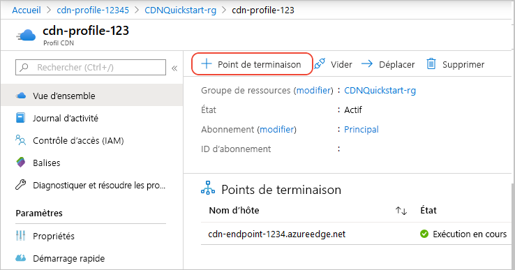
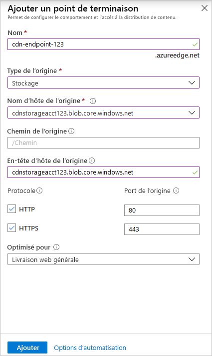

# Démarrage rapide : Créer un point de terminaison et un profil de réseau de distribution de contenu Azure
Dans ce démarrage rapide, vous allez activer le CDN Azure en créant un profil et un point de terminaison CDN. Après avoir créé un profil et un point de terminaison, vous pouvez commencer à distribuer du contenu à vos clients.

[!INCLUDE [quickstarts-free-trial-note](../../includes/quickstarts-free-trial-note.md)]

## Prérequis

Pour ce démarrage rapide, vous devez avoir créé un compte de stockage nommé *mystorageacct123*, que vous utilisez pour le nom d’hôte de l’origine. Pour plus d’informations, consultez [Intégrer un compte de stockage Azure à Azure CDN](cdn-create-a-storage-account-with-cdn.md).

## Se connecter au portail Azure.
Connectez-vous au [portail Azure](https://portal.azure.com) avec votre compte Azure.

[!INCLUDE [cdn-create-profile](../../includes/cdn-create-profile.md)]

## Créer un point de terminaison CDN

Une fois que vous avez créé un profil CDN, vous pouvez l’utiliser pour créer un point de terminaison.

1. Dans le portail Azure, sélectionnez le profil CDN que vous avez créé dans votre tableau de bord. Si vous ne le trouvez pas, sélectionnez **All services** (Tous les services), puis sélectionnez **Profils CDN**. Sur la page **Profils CDN**, sélectionnez le profil que vous souhaitez utiliser. 
   
    La page du profil CDN s’affiche.

2. Sélectionnez **Point de terminaison**.
   
    
   
    La page **Ajouter un point de terminaison** s’affiche.

    Utilisez les paramètres spécifiés dans le tableau à la suite de l’image.
   
    

    | Paramètre | Valeur |
    | ------- | ----- |
    | **Name** | Entrez *my-endpoint-123* comme nom d’hôte de point de terminaison. Ce nom doit être globalement unique. S’il est déjà utilisé, vous pouvez en entrer un autre. Ce nom sert à accéder à vos ressources en cache au niveau du domaine _&lt;endpoint name&gt;_.azureedge.net.|
    | **Type d’origine** | Sélectionnez **Stockage**. | 
    | **Nom d’hôte de l’origine** | Entrez *mystorageacct123.blob.core.windows.net* pour votre nom d’hôte. Ce nom doit être globalement unique. S’il est déjà utilisé, vous pouvez en entrer un autre. |
    | **Chemin de l’origine** | Laisser vide. |
    | **En-tête de l’hôte d’origine** | Laissez la valeur générée par défaut. |  
    | **Protocole** | Laissez les options **HTTP** et **HTTPS** par défaut sélectionnées. |
    | **Port de l’origine** | Laissez les valeurs de port par défaut. | 
    | **Optimisé pour** | Laissez la sélection **Livraison web générale** par défaut. |
    
3. Sélectionnez **Ajouter** pour créer un point de terminaison.
   
   Une fois le point de terminaison créé, il s'affiche dans la liste des points de terminaison pour le profil.
    
   
    
   Le point de terminaison n’est pas disponible immédiatement, car la propagation de l’enregistrement peut prendre du temps : 
   - Pour les profils du **CDN Azure Standard fourni par Microsoft**, la propagation s’effectue généralement dans un délai de 10 minutes. 
   - Pour les profils du **CDN Azure Standard fourni par Akamai**, la propagation s’effectue généralement dans un délai d’une minute. 
   - Dans le cas des profils du **CDN Azure Standard fourni par Verizon** et du **CDN Azure Premium fourni par Verizon**, la propagation s’effectue généralement dans un délai de 90 minutes. 

## Supprimer des ressources
Au cours des étapes précédentes, vous avez créé un profil et un point de terminaison CDN au sein d’un groupe de ressources. Enregistrez ces ressources si vous souhaitez passer à la section [Étapes suivantes](#next-steps) et apprendre à ajouter un domaine personnalisé à votre point de terminaison. Toutefois, si vous ne pensez pas utiliser ces ressources à l’avenir, vous pouvez les supprimer en supprimant le groupe de ressources. Vous éviterez ainsi de payer des frais supplémentaires :

1. Dans le menu de gauche du portail Azure, cliquez sur **Groupes de ressources**, puis sur **my-resource-group-123**.

2. Sur la page **Groupe de ressources**, sélectionnez **Supprimer le groupe de ressources**, saisissez *my-resource-group-123* dans la zone de texte, puis sélectionnez **Supprimer**.

    Cette action supprimera le groupe de ressources, le profil et le point de terminaison que vous avez créés dans ce démarrage rapide.

## Étapes suivantes
Pour en savoir plus sur l’ajout d’un domaine personnalisé à votre point de terminaison CDN, consultez le didacticiel suivant :

> [!div class="nextstepaction"]
> [Tutoriel : Ajouter un domaine personnalisé à un point de terminaison Azure CDN](cdn-map-content-to-custom-domain.md)

