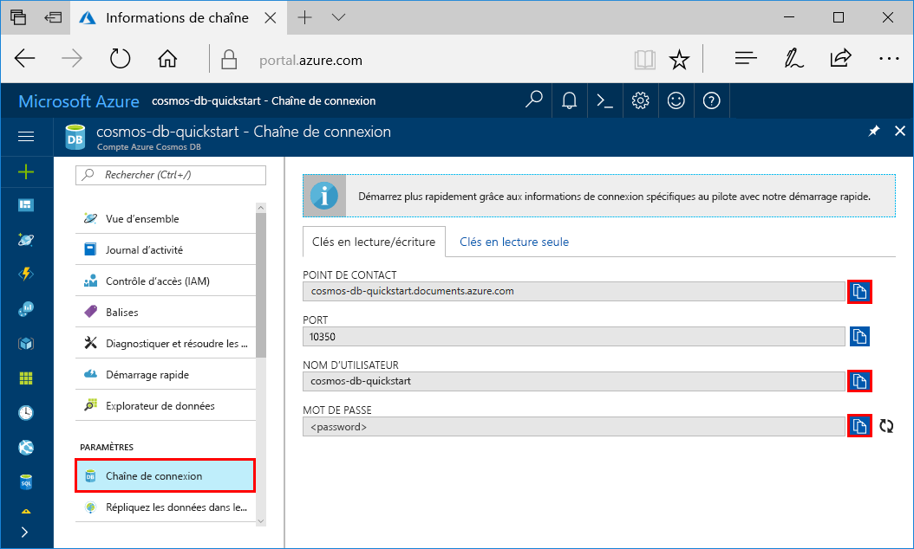
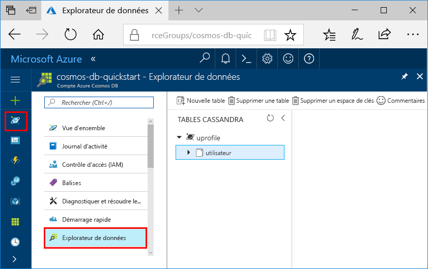

# <a name="quickstart-build-a-cassandra-app-with-net-and-azure-cosmos-db"></a>Démarrage rapide : Créer une application Cassandra avec .NET et Azure Cosmos DB

> [!div class="op_single_selector"]
> * [.NET](create-cassandra-dotnet.md)
> * [Java](create-cassandra-java.md)
> * [Node.JS](create-cassandra-nodejs.md)
> * [Python](create-cassandra-python.md)
>  

Ce guide de démarrage rapide montre comment utiliser .NET et [l’API Cassandra](cassandra-introduction.md) Azure Cosmos DB pour créer une application de profil en clonant un exemple de GitHub. Ce guide de démarrage rapide vous montre également comment utiliser le portail Azure web pour créer un compte Azure Cosmos DB.

Azure Cosmos DB est le service de base de données multi-modèle de Microsoft distribué à l’échelle mondiale. Vous pouvez rapidement créer et interroger des bases de données de documents, de tables, de paires clé/valeur et de graphes, lesquelles bénéficient toutes des fonctionnalités de distribution mondiale et de mise à l’échelle horizontale d’Azure Cosmos DB. 

## <a name="prerequisites"></a>Prérequis

[!INCLUDE [quickstarts-free-trial-note](../../includes/quickstarts-free-trial-note.md)] Vous pouvez également [essayer Azure Cosmos DB gratuitement](https://azure.microsoft.com/try/cosmosdb/) sans abonnement Azure, ni frais ni engagement.

Par ailleurs, vous devez avoir : 
* Si vous n’avez pas encore installé Visual Studio 2017, vous pouvez télécharger et utiliser la version **gratuite** [Visual Studio 2017 Community Edition](https://www.visualstudio.com/downloads/). Veillez à activer **le développement Azure** lors de l’installation de Visual Studio.
* Installez [Git](https://www.git-scm.com/) pour cloner l’exemple.

<a id="create-account"></a>
## <a name="create-a-database-account"></a>Création d’un compte de base de données

[!INCLUDE [cosmos-db-create-dbaccount-cassandra](../../includes/cosmos-db-create-dbaccount-cassandra.md)]


## <a name="clone-the-sample-application"></a>Clonage de l’exemple d’application

À présent, travaillons sur le code. Nous allons cloner une application API Cassandra à partir de GitHub, configurer la chaîne de connexion et l’exécuter. Vous verrez combien il est facile de travailler par programmation avec des données. 

1. Ouvrez une invite de commandes. Créez un dossier nommé `git-samples`. Ensuite, fermez l’invite de commandes.

    ```bash
    md "C:\git-samples"
    ```

2. Ouvrez une fenêtre de terminal git comme Git Bash et utilisez la commande `cd` pour accéder au nouveau dossier d’installation pour l’exemple d’application.

    ```bash
    cd "C:\git-samples"
    ```

3. Exécutez la commande suivante pour cloner l’exemple de référentiel : Cette commande crée une copie de l’exemple d’application sur votre ordinateur.

    ```bash
    git clone https://github.com/Azure-Samples/azure-cosmos-db-cassandra-dotnet-getting-started.git
    ```

4. Ouvrez ensuite le fichier solution CassandraQuickStartSample dans Visual Studio. 

## <a name="review-the-code"></a>Vérifier le code

Cette étape est facultative. Si vous voulez savoir comment le code crée les ressources de base de données, vous pouvez consulter les extraits de code suivants. Les extraits de code sont tous tirés du fichier `Program.cs` installé dans le dossier `C:\git-samples\azure-cosmos-db-cassandra-dotnet-getting-started\CassandraQuickStartSample`. Sinon, vous pouvez passer à l’étape [Mise à jour de votre chaîne de connexion](#update-your-connection-string).

* Initialisez la session en vous connectant à un point de terminaison de cluster Cassandra. L’API Cassandra sur la base de données Azure Cosmos prend en charge uniquement TLS 1.2. 

  ```csharp
   var options = new Cassandra.SSLOptions(SslProtocols.Tls12, true, ValidateServerCertificate);
   options.SetHostNameResolver((ipAddress) => CassandraContactPoint);
   Cluster cluster = Cluster.Builder().WithCredentials(UserName, Password).WithPort(CassandraPort).AddContactPoint(CassandraContactPoint).WithSSL(options).Build();
   ISession session = cluster.Connect();
   ```

* Créez un espace de clé.

    ```csharp
    session.Execute("CREATE KEYSPACE uprofile WITH REPLICATION = { 'class' : 'NetworkTopologyStrategy', 'datacenter1' : 1 };"); 
    ```

* Créez une table.

   ```csharp
  session.Execute("CREATE TABLE IF NOT EXISTS uprofile.user (user_id int PRIMARY KEY, user_name text, user_bcity text)");
   ```

* Insérez des entités utilisateur à l’aide de l’objet IMapper avec une nouvelle session qui se connecte à l’espace de clés uprofile.

    ```csharp
    mapper.Insert<User>(new User(1, "LyubovK", "Dubai"));
    ```
    
* Faites une requête pour obtenir les informations de tous les utilisateurs.

    ```csharp
   foreach (User user in mapper.Fetch<User>("Select * from user"))
   {
      Console.WriteLine(user);
   }
    ```
    
* Faites une requête pour obtenir les informations d’un seul utilisateur.

    ```csharp
    mapper.FirstOrDefault<User>("Select * from user where user_id = ?", 3);
    ```

## <a name="update-your-connection-string"></a>Mise à jour de votre chaîne de connexion

Maintenant, retournez dans le portail Azure afin d’obtenir les informations de votre chaîne de connexion et de les copier dans l’application. Les informations de la chaîne de connexion permettent à votre application de communiquer avec votre base de données hébergée.

1. Dans le [portail Azure](https://portal.azure.com/), sélectionnez **Chaîne de connexion**.

    Utilisez le  à droite de l’écran pour copier la valeur NOM D'UTILISATEUR.

    

2. Dans Visual Studio 2017, ouvrez le fichier Program.cs. 

3. Collez la valeur NOM D’UTILISATEUR à partir du portail sur `<FILLME>` à la ligne 13.

    La ligne 13 du fichier Program.cs doit maintenant ressembler à la ligne suivante : 

    `private const string UserName = "cosmos-db-quickstart";`

3. Revenez au portail et copiez la valeur MOT DE PASSE. Collez la valeur MOT DE PASSE à partir du portail sur `<FILLME>` à la ligne 14.

    La ligne 14 du fichier Program.cs doit maintenant ressembler à la ligne suivante : 

    `private const string Password = "2Ggkr662ifxz2Mg...==";`

4. Revenez au portail et copiez la valeur POINT DE CONTACT. Collez la valeur POINT DE CONTACT à partir du portail sur `<FILLME>` à la ligne 15.

    La ligne 15 du fichier Program.cs doit maintenant ressembler à la ligne suivante : 

    `private const string CassandraContactPoint = "cosmos-db-quickstarts.cassandra.cosmosdb.azure.com"; //  DnsName`

5. Enregistrez le fichier Program.cs.
    
## <a name="run-the-net-app"></a>Exécuter l’application .Net

1. Dans Visual Studio, sélectionnez **Outils** > **Gestionnaire de package NuGet** > **Console du gestionnaire de package**.

2. À l’invite de commandes, utilisez la commande suivante pour installer le package NuGet du pilote .NET. 

    ```cmd
    Install-Package CassandraCSharpDriver
    ```
3. Appuyez sur Ctrl + F5 pour exécuter l’application. Votre application s’affiche dans la fenêtre de votre console. 

    

    Appuyez sur CTRL + C pour arrêter l’exécution du programme et fermer la fenêtre de console. 
    
4. Dans le portail Azure, ouvrez **l’Explorateur de données** pour interroger, modifier et utiliser ces nouvelles données.

    

## <a name="review-slas-in-the-azure-portal"></a>Vérification des contrats SLA dans le portail Azure

[!INCLUDE [cosmosdb-tutorial-review-slas](../../includes/cosmos-db-tutorial-review-slas.md)]

## <a name="clean-up-resources"></a>Supprimer des ressources

[!INCLUDE [cosmosdb-delete-resource-group](../../includes/cosmos-db-delete-resource-group.md)]

## <a name="next-steps"></a>Étapes suivantes

Dans ce démarrage rapide, vous avez appris à créer un compte Azure Cosmos DB, à créer un conteneur à l’aide de l’Explorateur de données, et à exécuter une application web. Vous pouvez maintenant importer des données supplémentaires à votre compte Cosmos DB. 

> [!div class="nextstepaction"]
> [Importer des données Cassandra dans Azure Cosmos DB](cassandra-import-data.md)
