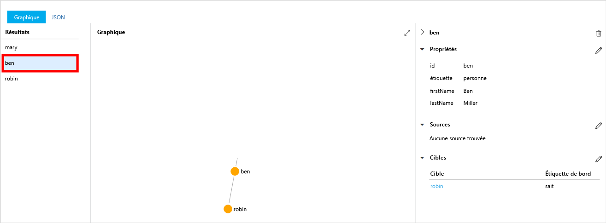
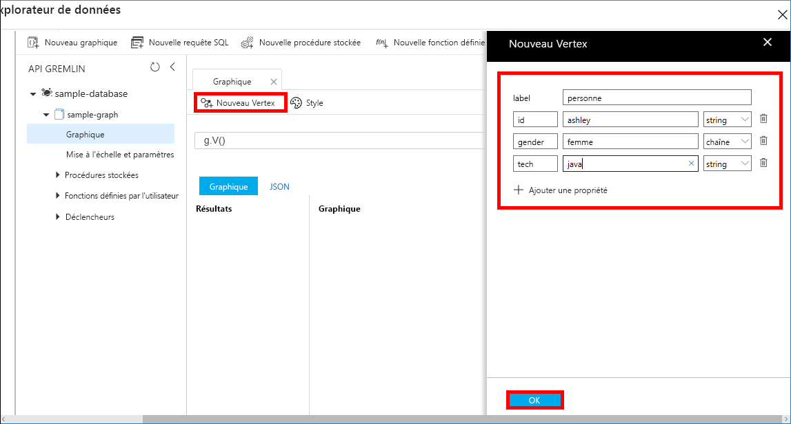
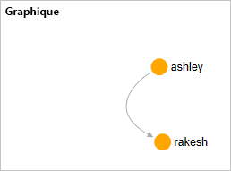

# <a name="azure-cosmos-db-create-a-graph-database-using-java-and-the-azure-portal"></a>Azure Cosmos DB : créer une base de données de graphiques à l’aide de Java et du portail Azure

Azure Cosmos DB est le service de base de données multi-modèle de Microsoft distribué à l’échelle mondiale. Rapidement, vous avez la possibilité de créer et d’interroger des documents, des paires clé/valeur, et des bases de données orientées graphe, profitant tous de la distribution à l’échelle mondiale et des capacités de mise à l’échelle horizontale au cœur d’Azure Cosmos DB. 

Ce guide de démarrage rapide crée une base de données de graphiques à l’aide des outils du portail Azure pour Azure Cosmos DB. Ce guide vous indique également comment créer rapidement une application console Java au moyen d’une base de données de graphiques en utilisant le pilote [Gremlin Java](https://mvnrepository.com/artifact/org.apache.tinkerpop/gremlin-driver) OSS. Les instructions de ce guide de démarrage rapide s’appliquent à tous les systèmes d’exploitation pouvant exécuter Java. Avec ce guide de démarrage rapide, vous saurez comment créer et modifier des ressources de graphique dans l’interface utilisateur ou par programme, selon la méthode que vous préférez. 

## <a name="prerequisites"></a>Composants requis

* [Java Development Kit (JDK) 1.7+](http://www.oracle.com/technetwork/java/javase/downloads/jdk8-downloads-2133151.html)
    * Sur Ubuntu, exécutez `apt-get install default-jdk` pour installer le JDK.
    * Veillez à définir la variable d’environnement JAVA_HOME pour qu’elle pointe vers le dossier dans lequel le JDK est installé.
* [Téléchargement](http://maven.apache.org/download.cgi) et [installation](http://maven.apache.org/install.html) d’une archive binaire [Maven](http://maven.apache.org/)
    * Sur Ubuntu, vous pouvez exécuter `apt-get install maven` pour installer Maven.
* [Git](https://www.git-scm.com/)
    * Sur Ubuntu, vous pouvez exécuter `sudo apt-get install git` pour installer Git.

[!INCLUDE [quickstarts-free-trial-note](../../includes/quickstarts-free-trial-note.md)]

## <a name="create-a-database-account"></a>Création d'un compte de base de données

Pour être en mesure de créer une base de données de graphiques, vous devez avoir préalablement créé un compte de base de données (Graphique) Gremlin avec Azure Cosmos DB.

[!INCLUDE [cosmos-db-create-dbaccount-graph](../../includes/cosmos-db-create-dbaccount-graph.md)]

## <a name="add-a-graph"></a>Ajout d’un graphique

Vous pouvez désormais utiliser l’outil Explorateur de données dans le portail Azure pour créer une base de données de graphiques. 

1. Dans le menu de navigation de gauche du portail Azure, cliquez sur **Explorateur de données** (version d’évaluation). 
2. Dans le panneau **Explorateur de données (version d’évaluation)**, cliquez sur **Nouveau graphique**, puis renseignez la page à l’aide des informations suivantes :

    

    Paramètre|Valeur suggérée|Description
    ---|---|---
    ID de base de données|sample-database|L’ID de votre nouvelle base de données. Les noms de base de données doivent inclure entre 1 et 255 caractères et ne peuvent pas contenir `/ \ # ?` ni d’espace de fin.
    ID du graphique|sample-graph|L’ID de votre nouveau graphique. Les noms de graphiques sont soumis aux mêmes exigences de nombre de caractères que les ID de bases de données.
    Capacité de stockage| 10 Go|Conservez la valeur par défaut. Il s’agit de la capacité de stockage de la base de données.
    Débit|400 unités de requête|Conservez la valeur par défaut. Vous pourrez augmenter le débit ultérieurement si vous souhaitez réduire la latence.
    Clé de partition|Laisser vide|Pour les besoins de ce guide de démarrage rapide, ne renseignez pas la clé de partition.

3. Une fois le formulaire rempli, cliquez sur **OK**.

## <a name="clone-the-sample-application"></a>Clonage de l’exemple d’application

À présent, nous allons cloner une application graphique à partir de github, définir la chaîne de connexion, puis l’exécuter. Vous pouvez constater à quel point il est facile de travailler par programmation avec des données. 

1. Ouvrez une fenêtre de terminal git, comme git bash, et accédez à un répertoire de travail à l’aide de la commande `cd`.  

2. Exécutez la commande suivante pour cloner l’exemple de référentiel : 

    ```bash
    git clone https://github.com/Azure-Samples/azure-cosmos-db-graph-java-getting-started.git
    ```

## <a name="review-the-code"></a>Examiner le code

Passons rapidement en revue ce qui se passe dans l’application. Ouvrez le fichier `Program.java` à partir du dossier \src\GetStarted, puis recherchez les lignes de code ci-après. 

* Le Gremlin `Client` est initialisé à partir de la configuration dans `src/remote.yaml`.

    ```java
    cluster = Cluster.build(new File("src/remote.yaml")).create();
    ...
    client = cluster.connect();
    ```

* Une série d’étapes Gremlin sont exécutées à l’aide de la méthode `client.submit`.

    ```java
    ResultSet results = client.submit(gremlin);

    CompletableFuture<List<Result>> completableFutureResults = results.all();
    List<Result> resultList = completableFutureResults.get();

    for (Result result : resultList) {
        System.out.println(result.toString());
    }
    ```

## <a name="update-your-connection-string"></a>Mise à jour de votre chaîne de connexion

1. Ouvrez le fichier src/remote.yaml. 

3. Indiquez vos valeurs *hôtes*, *nom d’utilisateur* et *mot de passe* dans le fichier src/remote.yaml. Vous n’avez pas à modifier les autres paramètres.

    Paramètre|Valeur suggérée|Description
    ---|---|---
    Hôtes|[***.graphs.azure.com]|Consultez la capture d’écran qui suit ce tableau. Cette valeur correspond à la valeur d’URI Gremlin indiquée sur la page Vue d’ensemble du portail Azure, entre crochets, sans les caractères finaux :443/.<br><br>Cette valeur peut également être récupérée à partir de l’onglet Clés, à l’aide de la valeur URI, en supprimant https://, en changeant les documents en graphiques et en supprimant la fin : 443/.
    Nom d’utilisateur|/dbs/sample-database/colls/sample-graph|Ressource sous la forme `/dbs/<db>/colls/<coll>`, où `<db>` est le nom de votre base de données existante et `<coll>` le nom de votre collection existante.
    Mot de passe|*Votre clé principale primaire*|Consultez la seconde capture d’écran qui suit ce tableau. Cette valeur correspond à votre clé primaire, que vous pouvez récupérer à partir de la page Clés du portail Azure, dans la zone Clé primaire. Copiez la valeur à l’aide du bouton de copie figurant sur le côté droit de la zone.

    Pour renseigner le paramètre Hôtes, copiez la valeur **URI Gremlin** de la page **Vue d’ensemble**. Si cette valeur n’est pas spécifiée, consultez les instructions de la ligne Hôtes dans le tableau précédent concernant la création de l’URI Gremlin à partir du panneau Clés.


    Pour renseigner le paramètre Mot de passe, copiez la **Clé primaire** indiquée dans le panneau **Clés** : 

## <a name="run-the-console-app"></a>Exécuter l’application console

1. Dans la fenêtre de terminal git, exécutez la commande `cd` pour accéder au dossier azure-cosmos-db-graph-java-getting-started.

2. Dans la fenêtre de terminal git, tapez `mvn package` pour installer les packages Java requis.

3. Dans la fenêtre de terminal git, exécutez `mvn exec:java -D exec.mainClass=GetStarted.Program` pour démarrer votre application Java.

La fenêtre de terminal affiche les vertex ajoutés au graphique. Une fois le programme terminé, rebasculez vers le portail Azure dans votre navigateur Internet. 

<a id="add-sample-data"></a>
## <a name="review-and-add-sample-data"></a>Examiner et ajouter des exemples de données

Vous pouvez à présent revenir à l’Explorateur de données et voir les vertex ajoutés au graphique, ainsi qu’ajouter des points de données supplémentaires.

1. Dans l’Explorateur de données, développez **sample-database**/**sample-graph**, cliquez sur **Graphique**, puis cliquez sur **Appliquer un filtre**. 

   

2. Dans la liste **Résultats**, observez les nouveaux utilisateurs ajoutés au graphique. Sélectionnez **ben** et notez qu’il est connecté à robin. Vous pouvez déplacer les vertex dans l’explorateur graphique, effectuer un zoom avant et arrière et augmenter la taille de la surface de l’explorateur graphique. 

   

3. Ajoutons quelques nouveaux utilisateurs au graphique à l’aide de l’Explorateur de données. Cliquez sur le bouton **New Vertex (Nouveau vertex)** pour ajouter des données à votre graphique.

   

4. Entrez l’étiquette *person*, puis entrez les clés et valeurs ci-après pour créer le premier vertex du graphique. Notez que vous pouvez créer des propriétés uniques pour chaque personne dans votre graphique. Seule la clé id est obligatoire.

    key|value|Remarques
    ----|----|----
    id|ashley|Identificateur unique du vertex. Si vous ne spécifiez aucun id, le système en génère un pour vous.
    gender|female| 
    tech | java | 

    > [!NOTE]
    > Dans ce guide de démarrage rapide, nous créons une collection non partitionnée. Toutefois, si vous créez une collection partitionnée en spécifiant une clé de partition lors de la création de la collection, vous devez inclure la clé de partition en tant que clé dans chaque nouveau vertex. 

5. Cliquez sur **OK**. Vous pouvez avoir besoin d’agrandir votre écran pour voir apparaître le bouton **OK** au bas de l’écran.

6. Cliquez de nouveau sur **New Vertex (Nouveau vertex)** et ajoutez un nouvel utilisateur supplémentaire. Entrez l’étiquette *person*, puis entrez les clés et valeurs suivantes :

    key|value|Remarques
    ----|----|----
    id|rakesh|Identificateur unique du vertex. Si vous ne spécifiez aucun id, le système en génère un pour vous.
    gender|male| 
    school|MIT| 

7. Cliquez sur **OK**. 

8. Cliquez sur **Appliquer un filtre** avec le filtre `g.V()` par défaut. Tous les utilisateurs apparaissent désormais dans la liste **Résultats**. À mesure que vous ajoutez d’autres données, vous pouvez utiliser des filtres pour limiter les résultats renvoyés. Par défaut, l’Explorateur de données utilise `g.V()` pour récupérer tous les vertex d’un graphique, mais vous pouvez remplacer ce filtre par une autre [requête de graphique](tutorial-query-graph.md), telle que `g.V().count()`, afin d’obtenir le nombre total de vertex du graphique au format JSON.

9. À présent, nous pouvons connecter rakesh et ashley. Prenez soin de sélectionner **ashley** dans la liste **Résultats**, puis cliquez sur le bouton de modification en regard de **Cibles** dans la partie inférieure droite de l’écran. Vous devrez peut-être élargir la fenêtre pour visualiser la zone **Propriétés**.

   

10. Dans la zone **Cible**, tapez *rakesh*, et dans la zone **Edge label (Étiquette de relation)**, tapez *knows*, puis cochez la case.

   

11. À présent, sélectionnez **rakesh** dans la liste des résultats et vérifiez qu’ashley et rakesh sont connectés. 

   

    Vous pouvez également utiliser l’Explorateur de données pour créer des procédures stockées, des fonctions définies par l'utilisateur et des déclencheurs afin d’exécuter la logique métier côté serveur ainsi que la mise à l’échelle du débit. L’Explorateur de données affiche tous les accès aux données par programmation intégrés disponibles dans l’API, mais permet d’accéder facilement à vos données dans le portail Azure.


## <a name="review-slas-in-the-azure-portal"></a>Vérification des contrats SLA dans le portail Azure

[!INCLUDE [cosmosdb-tutorial-review-slas](../../includes/cosmos-db-tutorial-review-slas.md)]

## <a name="clean-up-resources"></a>Supprimer des ressources

Si vous ne pensez pas continuer à utiliser cette application, supprimez toutes les ressources créées durant ce guide de démarrage rapide dans le Portail Azure en procédant de la façon suivante : 

1. Dans le menu de gauche du portail Azure, cliquez sur **Groupes de ressources**, puis sur le nom de la ressource que vous avez créée. 
2. Dans la page de votre groupe de ressources, cliquez sur **Supprimer**, tapez le nom de la ressource à supprimer dans la zone de texte, puis cliquez sur **Supprimer**.

## <a name="next-steps"></a>Étapes suivantes

Dans ce guide de démarrage rapide, vous avez appris à créer un compte Azure Cosmos D, à créer un graphique à l’aide de l’Explorateur de données et à exécuter une application. Vous pouvez maintenant générer des requêtes plus complexes et implémenter une logique de traversée de graphique puissante, à l’aide de Gremlin. 

> [!div class="nextstepaction"]
> [Interroger à l’aide de Gremlin](tutorial-query-graph.md)

