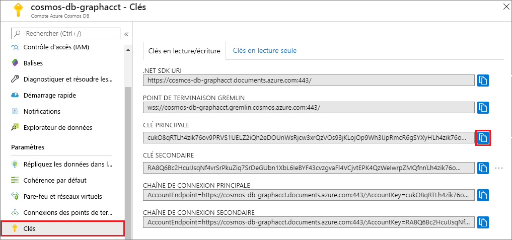

# <a name="azure-cosmos-db-build-a-nodejs-application-by-using-graph-api"></a>Azure Cosmos DB : Créer une application Node.js à l’aide de l’API Graph

Azure Cosmos DB est le service de base de données multi-modèle mondialement distribué de Microsoft. Vous pouvez rapidement créer et interroger des bases de données de documents, de paires clé-valeur et de graphiques, qui bénéficient toutes des fonctionnalités de distribution mondiale et de mise à l’échelle horizontale au cœur d’Azure Cosmos DB. 

Ce guide de démarrage rapide explique comment créer, à l’aide du portail Azure, un compte Azure Cosmos DB pour l’API Graph (préversion), une base de données, ainsi qu’un graphique. Par la suite, vous allez créer et exécuter une application console en utilisant le pilote [Gremlin Node.js](https://www.npmjs.com/package/gremlin-secure) open-source.  

> [!NOTE]
> Le module npm `gremlin-secure` est une version modifiée du module `gremlin`, avec la prise en charge de SSL et de SASL requise pour se connecter à Azure Cosmos DB. Le code source est disponible sur [GitHub](https://github.com/CosmosDB/gremlin-javascript).
>

## <a name="prerequisites"></a>Composants requis

Avant de pouvoir exécuter cet exemple, vous devez posséder les composants requis suivants :
* [Node.js](https://nodejs.org/en/) version 0.10.29 ou supérieure
* [Git](http://git-scm.com/)

[!INCLUDE [quickstarts-free-trial-note](../../includes/quickstarts-free-trial-note.md)]

## <a name="create-a-database-account"></a>Création d'un compte de base de données

[!INCLUDE [cosmos-db-create-dbaccount-graph](../../includes/cosmos-db-create-dbaccount-graph.md)]

## <a name="add-a-graph"></a>Ajout d’un graphique

[!INCLUDE [cosmos-db-create-graph](../../includes/cosmos-db-create-graph.md)]

## <a name="clone-the-sample-application"></a>Clonage de l’exemple d’application

À présent, nous allons cloner une application API Graph à partir de GitHub, configurer la chaîne de connexion et l’exécuter. Vous verrez combien il est facile de travailler par programmation avec des données. 

1. Ouvrez une fenêtre de terminal git, comme git bash, et indiquez un répertoire de travail (à l’aide de la commande `cd`).  

2. Exécutez la commande suivante pour cloner l’exemple de référentiel. 

    ```bash
    git clone https://github.com/Azure-Samples/azure-cosmos-db-graph-nodejs-getting-started.git
    ```

3. Ouvrez le fichier de solution dans Visual Studio. 

## <a name="review-the-code"></a>Examiner le code

Passons rapidement en revue ce qui se passe dans l’application. Ouvrez le fichier `app.js`. Les lignes de code suivantes doivent s’afficher. 

* Le client Gremlin est créé.

    ```nodejs
    const client = Gremlin.createClient(
        443, 
        config.endpoint, 
        { 
            "session": false, 
            "ssl": true, 
            "user": `/dbs/${config.database}/colls/${config.collection}`,
            "password": config.primaryKey
        });
    ```

  Les configurations sont toutes dans `config.js`, que nous allons modifier dans la section suivante.

* Une série d’étapes Gremlin sont exécutées à l’aide de la méthode `client.execute`.

    ```nodejs
    console.log('Running Count'); 
    client.execute("g.V().count()", { }, (err, results) => {
        if (err) return console.error(err);
        console.log(JSON.stringify(results));
        console.log();
    });
    ```

## <a name="update-your-connection-string"></a>Mise à jour de votre chaîne de connexion

1. Ouvrez le fichier config.js. 

2. Dans le fichier config.js, renseignez la clé config.endpoint avec la valeur **URI Gremlin** à partir de la page **Vue d’ensemble** du portail Azure. 

    `config.endpoint = "GRAPHENDPOINT";`

    

   Si la valeur **URI Gremlin** est vide, vous pouvez générer la valeur à partir de la page **Clés** dans le portail, à l’aide de la valeur **URI**, en supprimant https:// et en changeant les documents en graphiques.

   Le point de terminaison Gremlin doit correspondre uniquement au nom d’hôte, sans protocole/numéro de port comme `mygraphdb.graphs.azure.com` (et non `https://mygraphdb.graphs.azure.com` ou `mygraphdb.graphs.azure.com:433`).

3. Dans le fichier config.js, renseignez la valeur config.primaryKey avec la valeur **Clé primaire** à partir de la page **Clés** du portail Azure. 

    `config.primaryKey = "PRIMARYKEY";`

   

4. Entrez le nom de la base de données et le nom du graphique (conteneur) pour la valeur de config.database et de config.collection. 

Voici un exemple de ce à quoi votre fichier config.js terminé doit ressembler :

```nodejs
var config = {}

// Note that this must not have HTTPS or the port number
config.endpoint = "testgraphacct.graphs.azure.com";
config.primaryKey = "Pams6e7LEUS7LJ2Qk0fjZf3eGo65JdMWHmyn65i52w8ozPX2oxY3iP0yu05t9v1WymAHNcMwPIqNAEv3XDFsEg==";
config.database = "graphdb"
config.collection = "Persons"

module.exports = config;
```

## <a name="run-the-console-app"></a>Exécuter l’application console

1. Ouvrez une fenêtre de terminal et remplacez l’élément par le répertoire d’installation pour le fichier package.json inclus dans le projet (via la commande `cd`).  

2. Exécutez `npm install` pour installer les modules npm requis, y compris `gremlin-secure`.

3. Exécutez `node app.js` sur un terminal pour démarrer votre application Node.

## <a name="browse-with-data-explorer"></a>Navigation avec l’Explorateur de données

Vous pouvez maintenant revenir à l’Explorateur de données, dans le portail Azure, pour afficher, modifier, interroger et manipuler vos nouvelles données graphiques.

Dans l’Explorateur de données, la nouvelle base de données apparaît dans le volet **Collections**. Développez **graphdb**, **graphcoll**, puis cliquez sur **Graph**.

Les données générées par l’exemple d’application s’affichent dans le volet **Graphiques**.

## <a name="review-slas-in-the-azure-portal"></a>Examiner les SLA dans le Portail Azure

[!INCLUDE [cosmosdb-tutorial-review-slas](../../includes/cosmos-db-tutorial-review-slas.md)]

## <a name="clean-up-your-resources"></a>Nettoyage des ressources

Si vous n’envisagez pas de continuer à utiliser cette application, supprimez toutes les ressources que vous avez créées dans cet article en procédant comme suit : 

1. Dans le menu de navigation de gauche du portail Azure, cliquez sur **Groupes de ressources**, puis sur le nom de la ressource que vous avez créée. 
2. Sur la page de votre groupe de ressources, cliquez sur **Supprimer**, saisissez le nom de la ressource à supprimer, puis cliquez sur **Supprimer**.

## <a name="next-steps"></a>Étapes suivantes

Dans cet article, vous avez appris à créer un compte Azure Cosmos DB, à créer un graphique à l’aide de l’Explorateur de données et à exécuter une application. Vous pouvez maintenant générer des requêtes plus complexes et implémenter une logique de traversée de graphique puissante, à l’aide de Gremlin. 

> [!div class="nextstepaction"]
> [Interroger à l’aide de Gremlin](tutorial-query-graph.md)

