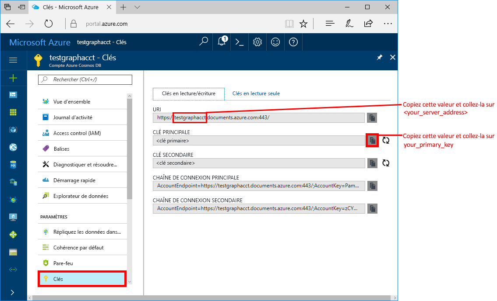
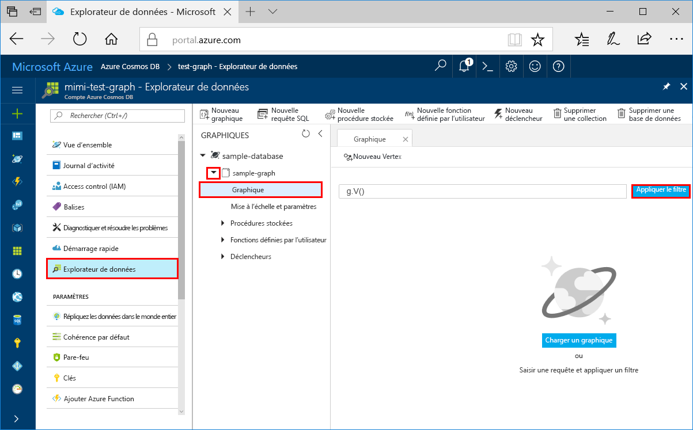
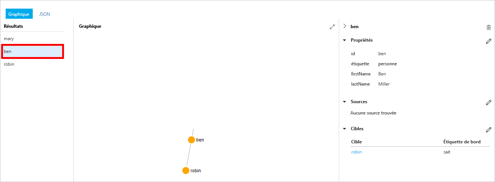
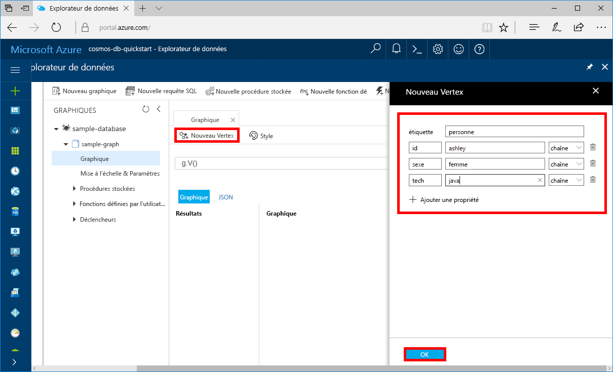
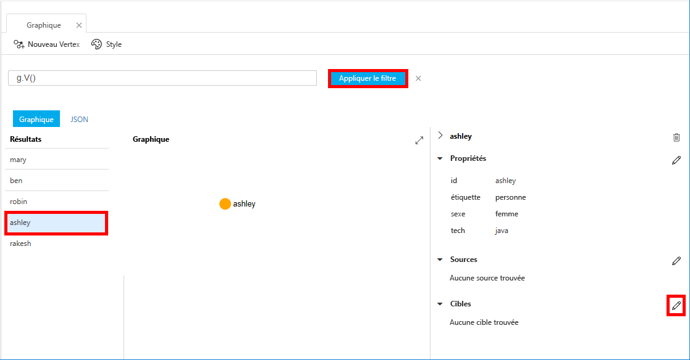
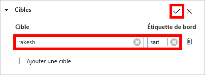
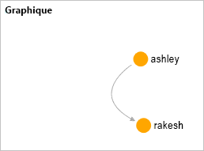

# <a name="azure-cosmos-db-create-a-graph-database-using-php-and-the-azure-portal"></a>Azure Cosmos DB : Créer une base de données de graphes à l’aide de PHP et du portail Azure

Ce guide de démarrage rapide montre comment utiliser PHP et [l’API Graph](graph-introduction.md) d’Azure Cosmos DB pour créer une application console en clonant un exemple à partir de GitHub. Ce guide de démarrage rapide vous montre également comment créer un compte Azure Cosmos DB en utilisant le portail web Azure.   

Azure Cosmos DB est le service de base de données multi-modèle de Microsoft distribué à l’échelle mondiale. Vous pouvez rapidement créer et interroger des bases de données de documents, de tables, de paires clé/valeur et de graphes, lesquelles bénéficient toutes des fonctionnalités de distribution mondiale et de mise à l’échelle horizontale d’Azure Cosmos DB.  

## <a name="prerequisites"></a>Prérequis

[!INCLUDE [quickstarts-free-trial-note](../../includes/quickstarts-free-trial-note.md)] Vous pouvez également [essayer Azure Cosmos DB gratuitement](https://azure.microsoft.com/try/cosmosdb/) sans abonnement Azure, ni frais ni engagement.

Par ailleurs :
* [PHP](http://php.net/) 5.6 ou version plus récente
* [Composer](https://getcomposer.org/download/)

## <a name="create-a-database-account"></a>Création d'un compte de base de données

Pour être en mesure de créer une base de données de graphiques, vous devez avoir préalablement créé un compte de base de données (Graphique) Gremlin avec Azure Cosmos DB.

[!INCLUDE [cosmos-db-create-dbaccount-graph](../../includes/cosmos-db-create-dbaccount-graph.md)]

## <a name="add-a-graph"></a>Ajout d’un graphique

[!INCLUDE [cosmos-db-create-graph](../../includes/cosmos-db-create-graph.md)]

## <a name="clone-the-sample-application"></a>Clonage de l’exemple d’application

À présent, travaillons sur le code. À présent, nous allons cloner une application API Graph à partir de GitHub, configurer la chaîne de connexion et l’exécuter. Vous verrez combien il est facile de travailler par programmation avec des données.  

1. Ouvrez une invite de commandes, créez un nouveau dossier nommé git-samples, puis fermez l’invite de commandes.

    ```bash
    md "C:\git-samples"
    ```

2. Ouvrez une fenêtre de terminal git comme Git Bash et utilisez la commande `cd` pour accéder à un dossier d’installation pour l’exemple d’application.  

    ```bash
    cd "C:\git-samples"
    ```

3. Exécutez la commande suivante pour cloner l’exemple de référentiel : Cette commande crée une copie de l’exemple d’application sur votre ordinateur. 

    ```bash
    git clone https://github.com/Azure-Samples/azure-cosmos-db-graph-php-getting-started.git
    ```

## <a name="review-the-code"></a>Vérifier le code

Cette étape est facultative. Pour savoir comment les ressources de base de données sont créées dans le code, vous pouvez examiner les extraits de code suivants. Tous les extraits de code sont tirés du fichier connect.php dans le dossier C:\git-samples\azure-cosmos-db-graph-php-getting-started\. Sinon, vous pouvez passer à l’étape [Mise à jour de votre chaîne de connexion](#update-your-connection-information). 

* L’objet `connection` Gremlin est initialisé au début du fichier `connect.php` à l’aide de l’objet `$db`.

    ```php
    $db = new Connection([
        'host' => '<your_server_address>.graphs.azure.com',
        'username' => '/dbs/<db>/colls/<coll>',
        'password' => 'your_primary_key'
        ,'port' => '443'

        // Required parameter
        ,'ssl' => TRUE
    ]);
    ```

* Une série d’étapes Gremlin sont exécutées à l’aide de la méthode `$db->send($query);`.

    ```php
    $query = "g.V().drop()";
    ...
    $result = $db->send($query);
    $errors = array_filter($result);
    }
    ```

## <a name="update-your-connection-information"></a>Mise à jour de vos informations de connexion

Maintenant, retournez dans le portail Azure afin d’obtenir vos informations de connexion et de les copier dans l’application. Ces paramètres permettent à votre application de communiquer avec votre base de données hébergée.

1. Dans le [portail Azure](http://portal.azure.com/), cliquez sur **Clés**. 

    Copiez la première partie de la valeur de l’URI.

    
2. Ouvrez le fichier `connect.php` et, sur la ligne 8, collez la valeur de l’URI sur `your_server_address`.

    L’initialisation de l’objet de connexion doit maintenant ressembler au code ci-après :

    ```php
    $db = new Connection([
        'host' => 'testgraphacct.graphs.azure.com',
        'username' => '/dbs/<db>/colls/<coll>',
        'password' => 'your_primary_key'
        ,'port' => '443'

        // Required parameter
        ,'ssl' => TRUE
    ]);
    ```

3. Si votre compte de base de données de graphiques a été créé le 20 décembre 2017 ou après, modifiez `graphs.azure.com` dans le nom d’hôte pour le remplacer par `gremlin.cosmosdb.azure.com`.

4. Remplacez le paramètre `username` dans l’objet de connexion par le nom de votre base de données et de votre graphe. Si vous avez utilisé les valeurs recommandées `sample-database` et `sample-graph`, vous devriez avoir le code suivant :

    `'username' => '/dbs/sample-database/colls/sample-graph'`

    L’intégralité de l’objet de connexion doit maintenant ressembler à l’extrait de code suivant :

    ```php
    $db = new Connection([
        'host' => 'testgraphacct.graphs.azure.com',
        'username' => '/dbs/sample-database/colls/sample-graph',
        'password' => 'your_primary_key',
        'port' => '443'

        // Required parameter
        ,'ssl' => TRUE
    ]);
    ```

5. Dans le portail Azure, utilisez le bouton de copie pour copier la CLÉ PRIMAIRE, puis collez-la sur `your_primary_key` dans le paramètre de mot de passe.

    L’initialisation de l’objet de connexion doit maintenant ressembler au code ci-après :

    ```php
    $db = new Connection([
        'host' => 'testgraphacct.graphs.azure.com',
        'username' => '/dbs/sample-database/colls/sample-graph',
        'password' => '2Ggkr662ifxz2Mg==',
        'port' => '443'

        // Required parameter
        ,'ssl' => TRUE
    ]);
    ```

6. Enregistrez le fichier `connect.php`.

## <a name="run-the-console-app"></a>Exécution de l’application console

1. Dans la fenêtre de terminal git, exécutez la commande `cd` pour accéder au dossier azure-cosmos-db-graph-php-getting-started.

    ```git
    cd "C:\git-samples\azure-cosmos-db-graph-php-getting-started"
    ```

2. Dans la fenêtre de terminal git, utilisez la commande suivante pour installer les dépendances PHP nécessaires.

   ```
   composer install
   ```

3. Dans la fenêtre de terminal git, utilisez la commande suivante pour démarrer l’application PHP.
    
    ```
    php connect.php
    ```

    La fenêtre de terminal affiche les vertex ajoutés au graphique. 
    
    Si vous rencontrez des erreurs de délai d’expiration, vérifiez que vous avez correctement mis à jour les informations de connexion dans [Mise à jour de vos informations de connexion](#update-your-connection-information) et essayez également de réexécuter la dernière commande. 
    
    Une fois le programme terminé, appuyez sur Entrée, puis rebasculez vers le portail Azure dans votre navigateur Internet. 

<a id="add-sample-data"></a>
## <a name="review-and-add-sample-data"></a>Examiner et ajouter des exemples de données

Vous pouvez à présent revenir à l’Explorateur de données et voir les vertex ajoutés au graphique, ainsi qu’ajouter des points de données supplémentaires.

1. Cliquez sur **Explorateur de données**, développez **sample-graph**, cliquez sur **Graphique**, puis cliquez sur **Appliquer un filtre**. 

   

2. Dans la liste **Résultats**, observez les nouveaux utilisateurs ajoutés au graphique. Sélectionnez **ben** et notez qu’il est connecté à robin. Vous pouvez glisser-déplacez les vertex, effectuer un zoom avant et arrière à l’aide de la roulette de la souris et augmenter la taille du graphique avec la double flèche. 

   

3. Nous allons à présent ajouter quelques nouveaux utilisateurs. Cliquez sur le bouton **New Vertex (Nouveau vertex)** pour ajouter des données à votre graphique.

   

4. Entrez l’étiquette *person*.

5. Cliquez sur **Ajouter une propriété** pour ajouter chacune des propriétés suivantes. Notez que vous pouvez créer des propriétés uniques pour chaque personne dans votre graphique. Seule la clé id est obligatoire.

    key|value|Notes
    ----|----|----
    id|ashley|Identificateur unique du vertex. Si vous ne spécifiez aucun id, le système en génère un pour vous.
    gender|female| 
    tech | java | 

    > [!NOTE]
    > Dans ce Démarrage rapide, vous créez une collection non partitionnée. Toutefois, si vous créez une collection partitionnée en spécifiant une clé de partition lors de la création de la collection, vous devez inclure la clé de partition en tant que clé dans chaque nouveau vertex. 

6. Cliquez sur **OK**. Vous pouvez avoir besoin d’agrandir votre écran pour voir apparaître le bouton **OK** au bas de l’écran.

7. Cliquez de nouveau sur **New Vertex (Nouveau vertex)** et ajoutez un nouvel utilisateur supplémentaire. 

8. Entrez l’étiquette *person*.

9. Cliquez sur **Ajouter une propriété** pour ajouter chacune des propriétés suivantes :

    key|value|Notes
    ----|----|----
    id|rakesh|Identificateur unique du vertex. Si vous ne spécifiez aucun id, le système en génère un pour vous.
    gender|male| 
    school|MIT| 

10. Cliquez sur **OK**. 

11. Cliquez sur le bouton **Appliquer un filtre** avec le filtre par défaut `g.V()` pour afficher toutes les valeurs dans le graphique. Tous les utilisateurs apparaissent désormais dans la liste **Résultats**. 

    À mesure que vous ajoutez d’autres données, vous pouvez utiliser des filtres pour limiter les résultats renvoyés. Par défaut, l’Explorateur de données utilise `g.V()` pour récupérer tous les vertex dans un graphique. Vous pouvez choisir une autre [requête de graphique](tutorial-query-graph.md) comme `g.V().count()` pour retourner le nombre total de vertex dans le graphique au format JSON. Si vous avez modifié le filtre, choisissez de nouveau le filtre `g.V()` et cliquez sur **Appliquer un filtre** pour afficher de nouveau l’ensemble des résultats.

12. À présent, vous pouvez connecter rakesh et ashley. Vérifiez que **ashley** est bien sélectionné dans la liste **Résultats**, puis cliquez sur le bouton de modification en regard de **Cibles** dans la partie inférieure droite de l’écran. Vous devrez peut-être élargir la fenêtre pour visualiser la zone **Propriétés**.

   

13. Dans la zone **Cible**, tapez *rakesh*. Dans la zone **Edge label** (Étiquette de relation), tapez *knows*, puis cochez la case.

   

14. À présent, sélectionnez **rakesh** dans la liste des résultats et vérifiez qu’ashley et rakesh sont connectés. 

   

   Ainsi s’achève la section de ce Démarrage rapide consacrée à la création de ressources. Vous pouvez continuer à ajouter des vertex à votre graphique, modifier les vertex existants ou modifier les requêtes. Nous allons à présent examiner les métriques fournies par Azure Cosmos DB et nettoyer les ressources. 

## <a name="review-slas-in-the-azure-portal"></a>Vérification des contrats SLA dans le portail Azure

[!INCLUDE [cosmosdb-tutorial-review-slas](../../includes/cosmos-db-tutorial-review-slas.md)]

## <a name="clean-up-resources"></a>Supprimer des ressources

[!INCLUDE [cosmosdb-delete-resource-group](../../includes/cosmos-db-delete-resource-group.md)]

## <a name="next-steps"></a>Étapes suivantes

Dans ce guide de démarrage rapide, vous avez appris à créer un compte Azure Cosmos D, à créer un graphique à l’aide de l’Explorateur de données et à exécuter une application. Vous pouvez maintenant générer des requêtes plus complexes et implémenter une logique de traversée de graphique puissante, à l’aide de Gremlin. 

> [!div class="nextstepaction"]
> [Interroger à l’aide de Gremlin](tutorial-query-graph.md)

