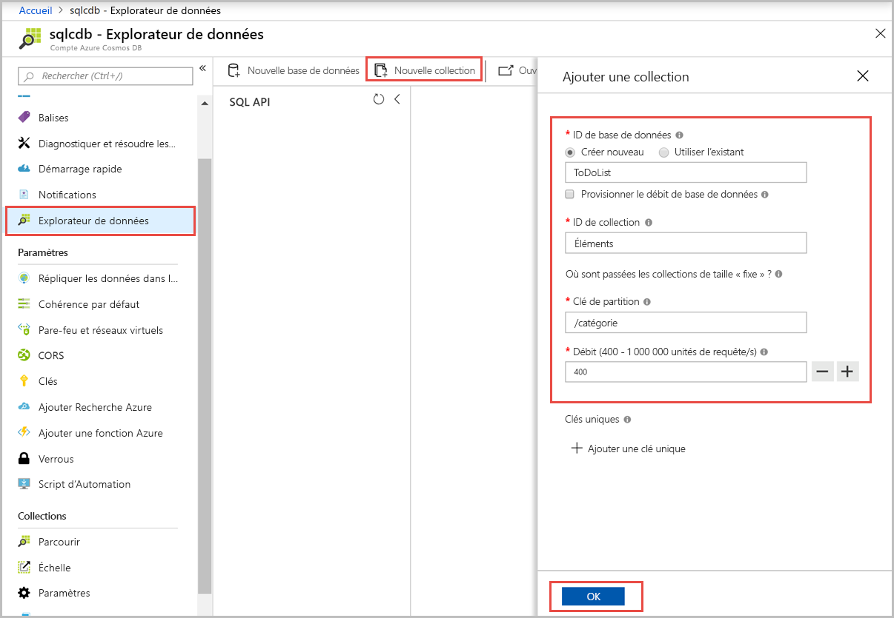
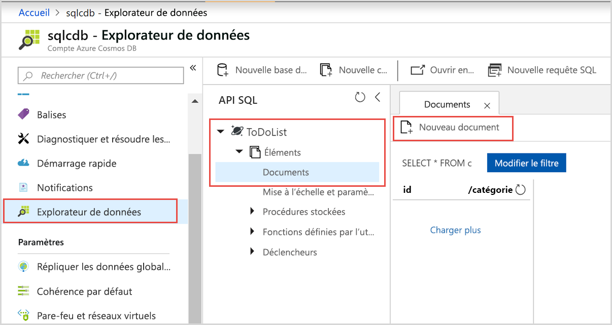
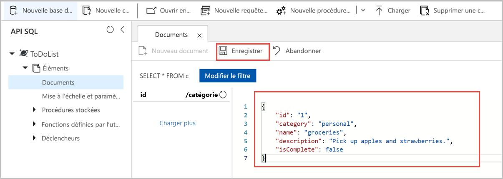

# <a name="quickstart-build-a-net-web-app-using-sql-api-account-in-azure-cosmos-db"></a>Démarrage rapide : Générer une application web .NET à l’aide d’un compte d’API SQL dans Azure Cosmos DB

> [!div class="op_single_selector"]
> * [.NET](create-sql-api-dotnet.md)
> * [.NET (préversion)](create-sql-api-dotnet-preview.md)
> * [Java](create-sql-api-java.md)
> * [Node.JS](create-sql-api-nodejs.md)
> * [Python](create-sql-api-python.md)
> * [Xamarin](create-sql-api-xamarin-dotnet.md)
>  
> 

Azure Cosmos DB est le service de base de données multi-modèle de Microsoft distribué à l’échelle mondiale. Vous pouvez utiliser Azure Cosmos DB pour créer et interroger rapidement des bases de données de paires clé/valeur, des bases de données de documents et des bases de données de graphes, qui bénéficient toutes des fonctionnalités de distribution mondiale et de mise à l’échelle horizontale au cœur même d’Azure Cosmos DB. 

Ce guide de démarrage rapide montre comment utiliser le portail Azure pour créer un compte d’[API SQL](sql-api-introduction.md) Azure Cosmos DB, comment créer une base de données de documents et une collection, et comment ajouter des données à la collection. Ensuite, vous allez utiliser une application web de [SDK .NET SQL](sql-api-sdk-dotnet.md) pour ajouter des données à la collection. 

Dans ce guide de démarrage rapide, vous allez utiliser l’Explorateur de données dans le portail Azure pour créer une base de données et une collection. Vous pouvez aussi créer la base de données et la collection en utilisant l’exemple de code .NET. Pour plus d’informations, consultez [Revue du code .NET](#review-the-net-code). 

## <a name="prerequisites"></a>Prérequis

Visual Studio 2019 avec le workflow de développement Azure installé
- Vous pouvez télécharger et utiliser **gratuitement** [Visual Studio 2019 Community Edition](https://www.visualstudio.com/downloads/). Veillez à activer **le développement Azure** lors de l’installation de Visual Studio. 

Un abonnement Azure ou un compte d’essai gratuit Azure Cosmos DB
- [!INCLUDE [quickstarts-free-trial-note](../../includes/quickstarts-free-trial-note.md)] 
- [!INCLUDE [cosmos-db-emulator-docdb-api](../../includes/cosmos-db-emulator-docdb-api.md)]  

<a id="create-account"></a>
## <a name="create-an-azure-cosmos-db-account"></a>Création d’un compte Azure Cosmos DB

[!INCLUDE [cosmos-db-create-dbaccount](../../includes/cosmos-db-create-dbaccount.md)]

<a id="create-collection-database"></a>
## <a name="add-a-database-and-a-collection"></a>Ajouter une base de données et une collection 

Vous pouvez utiliser l’Explorateur de données dans le portail Azure pour créer une base de données et une collection. 

1.  Dans la page de votre compte Azure Cosmos DB, sur la gauche, sélectionnez **Explorateur de données**, puis **Nouvelle collection**. 
    
    Vous devrez peut-être faire défiler vers la droite pour voir la zone **Ajouter une collection**.
    
    
    
1.  Dans la page **Ajouter une collection**, entrez les paramètres pour la nouvelle collection.
    
    |Paramètre|Valeur suggérée|Description
    |---|---|---|
    |**ID de base de données**|ToDoList|Entrez *ToDoList* pour le nom de la nouvelle base de données. Les noms de base de données doivent comporter entre 1 et 255 caractères, et ne peuvent pas contenir les caractères `/, \\, #, ?`, ni un espace de fin.|
    |**ID de la collection**|Éléments|Entrez *Items* comme nom pour votre nouvelle collection. Les ID de collection sont soumis aux mêmes exigences en termes de caractères que les noms de base de données.|
    |**Clé de partition**| /category| L’exemple décrit dans cet article utilise */category* comme clé de partition.|
    |**Débit**|400|Laissez le débit sur 400 unités de requête par seconde (RU/s). Si vous souhaitez réduire la latence, vous pourrez augmenter le débit par la suite.| 
    
    Pour cet exemple, n’ajoutez pas de **Clés uniques**. Les clés uniques vous permettent d’ajouter une couche d’intégrité des données à la base de données en garantissant que chaque clé de partition contient des valeurs uniques. Pour plus d’informations, consultez [Clés uniques dans Azure Cosmos DB](unique-keys.md).
    
1.  Sélectionnez **OK**. 
    L’Explorateur de données affiche la nouvelle base de données et la nouvelle collection.
    
    

## <a name="add-data-to-your-database"></a>Ajouter des données à votre base de données

Ajoutez des données à votre nouvelle base de données à l’aide de l’Explorateur de données.

1. Dans l’**Explorateur de données**, la nouvelle base de données s’affiche dans le volet **Collections**. Développez la base de données **ToDoList**, développez la collection **Items**, sélectionnez **Documents**, puis sélectionnez **Nouveau document**. 
   
   
   
1. Ajoutez la structure suivante au document, sur la droite du volet **Documents** :

     ```json
     {
         "id": "1",
         "category": "personal",
         "name": "groceries",
         "description": "Pick up apples and strawberries.",
         "isComplete": false
     }
     ```

1. Sélectionnez **Enregistrer**.
   
   
   
1. Sélectionnez à nouveau **Nouveau document** puis créez et enregistrez un autre document avec un `id` unique, ainsi que les propriétés et valeurs souhaitées. Vos documents peuvent avoir la structure de votre choix, car Azure Cosmos DB n’impose aucun schéma à vos données.

## <a name="query-your-data"></a>Interroger vos données

[!INCLUDE [cosmos-db-create-sql-api-query-data](../../includes/cosmos-db-create-sql-api-query-data.md)]

## <a name="use-the-net-web-app-to-manage-data"></a>Utiliser l’application web .NET pour gérer les données

Pour vous rendre compte à quel point il est facile d’utiliser des données Azure Cosmos DB par programmation, clonez l’exemple d’application web .NET d’API SQL à partir de GitHub, mettez à jour la chaîne de connexion, puis exécutez l’application pour mettre à jour vos données. 

Vous pouvez aussi créer la base de données et la collection en utilisant l’exemple de code .NET. Pour plus d’informations, consultez [Revue du code .NET](#review-the-net-code).

### <a name="clone-the-sample-app"></a>Clonage de l’exemple d’application

Tout d’abord, clonez une [application d’API SQL](https://github.com/Azure-Samples/documentdb-dotnet-todo-app) C# à partir de GitHub. 

1. Ouvrez une fenêtre de terminal git telle que Git Bash, créez un répertoire nommé *git-samples*, puis pointez vers celui-ci : 
   
   ```bash
   mkdir /c/git-samples/
   cd /c/git-samples/
   ```
   
1. Exécutez la commande suivante pour cloner l’exemple de dépôt et créer une copie de l’exemple d’application sur votre ordinateur :
   
   ```bash
   git clone https://github.com/Azure-Samples/documentdb-dotnet-todo-app.git
   ```

### <a name="update-the-connection-string"></a>Mettre à jour la chaîne de connexion 

1. Accédez au fichier *todo.sln*de votre application clonée, puis ouvrez-le dans Visual Studio. 

1. Dans l’**Explorateur de solutions** Visual Studio, ouvrez le fichier *web.config*. 

1. Retournez dans le portail Azure afin de copier les informations de votre chaîne de connexion et les coller dans le fichier *web.config*.
   
   1. Dans votre compte Azure Cosmos DB, sélectionnez **Clés** sur la gauche.
      
      
      
   1. Sous **Clés en lecture-écriture**, copiez la valeur d’**URI** à l’aide du bouton Copier situé à droite, puis collez-la dans la clé `endpoint` du fichier *web.config*. Par exemple :  
      
      `<add key="endpoint" value="https://mysqlapicosmosdb.documents.azure.com:443/" />`
      
   1. Copiez la valeur de **Clé primaire**, puis collez-la dans la clé `authKey` du fichier *web.config*. Par exemple : 
      
      `<add key="authKey" value="19ZDNJAiYL26tmnRvoez6hmtIfBGwjun50PWRjNYMC2ig8Ob9hYk7Fq1RYSv8FcIYnh1TdBISvCh7s6yyb0000==" />`

       
1. Vérifiez que le nom de la base de données et le nom de la collection qui figurent dans *web.config* correspondent à ceux que vous avez attribués précédemment. 

   ```csharp
   <add key="database" value="ToDoList"/>
   <add key="collection" value="Items"/>
   ```
 
1. Enregistrez le fichier *web.config*. Vous venez de mettre à jour votre application avec toutes les informations nécessaires pour communiquer avec Azure Cosmos DB.

### <a name="run-the-web-app"></a>Exécuter l’application web

1. Dans Visual Studio, cliquez avec le bouton droit sur le projet **todo** dans l’**Explorateur de solutions**, puis sélectionnez **Gérer les packages NuGet**. 

1. Dans la zone **Parcourir**de NuGet, tapez *DocumentDB*.

1. À partir des résultats, installez la bibliothèque **Microsoft.Azure.DocumentDB**, si elle n’est pas déjà installée. Cette opération permet d’installer le package [Microsoft.Azure.DocumentDB](https://www.nuget.org/packages/Microsoft.Azure.DocumentDB/) ainsi que toutes les dépendances.
   
   Si le gestionnaire de package NuGet affiche un message indiquant que certains packages sont manquants dans la solution, sélectionnez **Restaurer** pour les installer à partir de sources internes. 

1. Sélectionnez **Ctrl**+**F5** pour exécuter l’application dans votre navigateur. 

1. Sélectionnez **Créer** dans l’application todo, puis créez quelques tâches.

   

Vous pouvez revenir à l’Explorateur de données dans le portail Azure pour voir, interroger, modifier et utiliser vos nouvelles données. 

## <a name="review-the-net-code"></a>Revue du code .NET

Cette étape est facultative. Dans ce guide de démarrage rapide, vous avez créé une base de données et une collection dans le portail Azure, puis vous avez ajouté des données tirées de l’exemple .NET. Cependant, vous pouvez aussi créer la base de données et la collection en utilisant l’exemple .NET. Pour savoir comment les ressources de base de données sont créées dans le code, regardez les extraits de code suivants. Tous les extraits de code suivants proviennent du fichier *DocumentDBRepository.cs* du projet **todo**.

* Ce code initialise `DocumentClient` : 

    ```csharp
    client = new DocumentClient(new Uri(ConfigurationManager.AppSettings["endpoint"]), ConfigurationManager.AppSettings["authKey"]);
    ```

* Ce code crée la base de données à l’aide de la méthode `CreateDatabaseAsync` :

    ```csharp
    await client.CreateDatabaseAsync(new Database { Id = DatabaseId });
    ```

* Le code suivant crée la collection à l’aide de la méthode `CreateDocumentCollectionAsync` :

    ```csharp
    private static async Task CreateCollectionIfNotExistsAsync(string partitionkey)
    {
       try
       {       
        await client.ReadDocumentCollectionAsync(UriFactory.CreateDocumentCollectionUri(DatabaseId, CollectionId), new RequestOptions { PartitionKey = new PartitionKey(partitionkey) });
       }
        catch (DocumentClientException e)
        {
           if (e.StatusCode == System.Net.HttpStatusCode.NotFound)
            {
                await client.CreateDocumentCollectionAsync(
                  UriFactory.CreateDatabaseUri(DatabaseId),
                   new DocumentCollection
                    {
                      Id = CollectionId,
                      PartitionKey = new PartitionKeyDefinition
                       {
                           Paths = new System.Collections.ObjectModel.Collection<string>(new List<string>() { partitionkey })
                        }
                    },
                      new RequestOptions { OfferThroughput = 400 });
            }
            else
            {
                throw;
            }
        }
    }
    ```

## <a name="clean-up-resources"></a>Supprimer des ressources

[!INCLUDE [cosmosdb-delete-resource-group](../../includes/cosmos-db-delete-resource-group.md)]

## <a name="next-steps"></a>Étapes suivantes

Dans ce guide de démarrage rapide, vous avez appris à créer un compte Azure Cosmos DB, à créer une base de données et une collection à l’aide de l’Explorateur de données, et à exécuter une application web .NET pour mettre à jour vos données. Vous pouvez maintenant importer des données supplémentaires dans votre compte Azure Cosmos DB. 

> [!div class="nextstepaction"]
> [Importer des données dans Azure Cosmos DB](import-data.md)

