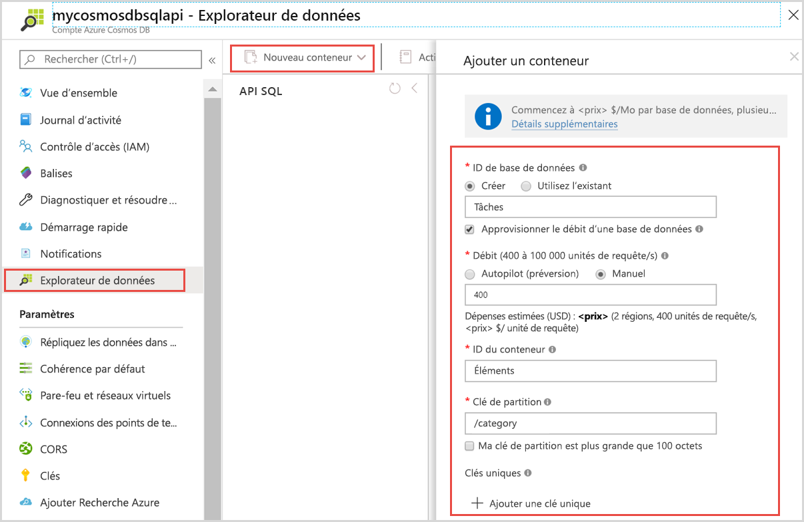
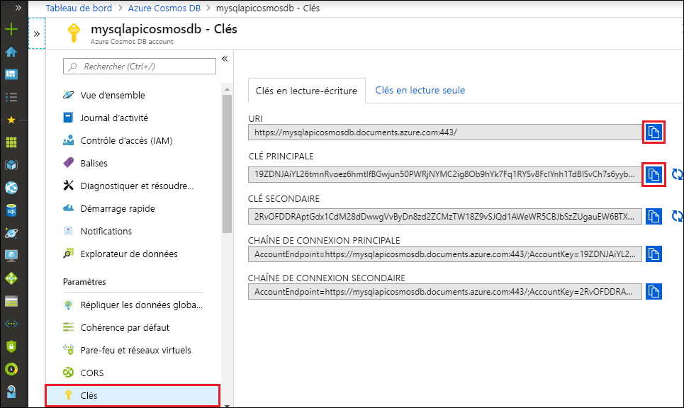

# <a name="quickstart-build-a-python-application-using-an-azure-cosmos-db-sql-api-account"></a>Démarrage rapide : Générer une application Python à l’aide d’un compte d’API SQL Azure Cosmos DB

> [!div class="op_single_selector"]
> * [.NET V3](create-sql-api-dotnet.md)
> * [.NET V4](create-sql-api-dotnet-V4.md)
> * [Java](create-sql-api-java.md)
> * [Node.JS](create-sql-api-nodejs.md)
> * [Python](create-sql-api-python.md)
> * [Xamarin](create-sql-api-xamarin-dotnet.md)

Ce démarrage rapide explique comment créer, à l’aide du portail Azure, un compte [API SQL](sql-api-introduction.md) d’Azure Cosmos DB, une base de données de documents, ainsi qu’un conteneur. Ensuite, vous créez et exécutez une application console à l’aide du kit SDK Python pour [l’API SQL](sql-api-sdk-python.md).

Azure Cosmos DB est le service de base de données multi-modèle de Microsoft distribué à l’échelle mondiale. Vous pouvez rapidement créer et interroger des documents ainsi que des bases de données de clés/valeurs, à colonnes larges et de graphiques. Toutes ces opérations bénéficient de la distribution et la mise à l’échelle d’Azure Cosmos DB.

Ce guide de démarrage rapide utilise la version 4 du [SDK Python](https://pypi.org/project/azure-cosmos/#history).

[!INCLUDE [quickstarts-free-trial-note](../../includes/quickstarts-free-trial-note.md)] [!INCLUDE [cosmos-db-emulator-docdb-api](../../includes/cosmos-db-emulator-docdb-api.md)]

## <a name="prerequisites"></a>Conditions préalables requises

* [Python 3.6](https://www.python.org/downloads/), avec l’exécutable `python` disponible dans votre `PATH`.
* [Visual Studio Code](https://code.visualstudio.com/)
* [Extension Python pour Visual Studio Code](https://marketplace.visualstudio.com/items?itemName=ms-python.python#overview)

## <a name="create-a-database-account"></a>Création d’un compte de base de données

[!INCLUDE [cosmos-db-create-dbaccount](../../includes/cosmos-db-create-dbaccount.md)]

## <a name="add-a-container"></a>Ajouter un conteneur

Vous pouvez désormais utiliser l’outil Explorateur de données dans le portail Azure pour créer une base de données et un conteneur. 

1. Sélectionnez **Explorateur de données** > **Nouveau conteneur**. 
    
    La zone **Ajouter un conteneur** s’affiche à l’extrême droite : il peut donc être nécessaire de faire défiler à droite pour l’afficher.

    

2. Dans la page **Ajouter un conteneur**, entrez les paramètres du nouveau conteneur.

    |Paramètre|Valeur suggérée|Description
    |---|---|---|
    |**ID de base de données**|Tâches|Entrez *ToDoList* pour le nom de la nouvelle base de données. Les noms de base de données doivent comporter entre 1 et 255 caractères, et ne peuvent pas contenir les caractères `/, \\, #, ?`, ni un espace de fin. Cochez l’option **Provisionner le débit de base de données** qui vous permet de partager le débit provisionné pour la base de données entre tous les conteneurs au sein de la base de données. Cette option permet également de réduire les coûts. |
    |**Débit**|400|Laissez le débit sur 400 unités de requête par seconde (RU/s). Si vous souhaitez réduire la latence, vous pourrez augmenter le débit par la suite.| 
    |**ID de conteneur**|Éléments|Entrez *Éléments* comme nom de votre nouveau conteneur. Les ID de conteneur sont soumis aux mêmes exigences en termes de caractères que les noms de base de données.|
    |**Clé de partition**| /category| L’exemple décrit dans cet article utilise */category* comme clé de partition.|
    
    Outre les paramètres précédents, vous pouvez ajouter des **clés uniques** pour le conteneur. Laissez le champ vide dans cet exemple. Les clés uniques permettent aux développeurs d’ajouter une couche d’intégrité des données à la base de données. En créant une stratégie de clé unique durant la création d’un conteneur, vous garantissez l’unicité d’une ou de plusieurs valeurs par clé de partition. Pour en savoir plus, référez-vous à l’article [Clés uniques dans Azure Cosmos DB](unique-keys.md).
    
    Sélectionnez **OK**. L’Explorateur de données affiche la nouvelle base de données et le nouveau conteneur.

## <a name="add-sample-data"></a>Ajouter un exemple de données

[!INCLUDE [cosmos-db-create-sql-api-add-sample-data](../../includes/cosmos-db-create-sql-api-add-sample-data.md)]

## <a name="query-your-data"></a>Interroger vos données

[!INCLUDE [cosmos-db-create-sql-api-query-data](../../includes/cosmos-db-create-sql-api-query-data.md)]

## <a name="clone-the-sample-application"></a>Clonage de l’exemple d’application

Nous allons à présent cloner une application API SQL à partir de GitHub, définir la chaîne de connexion et l’exécuter.

1. Ouvrez une invite de commandes, créez un nouveau dossier nommé git-samples, puis fermez l’invite de commandes.

    ```cmd
    md "git-samples"
    ```
   Si vous utilisez une invite de commandes bash, utilisez plutôt la commande suivante :

   ```bash
   mkdir "git-samples"
   ```

2. Ouvrez une fenêtre de terminal git comme Git Bash et utilisez la commande `cd` pour accéder au nouveau dossier d’installation pour l’exemple d’application.

    ```bash
    cd "git-samples"
    ```

3. Exécutez la commande suivante pour cloner l’exemple de référentiel : Cette commande crée une copie de l’exemple d’application sur votre ordinateur. 

    ```bash
    git clone https://github.com/Azure-Samples/azure-cosmos-db-python-getting-started.git
    ```  

## <a name="update-your-connection-string"></a>Mise à jour de votre chaîne de connexion

Maintenant, retournez dans le portail Azure afin d’obtenir les informations de votre chaîne de connexion et de les copier dans l’application.

1. Sur le [portail Azure](https://portal.azure.com/), dans votre compte Azure Cosmos, dans le volet de navigation gauche, sélectionnez **Clés**. Vous utiliserez les boutons de copie sur le côté droit de l’écran pour copier **l’URI** et la **Clé primaire** dans le fichier `cosmos_get_started.py` à l’étape suivante.

    

2. Ouvrez le fichier `cosmos_get_started.py` dans \git-samples\azure-cosmos-db-python-getting-started dans Visual Studio Code.

3. Copiez la valeur de votre **URI** dans le portail (à l’aide du bouton Copier), puis définissez-la comme valeur de la variable **endpoint** dans ``cosmos_get_started.py``. 

    `endpoint = 'https://FILLME.documents.azure.com',`

4. Ensuite, copiez la valeur de votre **CLÉ PRINCIPALE** à partir du portail et définissez-la comme valeur pour **key** dans ``cosmos_get_started.py``. Vous venez de mettre à jour votre application avec toutes les informations nécessaires pour communiquer avec Azure Cosmos DB. 

    `key = 'FILLME'`

5. Enregistrez le fichier ``cosmos_get_started.py``.

## <a name="review-the-code"></a>Vérifier le code

Cette étape est facultative. En savoir plus sur les ressources de base de données créées dans le code, ou passer directement à [Mettre à jour votre chaîne de connexion](#update-your-connection-string).

Tous les extraits suivants proviennent du fichier `cosmos_get_started.py`.

* Le CosmosClient est initialisé. Veillez à mettre à jour les valeurs de « endpoint » et de « key », comme décrit dans la section [Mettre à jour votre chaîne de connexion](#update-your-connection-string). 

    [!code-python[](~/azure-cosmos-db-python-getting-started/cosmos_get_started.py?name=create_cosmos_client)]

* Une nouvelle base de données est créée.

    [!code-python[](~/azure-cosmos-db-python-getting-started/cosmos_get_started.py?name=create_database_if_not_exists)]

* Un nouveau conteneur est créé, avec 400 RU/s de [débit provisionné](request-units.md). Nous choisissons `lastName` comme [clé de partition](partitioning-overview.md#choose-partitionkey), ce qui nous permet de faire des requêtes efficaces qui filtrent sur cette propriété. 

    [!code-python[](~/azure-cosmos-db-python-getting-started/cosmos_get_started.py?name=create_container_if_not_exists)]

* Certains éléments sont ajoutés au conteneur. Les conteneurs sont une collection d’éléments (des documents JSON) qui peuvent avoir différents schémas. Les méthodes d’assistance ```get_[name]_family_item``` retournent des représentations d’une famille stockées dans Azure Cosmos DB en tant que documents JSON.

    [!code-python[](~/azure-cosmos-db-python-getting-started/cosmos_get_started.py?name=create_item)]

* Les lectures des points (des recherches de valeurs de clés) sont effectuées avec la méthode `read_item`. Nous affichons les [frais en RU (unités de requête)](request-units.md) de chaque opération.
    [!code-python[](~/azure-cosmos-db-python-getting-started/cosmos_get_started.py?name=read_item)]

* Une requête est effectuée avec la syntaxe des requêtes SQL. Étant donné que nous utilisons les valeurs de clé de partition de ```lastName``` dans la clause WHERE, Azure Cosmos DB route cette requête vers les partitions pertinentes, ce qui améliore les performances.

    [!code-python[](~/azure-cosmos-db-python-getting-started/cosmos_get_started.py?name=query_items)]
   
## <a name="run-the-app"></a>Exécuter l’application

1. Dans Visual Studio Code, sélectionnez **Affichage** > **Palette de commandes**. 

2. À l’invite, entrez **Python: Select Interpreter**, puis sélectionnez la version de Python à utiliser.

    Le pied de page dans Visual Studio Code affiche désormais l’interpréteur sélectionné. 

3. Sélectionnez **Affichage** > **Terminal intégré** pour ouvrir le terminal intégré Visual Studio Code.

4. Dans la fenêtre du terminal intégré, vérifiez que vous êtes bien dans le dossier azure-cosmos-db-python-getting-started. Si ce n’est pas le cas, exécutez la commande suivante pour passer au dossier d’exemple. 

    ```cmd
    cd "\git-samples\azure-cosmos-db-python-getting-started"`
    ```

5. Exécutez la commande suivante pour installer le package azure-cosmos. 

    ```python
    pip install --pre azure-cosmos
    ```

    Si vous obtenez une erreur d’accès refusé quand vous tentez d’installer azure-cosmos, vous devrez [exécuter VS Code en tant qu’administrateur](https://stackoverflow.com/questions/37700536/visual-studio-code-terminal-how-to-run-a-command-with-administrator-rights).

6. Exécutez la commande suivante pour exécuter l’exemple, et pour créer et stocker de nouveaux documents dans Azure Cosmos DB.

    ```python
    python cosmos_get_started.py
    ```

7. Pour vérifier que les nouveaux éléments ont été créés et enregistrés, dans le portail Azure, sélectionnez **Explorateur de données** > **AzureSampleFamilyDatabase** > **Éléments**. Regardez les éléments qui ont été créés. Par exemple, voici un exemple de document JSON pour la famille Andersen :

```json
{
    "id": "Andersen-1569479288379",
    "lastName": "Andersen",
    "district": "WA5",
    "parents": [
        {
            "familyName": null,
            "firstName": "Thomas"
        },
        {
            "familyName": null,
            "firstName": "Mary Kay"
        }
    ],
    "children": null,
    "address": {
        "state": "WA",
        "county": "King",
        "city": "Seattle"
    },
    "registered": true,
    "_rid": "8K5qAIYtZXeBhB4AAAAAAA==",
    "_self": "dbs/8K5qAA==/colls/8K5qAIYtZXc=/docs/8K5qAIYtZXeBhB4AAAAAAA==/",
    "_etag": "\"a3004d78-0000-0800-0000-5d8c5a780000\"",
    "_attachments": "attachments/",
    "_ts": 1569479288
}
```

## <a name="review-slas-in-the-azure-portal"></a>Vérification des contrats SLA dans le portail Azure

[!INCLUDE [cosmosdb-tutorial-review-slas](../../includes/cosmos-db-tutorial-review-slas.md)]

## <a name="clean-up-resources"></a>Nettoyer les ressources

[!INCLUDE [cosmosdb-delete-resource-group](../../includes/cosmos-db-delete-resource-group.md)]

## <a name="next-steps"></a>Étapes suivantes

Dans ce guide de démarrage rapide, vous avez appris à créer un compte Azure Cosmos, à créer un conteneur à l’aide de l’Explorateur de données et à exécuter une application. Vous pouvez maintenant importer des données supplémentaires à votre compte Cosmos DB. 

> [!div class="nextstepaction"]
> [Importer des données dans Azure Cosmos DB pour l’API SQL](import-data.md)


