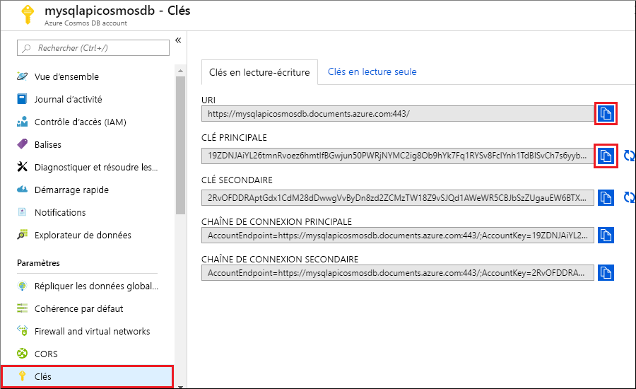

# <a name="azure-cosmos-db-build-a-sql-api-app-with-python-and-the-azure-portal"></a>Azure Cosmos DB : Développer une application API SQL grâce à Python et au Portail Azure

[!INCLUDE [cosmos-db-sql-api](../../includes/cosmos-db-sql-api.md)] 

Azure Cosmos DB est le service de base de données multi-modèle de Microsoft distribué à l’échelle mondiale. Rapidement, vous avez la possibilité de créer et d’interroger des documents, des paires clé/valeur, et des bases de données orientées graphe, profitant tous de la distribution à l’échelle mondiale et des capacités de mise à l’échelle horizontale au cœur d’Azure Cosmos DB. 

Ce guide de démarrage rapide explique comment créer, à l’aide du portail Azure, un compte Azure Cosmos DB, une base de données de documents, ainsi qu’une collection. Vous allez ensuite créer et exécuter une application console basée sur [l’API Python SQL](sql-api-sdk-python.md).

## <a name="prerequisites"></a>Prérequis

[!INCLUDE [quickstarts-free-trial-note](../../includes/quickstarts-free-trial-note.md)] 
[!INCLUDE [cosmos-db-emulator-docdb-api](../../includes/cosmos-db-emulator-docdb-api.md)]

* Par ailleurs :
    * Si vous n’avez pas encore installé Visual Studio 2017, vous pouvez télécharger et utiliser la version **gratuite** [Visual Studio 2017 Community Edition](https://www.visualstudio.com/downloads/). Veillez à activer **le développement Azure** lors de l’installation de Visual Studio.
    * Outils Python pour Visual Studio disponibles dans [GitHub](http://microsoft.github.io/PTVS/). Ce didacticiel utilise Python Tools for Visual Studio 2015.
    * Python 2.7 disponible auprès de [python.org](https://www.python.org/downloads/release/python-2712/)

## <a name="create-a-database-account"></a>Création d'un compte de base de données

[!INCLUDE [cosmos-db-create-dbaccount](../../includes/cosmos-db-create-dbaccount.md)]

## <a name="add-a-collection"></a>Ajouter une collection

[!INCLUDE [cosmos-db-create-collection](../../includes/cosmos-db-create-collection.md)]

## <a name="clone-the-sample-application"></a>Clonage de l’exemple d’application

À présent, nous allons cloner une application API SQL à partir de github, configurer la chaîne de connexion et l’exécuter. Vous pouvez constater à quel point il est facile de travailler par programmation avec des données. 

1. Ouvrez une fenêtre de terminal git, comme git bash, et accédez à un répertoire de travail à l’aide de la commande `cd`.  

2. Exécutez la commande suivante pour cloner l’exemple de référentiel : 

    ```bash
    git clone https://github.com/Azure-Samples/azure-cosmos-db-documentdb-python-getting-started.git
    ```  
## <a name="review-the-code"></a>Vérifier le code

Passons rapidement en revue ce qu’il se passe dans l’application. Ouvrez le fichier DocumentDBGetStarted.py, et vous découvrirez que ces lignes de code créent les ressources Azure Cosmos DB. 


* Le DocumentClient est initialisé.

    ```python
    # Initialize the Python client
    client = document_client.DocumentClient(config['ENDPOINT'], {'masterKey': config['MASTERKEY']})
    ```

* Une nouvelle base de données est créée.

    ```python
    # Create a database
    db = client.CreateDatabase({ 'id': config['SQL_DATABASE'] })
    ```

* Une nouvelle collection est créée.

    ```python
    # Create collection options
    options = {
        'offerEnableRUPerMinuteThroughput': True,
        'offerVersion': "V2",
        'offerThroughput': 400
    }

    # Create a collection
    collection = client.CreateCollection(db['_self'], { 'id': config['SQL_COLLECTION'] }, options)
    ```

* Certains documents sont créés.

    ```python
    # Create some documents
    document1 = client.CreateDocument(collection['_self'],
        { 
            'id': 'server1',
            'Web Site': 0,
            'Cloud Service': 0,
            'Virtual Machine': 0,
            'name': 'some' 
        })
    ```

* Une requête est effectuée grâce à SQL

    ```python
    # Query them in SQL
    query = { 'query': 'SELECT * FROM server s' }    
            
    options = {} 
    options['enableCrossPartitionQuery'] = True
    options['maxItemCount'] = 2

    result_iterable = client.QueryDocuments(collection['_self'], query, options)
    results = list(result_iterable);

    print(results)
    ```

## <a name="update-your-connection-string"></a>Mise à jour de votre chaîne de connexion

Maintenant, retournez dans le portail Azure afin d’obtenir les informations de votre chaîne de connexion et de les copier dans l’application.

1. Dans le [portail Azure](http://portal.azure.com/), dans votre compte Azure Cosmos DB, dans le volet de navigation de gauche, cliquez sur **Clés**, puis sur **Clés en lecture-écriture**. Vous utiliserez les boutons Copier sur le côté droit de l’écran pour copier l’URI et la clé primaire dans le fichier `DocumentDBGetStarted.py` à l’étape suivante.

    

2. Ouvrez le fichier `DocumentDBGetStarted.py`. 

3. Copiez votre valeur URI à partir du portail (à l’aide du bouton Copier) et définissez-la comme la valeur de la clé du point de terminaison dans `DocumentDBGetStarted.py`. 

    `'ENDPOINT': 'https://FILLME.documents.azure.com',`

4. Puis, copiez votre valeur de clé primaire à partir du portail et définissez-la comme la valeur de `config.MASTERKEY` dans `DocumentDBGetStarted.py`. Vous venez de mettre à jour votre application avec toutes les informations nécessaires pour communiquer avec Azure Cosmos DB. 

    `'MASTERKEY': 'FILLME',`
    
## <a name="run-the-app"></a>Exécution de l'application
1. Dans Visual Studio, cliquez avec le bouton droit sur le projet dans **l’Explorateur de solutions**, sélectionnez l’environnement Python actuel, puis cliquez avec le bouton droit.

2. Sélectionnez Installer le package Python, puis tapez dans **pydocumentdb**

3. Lancez F5 pour exécuter l'application. Votre application s’affiche dans votre navigateur. 

Vous pouvez dès à présent revenir à l’Explorateur de données et voir la requête, modifier et travailler avec ces nouvelles données. 

## <a name="review-slas-in-the-azure-portal"></a>Vérification des contrats SLA dans le portail Azure

[!INCLUDE [cosmosdb-tutorial-review-slas](../../includes/cosmos-db-tutorial-review-slas.md)]

## <a name="clean-up-resources"></a>Supprimer des ressources

Si vous ne pensez pas continuer à utiliser cette application, supprimez toutes les ressources créées durant ce guide de démarrage rapide dans le Portail Azure en procédant de la façon suivante :

1. Dans le menu de gauche du portail Azure, cliquez sur **Groupes de ressources**, puis sur le nom de la ressource que vous avez créée. 
2. Sur la page de votre groupe de ressources, cliquez sur **Supprimer**, tapez le nom de la ressource à supprimer dans la zone de texte, puis cliquez sur **Supprimer**.

## <a name="next-steps"></a>Étapes suivantes

Dans ce guide de démarrage rapide, vous avez appris à créer un compte Azure Cosmos DB, à créer une collection à l’aide de l’Explorateur de données, et à exécuter une application. Vous pouvez maintenant importer des données supplémentaires à votre compte Cosmos DB. 

> [!div class="nextstepaction"]
> [Importer des données dans Azure Cosmos DB pour l’API SQL](import-data.md)


