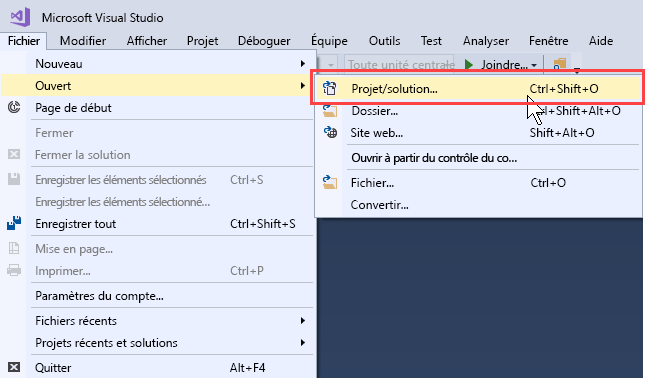
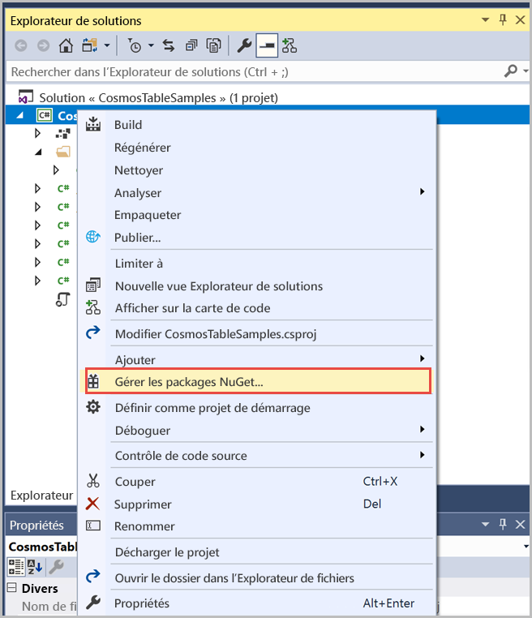
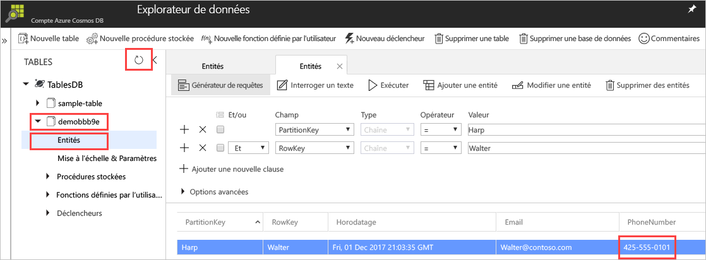

# <a name="quickstart-build-a-table-api-app-with-net-sdk-and-azure-cosmos-db"></a>Démarrage rapide : Créer une application d’API Table avec le SDK .NET et Azure Cosmos DB 

> [!div class="op_single_selector"]
> * [.NET](create-table-dotnet.md)
> * [Java](create-table-java.md)
> * [Node.JS](create-table-nodejs.md)
> * [Python](create-table-python.md)
>  

Ce guide de démarrage rapide montre comment utiliser .NET et [l’API Table](table-introduction.md) d’Azure Cosmos DB pour créer une application en clonant un exemple à partir de GitHub. Ce guide de démarrage rapide vous montre également comment créer un compte Azure Cosmos DB et comment utiliser l’Explorateur de données pour créer des tables et des entités dans le portail web Azure.

## <a name="prerequisites"></a>Prérequis

Si vous n'avez pas encore installé Visual Studio 2019, vous pouvez télécharger et utiliser la version **gratuite** [Visual Studio 2019 Community Edition](https://www.visualstudio.com/downloads/). Veillez à activer **le développement Azure** lors de l’installation de Visual Studio.

[!INCLUDE [quickstarts-free-trial-note](../../includes/quickstarts-free-trial-note.md)]

## <a name="create-a-database-account"></a>Création d’un compte de base de données

[!INCLUDE [cosmos-db-create-dbaccount-table](../../includes/cosmos-db-create-dbaccount-table.md)]

## <a name="add-a-table"></a>Ajouter une table

[!INCLUDE [cosmos-db-create-table](../../includes/cosmos-db-create-table.md)]

## <a name="add-sample-data"></a>Ajouter un exemple de données

[!INCLUDE [cosmos-db-create-table-add-sample-data](../../includes/cosmos-db-create-table-add-sample-data.md)]

## <a name="clone-the-sample-application"></a>Clonage de l’exemple d’application

À présent, nous allons cloner une application Table à partir de GitHub, configurer la chaîne de connexion et l’exécuter. Vous verrez combien il est facile de travailler par programmation avec des données. 

1. Ouvrez une invite de commandes, créez un nouveau dossier nommé git-samples, puis fermez l’invite de commandes.

   ```bash
   md "C:\git-samples"
   ```

2. Ouvrez une fenêtre de terminal git comme Git Bash et utilisez la commande `cd` pour accéder au nouveau dossier d’installation pour l’exemple d’application.

   ```bash
   cd "C:\git-samples"
   ```

3. Exécutez la commande suivante pour cloner l’exemple de référentiel : Cette commande crée une copie de l’exemple d’application sur votre ordinateur.

   ```bash
   git clone https://github.com/Azure-Samples/azure-cosmos-table-dotnet-core-getting-started.git
   ```

## <a name="open-the-sample-application-in-visual-studio"></a>Ouvrir l’exemple d’application dans Visual Studio

1. Dans Visual Studio, à partir du menu **Fichier**, choisissez **Ouvrir**, puis **Projet/Solution**. 

    

2. Accédez au dossier où vous avez cloné l’exemple d’application et ouvrez le fichier TableStorage.sln.

## <a name="update-your-connection-string"></a>Mise à jour de votre chaîne de connexion

Maintenant, retournez dans le portail Azure afin d’obtenir les informations de votre chaîne de connexion et de les copier dans l’application. Cette opération permet à votre application de communiquer avec votre base de données hébergée. 

1. Dans le [portail Azure](https://portal.azure.com/), cliquez sur **Chaîne de connexion**. Utilisez les boutons de copie sur le côté droit de la fenêtre pour copier la **CHAÎNE DE CONNEXION PRINCIPALE**.

   

2. Dans Visual Studio, ouvrez le fichier **Settings.json**. 

3. Collez la **CHAÎNE DE CONNEXION PRINCIPALE** du portail dans la valeur StorageConnectionString. Collez la chaîne entre les guillemets.

   ```csharp
   {
      "StorageConnectionString": "<Primary connection string from Azure portal>"
   }
   ```

4. Appuyez sur Ctrl+S pour enregistrer le fichier **Settings.json**.

Vous venez de mettre à jour votre application avec toutes les informations nécessaires pour communiquer avec Azure Cosmos DB. 

## <a name="build-and-deploy-the-app"></a>Génération et déploiement de l’application

1. Dans Visual Studio, cliquez avec le bouton droit sur le projet **CosmosTableSamples** dans **l’Explorateur de solutions**, puis cliquez sur **Gérer les packages NuGet**. 

   

2. Dans la zone **Parcourir** de NuGet, tapez Microsoft.Azure.Cosmos.Table. Cela permet de rechercher la bibliothèque cliente API de Table Cosmos DB. Notez que cette bibliothèque est actuellement disponible pour .NET Framework et .NET Standard. 
   
   

3. Cliquez sur **Installer** pour installer la bibliothèque **Microsoft.Azure.Cosmos.Table**. Cette opération installe le package API Table d’Azure Cosmos DB et toutes les dépendances.

4. Lorsque vous exécutez l’application entière, les données de l’exemple sont insérées dans l’entité table et supprimées à la fin pour n’afficher aucune donnée insérée si vous exécutez l’exemple en entier. Cependant, vous pouvez insérer des points d’arrêt pour visualiser les données. Ouvrez le fichier BasicSamples.cs, cliquez avec le bouton droit sur la ligne 52, sélectionnez **Point d’arrêt**, puis **Insérer un point d’arrêt**. Insérez un autre point d’arrêt sur la ligne 55.

    

5. Appuyez sur F5 pour exécuter l'application. La fenêtre de console affiche le nom de la nouvelle base de données de tables (dans ce cas demoa13b1) dans Azure Cosmos DB. 
    
   

   Lorsque vous atteignez le premier point d’arrêt, revenez à l’Explorateur de données dans le portail Azure. Cliquez sur le **Actualiser** bouton, développez la table demo*, puis cliquez sur **Entités**. L’onglet **Entités** situé à droite affiche la nouvelle entité qui a été ajoutée pour Walter Harp. Notez que le numéro de téléphone de la nouvelle entité est 425-555-0101.

   
    
   Si vous voyez une erreur indiquant qu’un fichier Settings.json n’a pas été trouvé pendant l’exécution du projet, vous pouvez la résoudre en ajoutant l’entrée XML suivante dans les paramètres du projet. Cliquez avec le bouton droit sur CosmosTableSamples, sélectionnez Modifier CosmosTableSamples.csproj et ajoutez l’élément itemGroup suivant : 

   ```csharp
     <ItemGroup>
       <None Update="Settings.json">
         <CopyToOutputDirectory>PreserveNewest</CopyToOutputDirectory>
       </None>
     </ItemGroup>
   ```

6. Fermez l’onglet **Entités** dans l’Explorateur de données.
    
7. Appuyez sur F5 pour exécuter l’application jusqu’au point d’arrêt suivant. 

    Lorsque vous atteignez le point d’arrêt, revenez au portail, cliquez à nouveau sur **Entités** pour ouvrir l’onglet **Entités**, et notez que le numéro de téléphone a été remplacé par 425-555-0105.

8. Appuyez sur F5 pour exécuter l’application. 
 
   L’application ajoute des entités à utiliser dans un exemple d’application avancée que l’API Table ne prend pas en charge actuellement. L’application supprime ensuite la table créée par l’exemple d’application.

9. Dans la fenêtre de console, appuyez sur Entrée pour mettre fin à l’exécution de l’application. 
  

## <a name="review-slas-in-the-azure-portal"></a>Vérification des contrats SLA dans le portail Azure

[!INCLUDE [cosmosdb-tutorial-review-slas](../../includes/cosmos-db-tutorial-review-slas.md)]

## <a name="clean-up-resources"></a>Supprimer des ressources

[!INCLUDE [cosmosdb-delete-resource-group](../../includes/cosmos-db-delete-resource-group.md)]

## <a name="next-steps"></a>Étapes suivantes

Dans ce guide de démarrage rapide, vous avez appris à créer un compte Azure Cosmos DB, à créer une table à l’aide de l’Explorateur de données, et à exécuter une application.  Maintenant, vous pouvez interroger vos données à l’aide de l’API Table.  

> [!div class="nextstepaction"]
> [Importer des données de table dans l’API Table](table-import.md)

