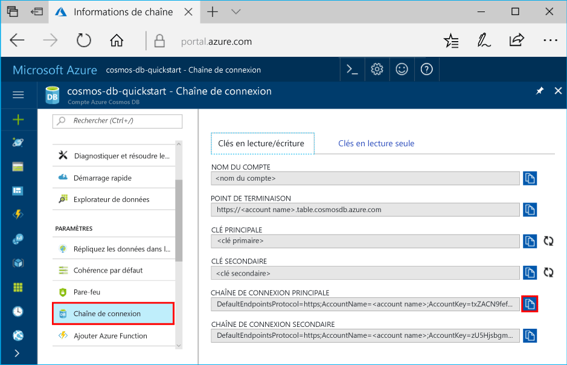

# <a name="quickstart-build-a-table-api-app-with-net-and-azure-cosmos-db"></a>Démarrage rapide : Créer une application d’API Table avec .NET et Azure Cosmos DB 

Ce guide de démarrage rapide montre comment utiliser Java et [l’API Table](table-introduction.md) d’Azure Cosmos DB pour créer une application en clonant un exemple à partir de GitHub. Ce guide de démarrage rapide vous montre également comment créer un compte Azure Cosmos DB et comment utiliser l’Explorateur de données pour créer des tables et des entités dans le portail web Azure.

Azure Cosmos DB est le service de base de données multi-modèle de Microsoft distribué à l’échelle mondiale. Rapidement, vous avez la possibilité de créer et d’interroger des documents, des paires clé/valeur, et des bases de données orientées graphe, profitant tous de la distribution à l’échelle mondiale et des capacités de mise à l’échelle horizontale au cœur d’Azure Cosmos DB. 

## <a name="prerequisites"></a>Composants requis

Si vous n’avez pas encore installé Visual Studio 2017, vous pouvez télécharger et utiliser la version **gratuite** [Visual Studio 2017 Community Edition](https://www.visualstudio.com/downloads/). Veillez à activer **le développement Azure** lors de l’installation de Visual Studio.

[!INCLUDE [quickstarts-free-trial-note](../../includes/quickstarts-free-trial-note.md)]

## <a name="create-a-database-account"></a>Création d'un compte de base de données

[!INCLUDE [cosmos-db-create-dbaccount-table](../../includes/cosmos-db-create-dbaccount-table.md)]

## <a name="add-a-table"></a>Ajouter une table

[!INCLUDE [cosmos-db-create-table](../../includes/cosmos-db-create-table.md)]

## <a name="add-sample-data"></a>Ajouter un exemple de données

Vous pouvez maintenant ajouter des données à votre nouvelle table grâce à l’Explorateur de données.

1. Dans l’Explorateur de données, développez **exemple de table**, cliquez sur **Entités**, puis cliquez sur **Ajouter une entité**.

   
2. À présent, ajoutez des données à la zone de valeur PartitionKey et aux zones de valeur RowKey, puis cliquez sur **Ajouter une entité**.

   
  
    Vous pouvez maintenant ajouter des entités supplémentaires à votre table, éditer vos entités, ou interroger vos données dans l’Explorateur de données. À partir de l’Explorateur de données, vous pouvez également faire évoluer votre débit et ajouter des procédures stockées, des fonctions définies par l’utilisateur, et ajouter à votre table des déclencheurs.

## <a name="clone-the-sample-application"></a>Clonage de l’exemple d’application

À présent, nous allons cloner une application Table à partir de GitHub, configurer la chaîne de connexion et l’exécuter. Vous verrez combien il est facile de travailler par programmation avec des données. 

1. Ouvrez une fenêtre de terminal git comme Git Bash et utilisez la commande `cd` pour accéder à un dossier d’installation pour l’exemple d’application. 

    ```bash
    cd "C:\git-samples"
    ```

2. Exécutez la commande suivante pour cloner l’exemple de référentiel : Cette commande crée une copie de l’exemple d’application sur votre ordinateur. 

    ```bash
    git clone https://github.com/Azure-Samples/storage-table-dotnet-getting-started.git
    ```

3. Ouvrez ensuite le fichier solution TableStorage dans Visual Studio. 

## <a name="update-your-connection-string"></a>Mise à jour de votre chaîne de connexion

Maintenant, retournez dans le portail Azure afin d’obtenir les informations de votre chaîne de connexion et de les copier dans l’application. Cette opération permet à votre application de communiquer avec votre base de données hébergée. 

1. Dans le [portail Azure](http://portal.azure.com/), cliquez sur **Chaîne de connexion**. 

    Utilisez les boutons de copie sur le côté droit de l’écran pour copier la CHAÎNE DE CONNEXION PRINCIPALE.

    

2. Dans Visual Studio, ouvrez le fichier App.config. 

3. Supprimez les marques de commentaire de la chaîne StorageConnectionString à la ligne 8 et commentez la chaîne StorageConnectionString à la ligne 7, étant donné que ce didacticiel n’utilise pas l’émulateur de stockage. 

3. Collez la valeur de la CHAÎNE DE CONNEXION PRINCIPALE dans la valeur de la chaîne StorageConnectionString à la ligne 8. 

    ```
    <add key="StorageConnectionString" value="DefaultEndpointsProtocol=https;AccountName=[AccountName];AccountKey=[AccountKey]" />`
    ```

    La ligne 8 doit maintenant ressembler à

    ```
    <add key="StorageConnectionString" value="DefaultEndpointsProtocol=https;AccountName=<account name>;AccountKey=txZACN9f...==;TableEndpoint=https://<account name>.table.cosmosdb.azure.com;" />
    ```

4. Enregistrez le fichier App.config.

Vous venez de mettre à jour votre application avec toutes les informations nécessaires pour communiquer avec Azure Cosmos DB. 

## <a name="build-and-deploy-the-app"></a>Génération et déploiement de l’application

1. Dans Visual Studio, cliquez avec le bouton droit sur le projet **TableStorage**dans **l’Explorateur de solutions**, puis cliquez sur **Gérer les packages NuGet**. 

2. Dans la zone **Parcourir** de NuGet, tapez *Microsoft.Azure.CosmosDB.Table*.

3. À partir des résultats, installez la bibliothèque **Microsoft.Azure.CosmosDB.Table**. Cette opération installe le package API Table d’Azure Cosmos DB, ainsi que toutes les dépendances.

4. Appuyez sur Ctrl + F5 pour exécuter l’application.

    La fenêtre de console affiche les données de table qui sont ajoutées à la nouvelle base de données de tables dans Azure Cosmos DB.

    Vous pouvez dès à présent revenir à l’Explorateur de données et voir la requête, modifier et travailler avec ces nouvelles données.

## <a name="review-slas-in-the-azure-portal"></a>Examiner les SLA dans le Portail Azure

[!INCLUDE [cosmosdb-tutorial-review-slas](../../includes/cosmos-db-tutorial-review-slas.md)]

## <a name="clean-up-resources"></a>Supprimer des ressources

[!INCLUDE [cosmosdb-delete-resource-group](../../includes/cosmos-db-delete-resource-group.md)]

## <a name="next-steps"></a>Étapes suivantes

Dans ce guide de démarrage rapide, vous avez appris à créer un compte Azure Cosmos DB, à créer une table à l’aide de l’Explorateur de données, et à exécuter une application.  Maintenant, vous pouvez interroger vos données à l’aide de l’API Table.  

> [!div class="nextstepaction"]
> [Importer des données de table dans l’API Table](table-import.md)

