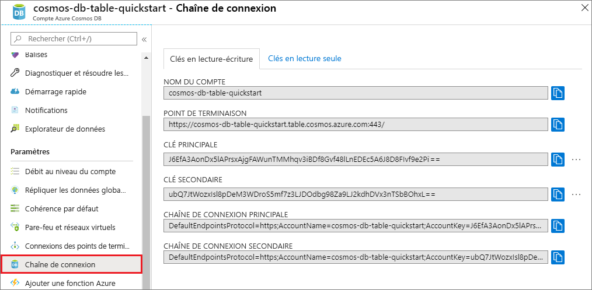

# <a name="quickstart-build-a-table-api-app-with-nodejs-and-azure-cosmos-db"></a>Démarrage rapide : Créer une application d’API Table avec Node.js et Azure Cosmos DB

Ce démarrage rapide montre comment utiliser Node.js et [l’API Table](table-introduction.md) d’Azure Cosmos DB pour créer une application en clonant un exemple à partir de GitHub. Ce guide de démarrage rapide vous montre également comment créer un compte Azure Cosmos DB et comment utiliser l’Explorateur de données pour créer des tables et des entités dans le portail web Azure.

Azure Cosmos DB est le service de base de données multi-modèle de Microsoft distribué à l’échelle mondiale. Vous avez la possibilité de créer et d’interroger rapidement des bases de données de documents, de paires clé/valeur, de colonnes larges et de graphes, qui bénéficient toutes des capacités de distribution mondiale et de mise à l’échelle horizontale qui sont au cœur d’Azure Cosmos DB. 

## <a name="prerequisites"></a>Prérequis

[!INCLUDE [quickstarts-free-trial-note](../../includes/quickstarts-free-trial-note.md)]
[!INCLUDE [cosmos-db-emulator-docdb-api](../../includes/cosmos-db-emulator-docdb-api.md)]

Par ailleurs :

* [Node.js](https://nodejs.org/en/) version v0.10.29 ou ultérieure
* [Git](http://git-scm.com/)

## <a name="create-a-database-account"></a>Création d'un compte de base de données

> [!IMPORTANT] 
> Vous devez créer un compte d’API Table pour utiliser les kits SDK d’API Table mis à la disposition générale. Les comptes d’API Table créés pendant la durée de la préversion ne sont pas pris en charge par les kits SDK mis à la disposition générale.
>

[!INCLUDE [cosmos-db-create-dbaccount-table](../../includes/cosmos-db-create-dbaccount-table.md)]

## <a name="add-a-table"></a>Ajouter une table

[!INCLUDE [cosmos-db-create-table](../../includes/cosmos-db-create-table.md)]

## <a name="add-sample-data"></a>Ajouter un exemple de données

[!INCLUDE [cosmos-db-create-table-add-sample-data](../../includes/cosmos-db-create-table-add-sample-data.md)]

## <a name="clone-the-sample-application"></a>Clonage de l’exemple d’application

À présent, nous allons cloner une application Table à partir de GitHub, configurer la chaîne de connexion et l’exécuter. Vous verrez combien il est facile de travailler par programmation avec des données. 

1. Ouvrez une invite de commandes, créez un nouveau dossier nommé git-samples, puis fermez l’invite de commandes.

    ```bash
    md "C:\git-samples"
    ```

2. Ouvrez une fenêtre de terminal git comme Git Bash et utilisez la commande `cd` pour accéder au nouveau dossier d’installation pour l’exemple d’application.

    ```bash
    cd "C:\git-samples"
    ```

3. Exécutez la commande suivante pour cloner l’exemple de référentiel : Cette commande crée une copie de l’exemple d’application sur votre ordinateur.

    ```bash
    git clone https://github.com/Azure-Samples/storage-table-node-getting-started.git
    ```

## <a name="update-your-connection-string"></a>Mise à jour de votre chaîne de connexion

Maintenant, retournez dans le portail Azure afin d’obtenir les informations de votre chaîne de connexion et de les copier dans l’application. Cette opération permet à votre application de communiquer avec votre base de données hébergée. 

1. Dans le [portail Azure](http://portal.azure.com/), cliquez sur **Chaîne de connexion**. 

    

2. Copiez la CHAÎNE DE CONNEXION PRINCIPALE à l’aide du bouton Copier à droite.

3. Ouvrez le fichier app.config, puis collez la valeur dans connectionString à la ligne trois. 

    > [!IMPORTANT]
    > Si votre point de terminaison utilise documents.azure.com, cela signifie que vous disposez d’un compte de version préliminaire et que vous devez créer un [nouveau compte d’API Table](#create-a-database-account) à utiliser avec le Kit de développement logiciel (SDK) d’API Table généralement disponible.
    >

3. Enregistrez le fichier app.config.

Vous venez de mettre à jour votre application avec toutes les informations nécessaires pour communiquer avec Azure Cosmos DB. 

## <a name="run-the-app"></a>Exécution de l'application

1. Dans la fenêtre de terminal git, exécutez `cd` pour accéder au dossier storage-table-java-getting-started.

    ```
    cd "C:\git-samples\storage-table-node-getting-started"
    ```

2. Exécutez la commande suivante pour installer les modules [azure], [node-uuid], [nconf] et [async] en local et pour enregistrer une entrée leur correspondant dans le fichier package.json

   ```
   npm install azure-storage node-uuid async nconf --save
   ```

2. Dans la fenêtre de terminal git, exécutez les commandes suivantes pour démarrer l’application Node.

    ```
    node ./tableSample.js 
    ```

    La fenêtre de console affiche les données de table qui sont ajoutées à la nouvelle base de données de tables dans Azure Cosmos DB.

    Vous pouvez dès à présent revenir à l’Explorateur de données et voir la requête, modifier et travailler avec ces nouvelles données. 

## <a name="review-slas-in-the-azure-portal"></a>Vérification des contrats SLA dans le portail Azure

[!INCLUDE [cosmosdb-tutorial-review-slas](../../includes/cosmos-db-tutorial-review-slas.md)]

## <a name="clean-up-resources"></a>Supprimer des ressources

[!INCLUDE [cosmosdb-delete-resource-group](../../includes/cosmos-db-delete-resource-group.md)]

## <a name="next-steps"></a>Étapes suivantes

Dans ce guide de démarrage rapide, vous avez appris à créer un compte Azure Cosmos DB, à créer une table à l’aide de l’Explorateur de données, et à exécuter une application.  Maintenant, vous pouvez interroger vos données à l’aide de l’API Table.  

> [!div class="nextstepaction"]
> [Importer des données de table dans l’API Table](table-import.md)
