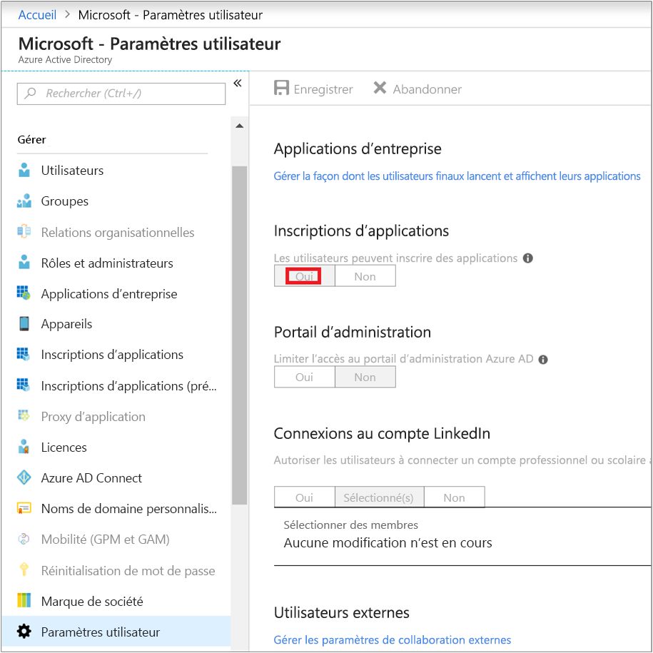
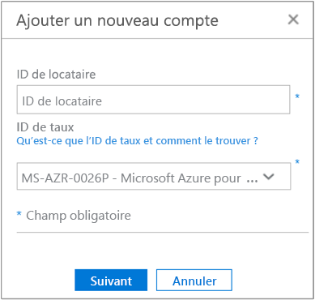
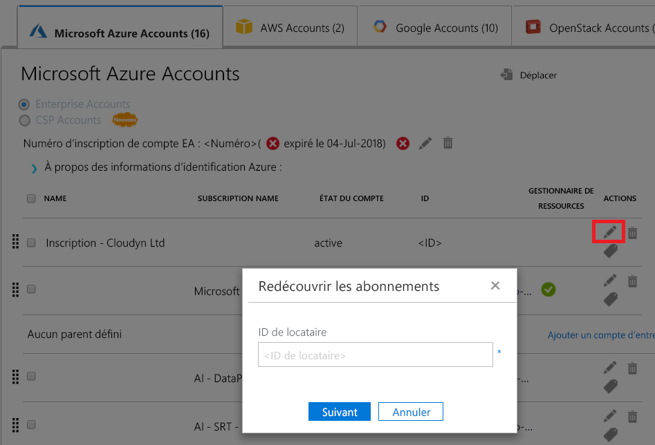

# <a name="activate-azure-subscriptions-and-accounts-with-cloudyn"></a>Activer des abonnements et des comptes Azure avec Cloudyn

L’ajout ou la mise à jour de vos informations d’identification Azure Resource Manager permet à Cloudyn de découvrir tous les comptes et abonnements au sein de votre locataire Azure. De plus, si l’extension Diagnostics Azure est activée sur vos machines virtuelles, Cloudyn peut collecter les métriques étendues telles que l’utilisation du processeur et de la mémoire. Cet article explique comment activer l’accès à l’aide des API Azure Resource Manager pour les comptes nouveaux et existants. Il indique également comment et résoudre les problèmes de compte courants.

Cloudyn ne peut pas accéder à la plupart des données de votre abonnement Azure quand celui-ci _n’est pas activé_. Vous devez modifier les comptes _non activés_ afin que Cloudyn puisse y accéder.

[!INCLUDE [cloudyn-note](../../../includes/cloudyn-note.md)]

## <a name="required-azure-permissions"></a>Autorisations Azure requises

Des autorisations spécifiques sont nécessaires pour effectuer les procédures de cet article. Votre administrateur de locataire ou vous-même devez avoir les deux autorisations suivantes :

- Autorisation d’inscrire l’application CloudynCollector auprès de votre locataire Azure AD.
- Possibilité d’affecter l’application à un rôle dans vos abonnements Azure.

Dans vos abonnements Azure, vos comptes doivent avoir un accès `Microsoft.Authorization/*/Write` pour affecter l’application CloudynCollector. Cette action est accordée par le biais du rôle [Propriétaire](../../role-based-access-control/built-in-roles.md#owner) ou [Administrateur de l’accès utilisateur](../../role-based-access-control/built-in-roles.md#user-access-administrator).

Si le rôle **Collaborateur** est affecté à votre compte, vous ne disposez pas de l’autorisation appropriée pour affecter l’application. Vous recevez une erreur quand vous tentez d’affecter l’application CloudynCollector à votre abonnement Azure.

### <a name="check-azure-active-directory-permissions"></a>Vérifier les autorisations Azure Active Directory

1. Connectez-vous au [portail Azure](https://portal.azure.com).
2. Dans le portail Azure, sélectionnez **Azure Active Directory**.
3. Dans Azure Active Directory, sélectionnez **Paramètres utilisateur**.
4. Vérifiez l’option **Inscriptions d’applications**.
    - Si elle est définie sur **Oui**, les utilisateurs non-administrateurs peuvent inscrire des applications AD. Ce paramètre signifie que n’importe quel utilisateur dans Azure AD peut inscrire une application.  
    
    - Si l’option **Inscriptions des applications** est définie sur **Non**, seuls les utilisateurs administratifs de locataire peuvent inscrire des applications Azure Active Directory. Votre administrateur de locataire doit inscrire l’application CloudynCollector.


## <a name="add-an-account-or-update-a-subscription"></a>Ajouter un compte ou mettre à jour un abonnement

Quand vous ajoutez un compte ou mettez à jour un abonnement, vous accordez à Cloudyn l’accès à vos données Azure.

### <a name="add-a-new-account-subscription"></a>Ajouter un nouveau compte (abonnement)

1. Dans le portail Cloudyn, cliquez sur le symbole d’engrenage dans le coin supérieur droit et sélectionnez **Cloud Accounts** (Comptes cloud).
2. Cliquez sur **Ajouter un compte** ; la boîte de dialogue **Ajouter un compte** s’affiche. Entrez les informations requises.  
    

### <a name="update-a-subscription"></a>Mettre à jour un abonnement

1. Si vous souhaitez mettre à jour un abonnement _non activé_ qui existe déjà dans la section de gestion des comptes de Cloudyn, cliquez sur le symbole crayon (modification) à droite du _GUID de locataire_ parent. Les abonnements sont regroupés sous un locataire parent, évitez donc d’activer les abonnements individuellement.
    
2. Si nécessaire, entrez l’ID de locataire. Si vous ne le connaissez pas, effectuez les étapes suivantes pour le rechercher :
    1. Connectez-vous au [portail Azure](https://portal.azure.com).
    2. Dans le portail Azure, sélectionnez **Azure Active Directory**.
    3. Pour obtenir l’ID de locataire, sélectionnez **Propriétés** pour votre client Azure AD.
    4. Copiez le GUID ID de répertoire. Cette valeur est votre ID de locataire.
    Pour plus d’informations, consultez [Obtenir l’ID de locataire](../../active-directory/develop/howto-create-service-principal-portal.md#get-values-for-signing-in).
3. Si nécessaire, sélectionnez votre Code produit. Si vous ne le connaissez pas, effectuez les étapes suivantes pour le rechercher.
    1. Dans l’angle supérieur droit du portail Azure, cliquez sur vos informations utilisateur, puis sur **Afficher ma facture**.
    2. Sous **Compte de facturation**, cliquez sur **Abonnements**.
    3. Sous **Mes abonnements**, sélectionnez l’abonnement.
    4. Votre code produit est affiché sous **ID de l’offre**. Copiez l’ID de l’offre de l’abonnement.
4. Dans la boîte de dialogue Ajouter un compte (ou Modifier l’abonnement), cliquez sur **Enregistrer** (ou **Suivant**). Vous êtes redirigé vers le portail Azure.
5. Connectez-vous au portail. Cliquez sur **Accepter** pour autoriser Cloudyn Collector à accéder à votre compte Azure.

    Vous êtes redirigé vers la page de gestion des comptes Cloudyn et votre abonnement est mis à jour avec un état du compte **actif**. Il doit afficher un symbole de coche verte dans la colonne Resource Manager.

    Si vous ne voyez pas un symbole de coche verte pour un ou plusieurs des abonnements, cela signifie que vous n’avez pas d’autorisations pour créer l’application de lecteur (le CloudynCollector) pour l’abonnement. Un utilisateur avec des autorisations plus élevées pour l’abonnement doit répéter ce processus.

Pour une présentation de ce processus, regardez la vidéo [Connecting to Azure Resource Manager with Cloudyn](https://youtu.be/oCIwvfBB6kk).

>[!VIDEO https://www.youtube.com/embed/oCIwvfBB6kk?ecver=1]

## <a name="resolve-common-indirect-enterprise-set-up-problems"></a>Résoudre des problèmes courants de configuration d’entreprise indirecte

Lorsque vous utilisez le portail Cloudyn pour la première fois, les messages suivants peuvent s’afficher si vous disposez d’un contrat Entreprise ou de fournisseur de solutions cloud (CSP) :

- *La clé d’API spécifiée n’est pas une clé d’inscription de niveau supérieur* dans l’Assistant **Configurer Cloudyn**.
- *Inscription directe – Non*, sur le portail Contrat Entreprise.
- *Aucune donnée d’utilisation trouvée pour les 30 derniers jours. Contactez votre distributeur pour vous assurer que le balisage a été activé pour votre compte Azure* s’affiche dans le portail Cloudyn.

Ces messages indiquent que vous avez acheté un Contrat Entreprise Azure via un revendeur ou un CSP. Votre revendeur ou CSP doit activer le _balisage_ pour votre compte Azure afin que vous puissiez afficher vos données dans Cloudyn.

Voici comment corriger les problèmes :

1. Votre revendeur doit activer le _balisage_ pour votre compte. Consultez les instructions sous [Indirect Customer Onboarding Guide](https://ea.azure.com/api/v3Help/v2IndirectCustomerOnboardingGuide) (Guide d’intégration de client indirecte).
2. Vous générez la clé Azure Enterprise Agreement à utiliser avec Cloudyn. Pour connaître les instruction, consultez [Inscrire un Accord Entreprise Azure et afficher les données de coût](https://docs.microsoft.com/azure/cost-management/quick-register-ea).

Afin de pouvoir générer la clé API Azure Enterprise Agreement pour configurer Cloudyn, activez l’API de facturation Azure en suivant les instructions sous :

- [Vue d’ensemble des API de création de rapports pour les clients Enterprise](../manage/enterprise-api.md)
- [API de création de rapports Microsoft Azure Enterprise Portal](https://ea.azure.com/helpdocs/reportingAPI) sous **Autoriser l’API à accéder aux données**

Vous devrez peut-être également accorder aux administrateurs de service, propriétaires de compte et administrateurs d’entreprise l’autorisation _d’afficher les frais_ avec l’API de facturation.

Seul un administrateur de service Azure peut activer Cloudyn. Les autorisations de coadministrateur sont insuffisantes. Vous pouvez toutefois contourner l’exigence de l’administrateur. Vous pouvez demander à votre administrateur Azure Active Directory qu’il vous accorde une autorisation afin d’autoriser le **CloudynAzureCollector** avec un script PowerShell. Le script suivant accorde l’autorisation d’inscrire le principal du service Azure Active Directory **CloudynAzureCollector**.


```powershell
#THE SOFTWARE IS PROVIDED "AS IS", WITHOUT WARRANTY OF ANY KIND, EXPRESS OR IMPLIED, INCLUDING BUT NOT LIMITED TO THE WARRANTIES OF MERCHANTABILITY, FITNESS FOR A PARTICULAR PURPOSE AND NONINFRINGEMENT. IN NO EVENT SHALL THE AUTHORS OR COPYRIGHT HOLDERS BE LIABLE FOR ANY CLAIM, DAMAGES OR OTHER LIABILITY, WHETHER IN AN ACTION OF CONTRACT, TORT OR OTHERWISE, ARISING FROM, OUT OF OR IN CONNECTION WITH THE SOFTWARE OR THE USE OR OTHER DEALINGS IN THE SOFTWARE.

#Tenant - enter your tenant ID or Name
$tenant = "<ReplaceWithYourTenantID>"

#Cloudyn Collector application ID
$appId = "83e638ef-7885-479f-bbe8-9150acccdb3d"

#URL to activate the consent screen
$url = "https://login.windows.net/"+$tenant+"/oauth2/authorize?api-version=1&response_type=code&client_id="+$appId+"&redirect_uri=http%3A%2F%2Flocalhost%3A8080%2FCloudynJava&prompt=consent"

#Choose your browser, the default is Internet Explorer

#Chrome
#[System.Diagnostics.Process]::Start("chrome.exe", "--incognito $url")

#Firefox
#[System.Diagnostics.Process]::Start("firefox.exe","-private-window $url" )

#IExplorer
[System.Diagnostics.Process]::Start("iexplore.exe","$url -private" )

```

## <a name="next-steps"></a>Étapes suivantes

- Si vous n’avez pas encore suivi le premier tutoriel de Cloudyn, consultez-le dans [Réviser l’utilisation et les coûts](tutorial-review-usage.md).
