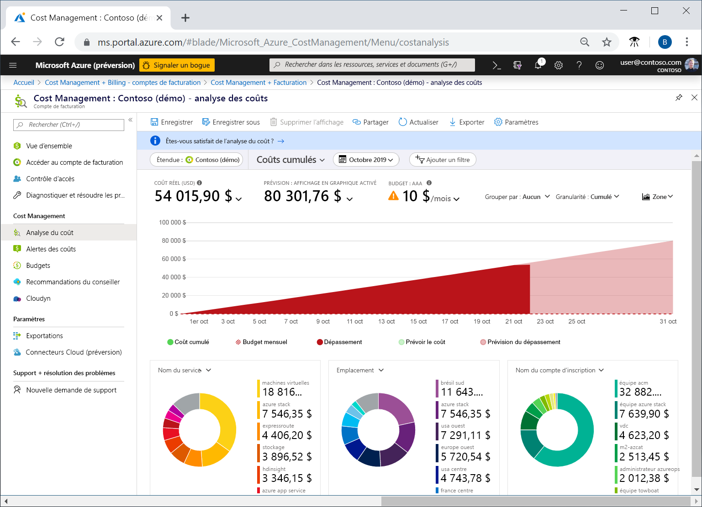
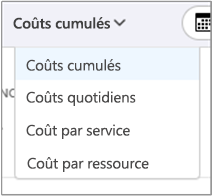
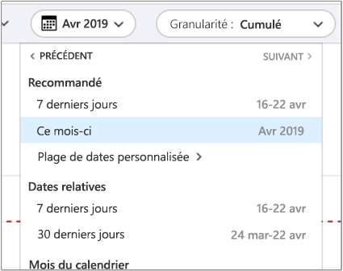
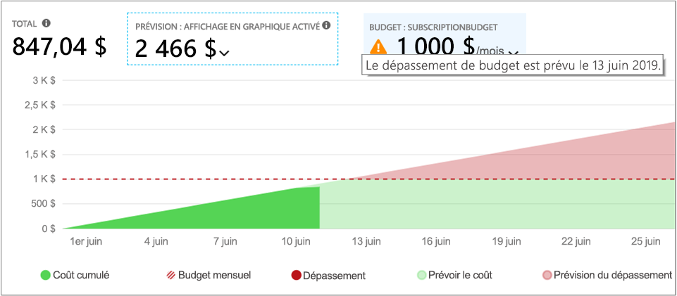
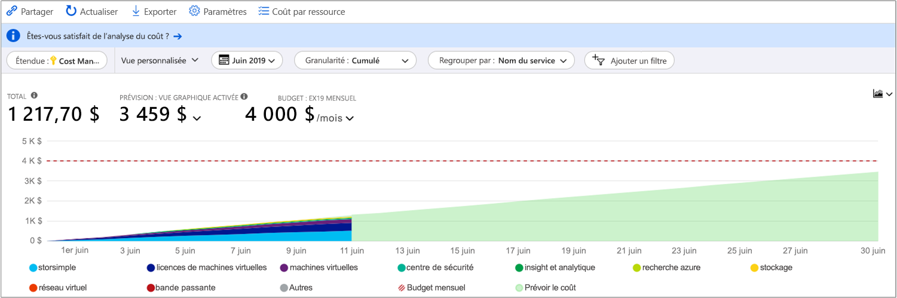
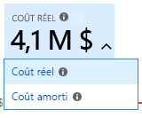
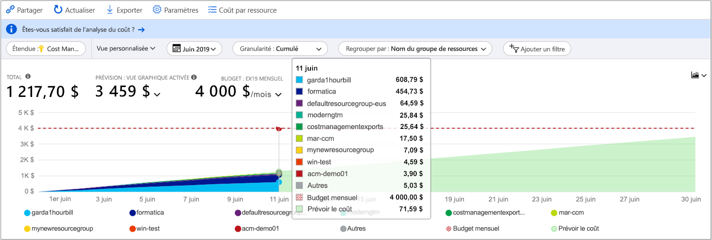
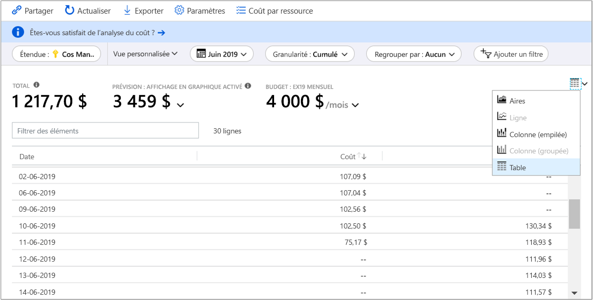

# <a name="quickstart-explore-and-analyze-costs-with-cost-analysis"></a>Démarrage rapide : Explorer et analyser les coûts avec l’analyse du coût

Pour pouvoir contrôler et optimiser vos coûts Azure correctement, vous devez comprendre d’où proviennent les coûts au sein de votre organisation. Il est également utile de connaître le coût de vos services, notamment en fonction des environnements et des systèmes. La visibilité de la totalité des coûts est essentielle pour comprendre avec précision les modèles de dépenses de l’organisation. Vous pouvez utiliser des modèles de dépenses pour appliquer des mécanismes de contrôle des coûts, tels que des budgets.

Dans ce guide de démarrage rapide, vous utilisez l’analyse du coût pour explorer et analyser les coûts Azure de votre organisation. Vous pouvez voir les coûts agrégés par l’organisation afin de comprendre d’où ils viennent et d’identifier les tendances de dépenses. Vous pouvez aussi voir les coûts cumulés au fil du temps pour évaluer des tendances mensuelles, trimestrielles ou même annuelles par rapport à un budget. Un budget permet de faire respecter des contraintes financières. Il est aussi utilisé pour voir les coûts de chaque jour ou de chaque mois afin d’isoler les irrégularités dans les dépenses. De plus, vous pouvez télécharger les données du rapport actuel en vue de les analyser de manière plus approfondie ou de les utiliser dans un système externe.

Dans ce guide de démarrage rapide, vous apprenez à :

- Passer en revue les coûts dans l’analyse du coût
- Personnaliser les vues des coûts
- Télécharger les données de l’analyse du coût


## <a name="prerequisites"></a>Conditions préalables requises

L’analyse des coûts prend en charge différents types de comptes Azure. Pour accéder à la liste complète des types de comptes pris en charge, voir [Comprendre les données de Cost Management](understand-cost-mgt-data.md). Pour afficher les données de coût, vous avez au minimum besoin d’un accès en lecture pour votre compte Azure.

Pour plus d’informations sur l’attribution de l’accès aux données Azure Cost Management, consultez [Assigner l’accès aux données](../../cost-management/assign-access-acm-data.md).

## <a name="sign-in-to-azure"></a>Connexion à Azure

- Connectez-vous au portail Azure sur https://portal.azure.com.

## <a name="review-costs-in-cost-analysis"></a>Passer en revue les coûts dans l’analyse du coût

Pour examiner vos coûts via la fonctionnalité d’analyse des coûts, ouvrez l’étendue dans le portail Azure et sélectionnez **Analyse du coût** dans le menu. Par exemple, accédez à **Abonnements**, sélectionnez un abonnement dans la liste, puis sélectionnez **Analyse du coût** dans le menu. Utilisez le paramètre **Étendue** pour passer à une autre étendue dans l’analyse des coûts. Pour plus d’informations sur les étendues, consultez [Comprendre et utiliser les étendues](understand-work-scopes.md).

L’étendue que vous sélectionnez est utilisée à travers Cost Management pour consolider les données et contrôler l’accès aux informations sur les coûts. Quand vous utilisez des étendues, vous n’opérez pas une sélection multiple. Au lieu de cela, vous sélectionnez une étendue plus grande qui en regroupe d’autres, puis vous filtrez jusqu’aux portées imbriquées dont vous avez besoin. Il est important de comprendre cette approche, car il est possible que certaines personnes n’aient pas accès à une étendue parente unique qui couvre plusieurs étendues imbriquées.

L’affichage initial de l’analyse du coût inclut les zones suivantes.

**Vue Coûts cumulés** : représente la configuration de la vue Coûts cumulés prédéfinie. Chaque vue comprend les options Plage de dates, Granularité, Regrouper par et Ajouter un filtre. La vue par défaut montre les coûts cumulés pour la période de facturation actuelle. Vous pouvez cependant choisir une autre vue intégrée. Pour plus d’informations, consultez [Personnaliser les vues des coûts](#customize-cost-views).

**Coût réel** : montre le total de l’utilisation et des coûts d’achat pour le mois en cours, tels qu’ils sont comptabilisés et qu’ils apparaissent sur votre facture.

**Prévision** : affiche le total des coûts prévisionnels pour la période de votre choix (l’option de prévision est en préversion).

**Budget** : indique la limite de dépenses planifiée pour l’étendue sélectionnée, si disponible.

**Granularité : Cumulés** : montre le total des dépenses quotidiennes cumulées, depuis le début de la période de facturation. Après avoir [créé un budget](tutorial-acm-create-budgets.md) pour votre compte de facturation ou votre abonnement, vous pouvez rapidement voir la tendance de vos dépenses par rapport au budget. Placez le curseur sur une date pour voir le coût cumulé de cette journée.

**Graphiques croisés dynamiques (anneau)**  : fournissent des tableaux croisés dynamiques où le coût total est détaillé par un ensemble commun de propriétés standard. Ils affichent les coûts des plus élevés au plus bas pour le mois en cours. Vous pouvez changer les graphiques croisés dynamiques à tout moment en sélectionnant un critère de croisement différent. Les coûts sont classés par service (catégorie comptage), emplacement (région) et étendue enfant par défaut. Par exemple, les comptes d’inscription figurent sous les comptes de facturation, les groupes de ressources sous les abonnements et les ressources sous les groupes de ressources.



## <a name="customize-cost-views"></a>Personnaliser les vues des coûts

L’analyse des coûts dispose de quatre affichages intégrés, optimisés pour les objectifs les plus courants :

Affichage | Répondre aux questions comme
--- | ---
Coûts cumulés | Combien ai-je dépensé jusqu’ici ce mois-ci ? Est-ce que je vais respecter mon budget ?
Coûts quotidiens | Y a-t-il eu une augmentation des coûts par jour pour les 30 derniers jours ?
Coût par service | Comment mon utilisation mensuelle a-t-elle varié sur les trois dernières factures ?
Coût par ressource | Quelles ressources ont été les plus onéreuses jusqu’ici ce mois-ci ?



Toutefois, il existe de nombreux cas où vous avez besoin d’une analyse plus approfondie. La personnalisation démarre en haut de la page, avec la sélection de la date.

L’analyse du coût affiche les données du mois en cours par défaut. Utilisez le sélecteur de date pour passer rapidement à des plages de dates communes. Il peut s’agit, par exemple, des sept derniers jours, du mois dernier, de l’année en cours ou de une plage de dates personnalisée. Les abonnements de paiement à l’utilisation incluent également des plages de dates en fonction de votre période de facturation (qui n’est pas liée au mois calendaire), telles que la période de facturation actuelle ou la dernière facture. Utilisez les liens **< PRÉCÉDENT** et **SUIVANT >** en haut du menu pour accéder respectivement à la période précédente ou suivante. Par exemple, **<PRÉCÉDENT** passe de la période **7 derniers jours** aux périodes **8 à 14 jours passés**, puis **15 à 21 jours passés**.



L’analyse du coût montre les coûts **cumulés** par défaut. Les coûts cumulés incluent tous les coûts de chaque jour plus des jours précédents, pour obtenir une vue en évolution constante de vos coûts quotidiens cumulés. Cette vue est optimisée pour montrer les tendances par rapport à un budget pendant l’intervalle de temps sélectionné.

La vue de graphique de la prévision vous permet d’identifier les dépassements de budget potentiels. Lorsqu’une possibilité de dépassement du budget est détectée, les dépenses excédentaires prévues sont affichées en rouge. Un indicateur s’affiche également dans le graphique. Lorsque vous placez le curseur sur cet indicateur, la date estimée du dépassement de budget s’affiche.



Il existe aussi la vue **quotidienne** qui montre les coûts de chaque jour. La vue quotidienne n’affiche pas de tendance géométrique. Elle est conçue pour montrer les irrégularités comme les pics ou les chutes de dépenses de chaque jour. Si vous avez sélectionné un budget, la vue quotidienne indique aussi une estimation de votre budget quotidien.

Quand vos coûts quotidiens sont constamment au-dessus du budget quotidien estimé, vous pouvez vous attendre à dépasser votre budget mensuel. Le budget quotidien estimé est un moyen pour vous aider à visualiser votre budget à un niveau inférieur. Si les coûts quotidiens présentent des fluctuations, la comparaison du budget quotidien estimé au budget mensuel est moins précise.

Voici une vue des dépenses récentes jour après jour, où la prévision des dépenses est activée.


Lorsque la prévision des dépenses est activée, vous ne voyez pas les dépenses qui sont prévues. En outre, lorsque vous regardez les coûts des périodes passées, les prévisions ne s’affichent pas non plus.

En général, attendez-vous à voir des données ou des notifications correspondant aux ressources utilisées dans les 8 à 12 heures suivantes.


**Regrouper par** propriétés communes pour ventiler les coûts et d’identifier les principaux contributeurs. Pour regrouper par balises de ressources, par exemple, sélectionnez la clé de balise d’après laquelle vous souhaitez effectuer le regroupement. Les coûts sont ventilés selon la valeur de chaque balise, avec un segment supplémentaire pour les ressources auxquelles cette balise n’a pas été appliquée.

La plupart des [ressources Azure prennent en charge le balisage](../../azure-resource-manager/management/tag-support.md). Cependant, certaines balises ne sont pas disponibles pour la gestion des coûts et la facturation. Par ailleurs, les étiquettes de groupe de ressources ne sont pas prises en charge. La prise en charge des étiquettes s’applique à l’utilisation signalée *après* l’application de l’étiquette à la ressource. Les étiquettes ne sont pas appliquées rétroactivement pour les cumuls de coûts.

Regardez la vidéo [Comment examiner les stratégies de balises avec Azure Cost Management](https://www.youtube.com/watch?v=nHQYcYGKuyw) pour découvrir comment utiliser la stratégie de balises Azure pour améliorer la visibilité des données de coûts.

Voici une vue des coûts des services Azure pour le mois en cours.



Par défaut, l’analyse des coûts montre tous les coûts liés aux achats et à l’utilisation, tels qu’ils sont comptabilisés et qu’ils apparaissent sur votre facture. C’est ce qu’on appelle également le **coût réel**. L’affichage du coût réel est idéal pour le rapprochement de vos factures. Toutefois, des pics de dépenses peuvent être alarmants si vous surveillez les anomalies liées aux dépenses. Pour aplanir les pics de dépenses causés par les achats de réservation, basculez vers la vue **Coût amorti**.



La vue Coût amorti répartit les achats de réservation jour par jour et les étale sur toute la durée de la réservation. Par exemple, au lieu de voir un achat d’un montant de 365 $ le 1er janvier, vous verrez un achat de 1 $ chaque jour, du 1er janvier au 31 décembre. En plus de l’amortissement de base, ces coûts sont également réaffectés et associés à l’aide des ressources qui ont utilisé la réservation. Par exemple, si cette dépense quotidienne de 1 $ a été répartie sur deux machines virtuelles, vous verrez deux dépenses de 0,50 $ pour la journée. Si une partie de la réservation n’est pas utilisée durant la journée, vous verrez une dépense de 0,50 $ associée à la machine virtuelle applicable, et une autre dépense de 0,50 $ de type `UnusedReservation`. Notez que les coûts liés aux réservations non utilisées ne sont visibles que lors de l’affichage du Coût amorti.

Étant donné que la représentation des coûts a changé, il est important de noter que les vues Coût réel et Coût amorti affichent des totaux différents. En règle générale, le coût total d’un achat de réservation étalé sur plusieurs mois diminue lorsque vous affichez les coûts amortis, et les coûts augmentent au cours des mois qui suivent un achat de réservation. L’amortissement est disponible uniquement pour les achats de réservation et ne s’applique pas aux achats effectués sur la Place de marché Azure.

L’image suivante montre les noms des groupes de ressources. Vous pouvez effectuer un regroupement par étiquette pour afficher les coûts totaux en fonction de l’étiquette, ou utiliser la vue **Coût par ressource** pour afficher toutes les étiquettes d’une ressource en particulier.



Lorsque vous regroupez les coûts en fonction d’un attribut spécifique, les 10 principaux contributeurs aux coûts s’affichent dans l’ordre décroissant. S’il y en a plus de 10, les neuf principaux contributeurs aux coûts sont affichés avec un groupe **Autres** qui réunit tous les groupes restants. Lors du regroupement par balises, vous pouvez aussi voir un groupe **Non balisé** pour les coûts auxquels la clé de balise n’a pas été appliquée. **Sans balise** est toujours mentionné en dernier, même si les coûts sans balise sont plus élevés que ceux avec balise. Les coûts sans balise font partie du groupe **Autres** s’il y a 10 valeurs de balise ou plus. Passez à la vue du tableau et modifiez la granularité en **Aucune** pour afficher toutes les valeurs classées du prix le plus bas au plus haut.

Les ressources de machines virtuelles, de réseau et de stockage classiques ne partagent pas de données de facturation détaillées. Elles sont fusionnées dans les **services Classic** lors du regroupement des coûts.

Les graphiques croisés dynamiques sous le graphique principal affichent différents regroupements qui vous donnent une vue d’ensemble de vos coûts globaux pour la période et les filtres sélectionnés. Sélectionnez une propriété ou une étiquette pour afficher les coûts agrégés d’après n’importe quelle dimension.


Vous pouvez afficher le jeu de données complet pour n’importe quelle vue. L’ensemble des sélections ou filtres que vous appliquez ont une incidence sur les données présentées. Pour voir le jeu de données complet, sélectionnez la liste **Type de graphique**, puis l’affichage **Tableau**.




## <a name="understanding-grouping-and-filtering-options"></a>Options de regroupement et de filtrage

Le tableau suivant répertorie quelques options courantes de regroupement et de filtrage, et indique à quel moment les utiliser.

| Propriété | Quand l’utiliser | Notes |
| --- | --- | --- |
| **Zones de disponibilité** | Décompose les coûts AWS par zone de disponibilité. | S’applique uniquement aux étendues et aux groupes d’administration AWS. Les données Azure n’incluent pas la zone de disponibilité et s’affichent avec le libellé **Non applicable**. |
| **Période de facturation** | Décompose les coûts PAYG selon le mois où ils ont été (ou seront) facturés. | Utilisez **Période de facturation** pour avoir une représentation précise des frais PAYG facturés. Incluez 2 jours supplémentaires avant et après la période de facturation si vous filtrez sur une plage de dates personnalisée. La limitation aux dates exactes de la période de facturation ne correspondra pas à la facture. Affiche les coûts de toutes les factures de la période de facturation. Utilisez **ID de facture** pour filtrer sur une facture spécifique. S’applique uniquement aux abonnements PAYG, car EA et MCA sont facturés par mois calendaires. Les comptes EA/MCA peuvent utiliser les mois du calendrier dans le sélecteur de dates ou la granularité mensuelle pour atteindre le même objectif. |
| **Type de dépense** | Pour décomposer selon le type de dépense : utilisation, achat, remboursement ou réservation non utilisée. | Les achats de réservation et les remboursements sont disponibles seulement pour les coûts réels, mais pas pour les coûts amortis. Les coûts liés aux réservations non utilisées s’affichent uniquement lors e la consultation des coûts amortis. |
| **Département** | Décompose les coûts par département EA. | Disponible uniquement pour EA et les groupes d’administration. Les abonnements PAYG n’ont pas de département et apparaissent avec le libellé **Non applicable** ou **Non affecté**. |
| **Compte d’inscription** | Pour décomposer les coûts par propriétaire de compte EA. | Disponible seulement pour les comptes, les départements et groupes d’administration EA. Les abonnements PAYG n’ont pas d’inscription EA et apparaissent avec le libellé **Non applicable** ou **Non affecté**. |
| **Fréquence** | Pour décomposer les coûts selon qu’ils sont uniques, récurrents ou basés sur l’utilisation. | |
| **ID de facture** | Décompose les coûts par facture émise. | Les frais non facturés n’ont pas encore d’ID de facture, et les coûts EA n’incluent pas les détails de facturation et s’affichent avec le libellé **Non applicable**.  |
| **Compteur** | Décompose les coûts par compteur d’utilisation. | Les achats et l’utilisation de la Place de marché s’affichent avec le libellé **Non applicable**. Reportez-vous à **Type de frais** pour identifier les achats et à **Type d’éditeur** pour identifier les frais de la Place de marché. |
| **opération** | Décompose les coûts AWS par opération. | S’applique uniquement aux étendues et aux groupes d’administration AWS. Les données Azure n’incluent pas les opérations et s’affichent avec le libellé **Non applicable** ; utilisez **Compteur** à la place. |
| **Modèle de tarification** | Décompose les coûts en fonction de l’utilisation à la demande, à la réservation ou ponctuelle. | Les achats apparaissent avec le libellé **OnDemand**. Si vous voyez **Non applicable**, regroupez par **Réservation** pour déterminer si l’utilisation est « Réservation » ou « À la demande », par **Type de frais** pour identifier les achats.
| **Fournisseur** | Pour décomposer les coûts liés à AWS et liés à Azure. | Disponible uniquement pour les groupes d’administration. |
| **Type d’éditeur** | Pour décomposer les coûts selon qu’ils proviennent d’AWS, d’Azure ou de la Place de marché. |  |
| **Réservation** | Pour décomposer les coûts par réservation. | Les utilisations ou les achats qui ne sont pas associés à une réservation s’affichent avec le libellé **Non applicable**. Regroupez par **Type d’éditeur** pour identifier les autres achats Azure, AWS ou Place de marché. |
| **Ressource** | Pour décomposer les coûts par ressource. | Les achats s’affichent avec le libellé **Non applicable**, car ils s’appliquent au niveau d’un compte de facturation EA/PAYG ou au niveau du profil de facturation MCA, et ne sont pas associés à une ressource spécifique. Regroupez par **Type d’éditeur** pour identifier les autres achats Azure, AWS ou Place de marché. |
| **Groupe de ressources** | Pour décomposer les coûts par groupe de ressources. | Les achats, les ressources de locataire non associées à des abonnements, les ressources d’abonnement non déployées sur un groupe de ressources et les ressources classiques n’ont pas de groupe de ressources, et ils apparaissent avec le libellé **Autres**, **Services classiques**, **$system**ou **Non applicable**. |
| **Type de ressource** | Pour décomposer les coûts par type de ressource. | Les achats et les services classiques n’ont pas de type de ressource Azure Resource Manager et apparaissent avec le libellé **Autres**, **Services classiques** ou **Non applicable**. |
| **Emplacement de la ressource** | Décompose les coûts par emplacement ou par région. | Les achats et l’utilisation de la Place de marché peuvent apparaître avec le libellé **Non affecté**, **Inconnu**, **Non mappé** ou **Non applicable**. |
| **Nom du service** ou **Catégorie du compteur** | Pour décomposer les coûts par service Azure. | Les achats et l’utilisation de la Place de marché apparaissent avec le libellé **Non applicable** ou **Non affecté**. |
| **Niveau de service** ou **Sous-catégorie de compteur** | Pour décomposer les coûts par sous-classification du compteur d’utilisation Azure. | Les achats et l’utilisation de la Place de marché apparaissent avec le libellé **Non applicable** ou **Non affecté**. |
| **Abonnement** | Décompose les coûts par abonnement Azure et par compte AWS lié. | Les achats et les ressources des locataires peuvent apparaître avec le libellé **Non applicable**. |
| **Tag** | Pour décomposer les coûts par valeur d’étiquette pour une clé d’étiquette spécifique. | Les étiquettes ne sont pas disponibles pour les achats, les ressources des locataires qui ne sont pas associées à des abonnements, les ressources d’abonnement non déployées sur un groupe de ressources et les ressources classiques. Notez que certains services n’incluent pas d’étiquettes dans les données d’utilisation. Pour plus d’informations, consultez [Prise en charge des étiquettes pour chaque type de ressource](https://docs.microsoft.com/azure/azure-resource-manager/management/tag-support). |

Pour plus d’informations sur ces termes, consultez [Comprendre les termes utilisés dans le fichier Utilisation et frais Azure](../understand/understand-usage.md).


## <a name="saving-and-sharing-customized-views"></a>Enregistrement et partage des vues personnalisées

Enregistrez des vues personnalisées et partagez-les avec d’autres utilisateurs en épinglant l’analyse des coûts au tableau de bord du portail Azure, ou en copiant un lien dans l’analyse des coûts.

Pour épingler l’analyse des coûts, cliquez sur l’icône en forme d’épingle située dans l’angle supérieur droit. L’épinglage de l’analyse des coûts enregistre uniquement la vue du graphique ou du tableau principal. Partagez le tableau de bord pour permettre à d’autres utilisateurs d’accéder à la vignette. Notez que seule la configuration du tableau de bord est partagée et que les autres utilisateurs n’auront pas accès aux données sous-jacentes. Si bous n’avez pas accès aux coûts mais bien à un tableau de bord partagé, vous voyez s’afficher le message « Accès refusé ».

Pour partager un lien vers l’analyse des coûts, sélectionnez **Partager** en haut du panneau. Une URL personnalisée s’affiche, qui permet d’ouvrir cette vue de l’étendue. Si vous n’avez pas accès aux coûts et obtenez cette URL, vous voyez s’afficher un message « accès refusé ».

Pour plus d’informations sur l’octroi de l’accès aux coûts pour chaque étendue prise en charge, consultez [Comprendre et utiliser des étendues](understand-work-scopes.md).

## <a name="automation-and-offline-analysis"></a>Automatisation et analyse hors connexion

Il arrive que vous deviez télécharger les données pour les analyser de manière plus approfondie, pour les fusionner avec vos propres données ou pour les intégrer à vos propres systèmes. Cost Management offre quelques options. Pour commencer, si vous avez besoin d’une synthèse de haut niveau ad hoc, comme vous pouvez en obtenir dans une analyse des coûts, créez la vue dont vous avez besoin. Ensuite, téléchargez-la en sélectionnant **Exporter**, puis **Télécharger les données au format CSV** ou **Télécharger les données vers Excel**. Le téléchargement vers Excel fournit un contexte supplémentaire au sujet de la vue que vous avez utilisée pour générer le téléchargement (comme l’étendue, la configuration des requêtes, le total ou la date de génération).

Si vous avez besoin du jeu de données complet et non agrégé, téléchargez-le à partir du compte de facturation. Ensuite, dans la liste des services dans le volet de navigation gauche du portail, accédez à **Gestion des coûts + facturation**. Sélectionnez éventuellement votre compte de facturation. Accédez à **Utilisation + frais**, puis sélectionnez l’icône **Télécharger** correspondant à la période de facturation souhaitée.

Adoptez une approche similaire pour automatiser la réception des données de coût. Utilisez l’[API Query](/rest/api/cost-management/query) pour une analyse plus approfondie avec un filtrage, un regroupement et une agrégation dynamiques, ou utilisez l’API [UsageDetails](/rest/api/consumption/usageDetails) pour obtenir le jeu de données complet non agrégé. La version en disponibilité générale (GA) de ces API est 2019-01-01. Utilisez **2019-04-01-preview** pour accéder à la préversion de la réservation et aux achats de la Place de marché à l’intérieur de ces API.

Par exemple, vous trouverez ci-dessous une vue agrégée des coûts amortis, répartis selon le type de frais (utilisation, achat ou remboursement), l’éditeur (Azure ou Place de marché), le groupe de ressources (qui sera vide pour les achats) et la réservation (qui sera vide si non applicable).

```
POST https://management.azure.com/{scope}/providers/Microsoft.CostManagement/query?api-version=2019-04-01-preview
Content-Type: application/json

{
  "type": "AmortizedCost",
  "timeframe": "Custom",
  "timePeriod": { "from": "2019-04-01", "to": "2019-04-30" },
  "dataset": {
    "granularity": "None",
    "aggregation": {
      "totalCost": { "name": "PreTaxCost", "function": "Sum" }
    },
    "grouping": [
      { "type": "dimension", "name": "ChargeType" },
      { "type": "dimension", "name": "PublisherType" },
      { "type": "dimension", "name": "Frequency" },
      { "type": "dimension", "name": "ResourceGroup" },
      { "type": "dimension", "name": "SubscriptionName" },
      { "type": "dimension", "name": "SubscriptionId" },
      { "type": "dimension", "name": "ReservationName" },
      { "type": "dimension", "name": "ReservationId" },
    ]
  },
}
```

Si vous n’avez pas besoin de l’agrégation et préférez utiliser le jeu de données brut et complet :

```
GET https://management.azure.com/{scope}/providers/Microsoft.Consumption/usageDetails?metric=AmortizedCost&$filter=properties/usageStart+ge+'2019-04-01'+AND+properties/usageEnd+le+'2019-04-30'&api-version=2019-04-01-preview
```

Si vous avez besoin que les coûts réels montrent les achats tels qu’ils ont été comptabilisés, définissez **type**/**metric** sur **ActualCost**. Pour plus d’informations sur ces API, consultez la documentation sur les API [Query](/rest/api/cost-management/query) et [UsageDetails](/rest/api/consumption/usageDetails). Notez que les documents publiés concernent la version en disponibilité générale. Cependant, ils peuvent également s’appliquer à la version d’API *2019-04-01-preview*, hormis le nouvel attribut type/metric et les noms de propriétés qui ont été modifié (les noms de propriétés sont abordés plus en détail ci-dessous).

Les API Cost Management fonctionnent sur toutes les étendues des ressources ci-dessus : groupes de ressources, abonnements et groupes d’administration qui sont accessibles via un accès RBAC Azure, comptes de facturation EA (inscriptions), départements et comptes d’inscription accessibles via le portail EA. Pour plus d’informations sur les étendues, et pour savoir comment déterminer votre ID d’étendue ou gérer l’accès, voir [Comprendre et utiliser des étendues](understand-work-scopes.md).

## <a name="next-steps"></a>Étapes suivantes

Passez au premier tutoriel pour apprendre à créer et à gérer des budgets.

> [!div class="nextstepaction"]
> [Créer et gérer des budgets](tutorial-acm-create-budgets.md)
